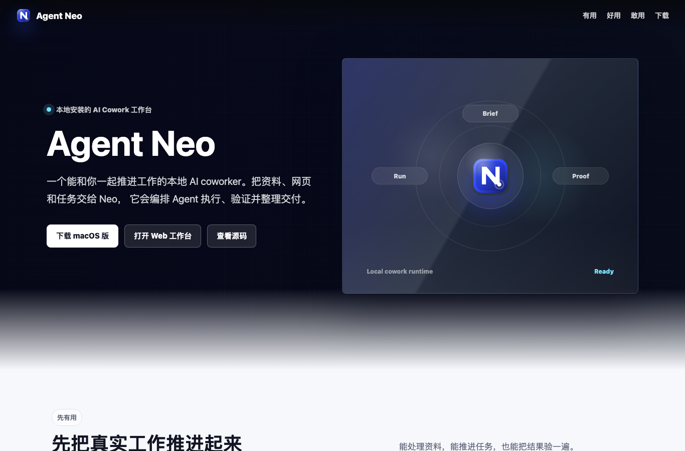

# Agent Neo

> **一个能和你一起干活的本地 AI coworker。** 你给目标，Neo 编排 AI 去执行、验证、整理，最后交给你一份能直接用的**产物**——网页、设计稿、演示稿、视频、数据分析、文档——而不是只回你一段文字。
>
> 仓库代号 **code-agent**（历史名，沿用至今）；产品名为 **Agent Neo**。



---

## Neo 能帮你做什么

把它当成一个坐在你旁边、你能随时叫停和纠偏的 AI 同事。比如：

- 🎨 **"帮我把这张海报的背景换掉，再出三个配色版本"** → 在无限画布上文生图、圈选局部重绘、A/B 对比，直接导出。
- 📊 **"分析这份销售数据，做成一页能汇报的看板"** → 读数据、跑分析、生成可交互 Dashboard，并自动校验数字对不对。
- 🌐 **"调研这三个竞品，整理成一份对比文档"** → 联网检索、抓取网页、交叉核实，产出带引用的结构化文档。
- 🖥️ **"每天早上九点把昨天的行业新闻汇总发给我"** → 定时任务后台跑，到点把整理好的结果推给你。
- 🕹️ **"登录这个后台，把这批订单状态改成已发货"** → 它能真的操作浏览器和你的电脑——打开网页、点击、填表、跨软件把活干完。
- 🎮 **"做一个能玩的贪吃蛇小游戏"** → 生成代码、真机运行、发现 bug 自己修，直到能跑通。

不是给你一堆待办清单让你自己做，而是**它把活干完、验证过，再交付**。

## 和普通 AI 聊天助手有什么不同

| | 普通 AI 助手 | Agent Neo |
|---|---|---|
| **交付物** | 一段文字回复 | 能直接用的产物（网页/设计稿/看板/视频…） |
| **协作方式** | 你问一句它答一句 | 它自己规划、执行、验证，全程你可监督、可叫停、可接管 |
| **工作方式** | 单一对话框 | 多个「工作面」：对话工作台 · 设计画布 · 任务编排 · 自动化 |
| **质量把关** | 说完就结束 | 产物自动校验 + 出错自修（游戏能不能跑、数据对不对） |
| **数据** | 云端 | 本地优先，数据存在你自己电脑上 |

## 能力一览

- **对话工作台** —— 主链路聊天里就能直接出活，内联能力工作台（Workbench）不用先开侧面板。
- **设计画布** —— 无限画布上文生图、局部重绘、标注重绘、扩图去水印、A/B 对比、做演示稿、图生视频。
- **浏览器操作（Browser Use）** —— 像人一样开网页、点击、填表、抓取，能登录后台自动跑流程。
- **电脑操作（Computer Use）** —— 直接操控你的电脑：截屏、点按、跨应用协作，把网页做不到的活也干了。
- **任务与多 Agent** —— 长任务后台跑、多个 Agent 组队并行、DAG 调度、任务中断了能恢复。
- **自动化** —— 定时（cron）/ 循环任务、心跳、到点通知，无人值守也能干活。
- **产物验证** —— 游戏 / 演示稿 / 看板等产物自动校验，跑不通就自己修。
- **多模型多内核** —— 一个应用里挂多个大模型和执行内核，按任务和成本自动路由。

## 专家团：一键请一位对口的同事进会话

不用自己写提示词。Neo 内置了一批**专家角色**，每位自带专长、工作方式和资料库，「请 TA 来」就进会话陪你干这类活：

| 专家 | 帮你做什么 |
|------|------------|
| 🔎 **溯真** | 把一个问题查穿——多源交叉验证，出一份敢下结论的调研报告 |
| ✍️ **青禾** | 从选题到成稿——公众号 / 小红书 / 演示稿，写出有你自己声音的内容 |
| 📐 **牧之** | 把模糊想法磨成能评审、能开工的产品需求 |
| 🪞 **明镜** | 把散落的工作攒成周报 / 月报 / 复盘，从会话和产物里萃取，不用你回忆 |

你也可以自己造角色、绑上专属技能和资料库，沉淀成你自己的"团队"。

## 工程规模与深度

> 面向想了解技术深度的读者：这是一个持续迭代的严肃工程，不是 demo。

- **4000+ 次提交**、**4800+ 个 TypeScript 文件**、**100 万+ 行代码**（其中约 35 万行是测试），桌面 + Web + CLI 三端同源。
- **复刻并研究了现代 Agent 架构**：Agent Loop、工具系统、上下文工程与压缩、记忆分层、多 Agent 编排。
- **评测驱动迭代**：用 200 题标准化评测集做 A/B 对照，30+ 轮实验持续爬升，能力演进有据可查。
- **本地优先**：Tauri（Rust）原生壳 + 本地 SQLite，API Key 存在本机 SecureStorage，隐私可控。

## 技术栈

| 层级 | 选型 |
|------|------|
| 桌面框架 | Tauri 2.x (Rust) |
| 前端 | React 18 + TypeScript 5.6 + Zustand 5 + Tailwind 3.4 |
| 构建 | esbuild（main/preload）+ Vite（renderer） |
| 本地存储 | SQLite (better-sqlite3) |
| 云端 | Supabase + pgvector |
| AI 模型 | 多 provider 目录（MiMo / GPT / DeepSeek / Kimi / 智谱 / 火山 / 本地 Ollama 等），本地 API Key 优先 |
| Agent Engine | Native / Codex CLI / Claude Code / MiMo / Kimi 多执行内核 |

## 快速开始

前置：Node（见 `.node-version`）、Rust 工具链（`source ~/.cargo/env`）、Xcode Command Line Tools；国际 API 走代理 `HTTPS_PROXY=http://127.0.0.1:7897`。

```bash
npm install
npm run typecheck            # 类型检查
npm run dev                  # 开发模式（web server + renderer）
cargo tauri dev             # 完整桌面开发模式（需代理）
```

构建 / 打包：

```bash
npm run build                # 构建 main/preload
npm run build:web            # Web 构建（Tauri 前端）
npm run build:cli            # CLI 构建（独立）
cargo tauri build           # 打包 macOS（~33MB DMG）
```

> 正式发版不在本地打包：推 `v<version>` tag 触发 GitHub Actions 完成多平台签名/公证/发布。详见 `CLAUDE.md` 的「发版」一节。

## 怎么读这个仓库

Agent Neo 是主产品。这个仓库里还放了桌面壳、官网和更新服务、管理后台、评测套件、浏览器扩展等配套工程。第一次打开仓库，可以先按这个顺序看：

| 想看什么 | 去哪里 |
|----------|--------|
| 产品和架构概览 | `README.md`、`docs/ARCHITECTURE.md` |
| 应用主体代码 | `src/` |
| 桌面 App 外壳 | `src-tauri/` |
| 官网、下载页、更新 API | `vercel-api/`、`public/code-agent/` |
| 管理后台 | `admin-console/` |
| 外部评测和跑分 | `benchmarks/`、`packages/eval-harness/` |
| 更细的目录导航 | `docs/architecture/repo-map.md`、`docs/architecture/source-map.md` |

顶层目录大致是这样：

```
code-agent/
├── src/                  # 应用主体：后端主进程、前端、共享类型、本地 web 桥、CLI
├── src-tauri/            # Tauri 桌面外壳和 Rust 原生能力
├── docs/                 # 架构、部署、API、发布记录
├── tests/                # 单测、组件测试、E2E、smoke
├── scripts/              # 构建、发布、诊断、验收脚本
├── config/               # 可入库的发布制品锁（不存放 secret / 用户配置）
├── packages/             # 可独立复用的子包，如本地 bridge、eval harness
├── artifact-knowledge/   # 产物知识包，给游戏、演示稿等产物生成和校验使用
├── benchmarks/           # 外部 benchmark 数据和 runner，如 SWE-bench、Excel benchmark
├── extension/            # 浏览器扩展
├── admin-console/        # 管理后台，用于排查外部分发后的 telemetry 和反馈
├── supabase/             # 数据库迁移和云函数
└── vercel-api/           # 官网、下载入口、更新 API、控制面 API
```

有几个名字容易混在一起，先按这一层理解：

| 名字 | 位置 | 用途 |
|------|------|------|
| Agent 能力技能 | `.agents/skills/` | 随仓库内置的任务能力，比如 docx、excel、ppt、pr。Agent 做这些任务时会读取。 |
| Claude Code 开发配置 | `.claude/skills/`、`.claude/rules/` | 开发本仓库时给 Claude Code 用的规则和技能。它不属于产品运行时。 |
| 用户安装技能 | `~/.code-agent/skills/` | 用户机器上的运行时技能，来自安装或 marketplace。 |
| 技能系统代码 | `src/host/services/skills/`、`src/host/skills/marketplace/` | 产品里负责发现、安装、解析、执行技能的代码。 |
| 产物知识包 | `artifact-knowledge/` | 给特定产物类型提供生成和验收知识，例如 platformer game。它和用户安装技能分属两层。 |

### `src/` 一级分层

| 目录 | 职责 |
|------|------|
| `src/host/` | **后端/主进程（核心）**：Agent 运行时、工具、上下文、记忆、安全、服务等（详见下方「src/host」小节） |
| `src/renderer/` | 前端：React 组件、Zustand store、hooks、i18n、样式 |
| `src/shared/` | 前后端共享：类型、契约（contract）、常量 |
| `src/web/` | webServer（renderer 与 host 间的本地 HTTP/SSE 桥） |
| `src/cli/` | 命令行入口与 CLIAgent 适配层 |
| `src/design/` | 设计工作区相关共享逻辑 |
| `src/artifacts/` | 产物（artifact）相关类型与处理 |

### `src/host` —— 后端/主进程（最核心）

整个项目最核心的目录，40+ 子域。按逻辑分组概览如下，完整的「在哪改」导航见 **[docs/architecture/source-map.md](docs/architecture/source-map.md)**：

| 分组 | 主要子目录 |
|------|-----------|
| **Agent 运行核心** | `agent/`（Agent Loop 与运行时）· `loop/` · `routing/`（意图分类/路由）· `model/`（模型路由/provider 适配）· `protocol/` · `planning/`（自动规划） |
| **任务 / 编排 / 会话** | `task/`（并发闸 + 后台任务账本）· `scheduler/`（DAG 调度）· `cron/`（定时/心跳）· `handoff/`（任务交接/长任务恢复）· `session/` · `cowork/`（人机协作契约） |
| **工具 / 能力 / 外部集成** | `tools/`（工具注册与执行）· `skills/` · `mcp/` · `connectors/` · `plugins/` · `lsp/` · `desktop/`（Computer Use）· `sandbox/` · `research/` · `channels/`（飞书等外部通道） |
| **上下文 / 记忆 / 提示词** | `context/`（上下文工程/压缩）· `memory/` · `lightMemory/`（轻记忆/失败日志）· `prompts/` |
| **质量 / 评测 / 观测** | `evaluation/`（**评测引擎**：实验适配/会话质量评分/回放/遥测查询）· `quality/`（产物质量检测）· `observability/` · `telemetry/` · `diagnostics/` · `testing/` · `hooks/` |
| **平台 / 基础设施** | `app/`（应用宿主/bootstrap）· `platform/` · `runtime/`（运行时资产）· `ipc/`（renderer↔host）· `services/`（core/infra/design/agentEngine 等）· `config/` · `security/` · `permissions/` · `errors/` · `extension/` · `utils/` |

评测相关目录有四类：`src/host/evaluation/` 是产品里的回放、轨迹、遥测和实验适配；`packages/eval-harness/` 是可复用的外部评测框架；`benchmarks/` 放外部 benchmark 的 runner 和样本；`tests/eval/` 放评测相关测试。

## 文档

- **[docs/ARCHITECTURE.md](docs/ARCHITECTURE.md)** — 架构索引入口（系统概览、Agent 核心、工具系统、前端、数据存储、多 Agent、设计工作区、ADR 等）
- **[docs/architecture/repo-map.md](docs/architecture/repo-map.md)** — 面向第一次浏览仓库的人：根目录、运行面、能力体系、评测目录怎么分
- **[docs/architecture/source-map.md](docs/architecture/source-map.md)** — `src/host` 源码地图（按逻辑分组）
- **[docs/architecture/](docs/architecture/)** — 各子系统深入文档（agent-core / tool-system / multiagent-system / data-storage / hot-update / windows-support 等）
- **[docs/api-reference/](docs/api-reference/)** · **[docs/DEPLOYMENT.md](docs/DEPLOYMENT.md)** — API 参考与部署
- **[src/host/README.md](src/host/README.md)** · **[tests/README.md](tests/README.md)** · **[scripts/README.md](scripts/README.md)** · **[.github/README.md](.github/README.md)** — 高密度目录的就近边界与维护规则
- `CLAUDE.md` — 工程规范、发版流程、常用命令

> 架构决策（ADR）记录见 `docs/ARCHITECTURE.md` 的决策表；PRD / 产品策略类文档不进公开仓库。

## 状态

活跃迭代中，主要面向研究与自用 dogfood。架构与能力以 `docs/ARCHITECTURE.md` 的版本演进记录为准。
