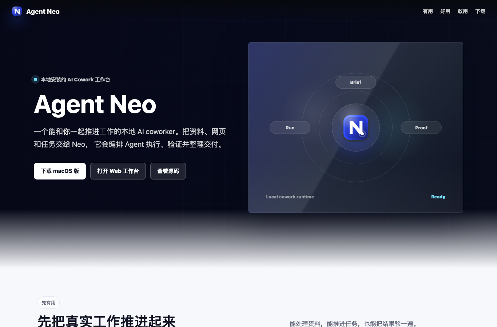

# Agent Neo

Agent Neo is a local-first AI coworker for turning goals into verified deliverables. It combines an agent runtime, desktop shell, web workspace, CLI, browser and computer control, scheduled work, and artifact quality checks.

## What it does

- Plans and executes multi-step work with inspectable progress and interruption support.
- Produces usable artifacts such as web pages, documents, decks, dashboards, and small games.
- Connects to multiple model providers and execution engines.
- Runs browser and computer workflows when a task needs more than text generation.
- Stores sessions and credentials locally by default, with optional cloud services for shared control planes and telemetry.
- Verifies selected artifacts and workflows with smoke tests, replay fixtures, and evaluation harnesses.

## Architecture

~~~text
User goal
   |
   v
Renderer (React + Vite) <--> Local web bridge <--> Host runtime
                                                   |
                    +------------------------------+------------------------------+
                    |              |               |              |               |
              Agent loop       Tool system      Context/memory  Task scheduler  Quality gates
                    |              |               |              |               |
             Providers, MCP, CLI engines, browser/computer control, local SQLite
                                                   |
                                             Tauri desktop shell
~~~

The main code lives in src/. The Tauri shell is in src-tauri/; the CLI and MCP surfaces are in src/cli/ and the host services. Tests, evaluation harnesses, release scripts, and supporting applications are kept in their own top-level directories.

## Quick start

Prerequisites:

- Node.js version from .node-version
- Rust and platform build tools for desktop development
- npm 11 or newer

~~~bash
npm install
npm run typecheck
npm run lint
npm test
npm run dev
npm run build:cli
npm run smoke:cli
~~~

For a full desktop build, use cargo tauri dev. Provider credentials are configured locally; never commit .env files, API keys, or generated user data.

## Testing

The default test suite is:

~~~bash
npm run lint
npm run typecheck
npm test
~~~

Focused checks include npm run test:smoke, npm run test:swarm:smoke, and the acceptance commands under scripts/acceptance/. Browser, model, and deployment checks may require local services or credentials; CI runs deterministic lint, typecheck, CLI build, and CLI smoke coverage.

## Documentation

- Architecture overview: docs/ARCHITECTURE.md
- Repository map: docs/architecture/repo-map.md
- Source map: docs/architecture/source-map.md
- Release and operations notes: CLAUDE.md
- Changelog: CHANGELOG.md

## Releases

The existing release workflow builds platform-specific artifacts and publishes GitHub Releases from version tags. Read the release notes and CLAUDE.md before creating a tag.

## Roadmap

- Make the local-first workflow easier to install on every supported desktop platform.
- Keep provider, MCP, browser, and computer integrations behind stable contracts.
- Expand deterministic replay, evaluation, and artifact verification coverage.
- Publish clearer contributor documentation for the runtime and extension surfaces.

## License

This repository currently does not declare an open-source license. Please contact the owner before redistributing or using it in another product.
