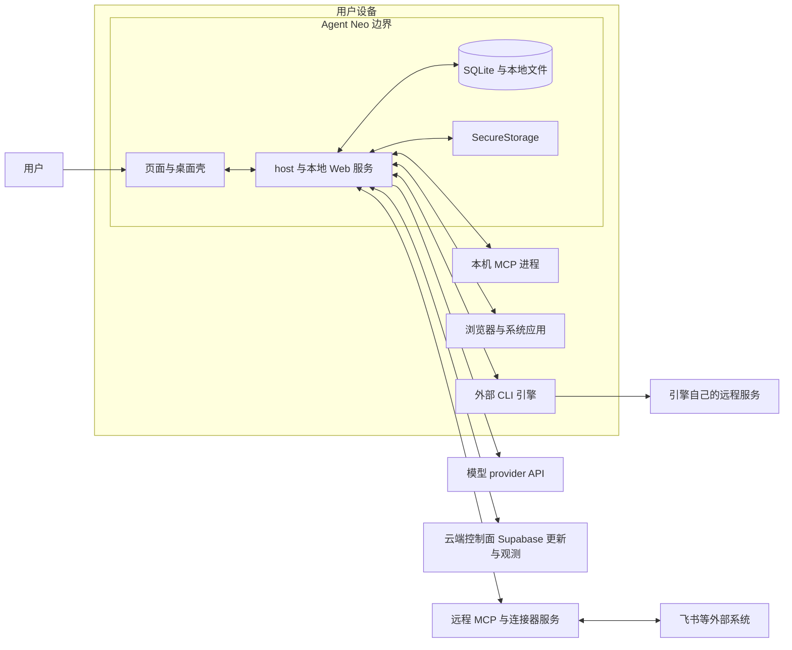
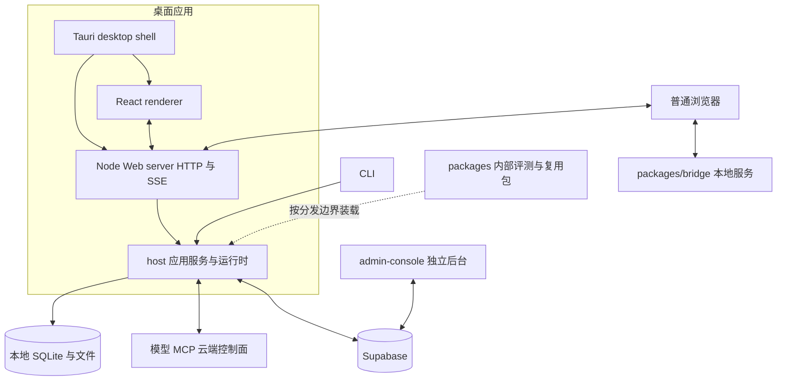
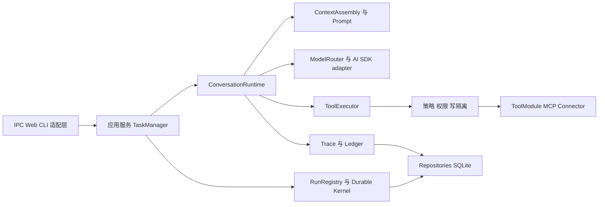
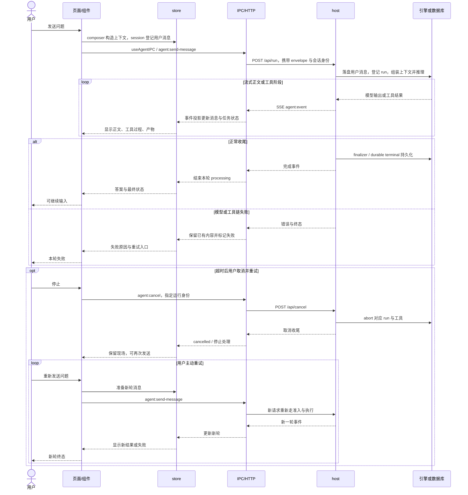
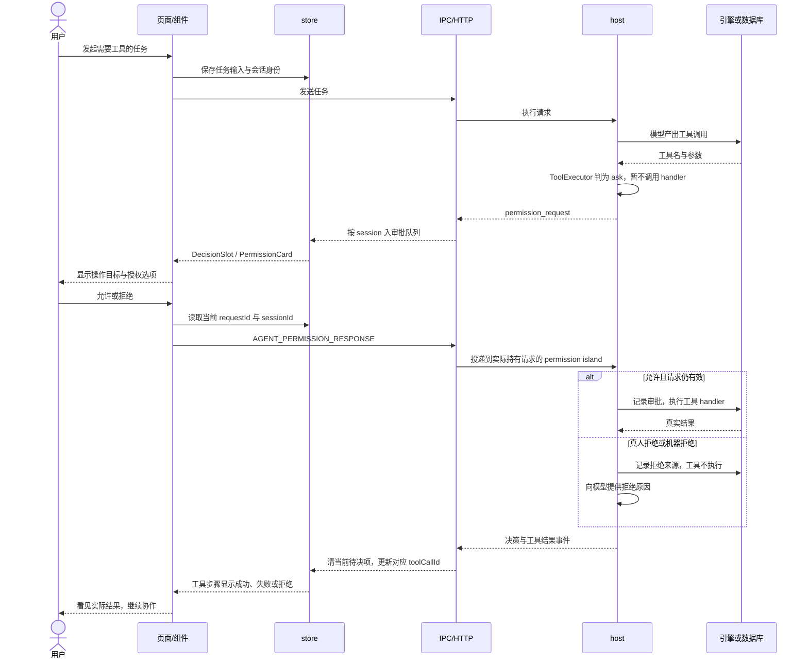
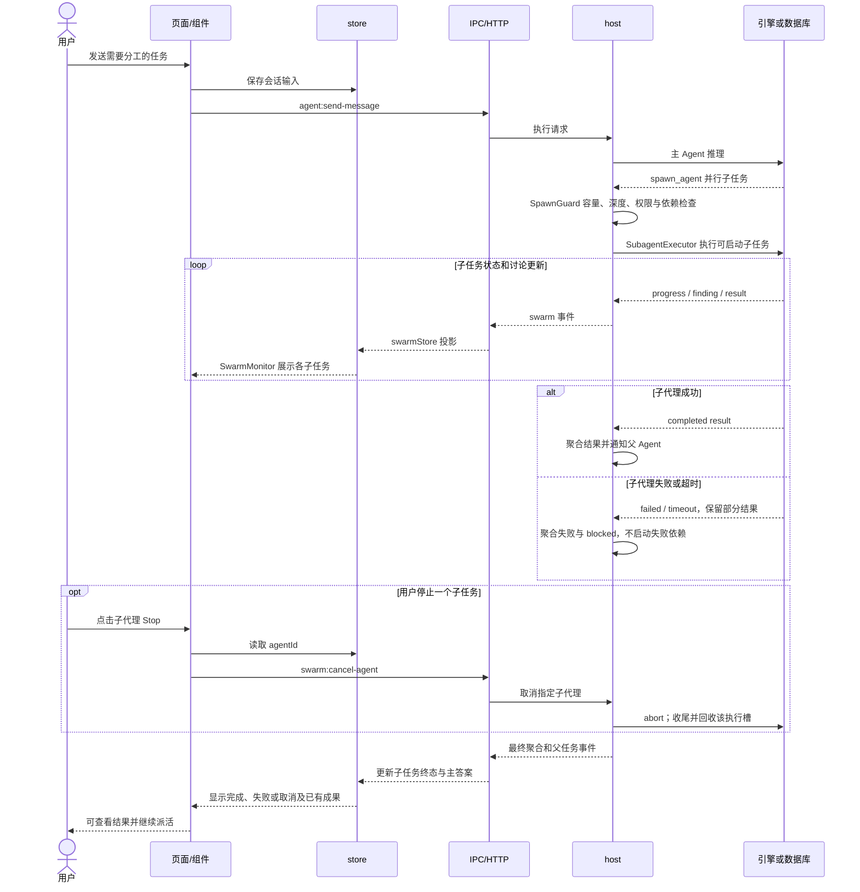
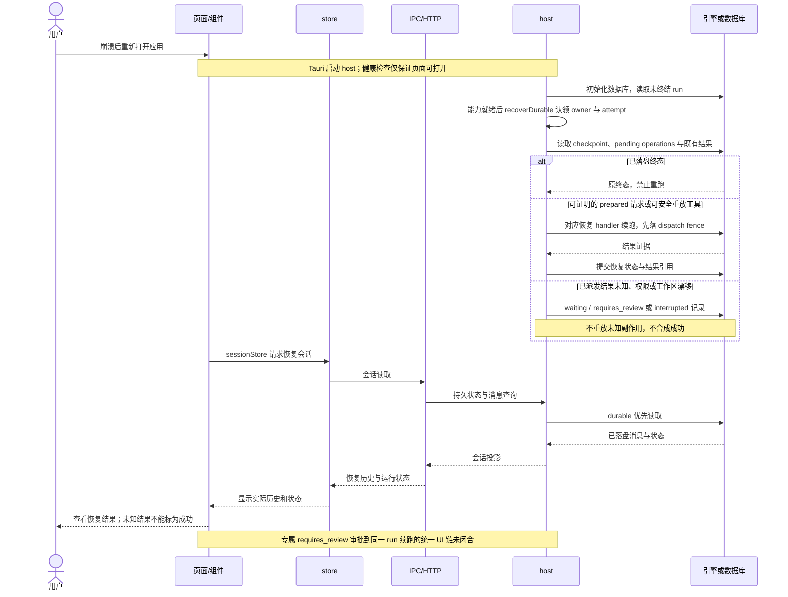
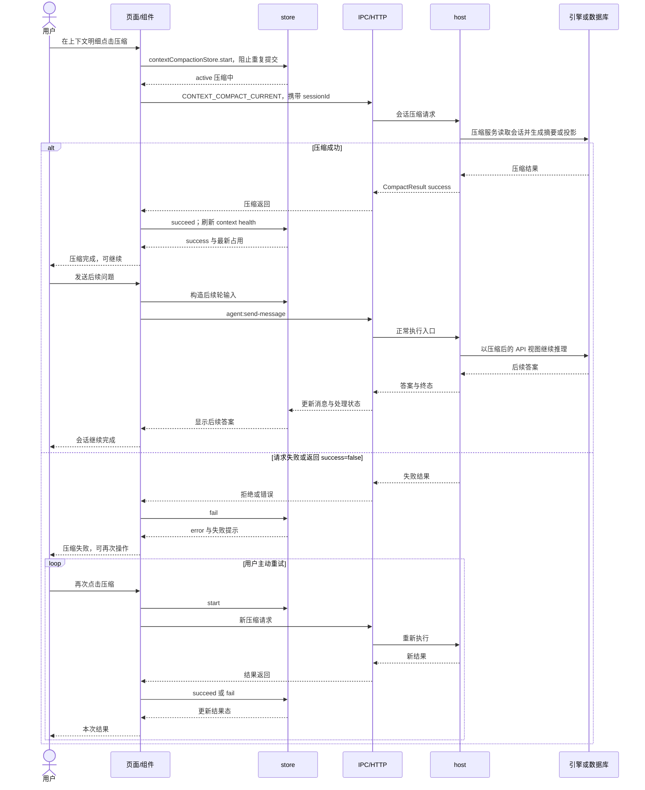

# Agent Neo 高层设计（HLD）

## 1. 范围

本文规定系统边界、子系统职责、运行契约与架构取舍；产品定位见 `README.md`，开发约束见 `AGENTS.md`，实现以引用的源码为准。版本流水已迁至 [架构历史流水](./releases/architecture-changelog.md)，每个 PR 的交付记录位于 [shipnotes](./shipnotes/)。（`docs/ARCHITECTURE.md`、`docs/releases/architecture-changelog.md`）

模块实现、接口字段和局部算法由下表分册承载；历史快照与债务计划保留其原有时态，不能直接当作当前实现。源码目录导航另见 [源码地图](./architecture/source-map.md)。（`docs/architecture/source-map.md`）

| 文档 | 描述 |
|------|------|
| [仓库导览](./architecture/repo-map.md) | 仓库导览的模块说明（`docs/architecture/repo-map.md`） |
| [系统概览](./architecture/overview.md) | 系统概览的模块说明（`docs/architecture/overview.md`） |
| [Agent 核心](./architecture/agent-core.md) | Agent 核心的模块说明（`docs/architecture/agent-core.md`） |
| [v0.33 运行时可观测与控制](./architecture/v0.33-runtime-observability-control.md) | v0.33 运行时可观测与控制的模块说明（`docs/architecture/v0.33-runtime-observability-control.md`） |
| [Durable Run Kernel](./architecture/durable-run-kernel.md) | Durable Run Kernel的模块说明（`docs/architecture/durable-run-kernel.md`） |
| [Durable Runtime Integration](./architecture/durable-runtime-integration.md) | Durable Runtime Integration的模块说明（`docs/architecture/durable-runtime-integration.md`） |
| [External Engine Durable Lifecycle](./architecture/external-engine-durable-lifecycle.md) | External Engine Durable Lifecycle的模块说明（`docs/architecture/external-engine-durable-lifecycle.md`） |
| [工具系统](./architecture/tool-system.md) | 工具系统的模块说明（`docs/architecture/tool-system.md`） |
| [前端架构](./architecture/frontend.md) | 前端架构的模块说明（`docs/architecture/frontend.md`） |
| [IPC 通道](./architecture/ipc-channels.md) | IPC 通道的模块说明（`docs/architecture/ipc-channels.md`） |
| [Desktop Shell](./architecture/desktop-shell.md) | Desktop Shell的模块说明（`docs/architecture/desktop-shell.md`） |
| [数据存储](./architecture/data-storage.md) | 数据存储的模块说明（`docs/architecture/data-storage.md`） |
| [云端/同步历史架构](./architecture/cloud-architecture.md) | 当前控制面入口与历史云执行设计（分节标明时态）（`docs/architecture/cloud-architecture.md`） |
| [多 Agent 编排](./architecture/multiagent-system.md) | 多 Agent 编排的模块说明（`docs/architecture/multiagent-system.md`） |
| [专家、资料库与角色化自动化](./architecture/experts-and-library.md) | 专家、资料库与角色化自动化的模块说明（`docs/architecture/experts-and-library.md`） |
| [Agent Engine 执行引擎](./architecture/agent-engine.md) | 执行引擎接入与模型兼容；种类以源码合同为准（`docs/architecture/agent-engine.md`） |
| [Dynamic Workflow](./architecture/dynamic-workflow.md) | Dynamic Workflow的模块说明（`docs/architecture/dynamic-workflow.md`） |
| [Runtime Consolidation Snapshot](./architecture/runtime-consolidation-2026-05-31.md) | 历史运行时收口快照（非现行状态保证）（`docs/architecture/runtime-consolidation-2026-05-31.md`） |
| [Agent Architecture Debt Iteration](./architecture/agent-architecture-debt-iteration-plan-2026-05-31.md) | 历史债务计划与阶段边界（`docs/architecture/agent-architecture-debt-iteration-plan-2026-05-31.md`） |
| [Chat-Native Workbench](./architecture/workbench.md) | Chat-Native Workbench的模块说明（`docs/architecture/workbench.md`） |
| [v0.33 用户体验合同](./designs/v0.33-user-experience-contract.md) | v0.33 用户体验合同的模块说明（`docs/designs/v0.33-user-experience-contract.md`） |
| [Live Voice](./architecture/live-voice.md) | Live Voice的模块说明（`docs/architecture/live-voice.md`） |
| [Artifact Verification](./architecture/artifact-verification.md) | Artifact Verification的模块说明（`docs/architecture/artifact-verification.md`） |
| [Activity Providers](./architecture/activity-providers.md) | Activity Providers的模块说明（`docs/architecture/activity-providers.md`） |
| [Native App 集成](./architecture/native-app-integration.md) | Native App 集成的模块说明（`docs/architecture/native-app-integration.md`） |
| [CLI 架构](./architecture/cli.md) | CLI 架构的模块说明（`docs/architecture/cli.md`） |
| [Windows 支持](./architecture/windows-support.md) | Windows 支持的模块说明（`docs/architecture/windows-support.md`） |
| [Intel x64 支持](./architecture/intel-x64-support.md) | Intel x64 支持的模块说明（`docs/architecture/intel-x64-support.md`） |
| [Surface Execution](./architecture/surface-execution.md) | Surface Execution的模块说明（`docs/architecture/surface-execution.md`） |
| [Design Mode 设计工作区](./architecture/design-mode.md) | 设计媒介、画布、演示稿生成与修改（`docs/architecture/design-mode.md`） |

## 2. 目标与非目标

Agent Neo 是本地优先的 cowork 产品：用户说出目标，Neo 组织执行、检查和整理，交付可以直接使用的网页、设计稿、演示稿、视频、看板或文档。cowork 指人与 AI 围绕同一任务和产物持续协作，默认用户无需懂编程。产品方向对标 Manus 的任务交付；这是定位，不代表能力已经达到竞品水平。（`README.md`、`AGENTS.md`、`docs/architecture/decisions/ADR-055-artifact-role-axis.md`）

聊天是协作入口，产物是工作主轴：用户能看过程、补充指令、审批动作、预览和修改结果；预览成功与任务验收是不同事实，不能以模型说“完成”代替产物证据。（`docs/architecture/workbench.md`、`src/shared/contract/productClosure.ts`、`src/host/agent/goalModeController.ts`）

| 明确的非目标 | 边界与出处 |
|---|---|
| 不属于 IDE / 编程助手品类 | 代码编辑与 CLI 是完成任务的手段，不能成为所有用户的前置知识；“Code Agent”只是历史仓库代号。（`AGENTS.md`、`README.md`） |
| 不承诺全功能离线 | 本机数据和本机能力可保留，远程模型、搜索与连接器依赖网络；本地模型需要用户另有运行环境。（`src/host/model/providerRegistry.ts`、`docs/architecture/agent-engine.md`） |
| 不承诺无人监督地处理所有外部动作 | 登录、支付等敏感操作有接管与审批边界；自动化的外发动作按权限合同执行。（`docs/architecture/surface-execution.md`、`src/host/agent/orchestratorPermissions.ts`） |
| 不把后台管理和题库答案当普通用户功能 | 评测中心通过内部包分发，答案与切分放私档；用户反馈和诊断导出保留在核心应用。（`packages/internal/evaluation-center/README.md`） |
| 不承诺重启后所有任务无感续跑或恰好执行一次 | 是否可恢复取决于已落盘证据、工具重放声明和模型请求状态；未知副作用要求复核。（`src/host/runtime/nativeRecoveryHost.ts`、`src/host/app/nativeRecoveryHost.ts`） |
| 不实现通用云端 Agent 集群或多租户执行平台 | 云端旧执行设计已归档，当前云端边界是控制面、同步和观测；没有把本机 run 迁往云 worker 的现行合同。（`docs/architecture/cloud-architecture.md`、`src/host/README.md`） |

## 3. 约束

| 约束 | 当前约束及真源 |
|---|---|
| 平台 | 正式发布矩阵为 macOS arm64、macOS x64、Windows x64；Linux 有部分运行时适配，不等同于正式桌面发布矩阵。（`.github/workflows/release.yml`、`src/host/sandbox/bubblewrap.ts`） |
| 离线与资源交付 | 壳有内置 renderer 与 bundled Node；远程技能/MCP 初始化不阻塞首窗，但对应能力未就绪时不能冒充可用。（`docs/architecture/desktop-shell.md`、`src/web/webServerBootstrap.cjs`） |
| 成本 | 任务预算和 provider usage 用于估算与控制；实时语音未知价格不显示伪金额，金额上限默认提醒而非挂断。（`src/shared/constants/pricing.ts`、`docs/architecture/live-voice.md`） |
| 单机资源 | 脚本运行默认并发上限 16、old-generation 堆上限 256 MiB；provider 并发限制另行生效。（`src/shared/constants/scriptRuntime.ts`、`src/host/agent/scriptRuntime/concurrencyGate.ts`） |
| 合规与分发 | 公开仓不放凭据和私档；发布包禁止夹带源码映射、开发资料、环境文件与私钥，第三方制品的许可证/来源由锁与发布材料追溯。（`REVIEW.md`、`scripts/release-security-scan.mjs`、`config/poppler-sidecar.lock.json`） |

技术栈版本是此 checkout 的锁定值，不是外部“最新版”；范围来自 `package.json`，精确安装版本来自 `package-lock.json`。（`package.json`、`package-lock.json`）

| 层级 | 技术选型 | 出处 |
|---|---|---|
| 运行时与包管理 | Node >=24.0.0；npm 11.12.1 | `package.json` |
| 桌面壳 | Tauri 2；updater / opener / dialog 插件 | `src-tauri/Cargo.toml` |
| 前端框架 | React 19.2.6 + TypeScript 6.0.3 | `package.json`、`package-lock.json` |
| 类型检查 | typescript7 别名指向 TypeScript 7.0.2 | `package.json`、`package-lock.json` |
| 状态管理 | Zustand 5.0.13 | `package-lock.json` |
| 样式 | Tailwind CSS 4.3.0 | `package-lock.json` |
| 构建 | esbuild 0.28.0 + Vite 8.0.13 | `package-lock.json`、`esbuild.config.ts`、`vite.config.ts` |
| 数据库 | better-sqlite3 13.0.3 | `package-lock.json` |
| 模型 SDK | ai 7.0.58 | `package-lock.json` |
| 测试 | Vitest 4.1.7 + Playwright 1.60.0 | `package-lock.json` |

## 4. 上下文边界

系统边界以用户设备为中心。模型 provider 是提供推理 API 的服务方；外部 CLI 引擎是设备上另一个执行程序，会使用它自己的账号和服务；MCP 是 Neo 与外部工具交换请求的协议，不等于所有工具都在云上。（`src/shared/contract/agentEngine.ts`、`src/host/mcp/mcpClient.ts`、`docs/architecture/native-app-integration.md`）

下图区分“设备内”和“Neo 所控制的进程”：外部 CLI、MCP 子进程、浏览器和系统应用即使在本机，也不因此获得 Neo 内部的全部权限。箭头表示可能的数据通道，实际是否启用取决于配置与授权。（`src/host/services/agentEngine/agentEngineGuards.ts`、`src/host/mcp/mcpClient.ts`、`src/host/services/surfaceExecution/`）

| 数据 | 可以去哪里，不能据此推导什么 | 执行点 / 出处 |
|---|---|---|
| 用户问题、选定资料与工具结果 | 会作为任务上下文发给所选模型；“本地优先”不等于“对话正文永不出机” | `src/host/agent/messageHandling/converter.ts`、`src/host/model/adapters/aiSdkAdapter.ts` |
| 本机原始会话 | SQLite 留作搜索、回退和回放真源；派生记忆、导出与遥测副本分别脱敏，不能宣称本机原文已全面去敏 | `src/host/security/sensitiveDataGuard.ts`、`docs/architecture/sensitive-data-guard.md` |
| 账号密钥 | 只能由凭据服务按目的读取；不得作为会话响应、日志、durable checkpoint 内容外发；模型 API 鉴权本身仍使用密钥 | `src/host/services/core/secureStorage.ts`、`src/host/services/infra/sessionManager.ts`、`src/host/app/dynamicWorkflowRecoveryHost.ts` |
| 截图、语音、活动上下文 | 用户选入的截图和语音可交模型处理；采集、渠道入站和导出各有自己的脱敏点，不能保证所有像素天然无敏感信息 | `src-tauri/src/appshots.rs`、`src/host/services/activity/screenshotPrivacyRedactor.ts`、`src/host/channels/privacy/channelPrivacyFirewall.ts` |
| 观测与诊断 | Supabase 聚合上传默认 metadata-only；诊断包是另一条含脱敏内容的队列，Langfuse 也是独立出口，不能混称“遥测只传元数据” | `src/host/telemetry/telemetryUploaderService.ts`、`src/host/telemetry/diagnosticBundleService.ts`、`src/host/services/infra/langfuseService.ts` |
| 上线后评分输入 | 截短、脱敏的真实轨迹交用户配置的评分模型；评分模型可能不同于本轮对话模型 | `src/host/testing/judge/postLaunchJudge.ts` |
| 私档、题库答案、凭据与个人身份材料 | 不进入公开仓和默认客户端分发；这是仓库/发布约束，不是任意文件上传的全局 DLP 承诺 | `REVIEW.md`、`packages/internal/evaluation-center/README.md`、`scripts/release-security-scan.mjs` |

## 5. 策略

| 取舍（一句结论） | ADR 与实现出处 |
|---|---|
| 聊天承担日常协作入口，深度控制面与产物预览在旁侧工作台承接 | ADR-011（历史索引见第 19 章）；`docs/architecture/workbench.md` |
| 会话保持可输入，耗时任务进入可观测的任务槽位，文字和语音共用控制语义 | [ADR-054](./architecture/decisions/ADR-054-session-as-command-center.md)；`src/host/services/commandCenter/sessionTaskSlotLedger.ts` |
| 运行事实由 durable kernel 统一记录，客户端与适配器读取投影 | [ADR-037](./architecture/decisions/ADR-037-durable-run-kernel.md)；`src/host/runtime/durableRunKernel.ts` |
| 压缩沿单一管线与协调入口执行，不维护两套互相修改上下文的算法 | [ADR-045](./architecture/decisions/ADR-045-context-compression-single-architecture.md)；`src/host/context/compressionPipeline.ts` |
| Browser / Computer 共用 owner、授权和观测合同，各自保留执行适配器 | [ADR-046](./architecture/decisions/ADR-046-surface-execution-v1.md)；`src/shared/contract/surfaceExecution.ts` |
| 产物按 deliverable / material / receipt 显式登记角色，不从文件名猜是否交付 | [ADR-055](./architecture/decisions/ADR-055-artifact-role-axis.md)；`src/shared/contract/artifactRoleRegistry.ts` |
| 评测中心经内部能力包装载，普通发行包保留反馈与诊断 | [ADR-060](./architecture/decisions/ADR-060-internal-feature-runtime-loader.md)；`packages/internal/evaluation-center/README.md` |

## 6. C4 视图

C4 在这里表示从外部关系到进程、再到内部组件的三种缩放。Context 层复用第 4 章系统边界图；Container 层的节点是部署或执行单元，`packages/` 是复用包集合，不伪装成一个常驻进程。（`docs/architecture/repo-map.md`、`package.json`）

> 🖼 archify 版（可交互、可导出、带构图门证据）：[Container 层](./architecture/diagrams/c4-container.html) · [Component 层](./architecture/diagrams/c4-component.html)。规格在 [`diagrams/specs/`](./architecture/diagrams/specs)，改图改规格后重跑 `archify deliver` 即可。下面的 mermaid 是随正文走的阅读版，两边同源。

Container 入口分别是 `src-tauri/src/main.rs`、`src/web/webServer.ts`、`src/renderer/index.tsx`、`src/host/app/createAgentRuntime.ts`、`src/cli/index.ts`、`packages/bridge/src/index.ts`、`admin-console/app/page.tsx`；包边界由 `packages/internal/evaluation-center/README.md` 规定。

Component 层的调用边界依次落在 `src/host/app/agentAppService.ts`、`src/host/task/TaskManager.ts`、`src/host/agent/runtime/conversationRuntime.ts`、`src/host/agent/runtime/contextAssembly.ts`、`src/host/model/modelRouter.ts`、`src/host/tools/toolExecutor.ts`、`src/host/runtime/runRegistry.ts`；组件细节见第 1 章分册。

### 目录结构

七个源码层的分工如下，其他根目录见 [仓库导览](./architecture/repo-map.md)。（`docs/architecture/repo-map.md`）

| 目录 | 边界 |
|---|---|
| `src/host/` | 业务、执行、权限、持久服务；含运行资产和 durable run，不应把 `runtime/` 狭义理解为仅资产安装 |
| `src/renderer/` | React 呈现、交互、Zustand 状态与事件投影 |
| `src/shared/` | 前后端共用类型、常量、IPC 合同 |
| `src/web/` | 本地 HTTP/SSE 与 host 适配 |
| `src/cli/` | CLI 模式、输入输出和运行时适配 |
| `src/design/` | 设计媒介共享逻辑 |
| `src/artifacts/` | 产物类型与处理 |

## 7. 子系统职责

| 子系统 | 职责 | 入口 | 分册 |
|---|---|---|---|
| 会话执行 | 管理一次 run、消息循环与终态 | `src/host/agent/runtime/conversationRuntime.ts` | [Agent 核心](./architecture/agent-core.md) |
| 会话任务 | 任务槽位、派活、前后台控制 | `src/host/task/TaskManager.ts` | [工作台](./architecture/workbench.md) |
| Durable run | 所有权、checkpoint、恢复与终态 | `src/host/runtime/durableRunKernel.ts` | [Kernel](./architecture/durable-run-kernel.md) |
| 多代理 | 子代理派发、依赖、通信和回收 | `src/host/agent/parallelAgentCoordinator.ts` | [多 Agent](./architecture/multiagent-system.md) |
| 脚本编排 | 受限脚本、预算、调用日志与续跑 | `src/host/agent/scriptRuntime/runService.ts` | [Workflow](./architecture/dynamic-workflow.md) |
| 工具 | 注册、搜索、校验、授权与分发 | `src/host/tools/toolExecutor.ts` | [工具](./architecture/tool-system.md) |
| 模型 | provider、能力判定和请求路由 | `src/host/model/modelRouter.ts` | [SDK](./architecture/ai-sdk-provider-migration.md) |
| 外部引擎 | 探测、启动、事件归一和恢复 | `src/host/services/agentEngine/agentEngineRegistry.ts` | [执行引擎](./architecture/agent-engine.md) |
| 上下文 | 组装、投影、压缩与健康统计 | `src/host/agent/runtime/contextAssembly.ts` | [注入全景](./architecture/injection-panorama.md) |
| 记忆与角色 | 记忆文件、角色资产、资料库 pin | `src/host/lightMemory/indexLoader.ts`、`src/host/services/roleAssets/roleAssetService.ts` | [专家与资料库](./architecture/experts-and-library.md) |
| 数据 | SQLite repositories、配置与安全存储 | `src/host/services/core/databaseService.ts` | [数据存储](./architecture/data-storage.md) |
| 平台壳 | 原生窗口、权限、启动和更新 | `src-tauri/src/main.rs` | [Desktop Shell](./architecture/desktop-shell.md) |
| 前端与 IPC | 会话/产物呈现与类型化通信 | `src/renderer/index.tsx`、`src/shared/ipc/handlers.ts` | [前端](./architecture/frontend.md)、[IPC](./architecture/ipc-channels.md) |
| 浏览器与电脑 | owner-aware 操作、接管与证据 | `src/host/services/surfaceExecution/` | [Surface](./architecture/surface-execution.md) |
| 插件与连接器 | 装载能力、原生应用和服务适配 | `src/host/plugins/pluginRegistry.ts`、`src/host/connectors/registry.ts` | [插件](./architecture/plugin-system.md)、[原生集成](./architecture/native-app-integration.md) |
| 设计与产物 | 按媒介生成、预览、编辑和检查 | `src/host/services/design/slidesGenerator.ts` | [设计](./architecture/design-mode.md)、[产物检查](./architecture/artifact-verification.md) |
| 语音与活动 | 语音输入、通话和选择性上下文 | `src/renderer/services/voiceCallBridge.ts` | [语音](./architecture/live-voice.md)、[活动](./architecture/activity-providers.md) |
| 定时与自动化 | 时间触发、角色执行和结果归档 | `src/host/cron/cronService.ts` | [角色化自动化](./architecture/experts-and-library.md) |
| 评测与观测 | 真实轨迹评分、回放、诊断与管理 | `src/host/testing/judge/postLaunchJudge.ts`、`src/host/telemetry/telemetryStorage.ts` | [观测](./architecture/observability.md)、[排障](./architecture/debugging-map.md) |

### 工具体系

Core 工具常驻请求，Deferred 工具经 ToolSearch 按需发现/装载；工具数量随注册表变化，不把旧“108 个 / 15 核心”数字当长期合同。Plugin、MCP 和原生 ToolModule 最终受工具执行边界约束。（`src/host/tools/registry.ts`、`src/host/services/toolSearch/toolSearchService.ts`、`docs/architecture/tool-system.md`）

以下跨版本机制仍存在，吸收入职责边界后，旧说明留在历史流水；这里不沿用当年的体积、节省比例和工具数量。（`docs/releases/architecture-changelog.md`）

| 补充职责 | 当前边界与出处 |
|---|---|
| 文档增量编辑 | DocEdit 统一分派，SnapshotManager 每文件默认最多保留 20 个快照；编辑与生成服务分工，不把所有格式强行重写。（`src/host/tools/modules/document/docEdit.ts`、`src/host/tools/document/snapshotManager.ts`） |
| 来源与变更证据 | DataFingerprint 标识数据结构，FileReadTracker 跟踪已读文件，citation 供结果溯源；不是额外的授权层。（`src/host/tools/dataFingerprint.ts`、`src/host/tools/fileReadTracker.ts`、`src/host/services/citation/`） |
| 产物预览 | 工作台统一 tab，内容预览上限 8；代码/Markdown 编辑、图表与沙箱 HTML 是产物操作方式，不能改变 cowork 定位。（`src/renderer/stores/appStore.ts`、`src/renderer/components/PreviewPanel.tsx`、`docs/architecture/frontend.md`） |
| Live Preview 定位 | bridge 协议把点选元素映射到源位置，full reload 后可恢复 selection；Vite-only 的设计范围与局部 HMR 限制见历史与分册。（`src/shared/livePreview/protocol.ts`、`src/renderer/components/LivePreview/LivePreviewFrame.tsx`、`docs/architecture/frontend.md`） |
| 角色主动性与 loop | 角色主动唤醒为 opt-in，cron 提供时间触发；loop 的内存执行和任务账本镜像不等于 durable 自动恢复。（`src/host/services/roleAssets/roleProactivity.ts`、`src/host/loop/loopController.ts`） |
| 关闭与取消 | 子代理 Signal/Grace/Flush/Force 分阶段收尾，父级取消与子级超时分开；时限来自共享常量。（`src/host/agent/shutdownProtocol.ts`、`src/shared/constants/timeouts.ts`） |
| 配置与缓存 | config 文件可热重载，推理缓存是可淘汰的优化；它们不能成为模型运行或会话身份的第二真源。（`src/host/services/core/configService.ts`、`src/host/model/inferenceCache.ts`） |
| 品牌与设计语言 | 星球资产、品牌标和设计 token 由品牌组件及设计系统文档承载，不再在 HLD 记每日视觉流水。（`src/renderer/components/brand/PlanetSphere.tsx`、`src/renderer/components/features/sidebar/NeoBrandMark.tsx`、`docs/designs/design-system.md`） |

## 8. 运行时时序五张

六条泳道固定表示用户、页面/组件、store、IPC/HTTP、host、引擎或数据库。store 是页面共享的状态仓；IPC/HTTP 是跨进程消息通道。箭头同时标出状态读取和消息投递，不意味着每次请求都必须由 store 方法发起；实际请求常由 hook 或组件使用 `ipcService` 发出。（`src/renderer/hooks/agent/useAgentIPC.ts`、`src/renderer/services/ipcService.ts`）

> 🖼 五张的 archify 版都在 [`architecture/diagrams/`](./architecture/diagrams)：泳道阶段带分段标题、返回/安全/强调三类箭头分色、结论卡写明每张「不画什么」。archify 版按构图门做过减法，逐条对照见私档证据档；mermaid 版保留完整分支，两边同源。

### ① 一次提问到出答案

> 🖼 archify 版：[① 一次提问到出答案](./architecture/diagrams/seq1-ask-to-answer.html)

桌面壳中的聊天同样使用 HTTP/SSE：SSE 是服务端持续推送答案片段的连接。下面是 Native 普通发送分支，运行中追加输入另由 `steerOrQueue` 决定投递；外部引擎按第 11 章分发。（`src/renderer/api/httpTransport.ts`、`src/renderer/hooks/agent/useAgentIPC.ts`、`src/web/routes/agent.ts`）

事实链：`src/renderer/components/ChatView.tsx` → `src/renderer/stores/composerStore.ts` / `src/renderer/stores/sessionStore.ts` → `src/renderer/hooks/agent/useAgentIPC.ts` → `src/renderer/api/httpTransport.ts` → `src/web/routes/agent.ts` → `src/host/agent/runtime/conversationRuntime.ts` / `src/host/agent/runtime/runFinalizer.ts`；取消边界见 `src/host/runtime/runRegistry.ts`。

### ② 工具调用遇到审批点（含拒绝出口）

> 🖼 archify 版：[② 工具调用遇到审批点](./architecture/diagrams/seq2-approval.html)

审批不是模型自己判“用户已同意”：host 保留待决请求，卡片只负责显示和回传选择。没有审批界面、请求过期或运行取消都必须区别于真人拒绝；当前交互审批的长等待提醒不自动代用户裁决。（`src/host/agent/orchestratorPermissions.ts`、`src/shared/contract/permission.ts`）

事实链：`src/host/tools/toolExecutor.ts`、`src/host/agent/orchestratorPermissions.ts`、`src/renderer/hooks/agent/effects/usePermissionQueueEffects.ts`、`src/renderer/stores/appStore.ts`、`src/renderer/components/PermissionDialog/PermissionCard.tsx`、`src/web/webPermissionResponseHandler.ts`。超时/取消的来源枚举在 `src/shared/contract/permission.ts`；取消后的主动重试沿图①重新申请，不能复用已失效批准。

### ③ 子代理派发与回收

> 🖼 archify 版：[③ 子代理派发与回收](./architecture/diagrams/seq3-subagent.html)

子代理是执行一个子任务的独立 Agent。这里画 `spawn_agent` 并行分支：依赖成功才启动，子代理失败不自动拖垮兄弟，父任务取消才向下级联。任务面板展示的是运行事件投影。（`src/host/agent/parallelAgentCoordinator.ts`、`src/shared/contract/cancellation.ts`、`docs/architecture/multiagent-system.md`）

事实链：`src/host/agent/multiagentTools/spawnAgent.ts`、`src/host/agent/spawnGuard.ts`、`src/host/agent/subagentExecutor.ts`、`src/host/agent/resultAggregator.ts`、`src/host/ipc/swarm.ipc.ts`、`src/renderer/stores/swarmStore.ts`、`src/renderer/components/features/swarm/SwarmMonitor.tsx`。主动重派沿图①发起新任务；不画不存在的自动无限重试。（`src/host/agent/shutdownProtocol.ts`）

### ④ durable run 崩溃后恢复

> 🖼 archify 版：[④ durable run 崩溃后恢复](./architecture/diagrams/seq4-durable-recovery.html)

Durable 表示运行身份和检查点可以落盘。重启先认领新的 owner epoch（所有者代号），旧进程的迟到写入会被拒绝。当前 Native 已有生产恢复端口：尚未派发的模型请求可以进入续跑，已派发且无法查询结果的请求不能自动重发收费。（`src/host/runtime/runRegistry.ts`、`src/host/runtime/nativeRecoveryHost.ts`、`src/host/app/nativeRecoveryHost.ts`）

**链路未闭合：缺统一的“复核恢复”页面动作 → 同一 Native run 续跑契约。**现有会话读链不能替代该动作，恢复分类 `requires_review` 也不是一个已实现的通用批准按钮。源码能证明的范围是恢复 handler、waiting 记录和会话投影；不画用户点一次就全量恢复。（`src/host/runtime/nativeRecoveryHost.ts`、`src/host/app/durableRunReadService.ts`、`src/renderer/stores/sessionStore.ts`）

启动装配在 `src/web/webServer.ts`、`src/host/app/initializeDurableRun.ts`、`src/host/runtime/durableRecoveryDispatcher.ts`；各引擎有不同恢复条件，详见 [恢复集成分册](./architecture/durable-runtime-integration.md)。该分册早期“Native 全部仅复核”的表述已落后于 `src/host/app/nativeRecoveryHost.ts`。

### ⑤ 上下文压缩触发到会话继续

> 🖼 archify 版：[⑤ 上下文压缩触发到会话继续](./architecture/diagrams/seq5-compaction.html)

上下文是模型本轮实际能看到的资料；压缩用摘要与投影降低占用，原始会话仍供查证。下面选择有明确页面状态回路的手动压缩；自动压缩在执行轮首由压力策略触发，不能把手动 store 的状态冒充自动事件已接入的进度。（`src/renderer/hooks/useContextHealthActions.ts`、`src/host/agent/runtime/contextAssembly/compression.ts`、`src/host/context/projectionEngine.ts`）

事实链：`src/renderer/components/ContextHealthPanel.tsx`、`src/renderer/hooks/useContextHealthActions.ts`、`src/renderer/stores/contextCompactionStore.ts`、`src/host/ipc/contextHealth.ipc.ts`、`src/host/context/compactionService.ts`、`src/host/context/compressionState.ts`。**手动请求的独立取消链未闭合**：当前 hook 未传 AbortSignal，也没有取消按钮；因此不虚构超时后自动取消。运行中取消仍沿图①的 run 取消链。（`src/renderer/hooks/useContextHealthActions.ts`）

## 9. 数据架构

本机 SQLite 保存会话和运行事实，文件保存产物、记忆正文及较大证据；Zustand、会话读取缓存与统计 rollup 均为投影。表族以下面 schema/repository 为真源，分册只提供导览。（`src/host/services/core/database/schema.ts`、`src/host/services/core/database/migrations.ts`、`docs/architecture/data-storage.md`）

| 表族 / 存储 | 真源与用途 | 出处 |
|---|---|---|
| sessions / messages / session_runtime_state / session_rewinds | 会话、原始消息、压缩状态、回退审计；rewound 消息隐藏而非物理抹除 | `src/host/services/core/repositories/SessionRepository.ts` |
| projects / project_goals / project_roles | 项目、目标与角色关系 | `src/host/services/core/repositories/ProjectRepository.ts` |
| library_items / session_context_pins | 资料库登记与会话选用的资料 ID | `src/host/services/core/repositories/LibraryRepository.ts` |
| durable run 表族 | run envelope、事件、checkpoint、pending operation、child link 与副作用记录，事务维持一致性 | `src/host/runtime/durableRunStores.ts`、`src/host/runtime/durableRunKernel.ts` |
| permission_decisions / tool_execution_events | 决策与执行 begin/complete 追加账本；缺 complete 只能证明执行未闭合 | `src/host/services/core/databaseService.ts`、`src/host/tools/toolExecutor.ts` |
| swarm_run_ledger / swarm rollup | ledger 追加事实；rollup 可重建，只有闭合 run 才有完成语义 | `src/host/services/core/repositories/SwarmLedgerRepository.ts`、`docs/architecture/swarm-trace-persistence.md` |
| workflow_runs / workflow_run_calls | 脚本源码重放、确定性调用缓存与 journal | `src/host/services/core/repositories/WorkflowJournalRepository.ts` |
| session_automations / pending_approvals | 自动化调度关系与待决审批；重启后的孤儿审批不能凭旧卡放行 | `src/host/services/sessionAutomation/sessionAutomationService.ts`、`src/host/services/core/repositories/PendingApprovalRepository.ts` |
| telemetry_* / system_prompt_cache | 聚合统计、原始诊断旁表、版本与 prompt 指纹；不替代会话消息真源 | `src/host/telemetry/telemetryStorage.ts` |
| turn_snapshots / compaction_snapshots | 调试快照，可独立保留与清理 | `src/host/agent/runtime/turnSnapshotWriter.ts`、`src/host/context/compactionAuditRecorder.ts` |
| artifact_issues / artifact_issue_evidence / eval_replay_quality_reports | 产物问题、证据和评测质量报告 | `src/host/services/core/repositories/ArtifactIssueRepository.ts` |
| memory Markdown / INDEX.md | 跨会话记忆正文与索引；整理用新卡、软归档和审计维护来源 | `src/host/lightMemory/consolidation.ts`、`src/host/lightMemory/indexLoader.ts` |

Append-only（只追加）是账本的写入合同，不表示数据库永不维护或所有表均不可改。工具/权限写账失败降为告警，不反向放宽权限；durable checkpoint/terminal 是另一类原子事务，不能套用“写失败无所谓”。reconcile 默认扫描，显式请求才重建缓存；backfill 只作选择性历史补账。（`src/host/tools/toolExecutor.ts`、`src/host/runtime/durableRunKernel.ts`、`docs/architecture/swarm-trace-persistence.md`）

SecureStorage 按 data dir 保存加密文件和独立密钥文件（0600），API key 本地缓存/加密存储是重启读取源；keytar 另承接系统钥匙串中的登录与设置备份。不能只用“全部密钥都在钥匙串”概括当前实现。（`src/host/services/core/secureStorage.ts`、`src/host/services/core/keytarAdapter.ts`）

Supabase 承载身份、同步、遥测和控制面数据，pgvector 的库侧能力由 SQL 迁移定义；云端 RLS（按行判断访问权限）限制归属。同步更新须保留远端时间戳，不能把每次导入都当本机新修改；云同步不等于跨设备迁移内存中的 run。（`supabase/migrations/`、`src/host/services/sync/syncService.ts`、`AGENTS.md`）

保留期分层：raw payload 单条最多 256 KiB、最近 100 turns、14 天、总量 500 MiB，任一上限可触发淘汰；遥测重量明细同为 14 天，轻量 sessions/turns 主干保留；语音录音 7 天、声纹 90 天。没有统一的“所有会话自动删除 N 天”承诺。（`src/shared/constants/ui.ts`、`src/host/telemetry/telemetryStorage.ts`、`src/shared/constants/voice.ts`、`src/host/services/core/repositories/SessionRepository.ts`）

## 10. 集成

| 集成边界 | 合同与出网目的地 | 唯一接入点 / 分册 |
|---|---|---|
| MCP client | stdio 本机进程与远程 HTTP 服务；OAuth 凭据引用、工具索引、显式长任务句柄 | `src/host/mcp/mcpClient.ts`；[MCP durable](./architecture/mcp-durable-task-and-tool-cache.md) |
| Neo 对外 MCP server | 只读观测面；与 Neo 内部调用 Computer 工具是不同方向，不把内部写能力反向暴露 | `src/host/mcp/mcpServer.ts`；`docs/architecture/tool-system.md` |
| 连接器 | 本机 Calendar/Mail/Reminders/Photos 经平台适配；外部业务服务经 connector，由 registry 管 readiness | `src/host/connectors/registry.ts`；[原生集成](./architecture/native-app-integration.md) |
| 飞书等消息渠道 | 入站经隐私策略进入任务，出站受发射动作权限；外发目的地来自渠道配置 | `src/host/channels/channelManager.ts`、`src/host/channels/privacy/channelPrivacyFirewall.ts` |
| 外部 CLI | 独立进程、自己的模型/账号配置；启动上下文与能力必须经 engine guard | `src/host/services/agentEngine/agentEngineGuards.ts`；[引擎](./architecture/agent-engine.md) |
| Browser / Computer Use | managed browser、Relay 真标签租约、桌面 provider 各自执行；owner/grant/observation 统一 | `src/host/services/surfaceExecution/`；[Surface](./architecture/surface-execution.md) |
| Local Bridge | HTTP/WebSocket 本地桥接，默认端口 9527；工具仍按 run 的 workspace/cwd 和桥外层许可限制 | `packages/bridge/`、`src/renderer/api/httpTransport.ts`；[Native Run](./architecture/native-run-context.md) |
| 控制面与更新 | 签名配置、模型目录、renderer bundle 和平台更新资产 | `vercel-api/`、`src/host/services/agentEngine/agentEngineModelCatalog.ts`；[更新](./architecture/hot-update.md) |

浏览器 Cookie 导入与 Relay 附着是两种显式登录态复用路径；前者用临时副本读取选定 Chromium profile，后者需用户批准 tab lease。远程浏览器池、跨浏览器全量存储镜像不属于当前承诺；支付/MFA/CAPTCHA 走人工接管。OCR 与 Photos 归档可走本机 Swift helper，图片分析则可能使用远程视觉模型。（`docs/architecture/surface-execution.md`、`src/host/connectors/native/photos.ts`、`src/host/services/desktop/visionAnalysisService.ts`）

## 11. 模型适配层

Engine 决定谁执行这一轮，provider 决定 Native 请求哪个模型服务。当前类型包含 native，以及 codex_cli、claude_code、mimo_code、kimi_code、codebuddy_code、grok_cli、dsh_cli、kimi_code_acp；类型可选项不等于本机已安装或每项均支持恢复。（`src/shared/contract/agentEngine.ts`、`src/host/services/agentEngine/agentEngineRegistry.ts`）

| 层 | 责任与边界 | 真源 |
|---|---|---|
| Provider 目录 | 注册连接/模型服务，默认值、端点和价目集中管理 | `src/host/model/providerRegistry.ts`、`src/host/model/providers/`、`src/shared/constants/` |
| 模型能力矩阵 | 按 provider + model 合并保守默认、provider 默认和精确声明；协议、搜索、思考参数从同一矩阵派生 | `src/host/model/modelCapabilityMatrix.ts` |
| 模型路由 | 解析配置、能力、健康与 fallback；本机配置 API key 与 provider 连接分开于引擎订阅 | `src/host/model/modelRouter.ts`、`src/host/model/providers/providerResolution.ts` |
| AI SDK adapter | 转换消息与流式响应；工具 schema 进入模型请求，工具执行仍回 Neo 的权限/审计边界 | `src/host/model/adapters/aiSdkAdapter.ts` |
| 外部引擎能力 | manifest、兼容矩阵、安装探测与 adapter 共同决定可执行范围；不沿用旧“所有外部引擎只读”的概括 | `src/shared/externalEngineManifest.ts`、`src/shared/constants/engineCompat.ts`、`src/host/services/agentEngine/agentEngineGuards.ts` |
| Catalog | 签名模型目录失败时使用内置目录；显式不支持的模型应失败，不静默换默认 | `src/host/services/agentEngine/agentEngineModelCatalog.ts` |

显式模型的跨 provider fallback 需要 `adaptive === true`；瞬态重试、同 provider 的产物修复与跨 provider 降级是不同策略。默认链来自常量，合法控制面 override 可以替换；已输出内容后的流式重试受 adapter 限制，防止把两次回答拼成一次。诊断记录 tried/skipped 与失败原因。（`src/host/model/modelRouter.ts`、`src/host/model/modelRouterPolicy.ts`、`src/host/model/adapters/aiSdkAdapter.ts`）

## 12. Prompt · Agent · 工具契约

Prompt 是给模型的任务说明；Agent 是围绕说明反复推理、调用工具、检查结果的执行循环；工具是它能申请的具体动作。提示词可以建议行动，却不能取代代码里的授权和结果判定。（`src/host/prompts/builder.ts`、`src/host/agent/runtime/conversationRuntime.ts`、`src/host/tools/toolExecutor.ts`）

系统提示按身份、模式、角色、规则、记忆与本轮上下文装配。registry 管可覆盖文本，动态块在装配时取当前值，缓存边界与预算防止每轮重复灌入不必要内容；被裁剪块应可诊断。入口 profile 和 overlay 定义不同执行环境需要的内容，不在 HLD 重列全部提示词。（`src/host/prompts/registry.ts`、`src/host/prompts/builder.ts`、`src/host/prompts/profiles.ts`、`src/host/prompts/overlayEngine.ts`、`docs/architecture/injection-panorama.md`）

| 契约 | 人话规则 | 执行点 |
|---|---|---|
| 工具注册与分层 | 核心工具常驻，其余按需搜索/预加载；可检索不等于可调用，未装载/不可调用要有原因 | `src/host/tools/registry.ts`、`src/host/services/toolSearch/toolSearchService.ts` |
| Schema | schema 是参数格式约束，参数先归一化和校验，再执行；给用户看的语义描述与真实执行参数分开 | `src/host/tools/dispatch/toolResolver.ts`、`src/host/agent/runtime/toolArgsValidator.ts` |
| 权限合同 | 原生、延迟和脚本内嵌工具都通过 ToolExecutor；允许工具不等于允许访问任意路径 | `src/host/tools/toolExecutor.ts`、`src/host/tools/skillBoundaryScope.ts` |
| Skill | 技能是任务方法与允许工具的说明；项目/用户技能不能靠 allowed-tools 自行扩权，strictToolset 可收窄模型可见面 | `src/host/services/skills/skillParser.ts`、`src/host/tools/skillBoundaryScope.ts` |
| 子代理 | 从父执行派生工具与权限；取消向下传播，子代理失败单独处理 | `src/host/agent/childContext.ts`、`src/shared/contract/cancellation.ts` |
| 计划审批 | 提案等待批准时结束本轮，批准后以新 meta turn 执行；请求修改不等于批准 | `docs/architecture/v0.33-runtime-observability-control.md`、`src/host/agent/runtime/messageProcessor.ts` |
| 工具结果 | 失败输出仍提供给模型自纠错；大结果可落盘、保留引用，不能只给退出码隐去真因 | `src/host/agent/runtime/messageProcessor.ts`、`src/host/tools/modules/shell/bash.ts` |
| 长任务完成 | `/goal` 完成申请须经确定性检查、可选 reviewer 与预算/无进展兜底；一般预览不等价于过门 | `src/host/agent/goalModeController.ts`、`src/host/agent/goalVerifyGate.ts`、`src/host/agent/goalReviewGate.ts` |
| 防空转 | 失败熔断、连续只读操作护栏与检索重复提示分别处理不同循环；不能只靠模型自觉停止 | `src/host/agent/toolExecution/circuitBreaker.ts`、`src/host/agent/antiPattern/detector.ts`、`src/host/agent/runtime/stagnationDetector.ts` |
| 能力装卸与补偿 | 当前可交换 unit 覆盖 skill 与 plugin；依赖检查后加载，失败逆序撤销，外部副作用补偿只提供具体工具的恢复线索 | `docs/architecture/v0.33-runtime-observability-control.md`、`src/host/services/capability/capabilityUnitRuntime.ts` |

### 上下文来源

RAG 是“先检索相关资料再交给模型”的方法，不代表本仓所有记忆都走向量数据库。跨会话记忆、资料库、检索材料和附件共享本轮装配边界，各自保留来源与权限。（`src/host/agent/runtime/contextAssembly.ts`、`src/host/lightMemory/indexLoader.ts`、`src/host/agent/runtime/contextAssembly/libraryPins.ts`）

| 来源 | 进入本轮的内容与边界 | 出处 |
|---|---|---|
| 会话与续接 | 当前消息、持久系统上下文与压缩后的 API 视图；rewind 隐藏之后的 active 消息并保留审计 | `src/host/context/projectionEngine.ts`、`src/host/services/core/repositories/SessionRepository.ts` |
| 规则与技能 | 环境/工作目录规则、已挂载技能和必要工具说明；规则进入内容不等于获得更宽写权限 | `src/host/hooks/builtins/agentsHooks.ts`、`src/host/services/skills/sessionSkillService.ts` |
| 轻量记忆 | INDEX 常驻、正文按需；近期会话摘要与 failure journal 提供延续性，整理走软归档和来源审计 | `src/host/lightMemory/indexLoader.ts`、`src/host/lightMemory/recentConversations.ts`、`src/host/lightMemory/consolidation.ts` |
| 学习与角色 | 会话反思提炼可泛化方法，角色 L0 身份与 L1 资料架分层；角色草稿确认后才落盘 | `src/host/lightMemory/conversationReview.ts`、`src/host/services/roleAssets/roleDraftQueue.ts`、`src/host/services/roleAssets/roleAssetService.ts` |
| 资料库 / 检索 | pin 只注入标题、路径、摘要和标签；正文再由工具取，pin 指纹影响缓存 | `src/host/agent/runtime/contextAssembly/libraryPins.ts`、`src/host/services/library/libraryService.ts` |
| 附件 | 图片与音视频/文档分类处理；PPT/压缩包可先提摘要，持久化剥离非图片的大内联数据；摘要不等于上传了原二进制 | `src/host/agent/messageHandling/converter.ts`、`src/shared/utils/messageAttachments.ts` |
| 桌面活动 / Appshots | 活动 provider 统一格式化，用户热键截图先进入 composer；截图不是模型可自行触发的 Appshots 输入动作 | `docs/architecture/activity-providers.md`、`src-tauri/src/appshots.rs`、`src/shared/contract/appshot.ts` |
| 产物定位与反馈 | 页面元素/文档定位、设计 brief 与选区随上下文传递，编辑工具再校验目标；文件变化可用 checkpoint 回退 | `src/host/app/workbenchTurnContext.ts`、`src/shared/contract/conversationEnvelope.ts`、`src/host/services/checkpoint/fileCheckpointService.ts` |

Context Health 的 bySource 是当前消息、system prompt 与已挂载技能重算的估计分布，不是历史累计计费。自动压缩长期不降压时会暂停并要求收窄范围，摘要失败有冷却，避免反复消耗 token。（`src/host/context/contextComposition.ts`、`src/host/context/contextHealthService.ts`、`src/host/agent/runtime/contextAssembly/compression.ts`）

## 13. 评测

| 层 | 入口与边界 | 出处 |
|---|---|---|
| 评测中心 | 内部 evaluation-center 包包含 runner、replay、归因和 UI；默认应用不得直接 import 该目录 | `packages/internal/evaluation-center/README.md` |
| Casebank | 公开题面在 `.claude/test-cases/`；答案和 eval-splits 在私档，缺答案保留计划并记 not_run | `packages/internal/evaluation-center/README.md`、`scripts/ci/check-casebank-answers.mjs` |
| 发布前判分 | 确定性断言与 dimension judge 分工，judge 校准报告分歧/混淆矩阵；真实坏产物标本用于防假通过 | `src/host/testing/judge/dimensionJudge.ts`、`src/host/testing/calibration/judgeCalibration.ts`、`src/host/testing/artifactRunnableAdapter.ts` |
| 上线后评测 | 真实轨迹无参考解地评过程；语义维与确定性安全/产物维分开，避免模型复判硬信号 | `src/host/testing/judge/postLaunchJudge.ts`、`src/shared/contract/postLaunchScore.ts` |
| 外部 benchmark | 独立 harness 与 SWE-bench 等样本，不把外部 runner 当聊天运行时 | `packages/eval-harness/`、`benchmarks/` |
| 产物质量 | 各 kind 自有 verifier，输出 ArtifactIssue 与质量报告；Admin Review Queue 做发布处置 | `docs/architecture/artifact-verification.md`、`src/web/routes/adminReviewQueue.ts` |

评测报告按 static-contract / hermetic-protocol / fault-injection / real-runtime 区分证明能力；只有结构门不能宣称运行时行为已验证，诊断评分也不自动阻断普通会话。（`docs/testing-evidence-classes.md`、`docs/architecture/v0.33-runtime-observability-control.md`）

## 14. 治理与安全

权限回答“这个动作是否能做”，审批回答“这一次是否已得到授权”，沙箱则在执行时限制程序能触达的资源。三者不是可相互替代的开关。下面按控制项列唯一裁决点；其他文件是适配或持久化，不应再自行放行。（`src/host/tools/toolExecutor.ts`、`src/host/permissions/guardFabric.ts`、`src/host/sandbox/manager.ts`）

| 控制项 | 规则 / 审批点 | 唯一裁决或执行点 |
|---|---|---|
| 工具入口权限 | allow / ask / deny 的结果决定是否调用 handler；失败不得变 allow | `src/host/tools/toolExecutor.ts` |
| 多源权限矩阵 | mode、用户规则、hook 与分类器共同形成判定；拓扑和子代理继承不得暗中扩权 | `src/host/permissions/guardFabric.ts`；继承构造点 `src/host/agent/childContext.ts` |
| 交互审批 | 请求与 resolver 留 host，处理器自报真人/机器来源；等待提醒不能当批准 | `src/host/agent/orchestratorPermissions.ts` |
| 无人值守待决 | 停车审批以数据库 UPDATE 成功数决定谁先决策；孤儿审批复核/拒绝，不重启后凭旧 resolver 执行 | `src/host/agent/orchestratorPermissions.ts`；落盘 `src/host/services/core/repositories/PendingApprovalRepository.ts` |
| Shell 安全档 | 全平台 strict 默认；lenient 仅显式环境变量开启 | `src/host/security/commandSafety.ts` |
| Shell 进程环境 | 子进程继承环境按白名单筛选，不让无关 API key 搭车 | `src/host/tools/modules/shell/bash.ts`、`src/host/utils/envSecretFilter.ts` |
| 写入范围 | run 绑定 workspace/cwd；权限判断不能拿可变 process cwd 代替；写冲突需隔离 | `src/host/runtime/runContext.ts`、`src/host/tools/toolExecutor.ts` |
| OS 沙箱 | 模式与开关决定是否启用；启用而不可用必须失败，不能静默裸跑 | `src/host/sandbox/manager.ts`、`src/host/tools/modules/shell/bash.ts` |
| 脚本沙箱 | 不可信脚本在独立进程限制权限/环境；子任务经受控 RPC，不能获得 host 的 ambient authority | `src/host/agent/scriptRuntime/sandbox.ts` |
| 浏览器授权 | 租约审批核对 owner、scope、有效期与 placement，答复不得扩张待批范围 | `src/host/services/infra/browserRelayApprovalBoundary.ts` |
| 凭据 | 加密存储与用途读取；MCP `secureref:` 只在 host 解引用，配置不保存明文副本 | `src/host/services/core/secureStorage.ts`、`src/host/mcp/mcpSecretResolver.ts` |
| 派生数据脱敏 | 原文和派生副本分开，秘密、身份字段、URL 参数等在相应 sink 脱敏 | `src/host/security/sensitiveDataGuard.ts` |
| HTTP 身份 | 本地 HTTP 请求校验服务 token；renderer token 不是云端 provider 密钥 | `src/web/middleware/auth.ts` |
| 管理操作 | 前端隐藏仅改善体验，管理 IPC 必须后端守卫，云端表另有 RLS | `src/host/ipc/adminGuard.ts`、`supabase/migrations/` |
| 私档与分发 | 私档/秘密不进公开 diff；内部评测资产不能从默认入口打包，发布扫描独立拒绝敏感制品 | `REVIEW.md`、`scripts/release-security-scan.mjs` |

出网按具体出口治理：模型 endpoint 来自配置和 provider 解析，网页/图像/连接器入口各自校验 URL 与目的地。**本仓没有可据以承诺“所有出网都经过同一个全局白名单”的统一执行点**；不能把某个 URL 校验器或系统代理配置写成全域防火墙。（`src/host/model/providers/providerResolution.ts`、`src/host/tools/modules/network/webFetch.ts`、`src/host/connectors/registry.ts`）

审批账本记录实际来源与 trace；begin/complete 记录实际执行。不可信工具结果和外部材料只能作为数据，不能借提示词内容修改授权。截图/浏览器 proof 专项脱敏与通用 guard 分工，仍需具体出口证据。（`src/host/tools/toolExecutor.ts`、`src/host/security/inputSanitizer.ts`、`src/shared/utils/surfaceExecutionRedaction.ts`）

## 15. 发布回滚

正式发布由 tag 触发 CI：macOS arm64/x64 矩阵加 Windows x64 job，macOS 执行 Developer ID 签名、公证和 staple，Windows NSIS 当前无 Authenticode、更新完整性走 minisign。Windows leg 缺席时的 mac-only 发布条件由 workflow 定义，不能把 mac 成功写成三平台都成功。（`.github/workflows/release.yml`、`docs/architecture/windows-support.md`、`docs/architecture/intel-x64-support.md`）

| 发布或回滚边界 | 手段与限制 | 出处 |
|---|---|---|
| 完整客户端 | bundled Node、原生模块和 renderer 同包；签名前准备资源与 ABI 检查 | `scripts/prepare-bundled-node.mjs`、`scripts/verify-macos-release.sh` |
| 渠道元数据 | 三平台 updater manifest 与 stable release JSON 汇合，预发布 tag 不自动提升 stable | `scripts/tauri-update-manifest.mjs`、`scripts/build-stable-release-json.mjs`、`.github/workflows/release.yml` |
| Renderer 热更新 | 下载先 staged，下次启动前提升 active；版本/资源异常退回 builtin | `src/host/services/renderer/rendererBundleCache.ts`、`docs/architecture/desktop-shell.md` |
| 更新后预热 | 隔离 data dir 与 SQLite 在线备份预热 compile cache；失败退冷启动，不影响活库 | `docs/architecture/desktop-shell.md`、`src/web/webServerBootstrap.cjs` |
| 分发回滚 | 恢复已知可用渠道元数据与制品，校验更新/下载/renderer rollout；不能单靠撤 tag 恢复用户已安装文件 | `scripts/control-plane-release-bundle.mjs`、`docs/releases/RELEASE_CHECKLIST.md` |
| Durable 运行策略回滚 | off / shadow / durable_preferred 是成套读写策略，不手工制造开写关读混合；schema 回滚与运行开关分开 | `src/host/app/durableRunRollout.ts`、[回滚分册](./architecture/durable-run-s9-acceptance-and-rollback.md) |

发布检查要求包内真实资源、签名包启动与部署后入口核对，不能用旧构建或热更新缓存代替；源码交付则走 `ship pr` 和对应快门，不在本文执行部署。（`AGENTS.md`、`docs/architecture/desktop-shell.md`、`.github/workflows/release.yml`）

## 16. 可观测

| 证据 | 回答的问题 | 真源 / 读取入口 |
|---|---|---|
| 工程日志 | 哪个模块报错、哪个阶段变慢 | `src/host/services/infra/logger.ts`；`docs/architecture/debugging-map.md` |
| Telemetry | 模型/工具耗时、token、成本、版本、失败比例 | `src/host/telemetry/telemetryCollector.ts`、`src/host/telemetry/telemetryStorage.ts` |
| Turn trace | 本轮模型、工具、审批、能力装卸和补偿的先后顺序 | `src/host/agent/runtime/turnTrace.ts`；`docs/architecture/v0.33-runtime-observability-control.md` |
| Durable / task / permission / tool ledger | 谁拥有 run、最后一次可靠写入在哪、哪个工具未闭合、谁拒绝 | `src/host/runtime/durableRunKernel.ts`、`src/host/services/core/databaseService.ts` |
| Session spine | 同一会话跨消息、任务、审批与工具账本的按需合并时间线 | `src/host/session/spine/packageBuilder.ts`；`docs/architecture/debugging-map.md` |
| 调试快照 | 某轮实际 prompt/API 视图与压缩前后发生了什么 | `src/host/agent/runtime/turnSnapshotWriter.ts`、`src/host/context/compactionAuditRecorder.ts` |
| 诊断包 | 能否在离开现场后定位版本、环境、span 与内容问题 | `src/host/telemetry/diagnosticBundleService.ts` |
| Sentry / PostHog / 管理后台 | 分发后的崩溃与使用行为、需运营跟进的错误会话 | `src/host/observability/`、`src/shared/observability/scrubEvent.ts`、`admin-console/` |
| Shell health | 卡在找资源、起 Node、监听还是首窗导航 | `src/shared/contract/desktopShell.ts`、`docs/architecture/desktop-shell.md` |

用 `sessionId / turnId / traceId / toolCallId` 串证据，而不是以工具同名或日志关键词猜归属。trace 按 8 条或 2 秒增量写，终态 flush；崩溃可读前缀并不保证内存最后一条零丢失。缺 telemetry 不等于缺会话，诊断旁路不能推翻 SQLite 已有事实。（`docs/architecture/debugging-map.md`、`src/host/agent/runtime/turnTrace.ts`）

## 17. 质量属性

| 属性 | 当前门、预算或基线 | 证据真源与限制 |
|---|---|---|
| 首窗启动 | 源码 webServer boot、packaged shell smoke 和健康 token 对齐；发布预热等待上限 20 秒 | `docs/architecture/desktop-shell.md`、`scripts/verify-webserver-boot.mjs`；没有通用首窗耗时 SLA |
| 长会话交互 | 500 turns 可交互 ≤2000 ms、历史 prepend 锚点漂移 ≤16 px、主线程长任务 ≤500 ms | `docs/perf/long-session-gold-latest.json`；该历史样本为 36.1 ms / 0.344 px / 最大 111 ms，不外推为本次运行结果 |
| 内存与并发 | 脚本 old-gen 256 MiB、并发 16；与模型服务限流共同限制扇出 | `src/shared/constants/scriptRuntime.ts`、`src/host/agent/scriptRuntime/concurrencyGate.ts` |
| 可恢复性 | owner fencing、原子 checkpoint/terminal、未知操作复核；进程 kill/restart 证据独立于静态类型 | `docs/architecture/durable-run-kernel.md`、`docs/architecture/durable-run-s9-acceptance-and-rollback.md` |
| 停止 | run abort 贯穿执行；真实停止门是 tool-cancel 与 app-host smoke，不是 renderer 终态模拟 | `scripts/acceptance/tool-cancel-smoke.ts`、`scripts/acceptance/agent-runtime-app-host-smoke.ts`、`docs/perf/long-session-gold-latest.json` |
| 可访问性 | a11y 静态扫描基线上限 30，设计系统棘轮阻止新增漂移，不能代替读屏/键盘真机验收 | `scripts/a11y-scan.mjs`、`scripts/check-design-system.mjs` |
| 类型与仓库结构 | typecheck、tests/scripts 零错误基线、源码目录和导航检查 | `package.json`、`scripts/tsc-tests-ratchet.mjs`、`scripts/ci/check-repository-structure.mjs` |
| 交付前置 | gates:fast 绑定 HEAD/tree 回执；全量 CI 为合并权威门，gates:local 为显式诊断 | `scripts/gates-fast.mjs`、`AGENTS.md`、`.github/workflows/swarm-ci.yml` |

## 18. 风险债

| 现象 | 影响面与当前处置 | 出处 | 单号 / 决策 |
|---|---|---|---|
| 历史分册混有已退休路径和过期数量 | 引擎种类、恢复能力、源码目录不能只抄分册；本文按代码限定，后续分册校准独立处理 | `docs/architecture/agent-engine.md`、`docs/architecture/durable-runtime-integration.md`、`src/shared/contract/agentEngine.ts` | N-DOCSYS-HLD（入口收口） |
| Native 已派发模型请求没有可证明的查询/幂等重试合同 | 自动重发可能重复收费；返回复核，不能承诺 exactly-once | `src/host/app/nativeRecoveryHost.ts` | ADR-037；独立补齐单号未在该文件登记 |
| 复核恢复的统一页面动作未闭合 | 后端分类不能直接兑现“点恢复接着跑”；见图④ | `src/host/runtime/nativeRecoveryHost.ts`、`src/renderer/stores/sessionStore.ts` | ADR-037 |
| 手动压缩请求缺独立取消通路 | UI active 期间只能等请求返回；不可编造超时自动取消与重试闭环 | `src/renderer/hooks/useContextHealthActions.ts` | 独立单号未登记 |
| 诊断内容与多个观测出口并存 | Supabase metadata-only 不覆盖诊断包/Langfuse；旧记录的知情同意与内容收敛要求需按出口复核 | `src/host/telemetry/telemetryUploaderService.ts`、`src/host/services/infra/langfuseService.ts`、`docs/releases/architecture-changelog.md` | ADR-030；历史发布 gate 未凭本文宣告关闭 |
| 脚本重放依赖确定性控制流 | Promise.race 等时序仍可能改变路径，结果缓存不是 VM 快照 | `docs/architecture/dynamic-workflow.md`、`src/host/agent/scriptRuntime/scriptValidator.ts` | 分册未登记独立单号 |
| Surface 平台与外部浏览器范围有限 | 当前适配与授权不能外推到远程池、任意 CDP 或全部操作系统 | `docs/architecture/surface-execution.md` | ADR-046 |
| 前端静态门与历史性能样本只覆盖部分质量 | a11y、语音、真实账号、三平台安装和长任务须另有真实运行证据 | `docs/architecture/v0.33-runtime-observability-control.md`、`docs/testing-evidence-classes.md` | 分册未登记统一单号 |

## 19. ADR 索引

保留重写前索引的编号、标题和状态，包括 superseded、closed 与 proposed；“未独立成文”不等于可以删除决策。历史行来源为 `docs/releases/architecture-changelog.md`，已存在的独立 ADR 可从 [决策目录](./architecture/decisions/) 查阅；第 5 章引用的其他 ADR 以各自文件为准。（`docs/releases/architecture-changelog.md`、`docs/architecture/decisions/`）

| ADR | 标题 | 状态 | 出处 |
|-----|------|------|------|
| 001 | Turn-Based 消息流架构 | accepted | `docs/releases/architecture-changelog.md` |
| 002 | ~~8 代工具演进策略~~ | superseded | `docs/releases/architecture-changelog.md` |
| 003 | 云端-本地混合执行架构 | accepted | `docs/releases/architecture-changelog.md` |
| 004 | 统一插件配置目录结构 | proposed | `docs/releases/architecture-changelog.md` |
| 005 | Eval Engineering Key Decisions | accepted | `docs/releases/architecture-changelog.md` |
| 006 | Deferred Tools 合并精简 (Phase 2) | accepted | `docs/releases/architecture-changelog.md` |
| 007 | Protocol 迁移现实性复盘 | accepted | `docs/releases/architecture-changelog.md` |
| 008 | Swarm Actor 重构 | accepted | `docs/releases/architecture-changelog.md` |
| 009 | 双 Coordinator 拆分 | accepted | `docs/releases/architecture-changelog.md` |
| 010 | Swarm Road to 10 | closed | `docs/releases/architecture-changelog.md` |
| 011 | Chat-Native Workbench 架构 | accepted | `docs/releases/architecture-changelog.md` |
| 012 | Live Preview V2-C Next.js 支持延期，V2 收敛为 Vite-only MVP | accepted | `docs/releases/architecture-changelog.md` |
| 013 | 评测中心 + 主聊天支持本地 Ollama 模型 | accepted | `docs/releases/architecture-changelog.md` |
| 014 | 调试快照系统 + CLI debug 命令树 | accepted | `docs/releases/architecture-changelog.md` |
| 015 | SWE-bench docker-based eval harness | accepted | `docs/releases/architecture-changelog.md` |
| 016 | 不提前抽 cross-kind verifier interface | accepted | `docs/releases/architecture-changelog.md` |
| 017 | Plugin 边界三层划分 | accepted | `docs/releases/architecture-changelog.md` |
| 018 | MasterTask sunset | accepted | `docs/releases/architecture-changelog.md` |
| 019 | 自动模式（Auto Mode）的能力边界与取舍 | accepted | `docs/releases/architecture-changelog.md` |
| 020 | 经验沉淀重做（废弃 telemetry n-gram，统一 LLM 反思路） | accepted | `docs/releases/architecture-changelog.md` |
| 021 | Computer Use 底座 argus → cua-driver | accepted | `docs/releases/architecture-changelog.md` |
| 029 | 统一 Evidence / Provenance 契约 | accepted | `docs/releases/architecture-changelog.md` |
| 030 | Fleet 遥测双通道（Sentry 错误通道 + Supabase 分析通道） | proposed | `docs/releases/architecture-changelog.md` |
| 031 | @Neo 运行时安全护栏（approved Neo run 的 fail-closed 工具边界） | accepted | `docs/releases/architecture-changelog.md` |
| 032 | 请求前缀稳定与主动工具结果裁剪（cache 经济学下半场） | accepted | `docs/releases/architecture-changelog.md` |
| 034 | Neo Tag 轻量化重设计（@neo 直接开干 + 内联清单 + topic 目录） | accepted | `docs/releases/architecture-changelog.md` |
| 035 | Neo Tag 跨会话 Topic（@neo 续接不被发起会话困住） | accepted | `docs/releases/architecture-changelog.md` |
| 036 | 评测判分可信度收口 + 红线 case 执行闸 | accepted | `docs/releases/architecture-changelog.md` |
| 037 | Durable Run Kernel（run 身份/所有权/恢复语义） | accepted | `docs/releases/architecture-changelog.md` |
| 038 | RuntimeContext 拆袋（共享可变袋分批收敛为切片状态） | accepted | `docs/releases/architecture-changelog.md` |
| 039 | Artifact repair 无进展逃生门统一语义 | accepted | `docs/releases/architecture-changelog.md` |
| 040 | Artifact Locator 契约（预览定点与编辑目标统一对账） | accepted | `docs/releases/architecture-changelog.md` |
| 041 | 浏览器登录态复用双通道与 `browser_action` 双引擎对标 | accepted | `docs/releases/architecture-changelog.md` |
| 042 | 远程 MCP OAuth 浏览器授权（SDK OAuthClientProvider 接线） | accepted | `docs/releases/architecture-changelog.md` |
| 043 | 组级工具步骤三态折叠预览 | accepted | `docs/releases/architecture-changelog.md` |
| 045 | 上下文压缩单一架构：删除旧三层 `checkAndCompress` 入口 | accepted | `docs/releases/architecture-changelog.md` |
| 046 | Surface Execution V1：Browser/Computer 统一 owner-aware 执行运行时 | accepted | `docs/releases/architecture-changelog.md` |
| 047 | 组队配方采用主理人编排，确定性 coordinator 作为降级路径 | accepted | `docs/releases/architecture-changelog.md` |
| 050 | MCP 配置里的凭据引用（`secureref:`） | accepted | `docs/releases/architecture-changelog.md` |
| 051 | 能力中心连接器持久化到用户级，不绑工作目录 | accepted | `docs/releases/architecture-changelog.md` |
| 053 | 通话态权限档跟随会话选择，不再抬严到 readOnly | accepted | `docs/releases/architecture-changelog.md` |
| 054 | 会话=指挥台：前台持续可输入，文字与语音统一派活语义 | accepted | `docs/releases/architecture-changelog.md` |
| 055 | 产物角色轴：deliverable/material/receipt 登记制取代反推式识别 | accepted | `docs/releases/architecture-changelog.md` |
| 057 | 审批拒绝来源由处理器自报，账本不许把机器判断记成 user | accepted | `docs/releases/architecture-changelog.md` |
| 058 | devModeAutoApprove 只在显式 dev 槽生效，机器批准独立留痕 | accepted | `docs/releases/architecture-changelog.md` |
