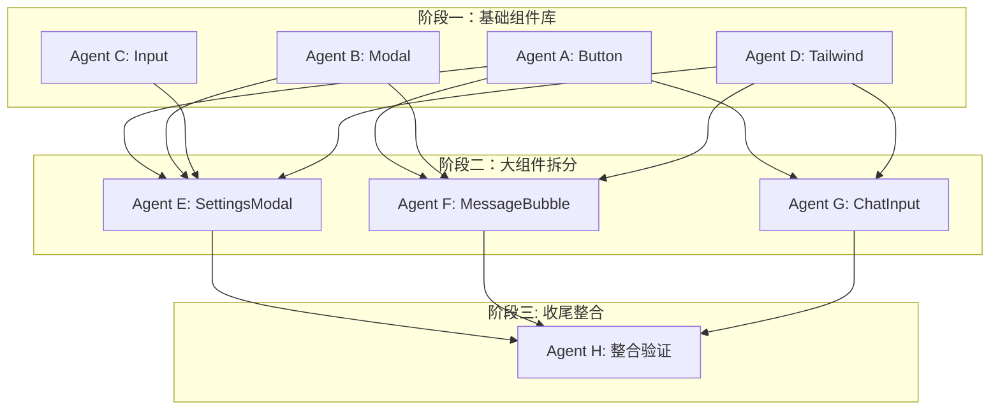

# 前端架构重构计划

> 创建时间：2025-01-19
> 目标：提炼组件库，消除代码重复，提升可维护性

## 一、改造目标

| 指标 | 当前 | 目标 |
|------|------|------|
| 最大组件行数 | 1113 | < 300 |
| 通用组件数 | 0 | 8+ |
| 代码重复率 | ~15% | < 5% |
| 动态 className | 121 | < 30 |

---

## 二、任务拆解与 Agent 分配

### 阶段一：基础组件库（可并行）

```
┌─────────────────────────────────────────────────────────────────┐
│                        阶段一：基础组件库                          │
│                      （4 个 Agent 并行执行）                       │
├─────────────┬─────────────┬─────────────┬─────────────────────────┤
│   Agent A   │   Agent B   │   Agent C   │        Agent D          │
│   Button    │    Modal    │    Input    │    Tailwind 组件类       │
│   1.5h      │    2h       │    1h       │        1h               │
└─────────────┴─────────────┴─────────────┴─────────────────────────┘
```

#### Agent A：Button 组件提取 (已完成)
- [x] 创建 `src/renderer/components/primitives/Button.tsx`
- [x] 实现 variant: primary | secondary | ghost | danger
- [x] 实现 size: sm | md | lg
- [x] 实现 loading 状态
- [x] 实现 icon 支持
- [x] 创建 `src/renderer/components/primitives/IconButton.tsx`
- [x] 替换以下文件中的按钮代码：
  - ChatInput.tsx (5 处)
  - SettingsModal.tsx (8 处)
  - Sidebar.tsx (3 处)
  - TitleBar.tsx (2 处)
  - ConfirmModal.tsx (2 处)

#### Agent B：Modal 组件提取 (已完成)
- [x] 创建 `src/renderer/components/primitives/Modal.tsx`
- [x] 实现 size: sm | md | lg | xl | full
- [x] 实现 header/footer 插槽
- [x] 实现 ESC 关闭、点击遮罩关闭
- [x] 创建 `src/renderer/components/composites/ConfirmDialog.tsx`
- [x] 重构以下 Modal 组件：
  - ConfirmModal.tsx -> 使用 Modal + ConfirmDialog
  - AuthModal.tsx -> 使用 Modal
  - PermissionModal.tsx -> 使用 Modal
  - UserQuestionModal.tsx -> 使用 Modal
  - ForceUpdateModal.tsx -> 使用 Modal

#### Agent C：Input/Form 组件提取 (已完成)
- [x] 创建 `src/renderer/components/primitives/Input.tsx`
- [x] 创建 `src/renderer/components/primitives/Textarea.tsx`
- [x] 创建 `src/renderer/components/primitives/Select.tsx`
- [x] 创建 `src/renderer/components/composites/FormField.tsx` (Label + Input + Error)
- [x] 替换 SettingsModal 中的表单元素
- [x] 替换 AuthModal 中的表单元素

#### Agent D：Tailwind 组件类提取 (已完成)
- [x] 在 `src/renderer/styles/tailwind.css` 添加 @layer components
- [x] 提取 .btn .btn-primary .btn-secondary .btn-ghost .btn-danger
- [x] 提取 .input .input-error
- [x] 提取 .panel .panel-header .panel-body
- [x] 提取 .badge .badge-success .badge-warning .badge-error
- [x] 提取 .card .card-hover

---

### 阶段二：大组件拆分（依赖阶段一，可并行）

```
┌─────────────────────────────────────────────────────────────────┐
│                      阶段二：大组件拆分                           │
│                     （3 个 Agent 并行执行）                       │
├───────────────────┬───────────────────┬─────────────────────────┤
│      Agent E      │      Agent F      │        Agent G          │
│   SettingsModal   │   MessageBubble   │       ChatInput         │
│   拆分为 8 文件    │   拆分为 5 文件    │      拆分为 4 文件       │
│       3h          │       2.5h        │         2h              │
└───────────────────┴───────────────────┴─────────────────────────┘
```

#### Agent E：SettingsModal 拆分 (已完成)
- [x] 创建 `src/renderer/components/features/settings/` 目录
- [x] 拆分 SettingsModal.tsx (1113行) 为：
  ```
  settings/
  ├── SettingsModal.tsx      # 布局 + Tab 切换 (~100行)
  ├── tabs/
  │   ├── ModelSettings.tsx      # 模型配置
  │   ├── AppearanceSettings.tsx # 外观设置
  │   ├── LanguageSettings.tsx   # 语言设置
  │   ├── CloudSettings.tsx      # 云端设置
  │   ├── DisclosureSettings.tsx # 披露设置
  │   ├── UpdateSettings.tsx     # 更新设置
  │   ├── DataSettings.tsx       # 数据管理
  │   └── AboutSettings.tsx      # 关于
  └── index.ts
  ```
- [x] 使用阶段一的 Modal、Button、Input 组件
- [x] 确保类型定义完整

#### Agent F：MessageBubble 拆分 (已完成)
- [x] 创建 `src/renderer/components/features/chat/MessageBubble/` 目录
- [x] 拆分 MessageBubble.tsx (975行) 为：
  ```
  MessageBubble/
  ├── index.tsx              # 主入口 (~150行)
  ├── UserMessage.tsx        # 用户消息
  ├── AssistantMessage.tsx   # AI 消息
  ├── MessageContent.tsx     # 消息内容渲染
  ├── ToolCallDisplay.tsx    # 工具调用显示
  ├── AttachmentPreview.tsx  # 附件预览
  ├── types.ts               # 类型定义
  └── utils.ts               # 工具函数
  ```
- [x] 提取 ToolCall 相关类型到 types.ts

#### Agent G：ChatInput 拆分 (已完成)
- [x] 创建 `src/renderer/components/features/chat/ChatInput/` 目录
- [x] 拆分 ChatInput.tsx (740行) 为：
  ```
  ChatInput/
  ├── index.tsx              # 主入口 (~100行)
  ├── InputArea.tsx          # 输入区域
  ├── AttachmentBar.tsx      # 附件栏
  ├── SendButton.tsx         # 发送按钮（含状态）
  ├── useFileUpload.ts       # 文件上传 hook
  └── utils.ts               # 工具函数
  ```
- [x] 使用阶段一的 Button、IconButton 组件

---

### 阶段三：收尾整合（依赖阶段二）

```
┌─────────────────────────────────────────────────────────────────┐
│                       阶段三：收尾整合                            │
│                        （1 个 Agent）                            │
├─────────────────────────────────────────────────────────────────┤
│                          Agent H                                 │
│   - 创建组件统一导出 index.ts                                     │
│   - 创建 uiStore (modal/toast 状态管理)                          │
│   - 运行 typecheck 修复类型错误                                   │
│   - 更新组件文档                                                  │
│                             2h                                   │
└─────────────────────────────────────────────────────────────────┘
```

#### Agent H：整合与验证 (已完成)
- [x] 创建 `src/renderer/components/primitives/index.ts` 统一导出
- [x] 创建 `src/renderer/components/composites/index.ts`
- [x] 创建 `src/renderer/components/features/index.ts`
- [x] 创建 `src/renderer/components/index.ts` 总入口
- [x] 创建 `src/renderer/stores/uiStore.ts`
- [x] 运行 `npm run typecheck` 修复所有类型错误
- [x] 运行 `npm run build` 确保构建通过
- [x] 更新 CLAUDE.md 中的目录结构说明

---

## 三、执行顺序甘特图

```
时间线    │ 0h    1h    2h    3h    4h    5h    6h    7h
──────────┼──────────────────────────────────────────────
Agent A   │ ████████████████  Button (1.5h)
Agent B   │ ██████████████████████  Modal (2h)
Agent C   │ ████████████  Input (1h)
Agent D   │ ████████████  Tailwind (1h)
          │              │
          │              ▼ 阶段一完成检查点
          │
Agent E   │              ██████████████████████████████  Settings (3h)
Agent F   │              ████████████████████████  MessageBubble (2.5h)
Agent G   │              ██████████████████████  ChatInput (2h)
          │                                    │
          │                                    ▼ 阶段二完成检查点
          │
Agent H   │                                    ██████████████████  整合 (2h)
          │                                                      │
          │                                                      ▼ 完成
```

**总工时**：~15 小时（并行执行约 7 小时）

---

## 四、依赖关系



---

## 五、验收标准

### 阶段一验收 (已完成)
- [x] `npm run typecheck` 通过
- [x] Button/Modal/Input 组件可独立使用
- [x] Tailwind 组件类在 IDE 中有自动补全

### 阶段二验收 (已完成)
- [x] 所有拆分后的文件 < 300 行
- [x] 原功能无回归（手动测试）
- [x] `npm run build` 通过

### 最终验收 (已完成)
- [x] 组件库导出结构清晰
- [x] 代码重复率 < 5%
- [x] 文档已更新

---

## 六、回滚策略

每个阶段完成后创建 git tag：
```bash
git tag refactor/phase1-primitives
git tag refactor/phase2-split
git tag refactor/phase3-final
```

如果某个 Agent 的改动导致问题，可以单独回滚该部分。

---

## 七、启动命令

```bash
# 阶段一：4 个 Agent 并行启动
# Agent A
claude "执行 REFACTOR-PLAN.md 中 Agent A 的任务：提取 Button 组件"

# Agent B
claude "执行 REFACTOR-PLAN.md 中 Agent B 的任务：提取 Modal 组件"

# Agent C
claude "执行 REFACTOR-PLAN.md 中 Agent C 的任务：提取 Input/Form 组件"

# Agent D
claude "执行 REFACTOR-PLAN.md 中 Agent D 的任务：提取 Tailwind 组件类"
```

---

## 八、注意事项

1. **不要跨阶段并行**：阶段二依赖阶段一的组件
2. **及时提交**：每完成一个组件立即 commit
3. **类型优先**：先写 interface，再写实现
4. **保持功能不变**：这是重构，不是新增功能
5. **测试验证**：每个组件完成后手动测试 UI 表现
