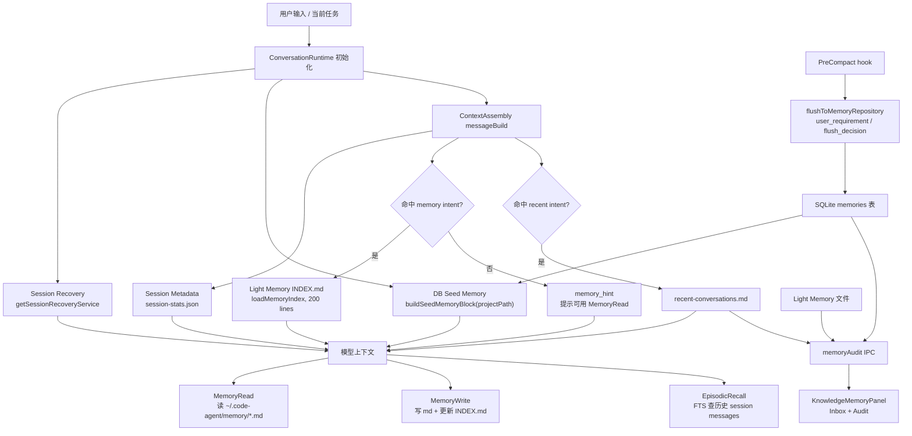

# code-agent Memory 系统整合研究：对标 Memoh

> 日期：2026-05-14
> 范围：长期记忆、会话记忆、Knowledge Inbox、Light Memory、DB memory 的产品与技术整合
> 参照：`/tmp/memoh-study` 的 memohai/Memoh 浅克隆源码
> 边界：只研究机制，不引入 AGPL 代码；不默认引入向量库；不做代码改动

## 结论

code-agent 当前已经有几块有价值的 memory 原件，但它们还没有形成一个统一产品。最清楚的分工应该是：

- **Light Memory** 做“用户确认后稳定生效的长期记忆”，继续保持文件可读、可编辑、可备份。
- **DB memory** 做“运行时可查询、可排序、可衰减、可作为候选的结构化记忆层”，承接 seed 注入、pre-compact flush、候选队列和审计元数据。
- **Session memory** 做“会话原始证据和短期连续性”，包括 session transcript、FTS recall、recent conversations、session recovery，不直接等同长期记忆。
- **Knowledge Inbox** 做“候选转正的工作流”，它应该是审阅、合并、拒绝、编辑、溯源的入口，而不是第四种独立存储。
- **Memory Workbench** 做最终产品面：可编辑、可审计、可重建、可导入导出、可解释注入、用户确认和回滚。

当前最大问题不是缺一个检索算法，而是缺一条“候选生成 -> 用户确认 -> 稳定存储 -> 注入可解释 -> 可重建”的闭环。Memoh 最值得借鉴的也不是 Extract/Decide 本身，而是它把 provider、bot 绑定、上下文注入、手动 CRUD、文件源、索引重建、健康状态和 UI 管理拉成了一条产品链。

## code-agent 当前 memory 全链路图

### 总览

### 1. Light Memory：文件型长期记忆

核心路径是 `~/.code-agent/memory/INDEX.md + *.md`：

- `src/main/lightMemory/indexLoader.ts:14-21` 定义目录与 INDEX 路径。
- `src/main/lightMemory/indexLoader.ts:29-42` 读取 INDEX，并把它截断到 200 行。
- `src/main/tools/modules/lightMemory/memoryWrite.ts:114-158` 写入带 frontmatter 的 markdown 文件，并更新 INDEX。
- `src/main/tools/modules/lightMemory/memoryRead.ts` 按文件名读取细节文件，限制 `.md`、禁止路径穿越，并做敏感信息 guard。
- `src/main/lightMemory/lightMemoryIpc.ts` 给 UI 提供 lightList/lightRead/lightDelete/lightStats。

这套设计的优点很明确：用户和 agent 都能理解文件，备份迁移简单，适合保存强规则、偏好、项目事实、纠偏反馈。缺点也明显：没有稳定 ID、没有版本历史、没有状态机，`INDEX.md` 是模型能不能发现文件的关键，但它不是一个强一致索引。

### 2. DB memory：结构化但产品归属还散

DB memory 主要落在 SQLite `memories` 表和旧的 `project_knowledge/user_preferences`：

- `src/main/services/core/repositories/MemoryRepository.ts:26-60` 创建 `memories` 记录，字段有 type/category/content/summary/source/projectPath/sessionId/confidence/metadata/accessCount。
- `src/main/services/core/repositories/MemoryRepository.ts:70-118` 支持按 type/category/source/projectPath/sessionId 列表查询。
- `src/main/services/core/repositories/MemoryRepository.ts:120-153` 支持更新、删除；`searchMemories()` 还有基于访问时间的 confidence decay。
- `src/main/ipc/memory.ipc.ts:139-179` 的 `handleListMemories()` 仍从旧 `project_knowledge` 和 `user_preferences` 映射成 MemoryItem。
- `src/main/ipc/memory.ipc.ts:185-219` 的 update/delete 只处理 `pk_` 和 `pref_`，没有覆盖新 `memories` 表里的 `mem_*`。
- `src/main/ipc/memory.ipc.ts:246-281` 的 import/export 也是旧格式导出，导入时用 `content.split(':')` 猜 preference key，保真度不够。

所以当前 DB memory 更像运行时素材库。它适合存候选、摘要、压缩前保留事实、注入候选，但还不适合作为用户心智里的“长期记忆唯一真相”。

### 3. 跨会话注入：有三条入口，策略不统一

目前实际注入有三条：

- **Seed memory**：`ConversationRuntime` 在 run 初始化时调用 `buildSeedMemoryBlock(this.ctx.workingDirectory)`，并注入 `<seed-memory>`。见 `src/main/agent/runtime/conversationRuntime.ts:1099-1104`。
- **Light Memory index**：`ContextAssembly` 只在 query 命中 `MEMORY_INTENT_PATTERN` 时读 `INDEX.md`，否则注入很短的 `memory_hint`。见 `src/main/agent/runtime/contextAssembly/messageBuild.ts:1115-1133`。
- **Recent conversations**：只有 query 命中 recent intent 时，才注入 recent conversations。见 `src/main/agent/runtime/contextAssembly/messageBuild.ts:1190-1200`。

这个策略节省 token，但也造成一个产品问题：用户不知道这次到底用了哪些记忆。Knowledge Memory Panel 已经把 `seed-candidate / memory-index / recent-conversations / available / stored` 做成审计标签，方向是对的，但还没有接到“本轮实际注入证据”。

### 4. 会话记忆：有原始证据，有召回工具，但还没进 Inbox

会话层现在有三类素材：

- session transcript 本身，是最强原始证据。
- `EpisodicRecall` 用 FTS5 trigram 搜历史 session messages，适合“之前是不是做过”这类场景。
- `recent-conversations.md` 保存最近 15 条用户意图摘要，适合轻量恢复话题。

它们的问题不是存不住，而是没有稳定的“摘录 -> 候选 -> 审阅 -> 写入长期记忆”流程。`recent-conversations` 已在 Knowledge Inbox 里被显示为候选，但只是展示，原因文案也写了“当前没有自动确认/写入项目知识的闭环”（`KnowledgeMemoryPanel.tsx:332-339`）。

### 5. Knowledge Inbox / Audit：已有只读雏形

`KnowledgeMemoryPanel` 的投影很接近目标产品的第一版：

- `buildAuditItems()` 把 Light Memory 文件、INDEX、recent conversations、DB memories 合成一个审计列表，并标记注入可能性。见 `src/renderer/components/features/knowledge/KnowledgeMemoryPanel.tsx:243-308`。
- `buildInboxItems()` 从 `session_extracted`、recent conversations、失败/模式信号里拼出 Inbox 候选。见 `src/renderer/components/features/knowledge/KnowledgeMemoryPanel.tsx:316-347`。
- UI 有刷新、搜索、分组、展开原文证据。

但它还缺关键动作：确认、编辑后确认、拒绝、合并、拆分、标为过期、写入 Light Memory、写入 DB memory、绑定 session/source evidence、回滚。

### 6. 自动学习：代码在，主路径基本断开

`memoryHooks.ts` 里有 session end 提取逻辑，但当前 `BuiltinHookExecutor.getMemoryServiceAdapter()` 直接返回 `null`，注释写的是 memory service removed。见 `src/main/hooks/builtinHookExecutor.ts:315-318`。这意味着 session end learning hook 现在基本是 no-op。

真正还在落库的是 pre-compact flush：

- `src/main/hooks/builtins/contextHooks.ts:513-533` 把 high importance decision 和 user requirement 构造成候选。
- `src/main/hooks/builtins/contextHooks.ts:539-565` 用 hash 对近期 `session_extracted` 去重。
- `src/main/hooks/builtins/contextHooks.ts:567-583` 写入 `memories` 表，并保留 sessionId、projectPath、flush metadata。

这条链更适合做 Knowledge Inbox 的候选来源，而不适合直接变成长期记忆。

### 7. 用户确认：接口遗留，产品闭环缺席

共享 contract 里有 `MemoryLearnedEvent` 和 `MemoryConfirmRequest`，但确认响应 handler 已经 no-op：`src/main/ipc/memory.ipc.ts:637-640`。这说明“用户确认”曾经进入过设计，但旧 notification 系统被移除后，没有新的确认工作流接上。

## Memoh 做得好的完整机制

### 1. Provider 是产品级抽象，不只是后端实现

Memoh 的 `Provider` 接口把 conversation hook、MCP tool、CRUD、compact、usage 放在同一个合同里。见 `/tmp/memoh-study/internal/memory/adapters/provider.go:11-39`。

这让 memory 能同时服务三件事：

- 对话前自动注入相关记忆。
- 对话后自动形成记忆。
- 用户/管理员可以手动搜索、创建、删除、压缩、看用量。

code-agent 当前是工具、IPC、hook、DB repo、Light Memory 各走各的，缺少一个 “MemoryProvider/MemoryRuntime” 级别的内部契约。

### 2. BeforeChat 注入有检索、打包和预算

Memoh 的 `OnBeforeChat()` 会按 botID 搜索相关 memory，dedupe、按 score 排序，再交给 packer 控预算，最后注入 `<memory-context>`。见 `/tmp/memoh-study/internal/memory/adapters/builtin/builtin.go:155-207`。

`context_packer.go` 这块尤其值得借鉴：

- 默认 target 6 条，总预算 1800 chars，每条 80-360 chars。
- 先 overfetch，再贪心装入。
- 不够条数时压缩已选条目，为更多条目让空间。
- 最后做 anti-lost-in-the-middle，把高分条目放头尾。见 `/tmp/memoh-study/internal/memory/adapters/builtin/context_packer.go:20-47` 和 `:83-159`。

code-agent 当前 seed memory 是“按 confidence/updatedAt 排序后的 200 token 小块”，Light Memory index 则靠意图注入。缺的是“针对当前 query 的候选打包策略”和“本轮注入解释”。

### 3. AfterChat formation 有候选检索和 CRUD 决策

Memoh 的 formation 不是单纯抽取事实：

- `Extract` 从完整消息中抽 facts。
- 根据 facts 搜候选，搜不到或不足时再 GetAll 补候选。
- `Decide` 在新 facts + existing candidates 上决定 ADD/UPDATE/DELETE/NOOP。
- apply 阶段真正调用 runtime CRUD。见 `/tmp/memoh-study/internal/memory/adapters/builtin/formation.go:33-76`、`:80-156`、`:159-218`。

这个机制的价值是“更新旧记忆”和“删除过时记忆”进入 formation 流程。code-agent 现在的 pre-compact flush 只会 append 候选，Light Memory Write 主要依赖模型主动写文件；缺少自动候选对旧记忆的合并/替换/失效建议。

### 4. 文件源是可重建真相，索引是派生物

Memoh 的 storefs 把 markdown 文件作为 source of truth：

- `PersistMemories()` 会先扫描 id -> file path，然后按日期文件合并写入，最后同步 overview。见 `/tmp/memoh-study/internal/memory/storefs/service.go:160-208`。
- `RebuildFiles()` 可以用内存条目重建文件。见 `:211-235`。
- `SyncOverview()` 根据全部 daily memory 文件生成 `MEMORY.md`。见 `:365-369`。
- `formatMemoryDayMD()` 以 `## Entry <id>` + YAML meta + markdown body 保存每条记忆。见 `:441-478`。
- 读旧 JSON 时会迁移成 markdown 格式。见 `:372-391`。

这点非常适合 code-agent：Light Memory 已经是文件型，但还缺稳定 entry ID、daily 分片、overview/INDEX 可重建、旧格式迁移、索引和源文件一致性检查。

### 5. 管理 UI 覆盖了日常维护动作

Memoh 的 bot memory UI 不是只展示：

- 左侧文件/记忆列表，搜索、刷新。
- 右侧编辑器，有 dirty 状态、保存、删除。
- 新建 memory 时可以从历史消息选择，转成 `[ROLE]: text` 草稿。见 `/tmp/memoh-study/apps/web/src/pages/bots/components/bot-memory.vue:1193-1221`。
- 保存当前实现是 delete old + add new，虽然不如 backend Update 精确，但至少给了用户可编辑入口。见 `:1237-1261`。
- compact UI 给了 light/medium/aggressive 三档和可选 decay date。见 `bot-memory.vue:60-123`、`:1302-1315`。
- sparse/dense 模式下还会展示检索诊断图，帮助理解索引质量。

code-agent 的 Knowledge Memory Panel 当前比 Memoh 更擅长“审计解释”，但弱在“管理动作”。Memoh 强在“你看到了就能改、能删、能创建、能压缩”。

### 6. Provider 设置和 bot 绑定是完整产品流

Memoh 有全局 memory provider 页面：

- 创建 provider 时可选 builtin/mem0/openviking。见 `/tmp/memoh-study/apps/web/src/pages/memory/components/add-memory-provider.vue:27-45`。
- builtin provider 有 off/sparse/dense 三段模式；dense 要选择 embedding model，sparse/dense 显示 collection 健康。见 `provider-setting.vue:48-180`。
- bot settings 里可以绑定 memory provider，并显示 source dir、overview path、markdown count、source count、indexed count、health、手动 sync。见 `/tmp/memoh-study/apps/web/src/pages/bots/components/settings-context-card.vue:25-120`。

code-agent 暂时不需要照搬 provider 商业化形态，但需要借“memory layer 有健康状态、有 source/index 数、有手动 rebuild/sync”的产品语法。

### 7. Rebuild / Status / Usage 是生产能力，不是锦上添花

Memoh 给了三类维护 API：

- `compact`：接收 ratio/decay_days，调用 provider compact。见 `/tmp/memoh-study/internal/handlers/memory.go:426-465`。
- `usage`：汇总 count/bytes。见 `:467-510`。
- `rebuild`：要求 provider 支持 SourceSync，先看 `CanManualSync`，再从 markdown source 重建派生存储。见 `:512-550`。
- `status`：暴露 runtime status。见 `:552-565`。

code-agent 的 Light Memory 适合立刻补“source/index 一致性、rebuild INDEX、导出包、导入 dry-run、健康检查”。这些不要求向量库。

### 8. 需要谨慎看待 Memoh compact 的实现落差

Memoh 文档注释和 UI 暗示 compact 会合并相似/冗余记忆，`memllm.Client.Compact()` 也提供了 LLM compaction 能力。但 builtin sparse/dense/file runtime 当前实际 compact 多数是“按 updatedAt 保留 ratio 前 N 条，然后 Rebuild”。例如 `/tmp/memoh-study/internal/memory/adapters/builtin/sparse_runtime.go:265-305`。

所以 code-agent 不该把“LLM compact 记忆”当成已经验证的可照搬能力。更稳的做法是先做可审计的候选压缩：展示将保留/合并/删除什么，由用户确认后再应用。

## 我们缺什么

### 产品缺口

1. **没有统一的 Memory Home**
   现在 Knowledge/Memory 是诊断面板，不是用户日常管理入口。用户不能在一个地方完成：看当前会用什么、确认候选、编辑长期记忆、导入导出、重建索引。

2. **Knowledge Inbox 不能处理候选**
   Inbox 已经会列出候选，但没有 approve/reject/edit/merge/split/stale 这些动作，也没有“采纳后写到哪里”的明确选择。

3. **长期记忆和会话记忆边界不清**
   recent conversations、session_extracted、Light Memory、DB memory 都会出现在 panel 里，但用户很难判断哪些已经稳定影响 agent，哪些只是候选，哪些只是历史证据。

4. **注入不可解释**
   Panel 能推测 seed-candidate、memory-index、recent-conversations，但缺少“本轮实际注入了哪些条目、为什么、用了多少 token、是否被截断”的 trace。

5. **确认机制断开**
   contract 里有 confirm request，IPC 里 confirm response 已 no-op。当前没有新的用户确认产品链路。

6. **导入导出不可信**
   现有 DB import/export 是旧 MemoryItem 格式，preference 解析靠字符串 split，Light Memory 文件没进入完整包，session evidence/source evidence 也没有被保真导出。

7. **缺少记忆生命周期**
   没有 draft/candidate/active/rejected/stale/archived 状态，也没有来源、确认人、确认时间、替代关系、过期理由。

### 技术缺口

1. **Memory runtime 契约缺失**
   工具、IPC、repo、hooks、panel 分散。需要内部 `MemoryRuntime` 或 `MemoryRepositoryFacade` 统一 CRUD、candidate、promotion、injection、audit。

2. **Light Memory 缺稳定 entry model**
   现在一个文件就是一个 memory 单元，适合人工文件，但不适合 merge/split/rebuild。Memoh 的 daily markdown entry + YAML meta 值得借鉴，但要用我们自己的格式。

3. **DB memory 和旧 project_knowledge 并存**
   `memory.ipc.ts` 管理面还在操作旧表，新 `memories` 表反而主要用于 seed/audit。需要迁移和明确职责。

4. **sessionEnd learning 没有落点**
   `getMemoryServiceAdapter()` 返回 null，自动 learning 主链断开。pre-compact flush 是当前唯一更可靠的候选来源。

5. **检索/注入策略太粗**
   seed memory 只按项目、置信度、更新时间；Light Memory 靠 intent 匹配注入 INDEX；recent conversations 靠 intent 注入。缺 query-aware packer、去重、预算控制、注入 trace。

6. **rebuild 缺位**
   Light Memory 可以写 INDEX，但没有校验/重建 INDEX 的正式 API；DB memories 也没有从 Light Memory 或导入包重建的流程。

7. **审计证据模型不够强**
   DB memory 有 sessionId/projectPath/metadata，但缺 evidence span、message id、source file path、write operation id。长期记忆转正后也缺源证据指针。

8. **权限与敏感信息需要更细**
   MemoryRead/Write 有敏感信息 guard 和工具权限，但用户确认、导出包、跨项目注入、个人偏好跨项目生效，需要更明确的隐私边界。

### 体验缺口

1. **用户无法快速回答“你这次为什么这么说”**
   需要在回答或 trace 里能打开 memory provenance：来自哪条记忆、是否稳定、是否用户确认。

2. **用户无法低成本纠错**
   现在纠错要靠下一轮对话或手改文件。应该在面板里一键“这条不对”“改成这样”“以后别用”。

3. **候选质量不可控**
   自动候选没有分风险等级。用户偏好、项目规则、事实、一次性上下文应该有不同确认强度。

4. **维护动作偏工程化**
   rebuild/index/health/export/import 都还不是清晰按钮和结果报告。

5. **跨会话连续性缺少用户可见开关**
   用户应该能看到并控制：本项目启用哪些 memory 层、跨项目偏好是否注入、session recall 是否参与。

## 三套方向

### 方向 A：保守增强

目标：不改底层架构，把已有 Light Memory + DB seed + Knowledge Panel 收成可用闭环。

做法：

- 把 Knowledge Inbox 从只读变成最小动作面：approve / reject / edit approve。
- approve 后写入 Light Memory 文件，并维护 INDEX；reject 写入 DB memory 状态或本地 rejected list，避免重复出现。
- 增加 Light Memory health：列出 INDEX 缺失项、孤儿文件、frontmatter 错误、超 200 行风险。
- 增加 `rebuild INDEX`：从 memory files 重建 INDEX，保留描述。
- 给 seed memory 和 memory index 注入记录 trace：本轮注入了什么、多少字符、为什么。
- DB import/export 暂时不扩；先做 Light Memory folder zip/markdown export 和 dry-run import。

收益：

- 很快让用户能管理候选，修正“记错了”的问题。
- 不碰向量库，不大改 schema，风险小。
- 保住 File-as-Memory 的简单性。

代价：

- DB memory 与 Light Memory 仍然双轨。
- 候选质量主要依赖现有 pre-compact flush 和 recent conversations。
- 不能解决复杂合并、版本历史、全量迁移。

风险：

- approve 写文件如果没有稳定 ID，后面 merge/split 仍然难。
- Knowledge Inbox 容易变成“又一个列表”，需要控制动作极少且清晰。

适用时机：

- 适合 P0 先做。当前最大痛点是有候选、有审计，但用户无法确认和修正。

### 方向 B：中等产品化

目标：建立统一 Memory Runtime，把 Light Memory 作为 confirmed source，DB memory 作为 candidate/index/runtime 层，补完整生命周期。

做法：

- 定义统一 `MemoryEntry`：id、kind、scope、content、summary、status、source、confidence、projectPath、sessionId、evidence、createdAt、updatedAt。
- `status` 至少包含：candidate / active / rejected / stale / archived。
- Light Memory 文件升级为多 entry 或 sidecar metadata；INDEX 从 active entries 自动生成，可重建。
- DB memory 承接候选、注入日志、访问统计、衰减、拒绝记录；active 长期记忆可在 DB 有镜像，但文件为 source of truth。
- Knowledge Inbox 支持 merge/split/edit/stale，采纳时写 active entry。
- 注入策略统一：query -> candidate retrieval -> packer -> injection trace。第一版可用 FTS/LIKE + Light index，不引入向量库。
- 导入导出做成 bundle：memory entries + evidence manifest + INDEX + rejected/stale 状态，导入先 dry-run diff。
- 会话记忆进入 Inbox：从 selected transcript / recent conversations / pre-compact flush 创建 candidate。

收益：

- 产品心智清楚：候选区、长期记忆区、会话证据区、注入记录区。
- 可审计、可重建、可导入导出开始成立。
- 后续要接更强检索或外部 provider，有统一契约承接。

代价：

- 需要 schema 和文件格式迁移。
- 需要 IPC、renderer、runtime 注入一起改，测试面较大。
- 要认真处理旧 `project_knowledge/user_preferences` 与新 `memories` 的迁移。

风险：

- 格式设计一旦过重，会压垮 File-as-Memory 的优点。
- 过早做复杂 merge UI，会拖慢主链路。

适用时机：

- P1 主线。完成 P0 后，应该进入这条路线，而不是继续往只读面板堆展示。

### 方向 C：完整 Memory Workbench

目标：把 memory 做成 code-agent 的一等工作台，覆盖多来源知识、跨会话注入、用户确认、审计回放、重建、导入导出和策略配置。

做法：

- 顶层入口改成 Memory Workbench，分为 Inbox、Active Memory、Session Evidence、Injection Trace、Maintenance、Policy。
- 支持记忆 diff：自动候选 vs 现有 active，显示 ADD/UPDATE/DELETE/NOOP 建议。
- 支持批量处理：批量确认、批量归档、按项目/用户/工具/会话过滤。
- 支持 “Why injected?”：每次模型调用都能回看注入条目、预算、触发原因、被截断内容。
- 支持 “Rebuild all”：从文件 source 重建 INDEX、DB mirror、FTS projection、注入索引。
- 支持导入导出：完整 bundle、部分项目包、用户偏好包、红线规则包。
- 支持策略：跨项目偏好默认注入、项目记忆只在 cwd 命中时注入、敏感 memory 永不自动注入、低置信度候选必须确认。
- 可选 provider 扩展：未来可以有 local sparse/dense/remote provider，但不作为默认依赖。

收益：

- memory 成为可被用户信任和维护的产品能力。
- 对长期协作、生活/工作助手定位价值最大。
- 能显著降低“记错、乱注入、忘了用户纠正”的信任损耗。

代价：

- 是完整产品，不是一轮小改。
- 需要 event/evidence/trace 数据模型，UI 也要重新组织。
- 测试要覆盖导入导出、重建、迁移、注入 trace、权限和敏感信息。

风险：

- 容易做成复杂后台。必须保持用户最常用动作在第一层：确认、改、删、看来源、关掉。
- 如果自动 formation 太激进，会制造错记忆；必须默认候选制。

适用时机：

- P2。等中等产品化把 entry model 和 source/index 分工跑顺后，再做完整 workbench。

## 推荐路线

### P0：先让候选能被用户处理

1. **Knowledge Inbox 最小确认流**
   - 对 `session_extracted`、recent conversations、failure/pattern 候选提供 approve / reject / edit approve。
   - approve 默认写 Light Memory，type 根据候选分类映射为 user/feedback/project/reference。
   - reject 记录到 DB，避免同 hash 候选反复出现。

2. **Light Memory Health + Rebuild INDEX**
   - 扫描 `~/.code-agent/memory/*.md`，检查 frontmatter、INDEX 缺失/孤儿项、重复文件、超长 INDEX。
   - 增加 rebuild INDEX 的主进程动作和 UI 按钮。

3. **注入 trace 最小化**
   - 在每轮记录 seedMemoryBlock、memory_index、recent_conversations 是否注入、来源条数、字符数、触发原因。
   - Knowledge Memory Panel 里区分“可能注入”和“本轮实际注入”。

4. **确认旧接口现实**
   - 明确 `MEMORY_CONFIRM_RESPONSE` no-op，新的确认走 Knowledge Inbox，不复活旧 notification。

### P1：统一模型和迁移

1. **定义 `MemoryEntry` 和状态机**
   - candidate/active/rejected/stale/archived。
   - source/evidence 一等字段：sessionId、messageId、filePath、toolCallId、flushHash。

2. **Light Memory source of truth**
   - active 长期记忆落文件；DB 保存 mirror/index/runtime metadata。
   - INDEX 从 active entries 自动生成。
   - 支持从文件重建 DB mirror。

3. **DB memory 角色收敛**
   - 新 `memories` 表承接候选、mirror、注入记录。
   - 旧 `project_knowledge/user_preferences` 做迁移或兼容只读。
   - `memory.ipc.ts` 的 update/delete/export/import 改为覆盖新 entry model。

4. **Query-aware packer**
   - 先用 FTS/LIKE + category/scope 过滤，不加向量库。
   - 引入 Memoh 那种 target items、per-item cap、total budget、anti-lost-in-middle。

5. **导入导出 v2**
   - bundle 包含 entries、INDEX、evidence manifest、状态、schema version。
   - import 必须 dry-run diff，显示新增/覆盖/冲突/跳过。

### P2：Memory Workbench

1. **Workbench IA**
   - Inbox、Active、Session Evidence、Injection Trace、Maintenance、Policy 六个视图。
   - 默认第一屏看 Inbox + 当前项目 Active Memory。

2. **Diff-based formation**
   - 参考 Memoh Extract -> candidates -> Decide，但输出进入 Inbox。
   - 建议 ADD/UPDATE/DELETE/NOOP，用户确认后才 active。

3. **重建和回放**
   - 从 source files 重建 INDEX/DB mirror/注入索引。
   - 每条 active memory 能打开来源证据和确认记录。

4. **策略层**
   - 用户偏好跨项目、项目规则仅 cwd、敏感 memory 禁止自动注入、候选置信度阈值。

## 关键设计建议

### 1. 不要让 DB memory 和 Light Memory 争夺“真相”

长期记忆需要用户能看懂、能备份、能手改。Light Memory 更适合做 confirmed source。DB memory 更适合做索引、候选、访问统计和运行时投影。

### 2. Knowledge Inbox 不要自动转正

pre-compact flush 很适合做候选，但它来自压缩压力下的保留逻辑，不等于用户确认过。默认进入 Inbox，用户点 approve 后才进入 active。

### 3. 会话记忆只做证据和候选来源

session transcript、FTS recall、recent conversations 都不应该直接变长期记忆。它们应该给候选提供证据，或者在当前任务里被召回。

### 4. 可重建优先级高于检索算法

先把 source files、INDEX、DB mirror、注入 trace 的关系做成可重建，再谈更强检索。否则后续引入任何索引都会加重不可信。

### 5. Memoh 的 compact 要借 UI 和维护语法，别照搬实现

Memoh UI 的 compact ratio、decay date、status/rebuild 很值得借；当前 sparse/dense runtime 的 compact 实现主要是按更新时间保留比例，不适合当作高质量记忆合并范式。

### 6. 第一版 packer 不需要向量库

可以先用：

- active Light Memory 的 title/description/content FTS。
- DB candidates 的 summary/content LIKE/FTS。
- projectPath、category、status、source 过滤。
- 最近访问和用户确认权重。

等产品闭环跑顺，再考虑可选 sparse/dense provider。

## 最小落地切片建议

### 切片 1：Inbox approve/reject

输入：`buildInboxItems()` 已有候选。
动作：approve 写 Light Memory；reject 写 rejected candidate。
验证：刷新 panel 后 active 文件出现，候选不重复出现，INDEX 更新。

### 切片 2：Light Memory Health

输入：`listMemoryFiles()` 和 `INDEX.md`。
动作：返回 health report：missingInIndex、orphanInIndex、invalidFrontmatter、duplicateNames、indexTooLong。
验证：造临时 memory dir fixture 跑单测。

### 切片 3：Injection Trace

输入：`buildSeedMemoryBlock()`、`loadMemoryIndex()`、`buildRecentConversationsBlock()`。
动作：记录每次实际注入的 block type、trigger、chars、source ids。
验证：单测覆盖 memory intent、非 memory intent、recent intent 三类。

### 切片 4：Export/Import v2 dry-run

输入：Light Memory files + DB candidates/rejected state。
动作：导出 bundle；导入先 dry-run diff。
验证：round-trip 不丢 frontmatter、INDEX 可重建、冲突可见。

## 最后判断

推荐先走 **方向 A -> 方向 B**。A 解决当前最扎眼的产品断点：候选不能处理、注入不可见、INDEX 不可重建。B 把底层分工收清，避免继续堆在旧 IPC 和只读 panel 上。

完整 Memory Workbench 值得做，但要等 `MemoryEntry`、source/index/mirror、Inbox 状态机跑顺。现在直接做大 Workbench，容易把还没定型的数据关系包进 UI 里，后面再拆会很痛。
