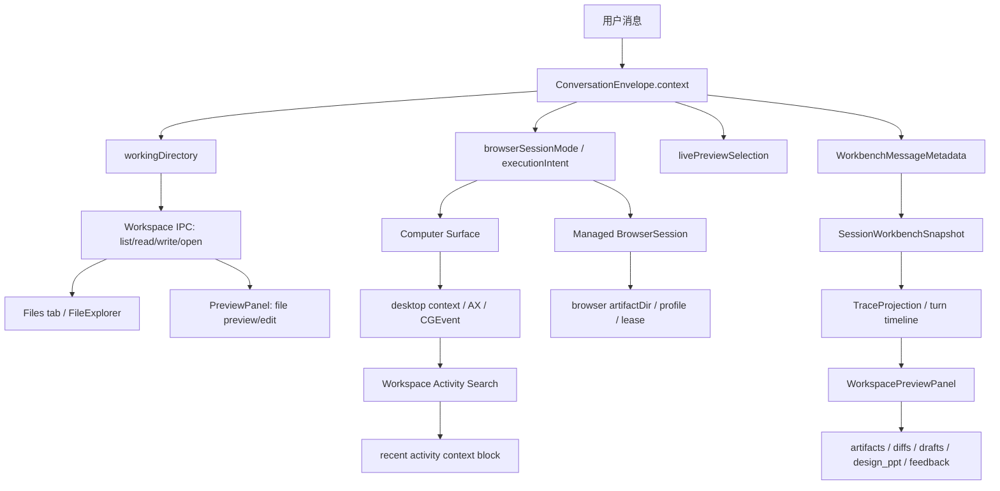

# code-agent Workspace 一等能力研究：对标 Memoh

> 日期：2026-05-14
> 范围：workspace、browser、computer use、workspace preview、artifact、desktop activity 的产品整合
> 参照：`/tmp/memoh-study` 的 memohai/Memoh 源码，当前 HEAD `1638a3e`
> 边界：只研究，不改代码；不把 Docker/K8s 当默认方案；不重做完整文件管理器

## 结论

code-agent 应该把 workspace 做成一等产品能力。浏览器、桌面操作、文件预览和 artifact 投影都已经有基础，真正欠缺的是统一入口和稳定对象，用户很难把它们理解成“助手正在使用同一个工作现场”。

默认产品隐喻建议叫 **助手工作台 / Workspace Home**，不建议一上来承诺“每个会话或每个助手都有自己的电脑”。code-agent 是桌面生活/工作助手，天然贴着用户的真实电脑、真实项目、真实 Mail/Calendar/浏览器/Finder 工作流。把默认心智改成“独立电脑”，会让用户误以为所有东西都在隔离 OS 里发生，反而遮住权限、隐私、真实文件位置和本机应用上下文。

更合适的分层是：

- **每个会话有工作台**：保存本轮状态、产物、预览、浏览器/桌面上下文、最近活动和可恢复证据。
- **每个项目可升格为项目工作区**：长期任务复用同一个根目录、偏好、最近产物和活动线索。
- **每个助手可按需申请隔离电脑**：只用于高风险自动化、依赖很重的构建、远程长跑任务、sub-agent 隔离和可复现执行。

Memoh 最值得借鉴的是“bot workspace 是产品对象”这件事，而不是默认容器化。它的容器、文件系统、快照、桌面/VNC 都挂在 bot workspace 生命周期上；code-agent 应该先把现有本地能力挂到 session/project workspace 生命周期上，再判断哪些场景需要隔离 runtime。

## code-agent 当前 Workspace 能力地图



### 1. Workspace 文件层：已有本地文件 API，但没有 Workspace 实体

`src/shared/contract/workspace.ts:5-17` 只有 `FileInfo` 和 `FileChange`，说明当前 contract 里 workspace 还只是文件列表/变更的薄类型。真正的文件能力在 `src/main/ipc/workspace.ipc.ts`：选择目录、获取/设置 current working directory、list/read/readBinary/write/create/open/reveal/download 都已经有了（`workspace.ipc.ts:17-64`、`:66-125`、`:236-299`）。

这套能力足够支撑本地桌面助手的 P0，但它还不是产品意义上的 workspace：

- 没有 workspace id、name、owner、type、root、createdAt、lastUsedAt。
- 没有 session workspace 和 project workspace 的区别。
- 没有生命周期动作，比如 archive、reset、snapshot、export manifest。
- 没有统一说明“这个文件属于本轮产物、项目源文件、浏览器下载，还是桌面活动引用”。

### 2. Session/Workbench 语义：已有投影，缺少实体化

`ConversationEnvelope.context` 已经能携带 `workingDirectory`、routing、skills/connectors/MCP、design brief、browser execution intent、live preview selection（`src/shared/contract/conversationEnvelope.ts:64-86`）。`WorkbenchMessageMetadata` 也会把这些内容落到消息元数据里（`:88-106`）。

`SessionWorkbenchSnapshot` 会从消息 metadata、tool history、session provenance、session metadata 里推断当前会话主表面是 workspace/browser/desktop/connector/chat，并生成 labels 和 summary（`src/shared/contract/sessionWorkspace.ts:9-20`、`:247-384`、`:448-535`）。

这说明 code-agent 已经有“会话工作现场”的推断层。缺的是把推断结果升格为可见、可管理的 Workspace Home：用户现在能看到单个 tab 或单个 panel，但看不到一个稳定对象在承载它们。

### 3. Workspace Preview：已有 artifact review 面，不是存储模型

`WorkspacePreviewItem` 的 contract 很丰富，覆盖 document、spreadsheet、message draft、calendar event、reminder、web snapshot、file、diff、terminal、trace、handoff、generic_html、chart、diagram、question_form、design_ppt 等类型，且有 status/source/file/content/actions/currentTurn/designBrief（`src/shared/contract/workspacePreview.ts:7-82`）。

实际模型由 `useWorkspacePreviewModel()` 读取当前 session messages、workingDirectory、pending permission、current turn artifact ownership，再调用 `buildWorkspacePreviewItems()` 生成（`src/renderer/hooks/useWorkspacePreviewModel.ts:7-36`）。`buildWorkspacePreviewItems()` 会从最近 60 条消息里收集 message artifacts、tool outputs、permission preview、current turn artifacts，排序后最多保留 40 条（`src/renderer/utils/workspacePreview.ts:324-424`、`:426-532`）。

`WorkspacePreviewPanel` 已经不只是“预览列表”：它有 Prompt Apps、Gallery、Copy preview、Delivery Review、Preview Feedback、Send feedback to chat，甚至会把设计 brief 绑定到 preview item 上（`src/renderer/components/WorkspacePreviewPanel.tsx:536-771`、`:893-1002`）。

当前边界很清楚：Workspace Preview 是“从会话证据投影出来的产物审阅面”，不是 workspace 的文件系统或生命周期模型。它应该成为 Workspace Home 里的 Preview/Outputs 区，而不是承担整个 workspace 概念。

### 4. PreviewPanel / Live Preview：文件预览和运行预览已经很强

`PreviewPanel` 支持 markdown/code 编辑、CSV/TSV 表格、图片/PDF、HTML iframe、长截图、Finder reveal、默认程序打开，也能保存文本文件（`src/renderer/components/PreviewPanel.tsx:21-35`、`:94-138`、`:228-432`）。

`appStore` 已经把 file preview 和 live dev server preview 都建成右侧 workbench tab，最多 8 个 preview tab，支持 LRU 淘汰；关闭 preview tab 时会停掉 code-agent 自己启动的 dev server（`src/renderer/stores/appStore.ts:53-104`、`:498-660`）。

这块很适合直接并入 Workspace Home 的 Preview 区，不需要重做完整 IDE 或完整文件管理器。

### 5. Browser / Computer：已有生产化基线，应该作为 Workspace 子表面

架构文档已经写明 Browser/Desktop 显式入口进入 workbench，托管浏览器具备 `session/profile/account/artifact/lease/proxy/TargetRef`，Computer Surface 具备 background AX / CGEvent 受控验证路径（`docs/architecture/workbench.md:34-35`、`:331-342`；`docs/architecture/overview.md:160-165`）。

代码上，`ManagedBrowserSessionState` 已经包含 `sessionId/profileId/profileMode/workspaceScope/artifactDir/lease/proxy/accountState/activeTab/lastTrace`（`src/shared/contract/desktop.ts:161-187`）。`BrowserService` 初始化时会创建 profileDir、artifactRootDir、downloadDir、artifactDir，并以 workspaceScope 参与 profile 解析（`src/main/services/infra/browserService.ts:112-179`）。

`useWorkbenchBrowserSession()` 会把 managed browser 和 desktop 模式统一成 readiness、preview、repair actions：托管浏览器可启动 headless/visible，桌面模式会检查 screen capture、accessibility、collector、computer surface 状态（`src/renderer/hooks/useWorkbenchBrowserSession.ts:40-111`、`:428-604`、`:606-711`）。

Computer Surface 的关键边界也很清楚：读动作可以并发，写动作必须走全局 FIFO mutex，因为真实桌面、键鼠和 frontmost 焦点不可池化（`src/main/services/desktop/computerSurfaceLock.ts:1-10`）。这进一步说明 code-agent 的“电脑”默认是用户当前真实电脑，而不是每个助手一台独立 OS。

### 6. Desktop Activity / Workspace Artifact：已有最近工作线索，但还没有归入 Workspace Home

`WorkspaceActivitySearchService` 把 desktop、mail、calendar、reminders 合成统一检索结果，并能生成“最近工作区活动”上下文块（`src/main/desktop/workspaceActivitySearchService.ts:10-44`、`:481-640`）。它默认不会在 prompt 注入路径刷新 office artifacts，避免拉起 Mail/Calendar/Reminders（`:596-603`）。

`WorkspaceArtifactIndexService` 会把 mail/calendar/reminders 最近条目索引成 `workspace_activity` memories，并用 lexical search 查询（`src/main/desktop/workspaceArtifactIndexService.ts:58-109`、`:644-802`）。

这些能力应该变成 Workspace Home 的 Recent Activity / Recent Artifacts，而不是散落在 context 注入和工具调用里。

## Memoh 的 Workspace 产品模型

### 1. 产品对象：Bot 拥有 Workspace，Workspace 拥有 runtime

Memoh 的 workspace 绑定在 bot 上。容器状态里有 container_id、workspace_backend、image、status、namespace、container_path、CDI devices、task_running、preserved data、legacy、created/updated（`/tmp/memoh-study/internal/workspace/manager.go:44-58`）。

容器页面是完整生命周期管理面：

- 缺容器时可以创建，支持 restore preserved data、自定义 image、GPU CDI devices（`bot-container.vue:778-889`）。
- 有容器时展示 ID/IMG/TASK badges、status、namespace、created/updated、container_path、CDI devices、metrics（`bot-container.vue:891-999`）。
- 数据操作有 export/import/restore preserved data/delete preserve（`bot-container.vue:479-520`、`:1000-1108`）。
- Snapshot 区可创建命名快照、展示版本/source/runtime snapshot name、rollback（`bot-container.vue:1148-1270`）。

这是一种强 runtime 产品：bot workspace 不只是“文件夹”，它是能启动、停止、备份、回滚、打开桌面的运行环境。

### 2. Workspace tab：chat/file/terminal/display/draft 都挂在 bot 下

Memoh 首页 workspace 使用 per-bot tabs，tab 类型包括 chat、file、terminal、display、draft（`/tmp/memoh-study/apps/web/src/store/workspace-tabs.ts:12-18`）。tabs 存在 `useStorage('workspace-tabs', {})`，按 bot id 保存（`:56-62`）。`chat-workspace.vue` 用一个 tab host 渲染 chat、file、terminal、display，并用 `KeepAlive` 保持状态（`chat-workspace.vue:1-44`）。

这个模型很明确：聊天、文件、终端和桌面都归属到“当前 bot 的工作区”，而不是一个全局编辑器。

### 3. 文件系统：以 `/data` 为 bot workspace 根

Memoh 的文件侧栏从 `/data` 开始，支持目录导航、上传、新建文件夹、刷新、打开、下载、重命名、删除，且 chat agent 做了 fs-mutating tool 后自动刷新（`chat-sidebar-files.vue:1-87`、`:226-285`、`:292-431`）。

文件 tab 用 `FileViewer`，文本走 Monaco，图片走 blob，保存调用 container fs write；如果 agent 改了同一 bot 的文件且用户没有 dirty edits，会自动 reload（`file-viewer.vue:48-100`、`:121-163`、`:166-230`）。

这块值得借鉴的是“文件作为 workspace 子表面”，不代表 code-agent 要复制完整文件管理器。code-agent P0 只需要当前 FileExplorer + PreviewPanel + recent touched files，不需要上传/重命名/删除全套 UI。

### 4. Desktop/VNC：虚拟显示器是容器 workspace 的一部分

Memoh 的 bot desktop 页面管理 virtual display 和 interaction sessions。它有 runtime diagnostics，分 infrastructure、environment、application 三组，检查 display、VNC、browser、toolkit 等状态（`bot-desktop.vue:1-148`、`:400-426`）。

`DisplayPane` 用 WebRTC 接视频流，`display-input` data channel 发送 pointer/key/wheel。连接前可以走 display prepare stream，连接后还会定期截取 display snapshot，作为 session preview（`display-pane.vue:545-627`、`:755-779`、`:812-904`、`:1066-1172`）。

这对 code-agent 的启发是：如果未来做隔离电脑，桌面/VNC 要作为一个明确 runtime surface，带诊断、会话、快照和关闭动作。它不适合成为桌面助手默认入口，因为 code-agent 已经能操作用户真实桌面，且真实桌面权限语义更重要。

### 5. 实现边界：容器是主干，本地 backend 是替代

Memoh 的 Manager 用标签 `memoh.bot_id`、`memoh.workspace=v3` 和 `workspace-<botID>` 管 workspace 容器（`manager.go:29-38`、`:125-130`）。默认 container backend 里，bot 数据在容器 writable layer snapshot，Memoh runtime 通过 read-only bind mount 注入，bridge socket 挂在 `/run/memoh`，display 打开时设置 `MEMOH_DISPLAY_ENABLED=true`、RFB 地址和 `DISPLAY=:99`（`manager.go:253-343`）。

Memoh 也支持 local backend：`StartWithWorkspaceConfig()` 可选 container/local，本地 backend 会把 StorageRef 设成 `Driver: local, Kind: directory`，并在本机目录创建 metadata 和 bridge templates（`manager.go:473-517`；`local_service.go:85-152`）。

bridge service 暴露 ReadFile、WriteFile、ListDir、Exec、Raw、Delete、Stat、Mkdir、Rename、Tunnel 等能力，默认工作目录是 `/data`（`bridgesvc/server.go:28-45`、`:78-166`）。

### 6. 快照是真 runtime 快照，不只是 UI 截屏

Memoh 的 `CreateSnapshot()` 会在容器锁下执行 stop -> commit snapshot -> replace container -> start，并用 detached context 避免 HTTP 请求取消打断关键序列；不支持原生 snapshot 时退到 archive snapshot（`versioning.go:65-143`）。`CreateVersion()` 做 pre-exec version（`:145-211`）。`RollbackVersion()` 会从 snapshot 恢复容器并记录 lifecycle event（`:330-380`）。

这套能力重，但产品承诺也强。code-agent 如果 P0 就承诺“每个助手一台电脑 + 快照”，就会被这类 runtime 一致性问题拖住。

## 要不要“每个会话 / 每个助手有自己的电脑”

需要一等 workspace，不宜把“自己的电脑”作为默认隐喻。

建议用三层文案：

1. **助手工作台**：默认形态。它承载本轮状态、文件、产物、预览、浏览器、桌面上下文、最近活动、可恢复证据。
2. **项目工作区**：长期形态。它绑定项目根目录和项目级历史，让生活/工作任务可以跨会话延续。
3. **隔离电脑**：高级形态。它只在需要隔离、复现、远程长跑、依赖很重或多 agent 并发时出现。

原因：

- code-agent 的价值在“贴着用户真实电脑做事”，包括真实项目目录、真实浏览器登录态、真实邮件日历提醒和桌面活动。默认隔离电脑会削弱这个优势。
- BrowserService 已经有 profile/artifact/lease/proxy，Computer Surface 已经能表达 foreground/background、permission、AX quality、last trace。把这些统一到 workspace 比新起容器更快产生产品价值。
- Memoh 的容器 workspace 适合云端 bot 和远程 runtime；code-agent 的桌面助手默认运行在用户本机，操作面和风险面不同。
- “每个助手一台电脑”容易制造过度承诺：文件到底在哪、能否访问用户 app、快照能否回滚真实文件、浏览器登录态是否隔离，都必须说清。

一句话决策：**每个会话应该有工作台，每个项目可以有工作区，每个助手只有在需要时才有隔离电脑。**

## UI 信息架构

Workspace Home 建议作为右侧 workbench 的一等页，整合现有 `files`、`workspace-preview`、`preview:*`、browser/desktop readiness 和 activity context。它不需要做成一个大而全的新 app，第一版是“状态 + 子表面索引 + 最近产物”。

### 1. State

显示当前 workspace 的身份和健康状态：

- 类型：session workspace / project workspace / local folder / managed browser / desktop context。
- 绑定：session id、project root、working directory、selected skills/connectors/MCP。
- 状态：是否有未保存 preview、是否有 pending permission、是否有 browser session、desktop collector 是否运行、computer surface 是否 ready。
- 隐私：最近活动来源、是否会读取 Mail/Calendar/Reminders、是否启用截图采集。

这块可以直接复用 `ConversationEnvelope`、`SessionWorkbenchSnapshot`、`ManagedBrowserSessionState`、`ComputerSurfaceState`。

### 2. Files

保留轻量文件树，不重做完整文件管理器：

- 当前 working directory。
- 最近被 agent 读写/生成的文件。
- Open Preview、Reveal in Finder、Send path to chat。
- 对用户源文件和生成产物做视觉区分。

不做 P0：批量上传、复杂权限、重命名/删除全套流程、跨 workspace 拖拽。

### 3. Preview / Outputs

把 `WorkspacePreviewPanel` 和 `PreviewPanel` 在 IA 上收成一个区：

- 当前 turn 产物：diff、file、document、sheet、chart、generic_html、design_ppt、question_form。
- 已打开 preview tabs：文件预览和 live dev server。
- Delivery Review / Preview Feedback 继续保留。
- 预览项应该带归属：本轮生成、历史产物、浏览器下载、桌面活动引用。

P0 不需要改变渲染能力，只需要让用户在 Workspace Home 里看到这些东西属于同一个工作现场。

### 4. Browser

Browser 区展示托管浏览器作为 workspace 子表面：

- running、mode、provider、active tab URL/title。
- profileId/profileMode、accountState、artifactDir、lease、proxy。
- recovery snapshot 摘要、last trace。
- 操作：Launch Headless、Launch Visible、Close、Open Browser Workbench。

这块已经由 `useWorkbenchBrowserSession()` 和 `desktop.ipc.ts` 支撑，P0 主要是重新摆放和命名。

### 5. Desktop

Desktop 区展示用户真实电脑上下文：

- frontmost app/window/browser URL。
- screen capture/accessibility/collector readiness。
- Computer Surface mode：background_ax、background_cgevent、foreground_fallback、unavailable。
- 最近 desktop activity 和 last action trace。
- 操作：检查权限、启动 collector、打开桌面状态面板。

这里的文案要直接说明“这是用户当前桌面”，避免和“助手自己的隔离电脑”混淆。

### 6. Snapshots

Snapshot 第一版不碰容器：

- Prompt Rewind / file checkpoint 入口。
- 当前 session 产物 manifest。
- Preview screenshot / live preview selection。
- Browser recovery snapshot。
- 桌面 activity 引用，不复制敏感原文。

P1 再做 session workspace manifest snapshot。P2 才考虑隔离 runtime snapshot，届时可参考 Memoh 的 stop/commit/replace/start/rollback 模型。

### 7. Recent Artifacts

Recent Artifacts 汇合四类东西：

- 文件产物：tool outputPath、metadata filePath/imagePath/pptxPath/pdfPath。
- 浏览器产物：downloads/uploads、browser artifactDir summary。
- 桌面产物：截图分析、桌面活动摘要。
- 办公活动：mail/calendar/reminders 的索引引用。

这一块可以复用 `WorkspaceActivitySearchService` 和 `WorkspaceArtifactIndexService`，但 UI 上要标明来源和读取边界。

## 技术路线对比

| 路线 | 形态 | 收益 | 代价和风险 | 建议 |
|------|------|------|------------|------|
| 纯本地 workspace | 继续使用用户选择的 workingDirectory 和现有 workspace IPC | 最贴近桌面助手，成本最低，能立即统一 Files/Preview/Activity | 容易污染用户目录，缺 session 私有产物区，快照只能依赖文件 checkpoint | P0 基础 |
| Session workspace | 每个 session 有隐藏工作目录和 manifest，绑定生成产物、browser artifacts、preview snapshots | 让“本轮工作现场”真实存在，方便恢复、导出、交接、审阅 | 要设计 storage layout、清理策略、隐私边界、和真实 project root 的关系 | P1 主线 |
| Project workspace | 每个项目有长期 workspace metadata、recent artifacts、偏好、活动线索 | 适合长期工作助手，跨会话连续性强 | 如果写进 repo 会污染项目；如果写 app data 又要做好路径映射和迁移 | P1 opt-in |
| Container workspace | 隔离 runtime，有独立 FS、进程、依赖、可快照，可远程/VNC | 适合高风险自动化、复现、长跑、sub-agent 隔离 | runtime 依赖、镜像、网络、快照一致性、权限、资源、UI 诊断都很重 | P2 可选能力 |

纯本地 workspace 的关键是把现有能力命名清楚；Session workspace 的关键是 manifest 和归属；Project workspace 的关键是长期连续性；Container workspace 的关键是隔离和可复现。它们不是互斥路线，可以按用户价值逐步叠。

## 推荐路线

### P0：Workspace Home，先统一产品对象

目标：不新增 runtime，不引入容器，把现有 workspace/browser/desktop/artifact/preview 统一成一个可见工作台。

应该做：

- 定义 `WorkspaceHome` 或 `WorkspaceSession` 的产品/contract 轮廓：id、type、sessionId、projectRoot、workingDirectory、browserSession、desktopState、recentArtifacts、previewItems、snapshotRefs。
- 右侧 workbench 增加 Workspace Home 聚合页，或把现有 `workspace-preview` 升级为 Workspace Home 的 Outputs 区。
- State 区展示当前工作台身份、状态、隐私来源和阻塞项。
- Recent Artifacts 合并 current-turn artifacts、tool outputs、browser artifact summary、desktop activity refs。
- Browser/Desktop 区只展示 readiness、preview 和修复动作，不复制完整设置页。

为什么先做：code-agent 已经有这些底层能力，P0 主要是产品解释和聚合，风险低，能快速解决“能力强但入口散”的问题。

暂缓内容：

- 不做 full file manager。
- 不做容器快照。
- 不承诺 session 级 OS 隔离。

### P1：Session Workspace + Manifest + 轻量快照

目标：让每个会话真正拥有一个可恢复的工作现场，但仍运行在本机。

应该做：

- 建 per-session artifact root，例如 app data 下的 `workspaces/sessions/<sessionId>/`，存 manifest、generated artifacts、preview screenshots、browser artifact refs。
- 给每个产物记录 provenance：来源 tool/message/permission/browser/desktop，所属 turn，是否 current turn，真实文件路径或 app-data 副本。
- 接入 file checkpoint / Prompt Rewind，把“恢复到某次提示词前”放进 Workspace Home 的 Snapshots 区。
- Project workspace 做 opt-in：默认 metadata 存 app data，避免污染 repo；用户明确允许时再写 `.code-agent/` 或项目内 manifest。
- 提供 Export Workspace Manifest，用于交接和审阅，不默认打包用户真实目录。

为什么做：P1 会把“工作台”从 UI 聚合变成可恢复产品能力，同时避免容器带来的运行时复杂度。

暂缓内容：

- 不把项目根目录整体复制一份。
- 不把 Mail/Calendar/desktop activity 原文塞进 workspace 包。
- 不做跨设备同步。

### P2：可选隔离电脑 / Container Workspace

目标：为特殊任务提供独立 runtime，而不是替代默认桌面工作台。

适用场景：

- 高风险自动化，需要和用户真实电脑隔开。
- 依赖复杂的构建/爬取/浏览器任务，需要可复现环境。
- 多 sub-agent 并发，需要独立 profile、FS、进程和网络。
- 远程长跑任务，需要桌面/VNC 和快照。

应该借鉴 Memoh：

- workspace runtime 有明确 lifecycle：create/start/stop/delete/preserve/export/import。
- bridge 提供受控 FS/exec/tunnel，而不是把 host 文件系统全暴露。
- snapshot 必须有 runtime 一致性模型，不能只做 UI 截图。
- desktop/VNC 要有 diagnostics、session archive、close session、snapshot preview。

为什么暂缓：这是运行时平台工程，不只是 UI。code-agent 作为桌面助手，默认已经能访问用户真实工作现场；P2 应该服务隔离和复现，而不是成为所有任务的前置条件。

## 关键产品命名建议

- 默认页名：`Workspace` 或 `工作台`。
- 默认解释：`当前会话的文件、预览、浏览器、桌面上下文和最近产物`。
- 项目级：`Project Workspace` 或 `项目工作区`。
- 高隔离：`Isolated Computer` 或 `隔离电脑`。

避免在 P0 文案中使用“每个助手自己的电脑”。这句话可以留给 P2，因为只有隔离 runtime、独立文件系统、独立浏览器 profile、明确快照和生命周期都成立时，才配得上这个承诺。

## 需要补的最小 Contract

P0 可以先补一个轻 contract，不急着动存储：

```ts
interface WorkspaceHomeSnapshot {
  id: string;
  type: 'session' | 'project' | 'local' | 'isolated';
  sessionId?: string;
  projectRoot?: string | null;
  workingDirectory?: string | null;
  label: string;
  state: 'active' | 'idle' | 'blocked' | 'archived';
  surfaces: {
    files?: { root?: string | null; recentPaths: string[] };
    preview?: { itemCount: number; currentTurnCount: number };
    browser?: BrowserSessionIntentSnapshot;
    desktop?: Pick<ComputerSurfaceState, 'ready' | 'mode' | 'targetApp' | 'blockedReason'>;
  };
  artifacts: WorkspaceArtifactRef[];
  snapshots: WorkspaceSnapshotRef[];
  privacy: {
    activitySources: Array<'desktop' | 'mail' | 'calendar' | 'reminders' | 'browser'>;
    includesScreenshots: boolean;
  };
}
```

这个 contract 的意义是聚合，不是替换现有 `workspacePreview`、`desktop`、`conversationEnvelope`。它可以先由 selector 生成，不必马上持久化。

## 最终判断

code-agent 需要一等 Workspace 产品能力。默认路线是把已有本地 workspace、preview、artifact、browser、desktop activity 收进一个 Workspace Home，让用户能理解“助手正在同一个工作现场里持续推进”。

Memoh 的 container workspace 可以作为 P2 参照，但不能作为 P0 默认。Memoh 解决的是 bot 拥有远程 runtime，code-agent 解决的是桌面助手贴着用户真实电脑工作。两者共享“workspace 一等对象”这个产品方向，运行时边界应该分开设计。
