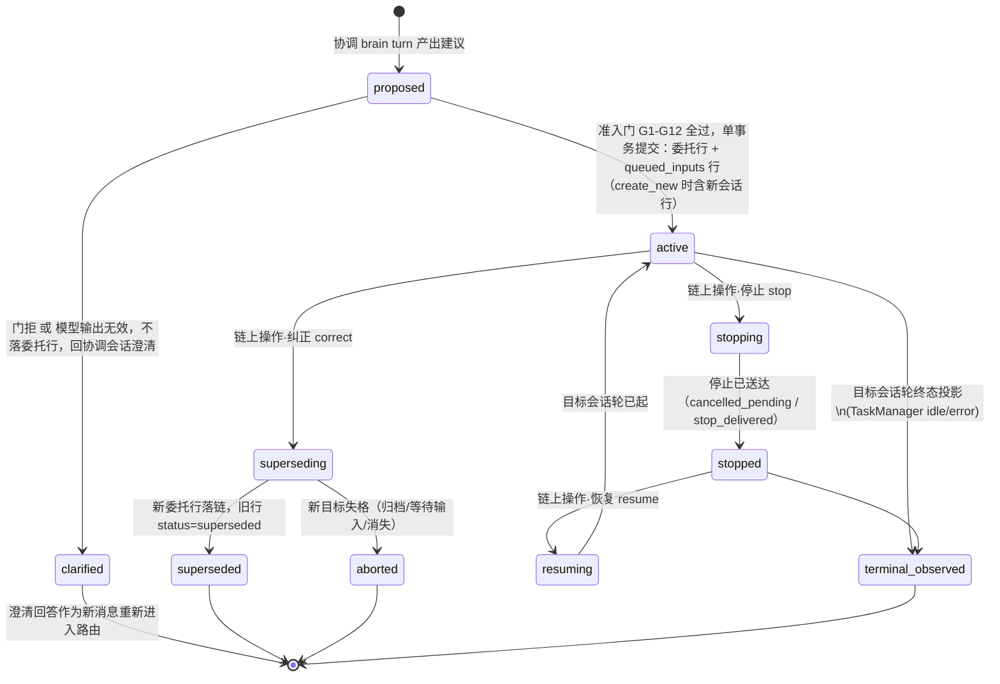
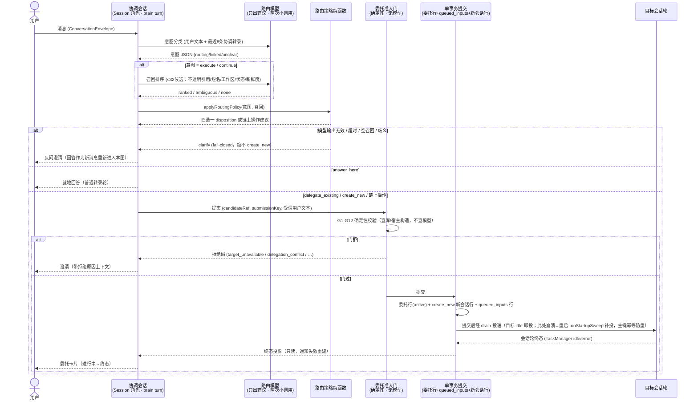
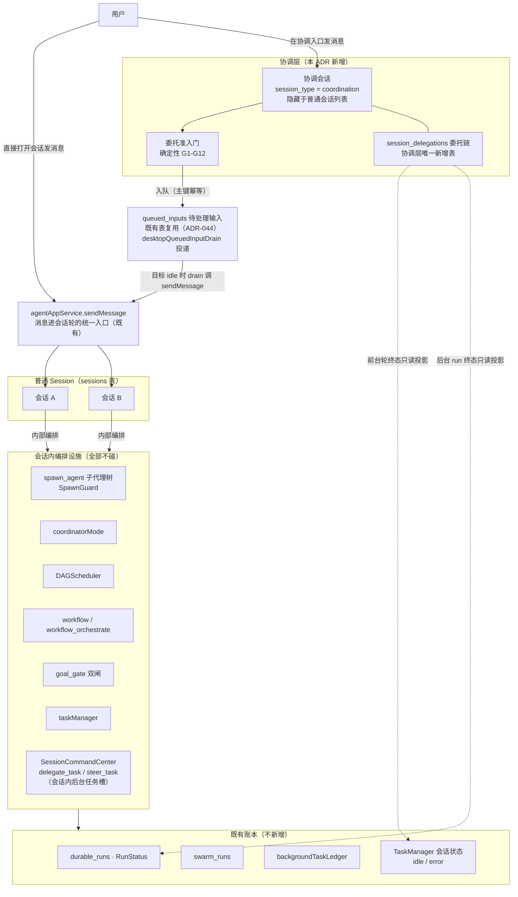

# ADR-072：跨会话协调协议——协调会话、委托链与确定性准入门

- 状态：**待拍板**（本单只出 ADR 不施工；施工卡由拍板后另立）
- 工单：N-WORKHUB-ADR（多agent线，wave 37）
- 相关：ADR-054（会话=指挥台——派活语义的上一拍）、ADR-047（主理人编排）、ADR-052（会话与专家的关系）、ADR-044（queued_inputs 排队输入——R1 起为委托投递路径）、ADR-067（注入 origin 链权限判定——R1 起为委托文本的防洗白依据）；在飞或待派单 N-BGSPAWN-DURABLE（刀1 已合 main）、N-LOOP-DURABLE-K2*、N-RUNENTRY-IDEMPOTENT、N-APPROVALWAIT-PAUSECLOCK
- as-built 基线：**origin/main@8c7dde035**（本文件所有 `标识符 @ 文件:行号` 均从该 commit 核出，不从工作树）
- 来源：`docs/competitive/maka-agent-2026-09-23-三周动向借鉴清单.md` §2（code-agent-private-archive 仓）；maka 源料 commit **d5bc0fad**，已拷贝至 `code-agent-private-archive/docs/evidence/assets/N-WORKHUB-ADR/maka-src/`（ADR、术语表、路由纯逻辑、准入门、协调器、协议、目标执行权威、崩溃恢复测试共 14 份）

## 背景：Neo 有「会话内指挥台」，没有「会话间协调层」

ADR-054（2026-08-04 已 accepted）把 Neo 的会话定为指挥台：前台 brain turn 用窄工具面（`delegate_task` / `steer_task` / `cancel_task` / `task_status`）把活派给**本会话的后台任务槽**，执行走账本任务，lane 串行 + submissionKey 幂等。这套派活语义已经落地（`SessionCommandCenter @ src/host/services/commandCenter/sessionCommandCenter.ts:116`，`spawn @ :151`）。

但它只覆盖一个会话内部。用户在 cowork 场景下的工作单位是**多个会话**（各有各的工作区、转录、产物和历史），今天想「把这句话送到对的会话去」只有一条路：自己记得哪个会话在干什么、手动切过去、手动粘贴。唯一跨会话的运行时行为是角色主动性（`wakeRole @ src/host/services/roleAssets/roleProactivity.ts:254` 起 schedule 会话，单向不回流）；`agentAppService.sendMessage @ src/host/app/agentAppService.ts:439` 虽是任意会话的统一投递入口，但只服务于用户直发，没有协调层、没有准入门。

Apache Maka 09 月做了 WorkHub：每个 Runtime Host 一个隐藏的**协调会话**（Session 的一个角色，不是新实体），把用户消息路由四选一（就地回答 / 委托已有会话 / 新建会话 / 澄清），所有写操作先过**确定性准入门**，模型只出建议、无效输出一律回退澄清，停止/纠正/恢复沿**持久化委托链**走。本 ADR 回答 Neo 版协议的形状——借协议骨架，不抄代码。

### 现状全表（@8c7dde035）

> 「作用域」列是本 ADR 的关键分轴：**今天 Neo 所有派活/编排入口的作用域都是会话内**，没有一个入口能把活派给另一个会话。

| # | 入口 | 锚点 | 作用域 | 持久化 | 生产消费方 |
|---|------|------|--------|--------|-----------|
| 1 | `spawn_agent` / `AgentSpawn`（单+并行子代理；`engine` 外部引擎、`isolation: worktree`、`run_in_background`） | `executeSpawnAgent @ src/host/agent/multiagentTools/spawnAgent.ts:95`；schema 名 `spawn_agent @ src/host/tools/modules/multiagent/spawnAgent.schema.ts:180`、`AgentSpawn @ :191`、`engine @ :90`、`isolation @ :133`、`run_in_background @ :171` | 会话内（子代理树，深度默认 3 硬上限 5） | 并行 Team 走 durable_runs；后台单个走 `BackgroundSubagentDurableLedger`（见 #14） | 模型工具（compatibility 层） |
| 2 | `Task`（spawn 的兼容别名） | `name: 'Task' @ src/host/tools/modules/multiagent/task.schema.ts:39` | 会话内 | 同 #1 | 模型工具 |
| 3 | agent 间通信：`send_input` / `wait_agent` / `agent_message` / `teammate` / `collect_agent` / `close_agent` / `plan_review` | `send_input @ src/host/tools/modules/multiagent/sendInput.schema.ts:5`、`wait_agent @ waitAgent.schema.ts:5`、`agent_message @ agentMessage.schema.ts:5`、`teammate @ teammate.schema.ts:5`、`close_agent @ closeAgent.schema.ts:5`、`plan_review @ planReview.schema.ts:5`、`collect_agent @ collectAgent.schema.ts:5` | 会话内（同 run 的 agent 间） | SpawnGuard 队列（内存）+ teammateService 投影 | 模型工具 |
| 4 | `coordinatorMode`（3+ 并行 spawn 自动激活的任务编排） | `CoordinatorSession @ src/host/agent/coordinatorMode.ts:47`、阈值 `COORDINATOR_ACTIVATION_THRESHOLD @ :41`、激活 `shouldActivateCoordinator @ :302`、接线 `spawnAgent.ts:852-854` | 会话内（并行 spawn 内部） | ❌ 纯内存 Map | `executeParallelAgents` |
| 5 | `DAGScheduler`（Task DAG 并行调度） | `DAGScheduler @ src/host/scheduler/DAGScheduler.ts:149` | 会话内 | checkpoint 委托给 durable run | `parallelAgentCoordinator`、`toolExecution/dagScheduler.ts`、`orchestration/adapters/dagGraphSchedulerAdapter.ts` |
| 6 | `workflow`（命令式脚本编排）+ `workflow_orchestrate`（声明式 stage-DAG） | `src/host/agent/scriptRuntime/`；`src/host/agent/multiagentTools/workflowOrchestrate.ts` | 会话内 | `workflow_runs` / `workflow_run_calls` | 模型工具（复杂长任务默认路径） |
| 7 | goal 模式完成闸 | `handleGoalCompletionGate @ src/host/agent/runtime/goalCompletionGate.ts:66`（闸0 证据自证 + 闸1 确定性 verify + 闸2 软评审） | 会话内（goal 模式，可 allowSwarm） | turnTrace + `tool_execution_events`（append-only） | goal 模式运行时 |
| 8 | `taskManager`（会话任务清单） | `taskManagerModule @ src/host/tools/modules/planning/taskManager.ts:430` | 会话内 | taskStore（会话任务表） | 模型工具 |
| 9 | **会话命令中心**（ADR-054 指挥台的会话内落地） | 工具 `delegate_task @ src/host/tools/modules/commandCenter/sessionCommandCenter.schema.ts:12`、`steer_task @ :35`、`cancel_task @ :54`、`task_status @ :70`；执行 `executeDelegateTask @ src/host/tools/modules/commandCenter/sessionCommandCenter.ts:84`；服务 `SessionCommandCenter @ src/host/services/commandCenter/sessionCommandCenter.ts:116`（`spawn @ :151`，laneKey+submissionKey 幂等） | **会话内**（本会话的后台任务槽） | `SessionTaskSlotLedger @ src/host/services/commandCenter/sessionTaskSlotLedger.ts:79`（全局 4 / 每会话 2 / lane 串行）+ `BackgroundTaskLedger @ src/host/task/backgroundTaskLedger.ts:32` | 模型工具 + 成员视图 |
| 10 | 组队配方（主理人编排，ADR-047） | `launchTeamRecipe @ src/host/services/team/teamRecipeLaunchService.ts:334`、`validateTeamRecipe @ src/shared/contract/teamRecipe.ts:80`、`SwarmLaunchApprovalGate @ src/host/agent/swarmLaunchApproval.ts:33` | 会话内（lead 在当前会话轮拉成员） | swarm_runs + durable run | 产品入口 + `/命令` |
| 11 | `autoAgentCoordinator`（自动多 Agent 编排） | `AutoAgentCoordinator @ src/host/agent/autoAgentCoordinator.ts:82` | 会话内 | durable run（旧 JSON checkpoint 已删） | `autoAgentRunner`、`autoAgentRecoveryHost` |
| 12 | 角色主动性（cadence/event 唤醒） | `wakeRole @ src/host/services/roleAssets/roleProactivity.ts:254`、`syncCadenceJobs @ :629` | **跨会话但单向**（从角色资产建 schedule 会话，不回流协调） | history append + 会话 `origin=role-cadence` | cron + Stop hook |
| 13 | `/loop` 自主循环 | `LoopController @ src/host/loop/loopController.ts:103`；刀1 启动收口 `loopStartupRecovery @ src/host/loop/loopStartupRecovery.ts:2`（N-LOOP-DURABLE，PR#1683 已合） | 会话内自动循环 | `session_automations`（刀2 将建 `loop_runs`） | 用户命令 |
| 14 | 后台子代理 durable 账本 | `BackgroundSubagentRegistry @ src/host/agent/backgroundSubagentRegistry.ts:76`；`BackgroundSubagentDurableLedger @ src/host/agent/backgroundSubagentDurableLedger.ts:93`（N-BGSPAWN-DURABLE 刀1 / ADR-025 B1 + ADR-037，已合 main） | 会话内子代理转后台 | durable_runs：spawn 落账、租约 heartbeat、重启收口 `interrupted_by_restart`（不做断点续跑） | spawn_agent `run_in_background` |
| 15 | 账本数据层 | `RunStatus @ src/shared/contract/durableRun.ts:5`（8 态 + `RUN_STATUS_TRANSITIONS @ :17`）；`swarm_runs @ src/host/services/core/database/schema.ts:962` | 数据层 | SQLite | 上述所有入口 |
| 16 | **跨会话消息入口（唯一现存通道）** | `sendMessage @ src/host/app/agentAppService.ts:439`（`ConversationEnvelope @ src/shared/contract/conversationEnvelope.ts:168`） | 任意会话（进程内） | 消息经 sessionRepository 落库 | renderer / IPC / web API——**无协调层、无准入门、无委托链** |
| 17 | ACP 外部引擎会话 | `acpClientAdapter @ src/host/services/agentEngine/acpClientAdapter.ts` | 引擎层（外部 agent 引擎的会话） | 引擎自管 | 引擎适配（本 ADR 划界外） |

**读表结论**：#9 已经把「派活语义」（delegate/steer/cancel/status + 短名 + lane 串行 + submissionKey 幂等 + 歧义走 askUserQuestion）在会话内拍板并落地；#16 提供了向任意会话投递消息的机械通道。**缺的是中间一层：决定「这句话该去哪个会话」的协调入口、防止派错的确定性准入门、以及记住「谁派给了谁」的委托链。**

## 三张图

### 图 1 · 委托链状态机

协调侧持久状态（`session_delegations.status`）与目标会话执行状态（只读投影：前台轮走 TaskManager 会话状态，后台 run 走 durable_runs 的 `RunStatus`）是两套语言：前者是协调层事实，后者是目标会话事实，**委托行永不复制目标执行状态**，只在读取时 join 投影。



**哪些迁移需要持久化**：`active` / `superseded` / `stopped` / `aborted` 是协调侧持久状态，落 `session_delegations`；`superseding` / `stopping` / `resuming` 是链上操作的中间态，由操作自身的持久记录（stop 请求行 / 纠正行）表达，不单独立状态。`running` / `waiting` 等执行态**不落委托表**——它们是目标会话的事实（前台轮 = TaskManager 会话状态、后台 run = durable_runs），协调层只读投影，会话变更通知失效后重建。

**崩溃重启从哪恢复**：`active` 行本身就是恢复锚点。事务提交（委托行 + queued_inputs 行同 commit，见 D5.1）与目标会话起轮之间崩溃——重启后既有 `runStartupSweep @ src/host/app/desktopQueuedInputDrain.ts:170` 扫到该 queued_inputs 行、目标 idle 即补投（ADR-044 的既有机制，不是 bg 子代理账本）；重复投递由 queued_inputs 主键幂等 + submissionKey 挡住（#9 的 spawn 已在生产用同款幂等）。协调层**不建第二个恢复状态机**。

### 图 2 · 一条用户消息从协调会话到落地



### 图 3 · 协调会话、普通 Session 与会话内编排设施的关系



三句话读图 3：协调会话**经准入门入队 queued_inputs、由既有 drain 复用** `sendMessage` 这个统一入口，不另开投递通道；会话内编排设施（spawn_agent / coordinatorMode / DAGScheduler / workflow / goal_gate / taskManager / SessionCommandCenter）**原封不动**，协调层不知道它们的内部结构；账本分层——`session_delegations` 是协调层唯一新增表（投递复用既有 queued_inputs），durable_runs / swarm_runs / backgroundTaskLedger 归会话内编排所有，前台轮终态投影走 TaskManager 会话状态。

## 决策

### D1 · 协调会话 = Session 的一个角色，不是新实体

**决策**：复用 `sessions` 表的一个角色值（`session_type = 'coordination'`，或等价的 `origin` 标记——实施时按 `session_type` 语义扩张的代价二选一），不建新表、不建新会话类型实体。每个 App 实例一个协调会话，懒创建（第一次进入协调入口时 provision），重启后按角色值解析回同一个会话。

**理由**：
1. `sessions` 表已有承载角色的列：`session_type @ src/host/services/core/database/schema.ts:26`（现默认 `'chat'`）、`origin @ :27`、`parent_session_id @ :29`、`is_archived @ :40`、`is_deleted @ :39`、`metadata @ :28`。maka 用 `role` 字段走的就是这条路（其 ADR 原话："a special role of the existing Session, not a new durable entity type"）。
2. 复用即免费拿到全套基建：消息转录（sessionRepository）、恢复（`sessionStateManager` 本就支持多会话并行，`SessionRuntimeState @ src/host/session/sessionStateManager.ts:32` 注释明示）、模型配置、spine 投影（`transcriptProjector @ src/host/session/spine/transcriptProjector.ts`）、会话切换/恢复生命周期。
3. Neo 没有 maka 的 Runtime Host 概念，单机单 App 实例，「每实例一个」直接成立，不需要 maka 那层 per-Host 边界讨论。

**代价**（maka 同款，认下）：普通会话列表、搜索、导出、云同步、统计**每一处遍历会话的地方都要排除 coordination 角色**。漏一处 = 用户在列表里看见一个系统会话。缓解：列表查询收口到 SessionRepository 一个口子，排除规则放查询层不放调用方。

**为什么不是扩展 SessionCommandCenter 把目标从任务槽改成会话**：任务槽与 Session 是两种生命周期的实体——任务槽是短命执行单元（排队/跑/终态，并发池管理），Session 是持久工作单位（转录、工作区、记忆、产物）。委托的目标是后者。复用的是**派活语义**（delegate/steer/cancel/短名/幂等/lane），不复用**槽池实现**。

### D2 · 路由结果集合：四选一 + 链上操作，不建第五项「交给用户选择」

**决策**：新路由决策的封闭结果集 = `answer_here`（就地回答）/ `delegate_existing`（委托已有会话）/ `create_new`（新建会话再委托）/ `clarify`（澄清）。纠正 / 停止 / 恢复是**链上操作**（作用于既有委托），不是第五个 disposition——与 maka 的划分一致（maka 术语表："Linked operation … is not a routing disposition"）。

**「交给用户面选择」不单列**，理由有二：
1. maka 的已验证做法：目标选择是 `delegate_existing` **路径内部的一次交互**（协调模型在已入会话的轮内发布单选表单，用户点选后继续走准入门），不是路由结果。
2. ADR-054 决策 4 已经拍过同族问题：「歧义时走**既有 askUserQuestion 工具**确认……不新造确认交互」。直接继承：召回 `ambiguous`（≥2 个可信候选）时，协调 brain 用 askUserQuestion 出选项卡，选项值绑定不透明 candidateRef（显示名不参与绑定），10 分钟未答过期回落 `clarify`。

**cowork 场景对四选一的修正**：maka 的 `discuss`（就地回答）对应 Neo 的 `answer_here`，语义不变；`create` 必须来自用户显式要求新工作（maka 同款收紧：意图模型 prompt 明示 "create requires an explicit request for new work"），**任何失败路径都不得静默变成 create_new**——这是 cowork 用户（非程序员）被派错会话后最难自救的场景。

### D3 · 确定性准入门：G1-G12 运行时门全查库/宿主构造，G9 为结构性约束

**决策**：模型输出（路由建议、链上操作提案）永远只是建议；任何写操作（委托落账、停止、纠正、恢复）之前必须过准入门，门的判定项全部是确定性事实查询：

| # | 判定项 | 数据源 | 拒绝码 |
|---|--------|--------|--------|
| G1 | 目标会话存在且未归档未删除 | sessions 表 `is_archived` / `is_deleted` 直查 | `target_unavailable` |
| G2 | 目标可被委托：不是协调会话本身、不是子代理/计划唤醒/评测会话、不是外部引擎会话（`AgentEngineKind @ src/shared/contract/agentEngine.ts:10` 全部非 native 值：codex_cli / claude_code / mimo_code / kimi_code / kimi_code_acp / codebuddy_code / grok_cli / dsh_cli——不只 ACP） | `session_type`；`agent_engine` 列的 kind 用 `isExternalAgentEngine @ src/host/services/agentEngine/agentEngineGuards.ts:69` 同款判据（按「非 native」判，不按 ACP 列举） | `not_delegatable` / `self_route` |
| G3 | 候选集新鲜：模型建议的 candidateRef 属于当前候选集快照 | candidateSetId = hash(候选会话集快照)，与建议携带的集合指纹比对 | `candidate_set_stale` |
| G4 | 无冲突在飞委托：同一目标会话至多一个 `active` 委托（v1 单活约束，见待拍板 Q3） | session_delegations 按 target 查 active | `delegation_conflict` |
| G5 | 工作区边界：目标会话的 workspaceScope 必须可解析、且其根在用户授权目录集内（协调会话是隐藏系统会话、无 projectId 无工作区——`resolveSessionWorkspaceScope` 对它返回 undefined，R0 的「协调与目标一致」比较无比对象，删） | `resolveSessionWorkspaceScope @ src/host/services/sessionFork/workspace/resolveSessionWorkspaceScope.ts:22`（:40-42 无 projectId 返回 undefined） | `workspace_boundary` |
| G6 | 写互斥：目标工作区不得与**任何活跃写方**重叠——不只比其他 active 委托，还包括用户直开的其他会话正在该工作区跑轮（R0 只比委托行，看不见用户直开会话） | 活跃前台轮的工作区（`getSessionState @ src/host/task/TaskManager.ts:610` + `hasActivePrimaryRun @ :637`）与目标 workspaceScope 的目录重叠判定（`bindFileOwnershipReleaseHook @ src/host/agent/multiagentTools/spawnAgent.ts:49` 的 ownedPaths 是子代理先例） | `write_conflict` |
| G7 | 幂等：submissionKey 已存在则返回既有委托结果；同键不同指纹拒绝 | session_delegations 唯一键 | `reused` / `idempotency_conflict` |
| G8 | create_new 的工作区上下文必须来自 Host 受信通道（当前授权目录），模型输出不得携带工作区或身份 | Host 侧构造 | `unauthorized_workspace` |
| G9 | 用户文本取自 ConversationEnvelope 原文（受信通道）；模型写的 delegationText 只是任务内容，不构成用户权威 | 入口投影 | （结构性约束，非运行时门——表内唯一不查库的一条） |
| G10 | 目标会话空闲：无活跃前台轮、无排队/发送中输入（人机争用——委托不得插进用户正在用的会话） | `getSessionState @ src/host/task/TaskManager.ts:610`（非 idle/error 即忙；忙时 `startTask` 本就直接抛 `:276-284`）+ `hasActivePrimaryRun @ :637`（web AgentLoop 路径不更新 sessionStates）+ queued_inputs 按 session 查 queued/sending（与 `hasQueuedUserInput @ src/host/services/commandCenter/foregroundWake.ts:60` 同判据） | `target_busy` |
| G11 | 目标会话权限档不得高于 acceptEdits：委托文本不得送进 `bypassPermissions` 档的会话（防权限洗白） | `getModeForSession @ src/host/permissions/modes.ts:334`（生效档，含 unattended/首跑/限流钳制）；先例：无人值守钳档 `clampUnattendedPermissionMode @ :749`（不得高于 acceptEdits）、B1 收口 `sessionManager.ts:258-262`（cron/heartbeat/channel 标 unattended 强制钳档） | `target_permission_mode` |
| G12 | folderTrust：create_new 的新工作区与 delegate_existing 的目标工作区都要过信任评估（`sendMessage` 现不调 folderTrust，须在准入门这一步调） | `evaluateFolderTrust @ src/host/security/folderTrustService.ts:857`；先例 `ensureFolderTrustForSpaceCreation @ src/host/services/project/projectService.ts:521`（用户亲手选目录 = 授权；含 gated 配置未确认则抛）。协调建议的 create_new 工作区**不是用户亲手选的**：非 trusted 且 blockedItems>0 一律拒绝回澄清，用户显式确认后才放行 | `untrusted_workspace` |

G7 的幂等键直接沿用 #9 已在生产验证的形状（`SessionCommandCenter.spawn` 的 laneKey + submissionKey）；maka 的 action fingerprint（sha256 绑定 操作+目标+载荷）作为同键冲突时的判别器。

**候选集的构造**（G2/G3 的输入）：`is_archived=0 AND is_deleted=0 AND session_type='chat'`——按 `session_type` 白名单收口：`SessionType @ src/shared/contract/session.ts:21` 的值域是 `'chat' | 'schedule' | 'heartbeat' | 'subagent' | 'eval'`，其中 schedule/heartbeat 是角色唤醒会话（单向不回流）、subagent/eval 是系统会话，一律不进候选。R0 用 `parent_session_id IS NULL` 判子代理是误伤：**用户手动分叉的会话也是 `parent_session_id=sourceSessionId` 且 `session_type='chat'`**（`SessionForkRepository.ts:274-294`，:283 字面量 'chat'、:294 写 parent_session_id）——该过滤会把用户分叉会话全挡掉；子代理会话由 `session_type` 白名单 + G2 引擎判定双重排除，不再依赖 parent_session_id。按最近活动排序截断（maka 上限 32 个，沿用），每项只含：不透明引用（候选集内稳定、跨集合不稳定）、短名、工作区短名、状态、新鲜度桶。**stable sessionId 不进模型输入**——模型只能引用它看过的候选集里的 opaque ref，由 Host 反查（maka 同款："Proposals never carry a Session id"）。

### D4 · 模型只出建议的契约

**输入**（两次独立小调用，全部截断有界）：

| 调用 | 输入 | 上限 |
|------|------|------|
| 意图 | 用户文本（≤2000 字）+ 最近 8 条协调转录（每条 ≤600 字） | 输出 ≤80 token，0 重试 |
| 召回 | 用户文本 + 意图结果 + ≤32 候选（不透明引用/短名/工作区名/状态/新鲜度桶） | 输出 ≤160 token，0 重试 |

界值取 maka 代码值（输入界值 `WORKHUB_ROUTING_MAX_*` @ 其 `workhub-routing.ts:43-46`，输出上限 80/160 @ 其 `execution-model-authority.ts:253/:275`；该路由模型生产未接电，两组界值均出自未通电的代码常量而非生产观测）；意图看不到候选，召回看不到 stable 会话身份——两者都不能单独授权任何写。

**输出**：严格 JSON，白名单解码（多余键、未知值、超集引用一律抛错）：
- 意图标签集（8 值，与 E1 评测口径一一对应）：`routing{discuss|execute|create|continue}`（四路由值）/ `linked{correct|stop|resume}`（三链上值）/ `unclear`
- 召回三值：`ranked[refs]`（首个为明确最佳）/ `ambiguous[refs]`（≥2 可信）/ `none`

**策略是纯函数**（决策表，单测锁死）：

| 意图 | 召回 | disposition |
|------|------|-------------|
| unclear | — | clarify |
| linked | — | 对应链上操作提案 |
| discuss | — | answer_here |
| create | — | create_new |
| execute / continue | ranked | delegate_existing（该候选） |
| execute / continue | 其他一切 | clarify |

**失败回退**：解析失败 / 超时 / provider 错误 / 候选不可用 / 空召回 / ambiguous 未被用户选择 —— 全部 fail-closed 到 `clarify`，**没有一条路径静默变成 create_new 或绑定任意会话**。超时建议 5s（Neo 侧先例：research 线意图分类从 8s 优化到 3s；路由是两次串行小调用，给 5s 总预算），落 `shared/constants`。

**绑定与恢复**：路由决定落协调轮的 turn metadata（bound decision），同轮后续工具提案与它不符即拒；崩溃恢复的续跑轮复用该决定，不重新路由（maka："Every fresh root receives its own decision"，排队跟进与恢复轮各得各的决定——即恢复轮拿的是**当初的决定**，不是新决定）。

**默认路由模型**：协调会话自己保存的模型（复用连接与 thinking 设置，零额外配置）。maka 的 `createHostWorkHubRoutingModel` 在生产**未接电**（只有测试夹具注入，其 ADR 自述「证据齐之前不改默认策略」）——Neo 的两步走见 D6。

### D5 · 委托链持久化：链接，不是转录副本

**决策**：新表 `session_delegations`，一行 = 一条委托链节：

```sql
CREATE TABLE IF NOT EXISTS session_delegations (
  delegation_id     TEXT PRIMARY KEY,
  coordination_session_id TEXT NOT NULL,
  coordination_turn_id    TEXT NOT NULL,
  disposition       TEXT NOT NULL,          -- delegate_existing | create_new
  target_session_id TEXT NOT NULL,
  target_message_id TEXT,                   -- 投递落定的消息 id（软链接，可因压缩/rewind 失效，见下）
  target_queued_input_id TEXT,              -- queued_inputs 行 id（投递幂等主键；行在消息消失后仍存活）
  submission_key    TEXT NOT NULL UNIQUE,   -- 幂等键：协调会话+轮+提案指纹
  action_fingerprint TEXT NOT NULL,         -- sha256(操作+目标+载荷)，同键判别器
  status            TEXT NOT NULL,          -- active | superseded | stopped | aborted
  supersedes_delegation_id TEXT,            -- 纠正链：新行指向旧行
  created_at        INTEGER NOT NULL,
  resolved_at       INTEGER,
  resolution_json   TEXT                    -- stop/correct 的终态事实（outcome 等）
);
```

**关键约束**（maka "Delegation links rather than copies transcripts" 的同款纪律）：
- 委托行只存**有界链接**（协调轮 ↔ 目标会话/消息/排队输入），不复制目标会话的执行状态与转录；`running` / `waiting` / 终态是 join 目标会话事实的**只读投影**（前台轮 = TaskManager 会话状态，后台 run = durable_runs），会话变更通知失效重建，重启后从同一链接重建。
- 协调状态与执行状态分离：`status` 表达的是**链**的生死（active/superseded/stopped/aborted），不是目标活的成败——目标活的成败属于目标会话。
- **单事务提交边界**（落到真实表见 D5.1）：委托行（session_delegations）+ queued_inputs 行 + create_new 的新会话行（sessions），一个 SQLite immediate 事务；提交前互不可见，提交后同时存在。投递（drain）只发生在提交之后。

**崩溃恢复入口复用什么**：不建第二个恢复状态机。三段接缝各有既有主人——(a) 提交与投递之间：queued_inputs 的启动补投（ADR-044：`runStartupSweep @ src/host/app/desktopQueuedInputDrain.ts:170` 扫 queued 行、目标 idle 即 drain，幂等见 D5.1）。R0 曾把这段引到 `BackgroundSubagentDurableLedger`，核源码后更正：该账本文件头 `:14-16` 是完成时 checkpoint、`:17-20` 是重启**收口成 interrupted_by_restart 不续跑**——它不是「待处理输入重启后派发」的主人，引错了；(b) 委托行残留 active 而协调会话轮已死：启动扫 `status='active'` 且无对应在跑轮的行，按 N-LOOP-DURABLE 刀1 的收口语义投影「中断事实」给协调会话（收口不续跑；续跑是 `resume` 链上操作的事）；(c) 目标会话自身的崩溃恢复：前台轮以 TaskManager 会话状态与转录尾部为准（`SessionStatus @ src/host/task/TaskManager.ts:64`），后台 run 才有 durable_runs 的 `recovering` 语义（`RunStatus @ src/shared/contract/durableRun.ts:10`），协调层只读。

**链的持久锚与三种失效**（R1 新增）：链的身份锚 = `delegation_id`（主键）+ `target_session_id`（sessions 行稳定）+ `target_queued_input_id`（queued_inputs 行在消息消失后仍存活——`markConsumed` 只 UPDATE status 不删行，且 drain 送达时它就是消息的 clientMessageId，`drainOne` 重建 envelope 带 `clientMessageId: record.id`）。`target_message_id` 降级为**软链接**：消息行消失或被隐藏时投影降级为「目标已前进」，链本身不断（委托行的身份不依赖消息存活）。fork 后委托**不跟到子会话**：fork 换新 id 新会话行、不复制 session_delegations，链停在源会话并投影「目标已分叉」（fork 的 `forkLineage` metadata 可 join 出 childSessionId，`SessionForkRepository.ts:293`），用户要继续就显式发新委托（新行 supersedes 旧行）——不让链静默漂移到用户没确认过的目标。三种失效各一行：

| 发生 | 链状态 | 用户看到什么 |
|------|--------|--------------|
| 目标会话手动压缩（`replaceMessages @ src/host/services/core/repositories/SessionRepository.ts:635`：:662 整表 DELETE 后 :670-677 重插；入口 `contextHealth.ipc.ts:561`） | target_message_id 指向的行被删 | 委托卡片显示「目标已前进（转录已压缩）」，链与终态事实仍在 |
| 目标会话 rewind（`hidden_by_rewind_id @ src/host/services/core/database/schema.ts:97`；`hideProjectionSuffix @ src/host/services/core/repositories/SessionRewindRepository.ts:367` 软隐藏不删行） | target_message_id 指向 `visibility='rewound'` 的行 | 委托卡片显示「目标已回退」，终态投影以 rewind 后的转录为准 |
| 目标会话被分叉（换 id，子会话无委托行） | 链停在源会话，status 不变 | 委托卡片显示「目标已分叉」，提示可向新会话显式发新委托（resume 语义） |

**与在飞单的关系**：
- **N-BGSPAWN-DURABLE**（刀1 已合 main）：委托链**依赖**它的接缝语义但不吸收它——它管「后台子代理的 durable 收口」，本 ADR 管「会话到会话的链接」，表不同、恢复入口不同。它的刀2（断点续跑，若立项）同样不被本 ADR 吸收。
- **N-RUNENTRY-IDEMPOTENT**（排队中）：目标是「客户端重试不重复起 run」。R1 起委托投递复用 queued_inputs，其 `INSERT OR IGNORE` + 主键幂等（`enqueue @ src/host/services/core/repositories/QueuedInputRepository.ts:62`）已是这类幂等的既有生产实例；该单落地后统一收口到共享幂等层，协议侧键形状对齐即可。**建议排序：本 ADR 的协议落地不 block on 它，接电前对齐。**
- **N-LOOP-DURABLE-K2***（排队中）：互不吸收。loop_runs 管循环轮次恢复，session_delegations 管委托链；两者共用「启动扫描收口 + 显式恢复操作」的框架思路（照 agent_wakes 模式），表与触发器各自独立。
- **N-APPROVALWAIT-PAUSECLOCK**（排队中）：无直接依赖；若落地，目标会话 waiting 态的时长口径以它为准，本 ADR 的 `waiting` 投影只读该口径。

### D5.1 · 委托投递路径：走既有 queued_inputs，不另建待处理表（R1 新增）

**决策**：委托消息进目标会话走既有 `queued_inputs` 表（ADR-044 D1，`queued_inputs @ src/host/services/core/database/schema.ts:1084`），不新建「目标会话待处理消息」存储——「协调层唯一新增持久化 = session_delegations 一张表」的自述由此成立：投递是**复用**既有表，不是新增。

**单事务提交边界（真实表）**：一个 SQLite immediate 事务 = session_delegations 行 + queued_inputs 行 +（create_new 时）sessions 行。create_new 的 Project 边界解析（`ensureProjectForWorkspace`，异步且自身有写）与 G12 的 folderTrust 评估都放在事务**前**完成，事务内只做三处行插入——`sessionManager.createSession @ src/host/services/infra/sessionManager.ts:217-256` 的插入部分由协调层在事务内直调，不走它的 async 外壳。

**入队形状**：`queued_inputs.id = 'delegation:' + submission_key`（确定性派生）。`enqueue @ src/host/services/core/repositories/QueuedInputRepository.ts:62` 是 `INSERT OR IGNORE` + 主键幂等——崩溃重放不重复入队；`position = MAX(position)+1`——委托排在已在队的用户输入**之后**（`ORDER BY position ASC, created_at ASC, id ASC`，FIFO 不插队）。

**投递执行**：全部复用既有 `registerDesktopQueuedInputDrain @ src/host/app/desktopQueuedInputDrain.ts:52`——目标会话转 idle（state_change 事件）或启动扫（`runStartupSweep @ :170`，只投 idle 会话；web 侧接线 `src/web/routes/agent.ts:326`）时 `drainOne @ :103` 调 `sendMessage`；投递失败重入队，至 `QUEUED_INPUT_RETRY.MAX_RESEND_ATTEMPTS = 3`（`src/shared/constants/queuedInput.ts:3`）耗尽后 markFailed + `QUEUED_INPUT_SEND_FAILED` 事件 → 委托行投影 `aborted(delivery_failed)`，协调会话向用户呈现送达失败，可 `resume` 重投。

**与前台唤醒跳过规则相容**：`hasQueuedUserInput @ src/host/services/commandCenter/foregroundWake.ts:60`（:68-69 见 queued/sending 即真）会让命令中心的前台唤醒跳过该会话（:148-149）——委托输入在队期间，该会话的后台任务完成**不触发前台唤醒**，直到 drain 消费完。这是既有规则对一切排队输入的统一行为（用户自己排队时同样发生），方向是安全的（防唤醒轮与排队输入交错），本 ADR 接受并沿用，不开例外。

**与 G10 一致**：准入门在提案时拒绝忙目标（target_busy）；提交后用户抢先说话的窗口由 drain 的既有语义兜住——`startTask` 忙抛（`TaskManager.ts:276-284`）→ 重入队 → 转 idle 再投，委托消息排在用户消息之后执行，顺序保真。与两个既有先例同哲学：`sessionAutomationService.ts:663-680` 忙则不打断（注释明言旧实现 interruptAndContinue 属敌意行为）、foregroundWake 有排队输入即跳过唤醒。

**恢复语义**：这段接缝的语义是**补投**（幂等重放，行为不丢），与接缝 (b) 委托行残留 active 的**收口**（投影中断事实、续跑靠显式 resume）不同段不同主——不要混用。

### D5.2 · 审批卡的归属与协调侧可见性（R1 新增）

**事实**：审批 park 按会话——`approvalParkEvents @ src/host/agent/approvalParkEvents.ts:31`（parked 事件总线）；`TaskManager.ts:296-298` 的注释明示后台 run 的「消息与审批仍归属原 sessionId」；启动重水化 `hydrateApprovalGatesAtBoot @ src/host/agent/parkedApprovalHydration.ts:26`。companion 手机端已有按会话渲染的 ApprovalCard（`packages/mobile/src/features/sessions/ApprovalCard.tsx:4`，`MobileRoot.tsx:674` 渲染）。

**决策**：委托轮触发的审批卡**留在目标会话**，协调层不搬卡、不代答。防权限洗白的运行时对应物已有：委托文本在目标会话按 ADR-067 D3 注入语义带 origin 链（本轮注入消息的 origin 链挂 turn context，权限判定取最不可信者——`subagentExecutor.ts:579`；peer 起源写/执行升人工确认——`subagentExecutor.ts:936`），G11 再从准入侧挡掉 bypassPermissions 档目标。

**协调侧感知**：只读投影「目标等待审批」（waiting 语义，时长口径归 N-APPROVALWAIT-PAUSECLOCK）；委托卡片给「去目标会话处理」的跳转，不在协调会话里复刻审批交互——协调会话的工具档本来就不含审批面，防协调层长成执行体。用户也可以在 companion 上答目标会话的审批卡（既有能力，无需新做）。协调入口/委托卡片要不要进 companion，列为待拍板 Q7。

### D6 · 两步走：协议先落地、默认不接电，接电判据可测

**决策**：像 maka 一样分两步。第一步（协议落地）：表 + 准入门 + 路由适配器（fail-closed）+ 协调会话角色 + feature flag（建议 `sessionCoordination`，默认 off），合 main 但用户不可见。第二步（接电）：flag 默认 on，前置判据如下——**全部可测，无形容词**：

| # | 判据 | 阈值 | 怎么测 |
|---|------|------|--------|
| E1 | 路由意图准确率 | ≥200 条评测集上意图标签 **8 值**（routing{discuss/execute/create/continue} + linked{correct/stop/resume} + unclear，与 D4 输出集一一对应）准确率 ≥85%，且分层配额达标：execute/continue 合计 ≥40%、create ≥5%、discuss ≥15%、linked ≥15%、unclear ≥10% | 评测集来源（协调入口未上线、无真实协调消息可采，用代理语料）：①从本机既有真实会话历史抽多会话快照、人工改写出「跨会话意图」样本（候选集快照按 G3 同 schema 从真实会话表构造，≤32 个）；②人工新写。金标 = 单人标注 + 20% 抽样双标（另一人/另一模型席），一致率 ≥90% 才收卷。Neo 既有 eval 框架跑（不建协调专用评测框架，maka 同款决策） |
| E2 | 不安全绑定 | **= 0**：把 execute 派给错误会话、或任何失败路径产出 create_new/任意绑定 | 评测集断言 + 准入门拒绝路径单测全覆盖 |
| E3 | 崩溃幂等 | 两个注入点各 ≥10 次、合计 ≥20 次：①单事务提交返回后、drain `markSending` 前（`drainOne @ src/host/app/desktopQueuedInputDrain.ts:103` 入口）②`markSending` 后、`sendMessage` 返回前（走重入队路径）。断言：重复投递 0（queued_inputs 主键 + submissionKey）、丢委托 0（行存活 + `runStartupSweep` 补投） | fault-injection 档测试（`docs/testing-evidence-classes.md` 口径），注入钩子即上述两个函数边界 |
| E4 | 多余澄清率 | 评测集上不必要的 clarify ≤20%（「不必要」= E1 金标判为可路由却 clarify） | 同 E1 评测集与金标流程，标注人同 E1 |
| E5 | 路由延迟 | 端到端路由决策 P95 ≤3s（两次小调用 + 候选查询） | 评测集计时 |
| E6 | 准入门真实工作 | flag 内测期 ≥500 条路由消息中拒绝码分布非全零、且 ≥2 种不同拒绝码被触发（门在真实使用中被触发，不是摆设） | flag 内测期打点 |

不满足 E1-E4 任意一条：不接电，回评测迭代；E5/E6 不满足：可以带病接电但必须立单。

## 与五个既有编排设施的关系（吸收 / 并存 / 不碰）

| 设施 | 关系 | 一句话 |
|------|------|--------|
| `coordinatorMode`（`CoordinatorSession @ src/host/agent/coordinatorMode.ts:47`） | **不碰** | 它是并行 spawn 内部的内存任务编排（3+ agent 自动激活）；协调层永远不进 spawn 树，协调会话的工具档**禁含 spawn_agent**（防协调层自己变成执行体） |
| `spawn_agent`（`executeSpawnAgent @ src/host/agent/multiagentTools/spawnAgent.ts:95`） | **不碰、不吸收** | 委托的目标是 Session，子代理树继续是会话内设施；`run_in_background` 的 durable 账本（#14）与委托链各自独立，表不同恢复入口不同 |
| `DAGScheduler`（`DAGScheduler @ src/host/scheduler/DAGScheduler.ts:149`） | **不碰** | 会话内 DAG 执行调度层（`webStartupServices` 注入 resolver）；协调层只选会话、不调度 DAG，两者的「依赖」语言不共享 |
| `goal_gate`（`handleGoalCompletionGate @ src/host/agent/runtime/goalCompletionGate.ts:66`） | **不碰** | goal 完成闸是会话内 goal 模式的语义；委托的「完成」= 目标会话轮终态投影（前台轮 = TaskManager idle/error，后台 run = durable_runs 终态），**不引入第二把完成闸**——协调层无权判定目标的活算不算完成 |
| `taskManager`（`taskManagerModule @ src/host/tools/modules/planning/taskManager.ts:430`） | **并存** | 协调会话作为 Session 可以用自己的任务清单记协调待办（可选）；委托不读写目标会话的 taskStore，两套任务语言不合并 |

另与 **ADR-054 会话命令中心**（#9）的关系是**分层并存**：它管「会话 brain → 本会话后台任务槽」，本 ADR 管「协调会话 → 其他会话」；派活语义（delegate/steer/cancel/短名/幂等/lane）同族同源，实现分体（槽池 vs 委托链）。用户在一个普通会话里说「帮我做 X」走它；在协调入口说「让那个做 X 的会话继续 Y」走本 ADR。

## 划界（不做什么）

- **不做多 Host / Mesh / 云同步协调**。单机单 App 实例是全部前提；跨设备协调（两台机器各开一个 Neo 互相同步委托）明确不在本 ADR，maka 也只做到 per-Host。
- **不动会话内编排的内部**。上面五个设施 + workflow 的内部结构、schema、语义一概不改；协调层对它们只有「目标会话的轮终态」这一个只读接口。
- **maka 的 model routing ≠ Neo 的 modelRouter**。maka「routing」指用模型把消息分派到会话；Neo `modelRouter` 是按任务选推理模型。两词在本 ADR 语境中不混用——本文「路由」一律指前者。
- **协调会话不做执行**。工具档禁 `spawn_agent` / `workflow` / `delegate_task`（会话内指挥台工具）等一切「自己把活干了」的口子；它只能回答、澄清、委托、链上操作。防协调层长成又一个执行体。
- **外部引擎会话不作为委托目标**（G2 拒绝，覆盖 `AgentEngineKind @ src/shared/contract/agentEngine.ts:10` 全部非 native 值——codex_cli / claude_code / mimo_code / kimi_code / kimi_code_acp / codebuddy_code / grok_cli / dsh_cli，判据同 `isExternalAgentEngine`，不只 ACP）：其轮生命周期由外部引擎驱动，待处理消息语义无保证。将来若开放，另立 ADR。
- **不做 L3 agent 间对话**（沿用 multiagent-system.md 的 L0-L3 分级决策）；协调会话与目标会话之间只有消息投递与状态投影，没有对话。

## 风险

- **「遍历污染」是复用 Session 角色的持续税**：每处新加的会话遍历（搜索/导出/同步/统计/最近列表）都要排除 coordination 角色。maka 认了同样的代价。缓解靠查询收口，但新建旁路查询时仍会漏——列入 code review 检查项。
- **v1 单活委托约束太紧**：用户想让两个委托先后进同一会话排队时，第二个直接被拒（回澄清）。先紧后松是对的（并发委托的正确性论证复杂度陡增），松绑判据：内测期 `delegation_conflict` 拒绝码占比 >10% 才考虑队列化。
- **fail-closed 的体验反噬**：路由模型弱时用户每句话都被反问，比没有协调层更烦。E4（多余澄清率 ≤20%）就是卡这个的；接电前必须用真实消息分布测，不能用合成消息。
- **名词混淆**：普通会话里有 `delegate_task`（派给本会话任务槽），协调入口有「委托」（派给会话）。用户面两套文案必须可区分（槽任务叫「任务」，链上叫「委托给会话 X」），落 i18n 时统一。

## 待爸拍板

| # | 问题 | 类型（拍错了受伤的是什么） | 我的建议 |
|---|------|------------------------|---------|
| Q1 | 协调入口的产品形态：独立常驻面板（maka 的 WorkHub 浮窗形态）还是现有会话列表里一个隐藏角色 + 侧栏顶部固定入口按钮？ | **定位与边界**——拍错整个 renderer 信息架构返工，且用户「在哪找到协调」的心智一旦形成难改 | v1 做隐藏角色 + 侧栏顶部「协调」入口按钮，不做独立面板/浮窗；面板形态等内测数据再说 |
| Q2 | ~~路由不确定时的默认档：宁可 `clarify` 还是宁可 `answer_here`？~~（R1 撤销拍板需求）D4 已把一切失败路径锁死 fail-closed 到 `clarify`、无任何路径静默 create_new 或绑定会话——正文已定，本槽降级为确认记录 | —（不再是开放槽） | 维持 D4；若要改默认档，先改 D4 契约再回本表，不在此处开后门 |
| Q3 | 单活委托：同一目标会话已有 active 委托时，第二个委托 v1 是直接拒绝回澄清，还是排进目标会话队列？ | **业务规则**——系统行为错：排队会引入「用户以为派了其实还在等」的静默延迟，拒绝会打断「我就想让它连着干两件」的自然意图 | v1 直接拒绝并在澄清里带「已有委托在跑」上下文；内测看 `delegation_conflict` 占比再决定是否队列化 |
| Q4 | 路由模型用协调会话自己保存的模型（主模型兼任）还是独立小模型配置？ | **成本与性能**（涉付费 API 调用归爸）——R1 重估：成本大头在**输入**不在输出——意图调用吃用户文本 ≤2000 字 + 最近 8 条转录 ×600 字，召回再吃一遍用户文本 + ≤32 候选描述，两次调用合计**输入约 4-7k token/条消息**、输出仅 80/160，全走主模型时账单随消息量线性涨 | 仍默认用协调会话已保存的模型（零配置优先，非程序员配不动旋钮）；设置里留「路由专用模型」可选项（v1.1），flag 内测期用 E5 计时 + 账单数据回看是否值得切小模型 |
| Q5 | 协调会话的转录进不进遥测上传与上线后评分分母？ | **数据口径**——拍错要么系统会话污染上线评分（协调轮天然高频短轮），要么协调行为完全无观测 | 进遥测上传（`toSessionRow` 的 `session_type` 列带 coordination，`telemetryUploaderService.ts:409`），但**剔出评分分母**（现分母只剔 eval，`postLaunchScoreStore.ts:166`，需加剔 coordination） |
| Q6 | 计费/quota 归属：路由两次小调用记协调会话、被委托轮 token 记目标会话（现状记账按会话各自记）——协调侧要不要汇总「本委托总共花了多少」？ | **成本可见性**——拍错用户在目标会话看到一笔没来由的 token 消耗，或协调层为汇总重造一套记账 | v1 不做汇总投影（记账留各会话、委托卡片不带成本）；内测看用户是否追问再立单 |
| Q7 | companion（手机端）可见性：协调入口/委托卡片要不要出现在手机端？ | **产品边界**——companion 已能按会话渲染审批卡（`ApprovalCard @ packages/mobile/src/features/sessions/ApprovalCard.tsx:4`），委托轮触发审批时手机上只见目标会话的卡、看不到「这是委托来的」上下文 | v1 手机端不做协调入口（桌面先行）；目标会话审批卡照常可达（D5.2），委托上下文标注随 v1.1 |

## 拍板记录

> 只增不改。每条一行：日期 · 问题号 · 决定 · 决定人。

| 日期 | 问题 | 决定 | 决定人 |
|------|------|------|--------|
| | | | |

## 修订记录

| 日期 | 改动 | 原因 |
|------|------|------|
| 2026-09-23 | 初稿（只出 ADR 不施工） | N-WORKHUB-ADR |
| 2026-09-23 | R1：新增 D5.1 委托投递路径（queued_inputs 复用）与 D5.2 审批卡归属；接缝 (a) 改引真实主人（ADR-044，弃 bg 子代理账本误引）；候选集判据 `parent_session_id IS NULL` → `session_type='chat'` 白名单（不再误伤用户分叉）；准入门补 G10-G12、G2 扩全部非 native 引擎、G6 补用户直开会话；D5 链锚定（target_queued_input_id + 软链接降级 + fork 不跟链）与三种失效表；E1/E3/E4/E6 改写得出数的测法；拍板槽重整（Q2 撤销、Q4 补输入 token、新增 Q5-Q7）；锚点修正 RUN_STATUS_TRANSITIONS :17、goal 闸 :66 | 三席跨家审（claude/opus · kimi · grok）全票「修后可拍板」，7 条 Important 收敛（N-WORKHUB-ADR R1） |

---

席位证据：GLM 5.3 · as-built 基线 origin/main@8c7dde035（本 worktree HEAD 同 commit，干净树核出）· maka 源料 commit d5bc0fad
R1（2026-09-23）：三席评审票存 `code-agent-private-archive/docs/evidence/assets/N-WORKHUB-ADR/review-{claude-opus,kimi,grok}-2026-09-23.*`；每条意见核到 8c7dde035 源码后再改，处置逐条记于证据档「R1 修订」节。
