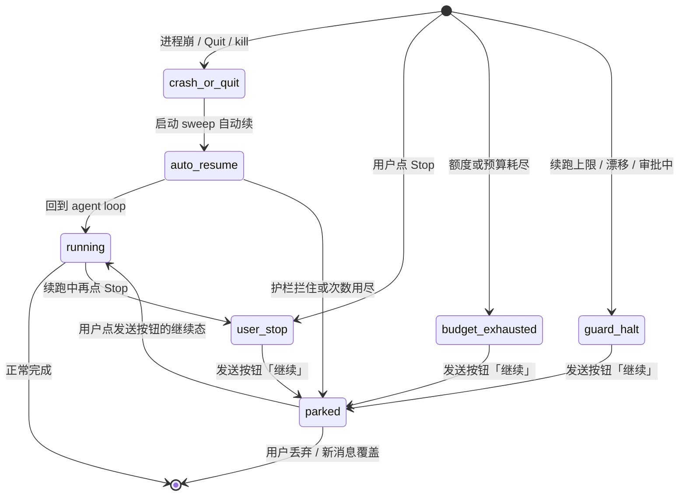

# ADR-075：重启后前台任务自动续跑

- 状态：**提议**（本页只定行为，不施工；爸拍板后再拆刀）
- 单号：N-RESTART-RESUME（稳定线 wave 12）
- 基线：`origin/main@35381f2e4`
- 证据：`code-agent-private-archive/docs/evidence/N-RESTART-RESUME-2026-09-26.md`
- 相关：ADR-037（durable kernel / at-least-once）、ADR-068（进程内流式断流续接）、T-083 / RQ-132 / N-RESIDENT-HOST-ADR（常驻宿主）、N-BGSPAWN-DURABLE（后台子代理 close-only）、N-RECOVERY-MATRIX（只验收不造机制）、N-CRON-APPROVAL-PARK（审批停车后续接同一 run）
- 触发时机（爸 2026-09-25 已拍板，不再列选项）：崩溃/退出打断 = 启动 sweep 自动续；用户 Stop、额度/预算停、护栏拦下 = 打开会话时发送按钮呈「继续」态由用户点

## 术语

| 词 | 含义 |
|----|------|
| 前台任务 | 用户正在聊的 native agent 轮：同一 `runId` 上的模型推理 + 工具循环。不含 `engine_kind='subagent_single'` 后台子代理，不含 cron/loop 自己的 engine |
| 中断原因 | 落在 durable envelope 上的停机分类：`crash_or_quit` / `user_stop` / `budget_exhausted` / `guard_halt`。启动自动续只认第一类 |
| 续跑 | 恢复后把当前一步的结果（含「中断/结果未知」）写进同一轮历史，**回到 agent loop** 让模型接着跑，保持同一 `runId` |
| 重放 | 把结果未知的工具再执行一次。本 ADR 禁止对未知写做重放 |
| 待续队列 | 启动 sweep 或会话打开时准备自动/一键续的 run 集合。Stop 必须把它清空 |

## 问题与现状

对标体验：任务跑到一半 app 退出，重启进会话后任务接着跑。Neo 的 durable kernel 已经能在重启后认出未完成的 native run，但恢复宿主把「补完当前一步」当成终态，用户看到的是「已中断 + 重试」，不是接着干。

### 现状锚点（@35381f2e4）

| # | 事实 | 锚点 |
|---|------|------|
| 1 | durable 默认开；`assembleDurableRun` 成功后启动即 `recoverAndDispatch`，并按租约一半间隔 sweep | `initializeDurableRun.ts:176-185`；`durableRecoveryRuntime.ts:94-99`（`recoverDurable → dispatcher.dispatch`） |
| 2 | 写工具结果不可查、且不能证明可重放时，恢复宿主 **review**，原因 `unknown_write_side_effect`，不 interrupt、不 replay | `src/host/runtime/nativeRecoveryHost.ts:197-202` |
| 3 | 任意一步一旦拿到 evidence，checkpoint 后立刻 `terminalDurable(completed)`，**不回到 agent loop** | 同文件 `:218-236`。单测把「一步 + 一个 terminal」写成合同（`nativeRecoveryHost.test.ts:66-70`） |
| 4 | 生产端口上已派发的模型请求 **不可查询、不可证明幂等**，`canRetrySafely` 恒 false，流式中断落 `model_safe_retry_unproven` 复核 | `src/host/app/nativeRecoveryHost.ts:305-318`；runtime `:167-171` |
| 5 | 只读且 stored+current 都是 `automatic` 才 replay；否则 interrupt，把「crashed before a result was recorded」写成 tool 失败结果，然后仍走第 3 条终态 | app `:395-425`；runtime `:193-205`；`toolReplaySafety.ts:40-45` |
| 6 | 审批中只恢复同一张卡（`observing` / `restore_same_approval`）；工作区或 scope 漂移进 review | runtime `:127-141`、`:239-267` |
| 7 | `/goal` 禁止恢复路径直接 `completed`（假完成 P0），进 review；真正再跑 loop 留作另单 | runtime `:25-29`、`:299-332` |
| 8 | 用户看见「已中断」（`outcomeWords['interrupted-restart']`）和 AgentErrorCard 的「重试」（`regenerateMessage`，等于重发上一条 user 消息）。发送按钮只有空闲发送 / 运行停止 / 转向 / 接入中，**没有「继续」态** | `AgentErrorCard.tsx:145-148`；`SendButton.tsx:29-34`；`outcomeWords.ts:72-76` |
| 9 | 进程内流中断另有 DecisionSlot「继续 / 放弃」；那是 ADR-068 / N-INTERRUPT-REPLAY 的进程内形态，不是跨进程续跑 | `DecisionSlot.tsx:89-178` |
| 10 | `pendingOperations` 在派发前先落盘（Cursor 社区 `/t/156178` 要的「工具调用执行前先落盘」Neo 已经有） | app `checkpointModelDispatchFence` / `checkpointToolReplayFence`（`:144-173`、`:120-141`）把 status 写成 `unknown` 再进 live loop |
| 11 | 验收矩阵是单测 + 杀进程夹具，期望未知写 `waiting_review`、安全恢复 `completed`。没有「重启后任务跑完」的 E2E | `tests/fixtures/durableRunKillRestart.ts:56-61`；N-RECOVERY-MATRIX 台账状态=待派，验收原文「只验收不造机制」 |

ARCHITECTURE.md 风险表已经点名这两处缺口：Native 已派发模型请求没有可证明查询/幂等合同；复核恢复的统一页面动作未闭合（「点恢复接着跑」兑不了现）。

## 方案对照（公开事实 + 台账 09-25 取证）

| 系统 | 公开 / 取证行为 | 对本问题的可借鉴点 |
|---|---|---|
| Cursor | 启动即自动唤醒会话；输入框按钮在发送与「Continue Working」之间切换。官方员工确认后台任务完成会自动唤醒 chat（forum.cursor.com/t/171439）。额度刷新后无确认自动续跑烧掉约 16% 额度，官方认错：因额度停下的 chat 不应无确认自行恢复，Stop 应清掉待唤醒队列。v3.21.9 用户点 Stop 后仍被自动恢复直到干完（/t/172081）。社区需求 /t/156178：工具调用执行前先落盘，崩溃后 Continue 从首个未完成调用续。 | 继续按钮 = 发送按钮的一个状态。只对崩溃/退出自动续。Stop 必须清队列。额度/预算停下的一律不自动续。成本必须可见。 |
| Codex Desktop | 打开会话视图时惰性恢复：`resumeState=needs_resume → maybe_resume_started → thread/resume`（约 6s），见 openai/codex#30916 日志。另有常驻 app-server daemon，`shutdownGraceSeconds` 默认 60s 等 turn 收尾（codex-rs/app-server-daemon/README.md）。台账未找到「打开后被中断的 turn 自动接着跑」的一手文字证据。 | 打开会话才露恢复动作，适合非崩溃停机。常驻宿主是另一条线（T-083），不能替代进程死后的续跑合同。 |
| Neo 现状 | durable + 启动 sweep 已在；未知写进复核死胡同；补一步就 `completed`。 | 账本领先（先落盘）。缺的是「回到 loop」和「按中断原因分流触发」。 |

Cursor 反例的避免合同写进护栏，不是可选项。

## 决策提议

### ① 续跑语义：喂回模型，回到 loop，不重放未知写

恢复宿主对当前 pending operation 只做一件事：**给这一步一个对模型诚实的结果**，然后把同一 `runId` 交回 live agent loop。禁止把「补完当前一步」写成 `completed`。

| 中断点 | 给模型的结果 | 是否重放该步 | 之后 |
|---|---|---|---|
| 只读工具，stored+current 均为 `automatic`，且能查到成功 complete | 查到的原结果 | 不需要 | 回 loop |
| 只读工具，无法证明可重放 | tool 失败：`interrupted: process crashed before a result was recorded; do not assume it ran or succeeded`（沿用 app `:408` 文案） | 否 | 回 loop，模型可再调一次只读工具 |
| 写工具（Bash / Write / Edit / 外部副作用），结果不可查 | 同上「中断/结果未知」 | **否**。禁止 `dispatchPrepared` | 回 loop，由模型自己 Read / `git status` / 看目录核实后再决定下一步 |
| 写工具，账本已有 success complete | 查到的原结果 | 不需要 | 回 loop |
| 模型流式中断，本进程已死 | 不把半截生成拼进下一次（ADR-068「不拼两次回答」）。半截按 B2 诚实分段落库；**重发该轮推理** | 重发的是推理，不是工具 | 两次 usage 都入账，展示层单轮 = Σ 各次尝试 |
| 模型请求仍是 `prepared`、尚未越过 provider | 现有 `execute_prepared_model_once` | 只发一次 | 回 loop（有 tool_call 就执行，没有就结束） |
| 审批中 | 不停、不续推理；恢复同一张审批卡 | — | 用户批过之后，才用本 ADR 的「回 loop」接同一 run（N-CRON-APPROVAL-PARK 依赖这条） |
| 工作区 / scope 漂移 | 不停在 drift 上续 | — | 保持 review，直到工作区回到 checkpoint 或用户丢弃 |

这是对 ADR-037「不确定的写要人工确认」在**前台崩溃续跑**这条缝上的收窄：协作者不是审查 `unknown_write_side_effect` 的人；核实写给模型，人只看到「正在从中断处继续」，随时可 Stop。ARCHITECTURE.md 写明的「复核页面动作未闭合」因此不再作为用户出路。人工审查仍留给漂移、审批、身份冲突、goal 假完成之外的不可恢复描述符。

`runId` 不变。`attempt` 按 ADR-037 递增。新的 `processInstanceId` 接管租约。续跑不是新开一条 user 消息，也不是 AgentErrorCard 的 `regenerateMessage`（那条路径会重放整轮，可能再次执行已经做过的写）。

生产端口 `canRetrySafely === false` 保持为对「静默二次收费」的诚实声明。本 ADR 接受 at-least-once：崩溃那次可能已经计费，重发再计一次，**两次都入账**。不承诺 exactly-once。

### ② 触发方式（已拍板，按此写）

- **崩溃/退出**：启动 sweep 自动续。不需要打开会话、不弹确认。这是「任务接着跑」的主路径。
- **其余**（用户 Stop、额度/预算停、续跑护栏拦下）：打开该会话时，发送按钮从「发送」切到「继续」。点一下才续。不自动、不在启动时唤醒一串会话抢焦点。
- 继续按钮就是发送按钮的第五态（爸 09-25 口径）。现有四态（空闲发送 / 运行停止 / 运行中转向 / 接入中）保持；有待续 run 且输入框无草稿时显示「继续」。用户开始打字则回到普通发送（新消息覆盖待续，等同丢弃自动续，但 `user_stop` 记录仍在，不会在下次启动被自动捞起）。

启动自动续在 sweep 里立刻开始，即使窗口还没出来。打开会话时才露出「正在从中断处继续」。不模仿 Cursor「启动即唤醒所有 chat」。

### ③ 护栏

1. **只对 `crash_or_quit` 自动续。** 用户 Stop、额度/预算耗尽、护栏拦下的一律不自动续。额度后来刷新、用户充值，也只把按钮变成「继续」，禁止静默开跑。这是 Cursor 16% 额度反例的直接对策。
2. **续跑次数上限。** 同一 `runId` 上 `autoResumeCount` 最多 **2**（与 ADR-068 `STREAM_RECONNECT_MAX` 同数量级）。第 3 次崩溃改为 parked + 继续按钮。计数落 durable envelope，跨进程保留。点「继续」是用户动作，不消耗自动次数；「继续」之后若再次崩溃，自动次数重新从 0 计（用户已经在场）。
3. **审批中或工作区漂移仍然停下。** 现有 `restore_same_approval` 与 `native_workspace_drift` / `native_workspace_scope_drift` 行为保持。自动续不得绕过权限卡，不得在根目录/scope version 对不上时写文件。
4. **一处信号。** 续跑中，聊天流里当前 assistant 消息内嵌一行「正在从中断处继续」；已花费和「续跑会再消耗额度」写在同一行。不新开 banner、不叠 AgentErrorCard、不用 DecisionSlot 再要一次「继续/放弃」。进程内断流仍用 ADR-068 的「连接中断，正在续接 n/N」。两种信号不同时出现。
5. **Stop 必须清掉待续队列。** 用户点 Stop：当前 run 终态 `cancelled`，中断原因 `user_stop`，该会话所有待自动续/待一键续的项删除。下次启动 sweep 看不到它们。禁止出现 Cursor v3.21.9「点了 Stop 仍被自动恢复直到干完」。
6. **成本可见。** 续跑前后 usage 都记账；信号行展示本轮已花费。不承诺零重复收费，承诺不瞒。

中断原因必须在停机当时落盘。进程被 kill -9 来不及写 `user_stop` 的，启动时按租约过期认领，归类 `crash_or_quit`（这是自动续的本意）。活着的 Stop 路径必须先写 `user_stop` 再终态，不能只靠「没心跳」推断。

### ④ 验收设计

真机 `kill -9` 三场景，fresh 数据目录，重启后**同一 `runId` 的任务能跑完**（模型最终给出完成态，而不是停在「已中断+重试」）：

| 场景 | 杀进程时机 | 重启后期望 |
|---|---|---|
| 模型流式中 | 已有可见 delta、provider 请求未完成 | 半截诚实分段；重发该轮；usage 含两次；任务继续直到完成 |
| Bash 执行中 | begin 已落、complete 未落 | 不重放 Bash；模型收到中断/未知；模型核实后自己决定是否再调；任务跑完 |
| 只读工具中 | Read/Glob 等 begin 已落 | 可 replay 则用原结果或安全重放；否则 interrupt 喂回；任务跑完 |

施工刀交付 E2E（或可重复的杀进程夹具 + 会话回读）。现有单测矩阵要改合同：安全恢复的期望从「一步后 `completed`」改为「一步后 run 仍 `running` 且 loop 已接上」；未知写的期望从 `waiting_review` 改为「interrupt 结果进历史 + loop 继续」，漂移/审批除外。

N-RECOVERY-MATRIX 仍只做六类故障的用户可见状态验收，不在那边造续跑机制。本 ADR 的 E2E 是机制门；矩阵是体验门。两边都要能指向同一 `runId` / 文案 / 可点出路。

反向变异（施工时，不在本 ADR 票）：删掉「未知写禁止 replay」必须红；删掉「Stop 清待续队列」必须红；把 `terminalDurable(completed)` 接回恢复终点必须红。

### ⑤ 划界

| 邻居 | 它管什么 | 本 ADR 管什么 | 互不吸收 |
|---|---|---|---|
| **T-083 / RQ-132 / N-RESIDENT-HOST-ADR** | 执行进程与 Tauri 壳解耦，关窗不等于杀进程；桌面/CLI 变成客户端 | 进程**真的死了**之后，前台 native run 怎么接着跑 | 常驻宿主少触发本 ADR，不代替本 ADR。本 ADR 不引入 daemon、pid 文件、session attach |
| **N-BGSPAWN-DURABLE** | 后台子代理 `engine_kind='subagent_single'`：启动收口 `interrupted_by_restart`，刀1 已合；断点续跑若立项是它的刀 | 前台 native agent loop 的续跑 | 前台续跑时，子代理仍按 close-only 向父会话投影中断事实。本 ADR 不把子代理接回 loop |
| **N-CRON-APPROVAL-PARK** | cron 碰到审批改为停车等人，批准后**续接同一 run**，同 job 停车期间不起第二发 | 提供「同一 `runId` 从 waiting/approval 回到 live loop」的语义 | 它依赖本 ADR 的回 loop 原语；本 ADR 不改 cron 调度、不改 60s 超时 |
| **ADR-068** | 进程还活着时的流式断流续接（B1 无缝 / B2 诚实分段） | 进程已死后的跨进程续跑 | 进程内走 068；跨进程走本 ADR 的重发+诚实计量。不把 068 的 prefix 合同套到已死的 socket 上 |
| **ADR-037** | run 身份、租约、at-least-once、未知操作可复核 | 把「复核死胡同」收成「模型核实 + 回 loop」，并按中断原因分流触发 | 不改 kernel 身份模型，不宣称 exactly-once |
| **N-RECOVERY-MATRIX** | 六类故障的用户可见状态与出路验收 | 造续跑机制 | 矩阵不实现 host；本 ADR 的施工刀不替代矩阵的六格体验记录 |
| **/goal** | verify/review 闸只在 live loop 里跑 | 建议崩溃后同样回 loop（见拍板 Q3），恢复路径仍禁止直接 `completed` | 不在恢复宿主里跑 verify |

## 用户可见状态（协作者，非程序员）

| 时刻 | 用户看见 | 用户能做 |
|---|---|---|
| 启动后，崩溃打断的任务正在续 | 打开该会话：一行「正在从中断处继续 · 本轮已花费 …」；发送按钮是停止 | Stop（清队列） |
| 打开会话，任务因 Stop/额度/上限停下 | 发送按钮是「继续」；没有红卡逼着重试整轮 | 点继续；或打字发新消息覆盖 |
| 审批中重启 | 同一张审批卡 | 批准 / 拒绝。批准后续同一 run |
| 工作区对不上 | 停下，说明工作区变了 | 回到原目录或丢弃 |
| 续跑成功 | 信号消失，模型接着说话/调用工具 | 普通协作 |
| 续跑再次崩溃且次数用尽 | 发送按钮「继续」 | 点继续或放弃 |

AgentErrorCard 的「重试」不再作为崩溃恢复的主出路。它继续服务 auth / 网络 / 模型错误。`interrupted-restart` 文案在自动续成功后不应再作为终态徽章留在时间线上；自动续进行中用续跑信号替换。

## 批准后拟拆施工单（只提议，不创建）

| 顺序 | 一句话 | 触及 | 预期收益 | 判断标准 |
|---|---|---|---|---|
| 1 | 恢复宿主补完当前一步后回到 agent loop，删除「一步即 `completed`」 | `nativeRecoveryHost.ts`（runtime + app）、`durableRecoveryHandlers.ts`、`nativeRecoveryHost.test.ts` | 任务能跑完，不再假完成 | 反向变异：把 `terminalDurable(completed)` 接回恢复终点必须红 |
| 2 | 未知写改为 interrupt 喂回模型，禁止 replay | runtime `:175-206`、app `:395-425`、`durableRunKillRestart.ts` | 不二次执行结果未知的 Bash/Write | 反向变异：删掉 `sideEffect` 分支的 review/interrupt 而走 `dispatchPrepared` 必须红 |
| 3 | 模型流式跨进程重发该轮，usage 合并入账 | app `canRetrySafely`/`retrySafe`/`dispatchPrepared`、conversationRuntime、ADR-068 接缝 | 流式中断后任务能继续，账单诚实 | 半截不拼进新生成；两次 usage 都在账本里 |
| 4 | 落盘 `interrupt_cause`；sweep 只自动续 `crash_or_quit` | durable envelope、cancel/Stop 路径、`initializeDurableRun` sweep | Cursor 额度反例进不来 | 反向变异：Stop 后仍被 sweep 捞起必须红 |
| 5 | `autoResumeCount` 上限 2；超限/护栏 → 发送按钮继续态 | envelope 字段、`SendButton.tsx` 第五态、sessionStore | 死循环有顶，协作者有一键继续 | 第 3 次崩溃按钮为继续；有草稿时不伪装成继续 |
| 6 | Stop 清待续队列 | runControl interrupt、待续投影 | 点停就是停 | 反向变异：Stop 后队列非空必须红 |
| 7 | 一处信号 + 成本可见 | 聊天流状态行、i18n、usage 投影 | 非程序员知道「在接着干、会花钱」 | 同时出现 banner + ErrorCard + DecisionSlot 必须红 |
| 8 | 真机 kill -9 三场景 E2E | 新 E2E / 杀进程夹具；不改 N-RECOVERY-MATRIX 的职责 | 机制有门 | 三场景重启后同一 run 跑完；N-RECOVERY-MATRIX 只记体验格 |

刀 1 是其余刀的前提：没有「回 loop」，喂结果、重发、继续按钮都无处可去。N-CRON-APPROVAL-PARK 应等刀 1 合入再施工。

## Decision needed

触发时机已拍板（见文首），下面只留仍需爸点头的项。每项带类型与推荐。

1. **未知写的核实主体**（类型：安全合同）。推荐：**模型核实**（喂「中断/结果未知」，禁止重放）。备选：维持人工 review 卡。推荐理由：复核卡没有「接着跑」的页面动作；协作者不是读 `unknown_write_side_effect` 的人；模型可以用 Read / git 自查。
2. **自动续次数**（类型：护栏数字）。推荐：**同一 `runId` 自动续最多 2 次**，与 `STREAM_RECONNECT_MAX` 对齐；用户点「继续」不占次数。备选：1 次更保守，或 3 次更粘。
3. **`/goal` 崩溃是否自动回 loop**（类型：范围）。推荐：**回 loop，但恢复路径仍禁止直接 `completed`**（假完成 P0 保持）。备选：goal 一律 parked + 继续按钮。推荐理由：goal 也是前台任务；闸门只在 live loop 里有意义。
4. **启动自动续是否抢焦点**（类型：体验）。推荐：**sweep 立刻续，打开会话才露信号，不把所有会话拉到前台**。备选：打开该会话才开始跑（更像 Codex 惰性恢复，但崩溃任务会在后台静默等到人点进来）。推荐理由：Neo 用户是协作者，任务应自己干完；抢焦点是 Cursor 反例的另一面。
5. **继续按钮的覆盖规则**（类型：UI）。推荐：**无草稿时发送按钮=继续；一开始打字就变回发送，新消息覆盖待续且保持 `user_stop`，下次启动不自动捞**。备选：继续与输入拆成两个按钮。推荐理由：爸 09-25「继续按钮=发送按钮的一个状态」。

## 拍板记录（只增不改）

2026-09-25 爸拍板（台账 note，写入正文，不列入 Decision needed）：

- 触发混合：崩溃/退出打断的任务 = 启动时自动续跑；其余（用户 Stop、额度/预算停、续跑护栏拦下）= 打开会话时发送按钮呈「继续」态由用户点。
- 四条护栏：只对崩溃/退出自动续；续跑前后成本可见；Stop 必须清空待续队列；继续按钮=发送按钮的一个状态。
