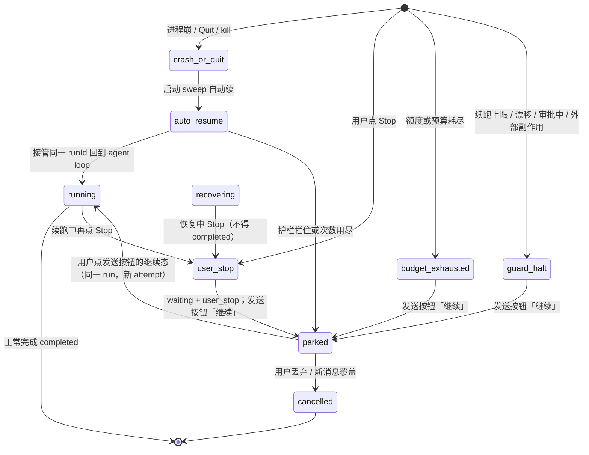

# ADR-075：重启后前台任务自动续跑

- 状态：**已拍板**（2026-09-26 爸「按推荐」，Decision needed 9 项全部按推荐；施工按「批准后拟拆施工单」8 刀）
- 单号：N-RESTART-RESUME（稳定线 wave 12）
- 基线：`origin/main@35381f2e4`；Round 2 修订对照分支 `docs/restart-resume-adr@e4b55f1`
- 证据：`code-agent-private-archive/docs/evidence/N-RESTART-RESUME-2026-09-26.md`
- 相关：ADR-037（durable kernel / at-least-once）、ADR-068（进程内流式断流续接）、T-083 / RQ-132 / N-RESIDENT-HOST-ADR（常驻宿主）、N-BGSPAWN-DURABLE（后台子代理 close-only）、N-RECOVERY-MATRIX（只验收不造机制）、N-CRON-APPROVAL-PARK（审批停车后续接同一 run）
- 触发时机（爸 2026-09-25 已拍板，不再列选项）：崩溃/退出打断 = 启动 sweep 自动续；用户 Stop、额度/预算停、护栏拦下 = 打开会话时发送按钮呈「继续」态由用户点

Round 2 修订（独立评审）：改正文里把 `dispatchPrepared` 写成「只发一次回 loop」的事实错；补「接管已有 runId」原语；并行未决 op 全部收口；把 parked 定义成 `waiting` + 中断原因而不是终态 `cancelled`；成本不再承诺崩溃那次精确入账。触发时机不动。

## 术语

| 词 | 含义 |
|----|------|
| 前台任务 | 用户正在聊的 native agent 轮：同一 `runId` 上的模型推理 + 工具循环。不含 `engine_kind='subagent_single'` 后台子代理，不含 cron/loop 自己的 engine |
| 中断原因 `interrupt_cause` | **需新增**的 envelope 字段。取值 `crash_or_quit` / `user_stop` / `budget_exhausted` / `guard_halt`。代码里该标识符目前为零（只出现在本 ADR 施工表）。启动自动续只认 `crash_or_quit` |
| parked | **产品态，不是新的 `RunStatus`。** kernel 现有状态机是 `waiting` 可回 `running`，`cancelled`/`completed`/`failed` 是终态（`durableRun.ts` `RUN_STATUS_TRANSITIONS` / `TERMINAL_RUN_STATUSES`）。parked = `status=waiting` + 已落盘的 `interrupt_cause`。人看到发送按钮「继续」 |
| 续跑 | 接管**已有** `runId`，把当前一步的结果（含「中断/结果未知」）写进同一轮完整历史，**回到 live agent loop**。同一 `runId`，新 `attempt`（ADR-037） |
| 继续 | 用户点发送按钮继续态：同一 `runId` 从 parked 回到 `running`（新 attempt）。不是新开一条 user 消息，也不是 `regenerateMessage` |
| 重放 | 把结果未知的工具再执行一次。本 ADR 禁止对未知写做重放 |
| 待续 | **不是实体队列。** 由 envelope 派生的两个集合：自动续集合（非终态 ∩ `interrupt_cause=crash_or_quit` ∩ `autoResumeCount` 未超限 ∩ 账本里看得到）；继续集合（非终态 ∩ `interrupt_cause` ∈ {`user_stop`,`budget_exhausted`,`guard_halt`}，或自动次数用尽）。Stop 写入 `user_stop`，该 run 离开自动续集合、进入继续集合 |

## 问题与现状

对标体验：任务跑到一半 app 退出，重启进会话后任务接着跑。Neo 的 durable kernel 已经能在重启后认出未完成的 native run，但恢复宿主把「补完当前一步」当成终态，用户看到的是「已中断 + 重试」，不是接着干。代码里也**没有**「带着完整历史、接管同一 `runId` 进入 live loop」的入口。

### 现状锚点（@35381f2e4）

| # | 事实 | 锚点 |
|---|------|------|
| 1 | durable 默认开；`assembleDurableRun` 成功后启动即 `recoverAndDispatch`，并按租约一半间隔 sweep | `initializeDurableRun.ts:176-185`；`durableRecoveryRuntime.ts:94-99`（`recoverDurable → dispatcher.dispatch`） |
| 2 | 写工具结果不可查、且不能证明可重放时，恢复宿主 **review**，原因 `unknown_write_side_effect`，不 interrupt、不 replay | `src/host/runtime/nativeRecoveryHost.ts:197-202` |
| 3 | 任意一步一旦拿到 evidence，checkpoint 后立刻 `terminalDurable(completed)`，**不回到 agent loop** | 同文件 `:218-236`。单测把「一步 + 一个 terminal」写成合同（`nativeRecoveryHost.test.ts:66-70`） |
| 4 | 生产端口上已派发的模型请求 **不可查询、不可证明幂等**，`canRetrySafely` 恒 false，流式中断落 `model_safe_retry_unproven` 复核。telemetry 只在完成后 flush，崩溃那次 usage 没落盘 | `src/host/app/nativeRecoveryHost.ts:305-318`；runtime `:167-171` |
| 5 | 只读且 stored+current 都是 `automatic` 才 replay；否则 interrupt，把「crashed before a result was recorded」写成 tool 失败结果，然后仍走第 3 条终态 | app `:395-425`；runtime `:193-205`；`toolReplaySafety.ts:40-45` |
| 6 | 审批中只恢复同一张卡（`observing` / `restore_same_approval`）；已批准未执行则进 review（`approval_${status}_continuation_requires_application_resume`）。工作区或 scope 漂移进 review | runtime `:127-141`、`:239-267` |
| 7 | `/goal` 禁止恢复路径直接 `completed`（假完成 P0），进 review；真正再跑 loop 留作另单。descriptor 只有 `isGoalRun?: boolean`，没有契约/闸计数/预算余量 | runtime `:25-29`、`:299-332`；`runRegistry.ts:441`；`goalModeController.ts` 状态全在内存 |
| 8 | 用户看见「已中断」（`outcomeWords['interrupted-restart']`）和 AgentErrorCard 的「重试」（`regenerateMessage`，等于重发上一条 user 消息）。发送按钮只有空闲发送 / 运行停止 / 转向 / 接入中，**没有「继续」态** | `AgentErrorCard.tsx:145-148`；`SendButton.tsx:29-34`；`outcomeWords.ts:72-76` |
| 9 | 进程内流中断另有 DecisionSlot「继续 / 放弃」；那是 ADR-068 / N-INTERRUPT-REPLAY 的进程内形态，不是跨进程续跑 | `DecisionSlot.tsx:89-178` |
| 10 | **执行前先落盘**指 live 路径：工具 `nativeToolCheckpoint.ts:45-49` → `runRegistry.ts:455-525`（`checkpointNativeToolOperation`）；模型 `nativeModelCheckpoint.ts:66-67`（`prepared` 紧接着 `dispatched`）。**不是**恢复路径上的 fence（app `:120-173` `checkpointToolReplayFence` / `checkpointModelDispatchFence`） | 见左 |
| 11 | 验收矩阵是单测 + 杀进程夹具，期望未知写 `waiting_review`、安全恢复 `completed`。没有「重启后任务跑完」的 E2E | `tests/fixtures/durableRunKillRestart.ts:56-61`；N-RECOVERY-MATRIX 台账状态=待派，验收原文「只验收不造机制」 |
| 12 | 「回 loop、保持同一 `runId`」在代码里不存在。`startRunPreferringDurable`（`durableRunStart.ts:18-38`）遇到冲突/失败会回落普通 `start()`。`TaskManager.startTask:263` 没有接管已有 durable envelope 的入口。orchestrator 虽可读 `options.runId`（`:940`），那是铸造或后台预分配，不是认领已有账本 | 见左 |
| 13 | 模型 `prepared` 恢复走 `dispatchPrepared`：`setSessionContext(messages.slice(0, sourceIndex))` 再 `startTask(source.content)`（app `:247-298`）。等于截到本轮 user 消息后整轮重跑，本轮已执行的工具结果全部丢失。这就是 ADR 要避开的 regenerate。刀 1 **不能**复用这条路径 | app `:274-296`；runtime `:153-158` 把它标成 `execute_prepared_model_once`，名不副实 |
| 14 | 并行工具：每次 `checkpointNativeToolOperation` 都用最新一笔覆盖 `descriptor`（`runRegistry.ts:497-515`）。恢复只处理 `descriptor.operationId`（runtime `:142`）。运行时存在 `parallelStrategy`（`toolExecutionEngine.ts:34,238`）。其它未决 op 会留下没有 `tool_result` 的 `tool_call`；`durableRun.ts:296-300` 禁止 `completed` 信封里有未了结 op | 见左 |
| 15 | `queryResult` 查到 complete 只返回 `{ resultRef: 'tool-ledger:…' }`（app `:320-326`），不写 tool 消息。interrupt / dispatchPrepared 才会 `persistToolMessage` | 对照 app `:380-393`、`:411-424` |
| 16 | checkpoint 失败只 warn、静默降级（`nativeModelCheckpoint.ts:60-65` `checkpointQuiet`）。这类 run 不在账本里，启动 sweep 看不到，也无处写 `interrupt_cause` | 见左 |
| 17 | 用租约过期认领：`canClaimOrphanedCliLease` 在租约到期时直接 true（`cliOrphanLease.ts:19-25`），休眠或事件循环卡住会被当成死进程。非 `cli-*` 的 `processInstanceId` 无法用 pid 探活，只能靠租约 | `durableRunKernel.ts:247-263` |

ARCHITECTURE.md 风险表已经点名这两处缺口：Native 已派发模型请求没有可证明查询/幂等合同；复核恢复的统一页面动作未闭合（「点恢复接着跑」兑不了现）。

## 方案对照（公开事实 + 台账 09-25 取证）

| 系统 | 公开 / 取证行为 | 对本问题的可借鉴点 |
|---|---|---|
| Cursor | 启动即自动唤醒会话；输入框按钮在发送与「Continue Working」之间切换。官方员工确认后台任务完成会自动唤醒 chat（forum.cursor.com/t/171439）。额度刷新后无确认自动续跑烧掉约 16% 额度，官方认错：因额度停下的 chat 不应无确认自行恢复，Stop 应清掉待唤醒队列。v3.21.9 用户点 Stop 后仍被自动恢复直到干完（/t/172081）。社区需求 /t/156178：工具调用执行前先落盘，崩溃后 Continue 从首个未完成调用续。 | 继续按钮 = 发送按钮的一个状态。只对崩溃/退出自动续。Stop 必须让该 run 离开自动续集合。额度/预算停下的一律不自动续。成本必须可见。 |
| Codex Desktop | 打开会话视图时惰性恢复：`resumeState=needs_resume → maybe_resume_started → thread/resume`（约 6s），见 openai/codex#30916 日志。另有常驻 app-server daemon，`shutdownGraceSeconds` 默认 60s 等 turn 收尾（codex-rs/app-server-daemon/README.md）。台账未找到「打开后被中断的 turn 自动接着跑」的一手文字证据。 | 打开会话才露恢复动作，适合非崩溃停机。常驻宿主是另一条线（T-083），不能替代进程死后的续跑合同。 |
| Neo 现状 | durable + 启动 sweep 已在；未知写进复核死胡同；补一步就 `completed`；「回 loop」入口不存在，现有 prepared 路径是 regenerate。 | 账本领先（live 路径执行前先落盘）。缺的是接管原语、按中断原因分流、以及全部未决 op 收口后再进 loop。 |

Cursor 反例的避免合同写进护栏，不是可选项。

## 决策提议

### ⓪ 先补原语：接管已有 durable `runId`，带完整历史进入 live loop

排在所有施工刀之前。没有这条，① 的「回 loop」无处落地。

入口形状（名称施工时可改，合同不能改）：

- 认领已有 envelope：新 `processInstanceId` 接管租约，`attempt` 按 ADR-037 递增，**不**走 `kernel.createNativeRun` / `startDurable` 铸造新信封。
- 会话历史原样交给 AgentLoop（含本轮已有的 assistant / tool 消息）。禁止 `messages.slice(0, sourceIndex)`。
- 不调用 `TaskManager.startTask` 重发本轮 user 正文。`startTask` 是新任务入口；续跑是 `resumeExistingDurableRun`（或等价）入口。
- `startRunPreferringDurable` 的冲突回落（`durableRunStart.ts:18-38`）不得用于这条路径：回落成普通 `start()` 会丢掉 durable 身份。

刀 1 明确禁止复用 app `:247-298` 的 `dispatchPrepared` → `setSessionContext(slice)` → `startTask(source.content)`。那条路径就是 regenerate：截断到本轮 user 之后整轮重跑，本轮已执行的工具结果全部丢失。

### ① 续跑语义：喂回模型，回到 loop，不重放未知写

恢复宿主对**所有未决** pending operation 做同一件事：给每一步一个对模型诚实的结果并物化成历史消息，全部收口之后，把同一 `runId` 交给 ⓪ 的入口进入 live agent loop。禁止把「补完当前一步」写成 `completed`。禁止只处理 `descriptor.operationId`、丢下兄弟 op。

| 中断点 | 给模型的结果 | 是否重放该步 | 之后 |
|---|---|---|---|
| 只读工具，stored+current 均为 `automatic`，且能查到成功 complete | 查到的原结果，**必须物化成 tool 消息**（现 `queryResult` 只返回 ledger 引用，不够） | 不需要 | 全部未决 op 收口后回 loop |
| 只读工具，无法证明可重放 | tool 失败：`interrupted: process crashed before a result was recorded; do not assume it ran or succeeded`（沿用 app `:408` 文案） | 否 | 回 loop，模型可再调一次只读工具 |
| 本地文件写（Write / Edit / 只动工作区的 Bash），结果不可查 | 同上「中断/结果未知」 | **否**。禁止 `dispatchPrepared` | 回 loop，由模型 Read / `git status` / 看目录核实（Q1a） |
| 外部/不可逆写（MCP 写、网络 POST、`git push`、发消息），结果不可查 | 同上「中断/结果未知」 | **否** | 默认 `guard_halt` parked，用户点「继续」（Q1b） |
| 写工具，账本已有 success complete | 物化成 tool 消息后的原结果 | 不需要 | 收口后回 loop |
| 模型流式中（账本几乎总是 `dispatched`） | 不把半截生成拼进下一次（ADR-068「不拼两次回答」）。半截按 B2 诚实分段落库；**重发该轮推理** | 重发的是推理，不是工具 | 崩溃那次 usage **标未知或按估算显示**；重发这次如实入账。不承诺两次都能精确入账 |
| 模型请求仍是 `prepared` | 与 `dispatched` 同一条路。`nativeModelCheckpoint.ts:66-67` 把 prepared / dispatched 背靠背落盘，崩溃几乎总落在 `dispatched` → `model_safe_retry_unproven`。「模型流式中」验收按 dispatched 设计 | 禁止走 `dispatchPrepared` / `startTask` | 回 loop |
| 同一轮并行多个 tool_call | 每个未决 op 逐个 query 或 interrupt，并物化 tool 消息 | 见各 op 自己的规则 | **全部收口后**才回 loop。否则 provider 拒收缺 `tool_result` 的 `tool_call`，也会触发 `durableRun.ts:300` |
| 审批中（pending） | 不停、不续推理；恢复同一张审批卡 | — | 用户批过之后，恰好执行那一次已批准的 op，再回 loop（N-CRON-APPROVAL-PARK 依赖这条） |
| 审批已批准、工具尚未执行 | 执行那一次，不再问 | 只那一次 | 回 loop。禁止恢复路径再 dispatch 第二次 |
| 工作区 / scope 漂移 | 不停在 drift 上续 | — | 保持 review，直到工作区回到 checkpoint 或用户丢弃 |
| 父 run 带未收口的子 op / 后台子代理 | 子代理仍 close-only（N-BGSPAWN-DURABLE） | 不把子代理接回 loop | 父 run 先把子 op 收口（中断事实写进历史）再回自己的 loop |

这是对 ADR-037「不确定的写要人工确认」在**前台崩溃续跑**这条缝上的收窄：本地文件写的核实主体是模型；外部/不可逆写默认停给用户。人看到「正在从中断处继续」，随时可 Stop。ARCHITECTURE.md 写明的「复核页面动作未闭合」因此不再作为用户出路。人工审查仍留给漂移、身份冲突、goal 假完成之外的不可恢复描述符。

`runId` 不变。`attempt` 按 ADR-037 递增。新的 `processInstanceId` 接管租约。续跑不是新开一条 user 消息，也不是 AgentErrorCard 的 `regenerateMessage`。

生产端口 `canRetrySafely === false` 保持为对「静默二次收费」的诚实声明。本 ADR 接受 at-least-once。不承诺 exactly-once。

**恢复中的 Stop（刀 1 反向变异）：** 恢复已走到一半、会话里已有半截 assistant 时，`preparedModelEvidence` 会命中，现有代码随即 `terminalDurable(completed)`（runtime `:230`）。Stop 被记成完成。合同：恢复中（`recovering`）的 Stop 必须落到 `interrupt_cause=user_stop` 的 parked，**绝不是** `completed`。删掉这条必须红。

### parked 与终态（kernel）

| | parked | 终态 `cancelled` | 终态 `completed` / `failed` |
|---|---|---|---|
| kernel `status` | `waiting` | `cancelled` | `completed` / `failed` |
| 能否再进 `running` | 能（同一 `runId`，新 attempt） | 不能。`RUN_STATUS_TRANSITIONS.cancelled = []` | 不能 |
| 用户动作 | 点「继续」= 续跑；打字发新消息 = 覆盖并 `cancelled` | 已丢弃。要再干是新 run | 已结束 |
| Stop | 活着的 Stop **进入 parked**，不是 `cancelled` | 丢弃 / 新消息覆盖才 `cancelled` | — |

「继续」= 同一 run、新 attempt。不是新开 run。`cancelled` 不能再「继续」（见拍板 Q7）。

### ② 触发方式（已拍板，按此写）

- **崩溃/退出**：启动 sweep **分类**为 `crash_or_quit`。真正派进 live loop 等到窗口就绪之后（防崩溃循环在窗口起来前空转）。不弹确认、不把所有会话拉到前台。后台静默续跑必须有托盘或系统通知（Q4）。
- **其余**（用户 Stop、额度/预算停、续跑护栏拦下、外部不可逆写）：打开该会话时，发送按钮从「发送」切到「继续」。点一下才续。不自动、不在启动时唤醒一串会话抢焦点。
- 继续按钮就是发送按钮的第五态（爸 09-25 口径）。现有四态（空闲发送 / 运行停止 / 运行中转向 / 接入中）保持；有待续 run 且输入框无草稿时显示「继续」。用户开始打字则回到普通发送（新消息覆盖待续，该 run `cancelled`，`user_stop` 记录仍在，不会在下次启动被自动捞起）。

不模仿 Cursor「启动即唤醒所有 chat」。

### ③ 护栏

1. **只对 `crash_or_quit` 自动续。** 用户 Stop、额度/预算耗尽、护栏拦下、外部/不可逆写的一律不自动续。额度后来刷新、用户充值，也只把按钮变成「继续」，禁止静默开跑。这是 Cursor 16% 额度反例的直接对策。
2. **续跑次数上限。** 同一 `runId` 上 `autoResumeCount` 最多 **2**。第 3 次崩溃改为 parked + 继续按钮。计数必须在派发前与 fence **同一笔**落盘；派发失败不得已加过次数。点「继续」是用户动作，不消耗自动次数。「继续」之后若再次崩溃，自动次数从 0 计（用户已经在场）。成功推进一轮（恢复后至少一次模型调用成功结束，或一个 tool complete）后计数清零——这是拍板题，推荐清零（Q2）。
3. **审批中或工作区漂移仍然停下。** 现有 `restore_same_approval` 与 `native_workspace_drift` / `native_workspace_scope_drift` 行为保持。自动续不得绕过权限卡，不得在根目录/scope version 对不上时写文件。批准后由施工刀「恰好执行一次」接回 loop，禁止恢复路径二次 dispatch。
4. **一处信号。** 续跑中，聊天流里当前 assistant 消息内嵌一行「正在从中断处继续」；已花费（含「崩溃那次未知/估算」）和「续跑会再消耗额度」写在同一行。不新开 banner、不叠 AgentErrorCard、不用 DecisionSlot 再要一次「继续/放弃」。进程内断流仍用 ADR-068 的「连接中断，正在续接 n/N」。两种信号不同时出现。
5. **Stop 把该 run 标成 parked，离开自动续集合。** 用户点 Stop：`status=waiting`，`interrupt_cause=user_stop`，**不是**终态 `cancelled`。该会话自动续集合里不再有它；继续集合里有它。下次启动 sweep 不得把它当 `crash_or_quit` 捞起。丢弃或新消息覆盖才 `cancelled`。禁止出现 Cursor v3.21.9「点了 Stop 仍被自动恢复直到干完」。代码里没有待续队列实体，施工就是写 `interrupt_cause` 并按派生集合过滤。
6. **成本可见，不承诺崩溃那次精确。** app `:305-308` 写明 telemetry 只在完成后 flush，崩溃那次 usage 经常没落盘。文案：崩溃那次标「未知」或按估算显示；重发这次如实入账。禁止写「两次都入账」。不承诺零重复收费，承诺不把未知说成精确。
7. **并行未决 op 全部收口。** 回 loop 之前，所有非终态 pending op 逐个 interrupt 或查询并物化。descriptor 只指向最后一次 checkpoint 的那一笔，不能当唯一处理对象。
8. **多会话自动续串行。** 同时只派一个自动续；下一次等上一次进 loop 或 parked。续跑前重新检查预算，超了走 `budget_exhausted` parked。单次续跑花费上限见 Q6。
9. **父 run 对子 op 先收口再回 loop。** 后台子代理仍 close-only，中断事实写进父历史。

#### 中断原因必须落盘

中断原因必须在停机当时落进 envelope（`interrupt_cause` **需新增**；当前 grep 为零）。活着的 Stop 路径必须先写 `user_stop` 再把 status 打成 `waiting`，不能只靠「没心跳」推断。

`crash_or_quit` 只在**启动 sweep** 分类，并且：

- 优先确认原 `processInstanceId` 已死（CLI 已有 `isAbandonedCliProcess` pid 探活，`cliOrphanLease.ts:8-16`）。
- 禁止把「租约过期」单独当成崩溃：休眠或事件循环卡住会误伤（`canClaimOrphanedCliLease` 在到期时直接 true，`:24`）。桌面非 `cli-*` 形状无法探活时，只在启动 sweep 里、且窗口已起来之后，才标 `crash_or_quit`；运行中租约到期走续租/告警，不改中断原因。

checkpoint 失败只 warn、静默降级（`nativeModelCheckpoint.ts:60-65`）的 run **不在账本里**。sweep 看不到它们，也无处写 `interrupt_cause`。这是已知缺口：本 ADR 不把它们假装成可续跑对象；施工刀应把「checkpoint 失败仍继续模型调用」收成可见降级（日志 + 不计自动续），不在无账本的 run 上发明恢复。

`autoResumeCount` 与派发 fence 同笔落盘。自动续的实际进 loop 延后到窗口就绪之后，避免启动瞬间崩溃循环。

### ④ 验收设计

真机 `kill -9` 三场景，fresh 数据目录，重启后**同一 `runId` 的任务能跑完**（模型最终给出完成态，而不是停在「已中断+重试」）：

| 场景 | 杀进程时机 | 重启后期望 |
|---|---|---|
| 模型流式中 | 账本已是 `dispatched`（prepared 窗口可忽略）、已有可见 delta、provider 请求未完成 | 半截诚实分段；按 dispatched 重发该轮；崩溃 usage 标未知或估算，重发这次在账本里；任务继续直到完成 |
| Bash 执行中 | begin 已落、complete 未落 | 不重放 Bash；模型收到中断/未知；模型核实后自己决定是否再调；任务跑完 |
| 只读工具中 | Read/Glob 等 begin 已落 | 可 replay 则把原结果**物化成 tool 消息**；否则 interrupt 喂回；若同轮有并行兄弟 op，全部收口；任务跑完 |
| 并行只读两发 | 两笔 tool 都 dispatched，descriptor 指向后一笔 | 两笔都有 tool 消息后才回 loop；不得只收口 descriptor 那一笔 |

施工刀交付 E2E（或可重复的杀进程夹具 + 会话回读）。现有单测矩阵要改合同：安全恢复的期望从「一步后 `completed`」改为「一步后 run 仍 `running` 且 loop 已接上（同一 `runId`）」；未知写的期望从 `waiting_review` 改为「interrupt 结果进历史 + loop 继续」，漂移/审批/外部不可逆写除外。

N-RECOVERY-MATRIX 仍只做六类故障的用户可见状态验收，不在那边造续跑机制。本 ADR 的 E2E 是机制门；矩阵是体验门。两边都要能指向同一 `runId` / 文案 / 可点出路。

反向变异（施工时，不在本 ADR 票）：

- 把 `terminalDurable(completed)` 接回恢复终点必须红。
- 恢复中 Stop 落到 `completed` 必须红。
- 删掉「未知写禁止 replay」必须红。
- Stop 后仍被 sweep 当 `crash_or_quit` 捞起必须红。
- 刀 1 走 `startTask` 截断 regenerate 必须红。
- 并行未决 op 留在信封里就回 loop 必须红。

### ⑤ 划界

| 邻居 | 它管什么 | 本 ADR 管什么 | 互不吸收 |
|---|---|---|---|
| **T-083 / RQ-132 / N-RESIDENT-HOST-ADR** | 执行进程与 Tauri 壳解耦，关窗不等于杀进程；桌面/CLI 变成客户端 | 进程**真的死了**之后，前台 native run 怎么接着跑 | 常驻宿主少触发本 ADR，不代替本 ADR。本 ADR 不引入 daemon、pid 文件、session attach |
| **N-BGSPAWN-DURABLE** | 后台子代理 `engine_kind='subagent_single'`：启动收口 `interrupted_by_restart`，刀1 已合；断点续跑若立项是它的刀 | 前台 native agent loop 的续跑 | 前台续跑时，子代理仍按 close-only 向父会话投影中断事实。本 ADR 不把子代理接回 loop。父 run 必须先收口子 op |
| **N-CRON-APPROVAL-PARK** | cron 碰到审批改为停车等人，批准后**续接同一 run**，同 job 停车期间不起第二发 | 提供「同一 `runId` 从 waiting/approval 回到 live loop」+ **批准后恰好执行一次** | 它依赖本 ADR 的回 loop 原语和「批准后执行一次」；本 ADR 不改 cron 调度、不改 60s 超时 |
| **ADR-068** | 进程还活着时的流式断流续接（B1 无缝 / B2 诚实分段） | 进程已死后的跨进程续跑 | 进程内走 068；跨进程走本 ADR 的重发+诚实展示。不把 068 的 prefix 合同套到已死的 socket 上。自动续次数**不要**拿 `STREAM_RECONNECT_MAX` 当理由（那是进程内断流预算） |
| **ADR-037** | run 身份、租约、at-least-once、未知操作可复核 | 把「复核死胡同」收成「模型核实 + 回 loop」，并按中断原因分流触发。parked 复用 `waiting`，不新增 `RunStatus` | 不改 kernel 身份模型，不宣称 exactly-once，不把 `cancelled` 当可恢复态 |
| **N-RECOVERY-MATRIX** | 六类故障的用户可见状态与出路验收 | 造续跑机制 | 矩阵不实现 host；本 ADR 的施工刀不替代矩阵的六格体验记录 |
| **/goal** | verify/review 闸只在 live loop 里跑；控制器状态（契约、闸失败计数、swarm token、anti-spin）全在内存 | 恢复路径仍禁止直接 `completed`。回 loop 的前提是 goal 状态能重建；否则默认 parked（Q3） | 不在恢复宿主里跑 verify。descriptor 只有 `isGoalRun` 布尔，重建是单独一刀 |

## 用户可见状态（协作者，非程序员）

| 时刻 | 用户看见 | 用户能做 |
|---|---|---|
| 启动后，崩溃打断的任务正在续 | 打开该会话：一行「正在从中断处继续 · 本轮已花费 …（崩溃那次未知/估算）」；发送按钮是停止。窗口未开时：托盘或系统通知「任务正在从中断处继续」 | Stop（该 run 进入 parked） |
| 打开会话，任务因 Stop/额度/上限/外部副作用停下 | 发送按钮是「继续」；没有红卡逼着重试整轮 | 点继续（同一 run）；或打字发新消息覆盖（该 run `cancelled`） |
| 审批中重启 | 同一张审批卡 | 批准 / 拒绝。批准后恰好执行一次，同一 run |
| 工作区对不上 | 停下，说明工作区变了 | 回到原目录或丢弃 |
| 续跑成功 | 信号消失，模型接着说话/调用工具 | 普通协作 |
| 续跑再次崩溃且次数用尽 | 发送按钮「继续」 | 点继续或放弃 |
| 恢复尚未进 loop，用户点了 Stop | 发送按钮「继续」，不是「已完成」 | 点继续或放弃。不得显示完成 |

AgentErrorCard 的「重试」不再作为崩溃恢复的主出路。它继续服务 auth / 网络 / 模型错误。`interrupted-restart` 文案在自动续成功后不应再作为终态徽章留在时间线上；自动续进行中用续跑信号替换。

## 批准后拟拆施工单（只提议，不创建）

刀 1 单独合入会在没有未知写处理、次数上限、中断原因的情况下无限自动续。顺序把落盘和收口放到回 loop 之前，并把 1+2+6 打成同一刀。

| 顺序 | 一句话 | 触及 | 预期收益 | 判断标准 |
|---|---|---|---|---|
| 0 | **接管已有 durable `runId`**：带完整历史进入 live loop。禁止 `startTask` 截断 regenerate | 新入口；`durableRunStart.ts`；`TaskManager`；`agentOrchestrator.ts:940` 旁路 | 后续所有刀有地方可去 | 反向变异：续跑走 `setSessionContext(slice)` + `startTask(source.content)` 必须红 |
| 1 | 落盘 `interrupt_cause` 与 `autoResumeCount`（与派发 fence 同笔）；sweep 只自动续 `crash_or_quit` | envelope 新字段、cancel/Stop 路径、`initializeDurableRun` sweep、窗口就绪闸 | Cursor 额度反例进不来；崩溃循环有顶 | 反向变异：Stop 后仍被 sweep 当崩溃捞起必须红；计数在 fence 之后才写必须红 |
| 2 | 恢复宿主：全部未决 op 收口 + 未知写 interrupt 喂回 + 补完后回 loop（**原刀 1+2+6 同一刀**）+ Stop→parked | `nativeRecoveryHost.ts`（runtime + app）、`durableRecoveryHandlers.ts`、`runRegistry.ts:497-515`、Stop 路径、单测 | 任务能跑完；并行不卡 provider；点停就是停 | 反向变异：`terminalDurable(completed)` 接回恢复终点必须红；恢复中 Stop 变 `completed` 必须红；只收口 `descriptor.operationId` 必须红；未知写走 `dispatchPrepared` 必须红 |
| 3 | 审批批准后恰好执行一次 | runtime `recoverApproval` `:239-267` | N-CRON-APPROVAL-PARK 能接同一 run | 反向变异：已批准 op 被 dispatch 第二次必须红 |
| 4 | 模型流式跨进程重发该轮（按 **dispatched** 设计）；崩溃 usage 标未知/估算 | app `canRetrySafely`/`queryResult`/`dispatchPrepared`（禁用 regenerate）、conversationRuntime、ADR-068 接缝 | 流式中断后任务能继续，账单不撒谎 | 半截不拼进新生成；文案出现「两次都入账」必须红 |
| 5 | goal 状态重建（若 Q3 选回 loop；否则本刀改成 goal 一律 parked） | descriptor 现只有 `isGoalRun`；需落契约/闸计数/预算余量，或从 originating `/goal` 消息重建 | 假完成 P0 保持，goal 也能接着干 | 重建失败仍回 loop 必须红；恢复路径 `completed` 必须红 |
| 6 | `autoResumeCount` 上限兑现到按钮；发送按钮继续态；一处信号 + 成本未知/估算；托盘/系统通知 | envelope 字段、`SendButton.tsx` 第五态、sessionStore、i18n、usage 投影、通知 | 死循环有顶，协作者有一键继续，后台续跑可感知 | 第 3 次崩溃按钮为继续；有草稿时不伪装成继续；同时出现 banner + ErrorCard + DecisionSlot 必须红 |
| 7 | 真机 kill -9 三场景 + 并行两发 E2E | 新 E2E / 杀进程夹具；不改 N-RECOVERY-MATRIX 的职责 | 机制有门 | 三场景重启后同一 run 跑完；并行两发都有 tool 消息；N-RECOVERY-MATRIX 只记体验格 |

N-CRON-APPROVAL-PARK 应等刀 0 与刀 3（批准后执行一次）合入再施工。

## Decision needed

触发时机已拍板（见文首），下面只留仍需爸点头的项。每项带类型、推荐、大白话。

1. **本地文件写，谁来核实？**（类型：安全合同）。推荐：**模型核实**——喂「中断/结果未知」，禁止重放，让模型自己 Read / `git status`。备选：维持人工 review 卡。推荐理由：复核卡没有「接着跑」的按钮；协作者不是来读 `unknown_write_side_effect` 的。
2. **外部/不可逆写要不要自动续？**（类型：安全合同）。包括 MCP 写、网络 POST、`git push`、发消息。推荐：**默认 `guard_halt` 停下，用户点「继续」**。备选：与本地写一样交给模型。推荐理由：这类动作撤不回来，崩溃时不知道有没有发出去；自动续等于赌第二次。与第 8 题同一条政策。
3. **自动续几次？成功推进一步后计数清不清零？**（类型：护栏数字）。推荐：**同一 `runId` 最多 2 次自动续**；恢复后只要成功跑完一轮模型或一个 tool complete，计数清零；用户点「继续」不占次数。备选：次数 1 更保守 / 3 更粘；或不清零（整个 run 一辈子 2 次）。推荐理由：长任务中途崩几次，每次都有进展，应给新预算；连续崩、毫无进展，2 次就停。**不要**拿 `STREAM_RECONNECT_MAX` 当理由——那是进程内断流续接预算，场景不是进程死亡。
4. **`/goal` 崩溃后回不回 loop？**（类型：范围）。前提：**goal 状态能重建才回 loop**（契约、闸、预算余量；descriptor 今天只有 `isGoalRun` 布尔）。重建不了就默认 parked + 继续按钮。推荐：能重建则回 loop，恢复路径仍禁止直接 `completed`。备选：goal 一律 parked。推荐理由：闸门只在 live loop 里有意义；假状态回 loop 会假完成。
5. **启动自动续抢不抢焦点？后台怎么让人知道？**（类型：体验 / UI）。推荐：**sweep 立刻分类，窗口就绪后再进 loop；不把会话拉到前台；后台静默续跑必须有托盘或系统通知。** 备选：打开该会话才开始跑。推荐理由：任务应自己干完；完全没提示的后台续跑，人不知道在花钱。
6. **继续按钮怎么被新输入覆盖？**（类型：UI）。推荐：**无草稿时发送按钮=继续；一开始打字就变回发送，新消息覆盖待续并把该 run `cancelled`，下次启动不自动捞。** 备选：继续与输入拆成两个按钮。推荐理由：爸 09-25「继续按钮=发送按钮的一个状态」。
7. **多会话一起崩，同时续几个？单次续跑花多少就停？**（类型：护栏数字）。推荐：**串行**（同时只自动续 1 个会话）；每次进 loop 前重新检查预算；单次续跑花费上限 = 该会话剩余预算，超了 `budget_exhausted` parked。备选：有限并行（例如 2）。推荐理由：并行自动续会把机器和额度一起打满，人还没看到窗口。
8. **恢复中点了 Stop，算完成吗？`cancelled` 还能点「继续」吗？**（类型：安全 / 状态机）。推荐：恢复中 Stop = `user_stop` parked，**绝不是** `completed`；`cancelled` 不能再「继续」，要再干是新 run。备选：`cancelled` 允许从终态复活（要改 kernel 状态机，不推荐）。推荐理由：完成就是完成；停就是停。Cursor 的 Stop 被自动捞起，就是把停写成了还能跑。
9. **外部副作用是不是一律禁止自动续？**（类型：安全合同）。推荐：**是，一律禁止自动续**，与第 2 题同一政策。本地文件写可以模型核实后自动续；出了工作区的写默认停。备选：按工具白名单逐个开。推荐理由：白名单养不大，漏一个就是二次对外动作。

## 拍板记录（只增不改）

2026-09-25 爸拍板（台账 note，写入正文，不列入 Decision needed）：

- 触发混合：崩溃/退出打断的任务 = 启动时自动续跑；其余（用户 Stop、额度/预算停、续跑护栏拦下）= 打开会话时发送按钮呈「继续」态由用户点。
- 四条护栏：只对崩溃/退出自动续；续跑前后成本可见；Stop 必须清空待续队列；继续按钮=发送按钮的一个状态。

Round 2 把「Stop 必须清空待续队列」收成可执行合同：代码里没有队列实体；Stop 写入 `interrupt_cause=user_stop` 并进入 parked（`waiting`），离开自动续集合。09-25 触发时机本身不重开。

2026-09-26 爸拍板（原话「按推荐」）：Decision needed 9 项全部采纳推荐——
1. 本地文件写：模型核实（喂「中断/结果未知」，禁止重放）。
2. 外部/不可逆写：默认 `guard_halt` 停下，用户点「继续」。
3. 自动续：同一 `runId` 最多 2 次；成功推进一轮后清零；用户点「继续」不占次数。
4. `/goal`：goal 状态能重建才回 loop，否则 parked + 继续按钮；恢复路径禁止直接 `completed`。
5. 启动续：窗口就绪后进 loop、不抢焦点；后台续跑必须有托盘或系统通知。
6. 继续按钮：无草稿=继续；开始打字变回发送，新消息覆盖待续并 `cancelled`。
7. 多会话：串行自动续；每次进 loop 前重查预算，超了 `budget_exhausted` parked。
8. 恢复中 Stop = `user_stop` parked，绝非 `completed`；`cancelled` 不能再「继续」。
9. 外部副作用一律禁止自动续（与第 2 项同一政策）。
