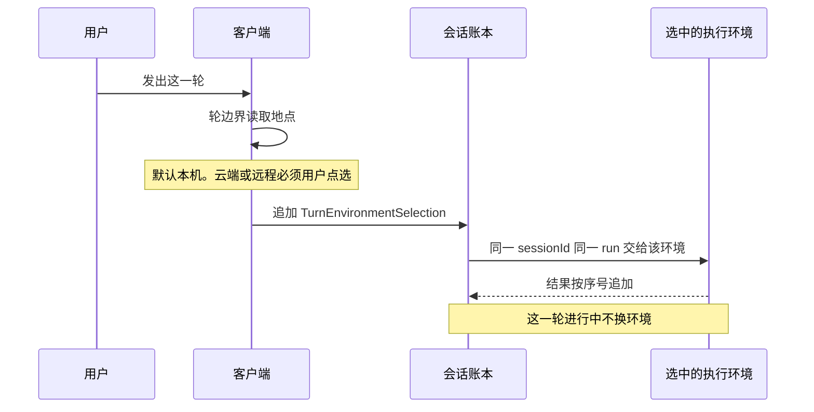
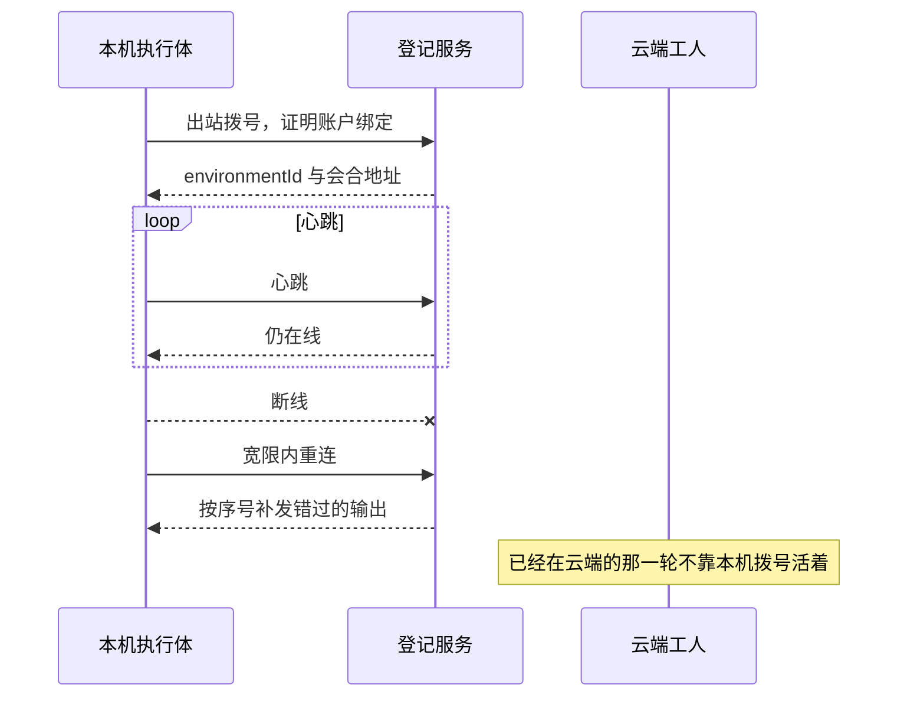
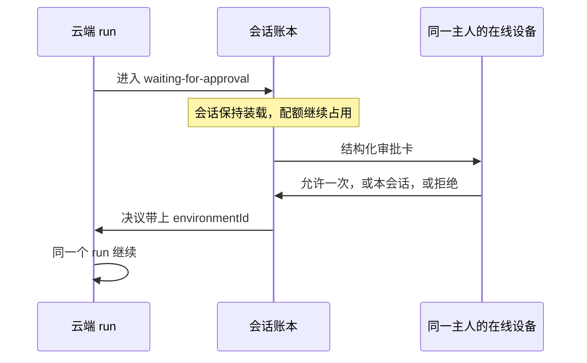
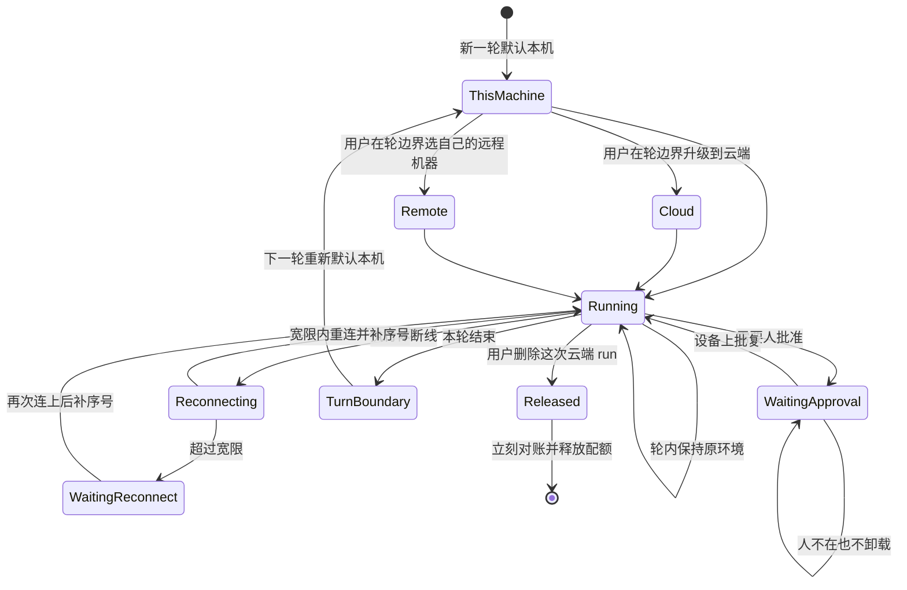
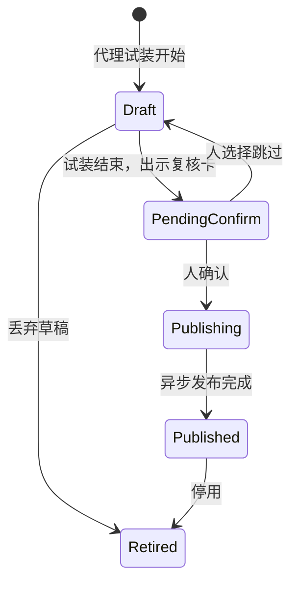

# ADR-076：执行环境成为一等对象

- 状态：**草稿·待爸拍板**
- 单号：N-CLOUD-ENV-ADR（只定合同，不施工）
- 基线：`origin/main@869f4918b361`（`869f4918b361d534efaac5ccb18a041dac2738e3`）
- 证据：本机证据档 `~/work/evidence/N-CLOUD-ENV-ADR.md`。竞品摘录来自任务书所附 2026-09-30 一手实测摘要；私档原文路径在本机不存在，见「竞品实测摘录」
- 相关：ADR-033（会话账本权威；正文不在本仓）、ADR-037（durable kernel，一 run 一 owner）、ADR-046（Surface Execution）、ADR-050 / ADR-051（连接器凭据引用与用户级落点）、ADR-066（出网白名单，索引仍为待拍板）、ADR-075（前台续跑；划界里点名常驻宿主 N-RESIDENT-HOST-ADR）、N-CLOUD-CRON-APPROVAL 及文末施工单

本 ADR 修订 ADR-033 的适用范围：交互轮的执行地点改成逐轮选择。ADR-033 正文不在本仓，下面只给状态修订表，不改写没读到的句子。状态翻转留给审稿人。

## 术语

| 词 | 含义 |
|----|------|
| 执行环境 | 一轮工具和命令真正跑在上面的地方。三种：本机、云端、同一主人已登记的远程机器。不是浏览器标签，也不是 Surface 里的窗口 |
| 会话账本 | 同一条 `sessionId` 上的权威记录：消息、run、审批、序号。权威不换边（ADR-033 决策 4″） |
| 轮边界 | 用户发出一轮新的输入、上一轮已经结束的那个时刻。地点只在这里选 |
| 本机 | 默认执行环境。选择器里对应「这台电脑」 |
| 云端 | 用户显式升级才进入的执行环境。合上电脑之后这轮仍可在云端跑完 |
| 远程机器 | 同一账户下登记过的另一台自己的电脑，或该账户的 SSH 设备。不是别人的机器 |
| `environmentId` | 执行环境的稳定标识。本机也有，允许记录靠它钉地点 |
| `TurnEnvironmentSelection` | 一轮开始时写入账本的选择。字段是 `environmentId`、`cwd`、`workspaceRoots`、`config` |
| 登记 | 一台机器或一份云端环境向账户证明「我是这个人的」。出站拨号完成，不靠本机开端口等人来连 |
| 宽限 | 执行体断线后仍视为同一 run 可恢复的时间。等审批的会话不受这道计时卸载 |
| 凭据占位 | 环境定义里写「需要哪一种连接器、绑到哪个目的地」。长期真值留在个人保险库 |
| 个人保险库 | 现有 SecureStorage / 系统钥匙串。云端工人拿不到里面的长期原文 |
| 配额 | 一个用户同时处于运行中的云端 run 个数上限。超出的进该用户自己的队列 |

## 现状锚点

行号在基线 `869f4918b361` 上打开文件核对过。任务书里的约数有漂移的，以本表为准。

| # | 事实 | 锚点 |
|---|------|------|
| 1 | `runsOn` 只出现在定时任务及其投影上。创建时缺省为 `local`，创建之后改地点直接抛错。交互轮没有这个字段 | `src/shared/contract/cron.ts:65-66`；`src/host/cron/cronService.ts:243`、`:288-289`；`src/host/cron/cronFailurePolicy.ts:47` |
| 2 | 记忆整理和技能蒸馏在创建定时任务时把 `runsOn` 写成 `'local'`。`src/**/*.ts` 里其余命中仍是定时任务定义、执行记录或自动化收件箱上的展示快照，交互轮的类型没有这个字段 | `src/host/services/memory/dreamScheduler.ts:38`；`src/host/services/skills/distillScheduler.ts:37`；`src/shared/contract/sessionAutomation.ts:86-87` |
| 3 | 事件触发的任务不能上云 | `src/host/cron/cronEventTrigger.ts:84-85`；`src/host/cron/cronApiClient.ts:37-39` |
| 4 | 云端定时任务的声明把会话钉成 `isolated`。本地执行记录不写 `sessionId`：云端 run 的会话在服务端，本地 `sessions` 表没有那一行 | `src/host/cron/cronApiClient.ts:136`、`:222-226` |
| 5 | 云端声明的动作只有 `agentTurn` 和 `command`。`ipc`、`memory-consolidation`、`role-wake` 在上云前抛错 | `src/host/cron/cronApiClient.ts:72-127` |
| 6 | 云端令牌是设置里的 `cronCloud.baseUrl` / `cronCloud.token`。注释写明租户和凭据归属还没定 | `src/host/cron/cronService.ts:118-123`；`src/shared/contract/settings.ts:256-260` |
| 7 | 出站骨架之一：连上 `/api/cron/events` 之前先 `listRuns()`，请求头带 `Authorization: Bearer`。断线后从 500ms 倍增到 30s 再连。帧解析只认 `event: cron` | `src/host/cron/cronApiClient.ts:301-312`、`:345-362`、`:366-368` |
| 8 | `cronApiClient.ts` 与 `cronCloudRuntime.ts` 全文没有 `approval` 或 `park`。云端分支调用 `runJob` 之后，本地那条执行记录随即标成 `completed`（这是触发回执，云端 agent 的结束另走 SSE） | 两文件检索无命中；`src/host/cron/cronService.ts:706-708`；投影在 `src/host/cron/cronCloudRuntime.ts:199-208` |
| 9 | 对账周期 60s：云端清单里没了就重新注册。删除走「先 list 再 remove」 | `src/host/cron/cronCloudRuntime.ts:19-23`、`:80-116`、`:150-164` |
| 10 | 反向桥在 `127.0.0.1` 上听。这是入站，不是执行体向外登记 | `packages/bridge/src/server.ts:439-442` |
| 11 | 渲染进程把本地工具调用转给桥。桥没连上时不排队，把失败 POST 回去。SSE 是页面连本地 webServer，断线 5 秒再连，不是向云端登记 | `src/renderer/api/httpTransport.ts:369-389`、`:483-493`、`:540-547` |
| 12 | 出站骨架之二：伴侣中继由本机向外拨号，带 Bearer，心跳 20s，探测 30s，重连退避到 30s，帧按序号重排。手机卡片是桌面待决解析器的投影，权威在桌面 | `src/host/services/companion/CompanionRelayClient.ts:376-419`、`:461-467`；`src/shared/constants/companion.ts:155`、`:170`、`:181`；`src/shared/companion/relaySeqBuffer.ts:4-36`；`src/host/services/companion/CompanionApprovalService.ts:15` |
| 13 | Surface 注册表的类别含 `browser` / `computer` / `remote-browser` 等。本机 `cua-driver` 可用；`future:remote-managed` 为 gated。云端 cron 路径不引用这些提供者 | `src/host/services/surfaceExecution/SurfaceProviderRegistry.ts:12-18`、`:181-194`、`:211-226` |
| 14 | 会话分叉的同步传输只有假实现。`remoteUploadEnabled` 默认关，刷新时抛 `REMOTE_UPLOAD_DISABLED`。不存在「把会话拷到另一边」的通路 | `src/host/services/sessionFork/portability/syncStateMachine.ts:10-12`、`:37`、`:58`、`:107-110`。任务书旧路径 `sessionFork/syncStateMachine.ts` 已不在 |
| 15 | 允许记录没有环境标签。会话记忆键是类型加路径或命令前缀；`always` 进持久记忆。自动化上的长期授权只有 `tool` / `target` / `grantedAt` | `src/shared/contract/permission.ts:35-40`；`src/renderer/stores/permissionStore.ts:69-104`、`:119-126`；`src/shared/contract/sessionAutomation.ts:44-51` |
| 16 | 外部引擎没有已验证的「分叉这条会话」原语。能力表覆盖全部非 native 引擎：Codex / Claude 只接新会话的有界上下文，其余种类直接 unsupported，`providerNativeFork` 全是 false | `src/host/services/sessionFork/context/externalForkContextHandoff.ts:50-103`；`src/shared/contract/agentEngine.ts:22` |
| 17 | durable kernel：一个 run 的活主人是 `ownerId + processInstanceId + epoch`。租约内别人不能认领。序号按 `runId` 单调，不因 attempt 归零 | `docs/architecture/durable-run-kernel.md:108-120`；ADR-037 决策 1–2 |
| 18 | 本仓搜不到部署侧的 `maxConcurrentRuns=1`。唯一同名符号是网页排队输入测试里的局部计数，断言排水并发为 1 | `tests/unit/web/webQueuedInputDrain.test.ts:340-360` |
| 19 | 连接器长期秘密走 `secureref:`，真值在 SecureStorage，解不开就 fail-closed。能力中心写入的是用户级配置，不绑工作目录 | ADR-050；ADR-051 |
| 20 | 常驻宿主单（N-RESIDENT-HOST-ADR）正文不在本仓。ADR-075 的划界是：执行进程与壳解耦之后，关窗不等于杀进程。任务书给的现状句是合盖等于本机离线 | `docs/architecture/decisions/ADR-075-foreground-restart-resume.md:199` |

## 竞品实测摘录

2026-09-30 一手实测，任务书标为证据等级 A。本机没有 `code-agent-private-archive/docs/competitive/2026-09-30-OpenAI-DevDay-源材料/实测/00-实测记录.md`，也没有 `codex-rs` 树。下表是任务书摘要，不把 `remote.rs` 的行号写成我复核过的行号。

| # | 观察到的行为 | 本 ADR 怎么用 |
|---|--------------|----------------|
| 1 | 桌面在启动时向外执行 `exec-server --remote`，本机成为可调度环境。会合地址由服务端发。开源侧有 30 秒重连宽限，并按序号补输出 | 出站形状的参照。宽限秒数见 Decision needed |
| 2 | 地点三态：这台电脑 / 云端 / 远程。远程含 SSH 与设备互控。不可用时置灰并写原因，不藏起来 | 选择器照这个三态做 |
| 3 | 环境创建是一轮代理试装，不是表单。人在复核卡上 Skip 或 Done，再异步发布。草稿在发布前 CLI 看不见 | 可复用环境对象的生命周期 |
| 4 | 编辑字段含仓库、脚本、出网（包管理器预设加额外域名）、绑域名的网络秘密、环境变量、谁能用 | 字段列入环境对象。出网默认与「谁能用」见正文 |
| 5 | 结果是相对 `origin/main` 的分支 diff，可复制 git apply。未跟踪文件不显示。没有一键应用。CLI 看不见应用里创建的云端线程，两套对象 | 我们保持同一条会话。未跟踪文件要进结果。两套对象不采用 |
| 6 | 客户端退出约 100 秒，云端任务自己跑完 | 合盖后续跑的收益依据 |
| 7 | 云端审批是对话里回 yes，提权在服务端完成，没有卡片。本机电脑操作则是按应用的结构化卡，三项：始终 / 本对话 / 拒绝 | 云端也保留结构化卡，见 Decision needed |
| 8 | 失败腿：无害提示被内容分类器误拒，并传染整条线程，另有一次任务中途被打断；工作区根和仓库根不一致时写到了仓库外；diff 面板不自动刷新 | 写进交接合同：拒绝不传染会话；根目录显式列出；结果按序号刷新 |

## 方案图

图在决策正文之前。地点只在轮边界变；执行体出站登记；云端审批回到同一主人的设备。









环境对象自身的生命周期：



## 已拍板

2026-09-30 主人已定，下面不再打开选项。

1. 本机与云端的交接按竞品已写明的行为：环境在**轮边界**按轮选择。正在跑的一轮中途不迁移。会话账本不换边（「账本不动、只换执行环境」），保持 ADR-033 决策 4″。
2. 云端轮**携带**用户已经连上的连接器授权，同时有显式凭据边界：哪些可以上云、如何撤销、泄露演练怎么说。边界的推荐句在 Decision needed 里，等拍板后成为施工合同。
3. 云端并发大于 1 现在就在范围内，因此 ADR-033 替换判据②生效。阶段 1 是按用户排队和配额。「跑 N 份再挑一份最好的」拆出去，不做。
4. 地点粒度是一轮。默认这台机器。云端是显式升级。选地点的是用户，不是模型。
5. 五条不变量写在下一节，原文含义保持，不降成可选项。
6. 明确不学的三件事写在文末专节：服务端能读到的运行时密钥；挂载等于信任、目录没有沙箱；审批默认全部允许。

## 不变量

1. **目录钉在地点上。** 相对路径不得静默解析成空。一条路径属于它被记录时的那个 `environmentId`。换了环境，旧路径仍指向旧环境，不能在新环境里被当成同一条本地路径。
2. **审批钉在地点上。** 允许记录带环境标签。切换环境使会话级「始终」失效，并重新确认。真机上的写和执行默认要问。
3. **只碰同一主人。** 云端只接触这个用户自己的机器。
4. **外部引擎会话不能交接。** `native` 以外的引擎种类，云端和远程都置灰，原因写出来。现状能力表里没有任何一种已经验证过的原会话分叉。
5. **删除云端 run 立刻对账并释放配额。** 释放发生在删除调用里。60 秒对账只做崩溃后的补救，不当作释放本身。

## 会话账本、登记与逐轮选择

### 账本归属

`sessionId` 仍是对话身份，`runId` 仍是这一次执行的身份（ADR-037 决策 1）。换执行环境不新建会话，不分叉，不上传一份会话副本。分叉同步保持默认关闭（锚点 14），交接不走那条假传输。

竞品里 CLI 看不见应用创建的云端线程，是两套对象。这里不采用。用户回来打开的是原来那条会话。

云端定时任务今天的形态相反：声明是 `isolated`，本地不写 `sessionId`（锚点 4）。那是定时任务工位，不是交互交接。交互轮禁止套用「触发回执一到就把本地记录标完成」（锚点 8）来表示云端轮已经结束。用户看见的 run 保持运行，直到云端这一轮真正结束或停在审批上。

### Decision needed [产品口径] 合盖期间账本写到哪里

推荐：同一次云端轮的追加写到**账户域里的同一 `sessionId`**。本机 SQLite 是按序号追赶的副本。云端工人用 ADR-037 已有的方式认领这一 `runId`（新的 `processInstanceId`，epoch 加一），不发明第二套内核，也不新开一条云端线程。

合盖之后本机进程不在，本地文件没有写者。收益句「合上电脑后接着跑、回来原会话续上」要求这段时间账本仍能追加。权威仍是这一条会话，满足「账本不动、只换执行环境」。这不是把账本换到另一个会话对象上。

备选：云端只缓冲工具输出，等本机再打开时一次补进本地 SQLite。代价是合盖期间另一台自己的设备看不见中间步骤，审批也无法落进账本，回来要先补写才续得上。不推荐。

本机未打开 ADR-033 正文。上面是对决策 4″「账本权威唯一不换边」的读法。若主人认为权威必须始终是笔记本上的那个 SQLite 文件，备选才成立，收益句要改。

### 环境标识与登记鉴权

每个可选地点都有 `environmentId`，包括本机。本机的标识在首次启动时本地生成并随后登记到账户，这样允许记录从第一天起就能带标签。云端环境和远程机器的标识由登记服务颁发。

登记是出站拨号。服务端颁发会合地址。执行体证明它属于当前账户（设备密钥加账户绑定）。服务端不保存一份可以读回明文的运行时密钥。`cronCloud.token` 继续只用于定时任务调度（锚点 6 写明归属未定），不拿来当执行环境的登记凭据。

未发布的草稿没有 `environmentId` 可见性：选择器和 CLI 都列不出来。

不可用的地点留在选择器里，置灰，并写原因。原因至少包括：外部引擎会话、远程机器离线、环境仍是草稿、客户端协议太旧、不是同一账户的机器。

### 和 Surface 注册表的关系

`SurfaceProviderRegistry` 管的是一次操作落在哪个表面：浏览器文档、电脑窗口、手机屏幕、应用内文档。可用性、宿主签发的目标、输入不带秘密原文、清理义务，这些边界值得执行环境照着做（锚点 13，`SurfaceProviderRegistry.ts:12-56`）。

执行环境不写进 `SurfaceProviderClassV1`。地点的寿命是一轮到一台机器，表面授权的寿命是一次操作。把 `cloud` 塞进那个枚举，会让远程浏览器的 G4 闸门变成地点闸门。

提议另建执行环境注册，条目沿用同一组边界字段：`availability`、`boundaries`、需要时再挂 `decisionGate`。一个已发布的云端环境可以声明自己提供哪些表面。今天的云端条目不声明 `browser` 或 `computer`。`future:remote-managed` 继续 gated，不因为有了云端环境就打开。

### 逐轮选择的契约

用户发出一轮时，账本追加：

```ts
interface TurnEnvironmentSelection {
  environmentId: string;
  cwd: string;
  workspaceRoots: string[];
  config: {
    internet: 'deny' | { allowDomains: string[] };
    credentialPlaceholders: Array<{
      placeholderId: string;
      connectorId: string;
      destination: string;
    }>;
  };
}
```

外层消息另带 `protocolVersion: 'environment-selection/1'`，用来做版本闸。四个字段与任务书点名的形状一致。竞品 `protocol.rs:155` 的源文件不在本仓，没有逐行对照。

约束：

- 缺省 `environmentId` 是本机。模型工具参数里不接受地点字段。模型说「放到云端」只是一句建议，地点不变，直到用户在选择器里改。
- `cwd` 与 `workspaceRoots` 是**该环境自己的路径**。不做本机绝对路径到云端家目录的映射。
- `workspaceRoots` 显式列出。仓库根和工作区根可以不同，但写到根外仍要审批。这挡住竞品里「根不一致就写到仓库外面」的那条失败腿。
- `internet` 默认 `'deny'`。包管理器域名可以出现在发布卡上作为预设，默认关，人打开才写进 `allowDomains`。这是「挂载不等于信任」的直接结果，也和 ADR-066 的白名单方向同向。ADR-066 在架构索引里仍是待拍板，本 ADR 不把它当成已经生效的门。
- 一轮开始之后这份选择冻结。要换地方，等这一轮结束。

### 切换时工作目录和文件

- 解析相对路径只相对这一轮的 `cwd`，并且结果必须落在 `workspaceRoots` 之内。落出去、解析为空、或环境里没有这个目录：工具失败并说明地点，禁止当成空成功。
- 历史里的每次工具调用记下当时的 `environmentId`。下轮换了环境，模型看到的是「这些路径在上一环境」，不能把云端文件当成已经在笔记本磁盘上。
- 云端仓库工作的结果进**同一条会话**：一份包含未跟踪文件的变更清单，以及可复制的应用命令。变更清单按序号推送，面板跟着刷新。清单是会话里的产物，不是第二条线程。
- 用户没有点「应用到本机」之前，云端文件留在云端环境。

### 断线、心跳、会话保留

输出缓冲按序号补齐，语义同 `RelaySeqBuffer`：缺口不跳，重复丢掉。

等审批的会话永远不卸载。宽限只决定「还算连着」还是「等重连」。超过宽限把 run 标成等待重连，不标失败，不释放会话，若当时也在等审批则配额继续占着。人不在，不升级成允许。

### Decision needed [默认值] 断线宽限

推荐 **30 秒**。这与竞品实测摘要里的重连宽限一致，也落在伴侣中继退避的上限（30 秒）上。30 秒内重连成功的，按序号补输出，run 保持运行。超过 30 秒记为等待重连。等审批的会话不因为这 30 秒到期被卸载。

心跳间隔推荐直接用伴侣中继已经在用的 20 秒（`src/shared/constants/companion.ts:170`），不另开一个数。

合盖：已经选了云端的那一轮继续由云端工人跑（竞品退出约 100 秒仍跑完）。本机作为**可被调度的环境**会变成离线，选择器里置灰，原因是这台电脑不在线。常驻宿主若以后让关窗不等于杀进程，只改变「本机环境离线」的时刻，不改变云端轮的续跑。N-RESIDENT-HOST-ADR 正文本机未读到，这里只采用 ADR-075 的划界句加任务书的现状句。

### 审批如何回到用户手上

云端 run 需要批准时停在 `waiting-for-approval`，问题先写入账本再等。恢复不得把等待改写成已经批准（durable kernel 现有规则，`durable-run-kernel.md:130`）。

### Decision needed [安全边界] 云端审批用卡片还是对话里的 yes

推荐继续用结构化卡片，三项是：允许一次、本会话允许、拒绝。对话里打出 yes 不算批准。竞品的云端路径是用户在聊天里回 yes，提权在服务端完成，没有卡片。那条不拿来当默认：它和「审批默认全部允许」只差一个没有结构的字，也和真机上「写和执行默认要问」对不齐。

备选：云端跟随竞品，聊天里的肯定句即批准。代价是决议没有环境标签可挂，会话级「始终」无法和一次口头 yes 分开，演练时也分不清人看过哪一项。

同一主人、当时在线的设备都能看到这张卡，包括醒着的桌面和已经配对的手机。云端轮的决议权威是账本上的这条审批，不是「桌面进程还活着」。今天手机卡只是桌面解析器的投影（锚点 12）。那条对**本机环境**继续有效。云端环境若仍把权威留在合上的笔记本上，审批就回不到用户手上。施工时只改云端轮的权威落点，本机轮不动。

允许记录从现在起带 `environmentId`：

- 只和同一 `environmentId` 匹配。
- 会话级「始终」在地点切换时作废，回到该会话的原环境也不自动再生效，必须再问一次。
- 持久「始终」保留，但只命中它被授予的那个环境。
- 真机（本机或远程机器）上的写和执行，默认动作是询问。云端授予的允许不会让真机免问。
- 现有记忆键（锚点 15）没有环境标签。施工要加标签；没有标签的旧记录只对本机生效，不能被云端或远程机器拿去匹配。

删除云端 run：账本记下删除，这次 run 的短期授权作废，配额在同一次调用里减掉。工人已经消失也要减。随后的 list 对账只负责把服务端残留清掉。

## 可复用的环境对象

创建走一轮代理试装，不走空白表单。顺序：人选定仓库 → 代理在草稿环境里安装依赖、跑仓库自己的检查、留下 `install_script` 和一段自然语言 `start_skill` → 复核卡「确认安装说明」，Skip 回到草稿，Done 进入异步发布 → 发布完成之前选择器和 CLI 都看不见它。

环境定义保存：仓库、脚本、出网允许域名、按目的地绑定的凭据占位、环境变量占位、谁可以使用。

共享一份环境时，大家看到的是同一份「需要哪些凭据、绑到哪些目的地」。每个人的真值只从自己的个人保险库解出。甲的密钥不会因为乙能用这份环境就复制到乙的保险库，也不会写进环境定义。

### Decision needed [默认值] 谁可以使用一份共享环境

推荐默认只有创建者。要让别人用，创建者在发布时逐个加上账户。没有「链接打开就能用」。

这不放松不变量 3：被加上的人仍只用自己的保险库，云端仍只碰这个使用者自己的机器。共享的是安装说明和凭据**清单**，不是机器控制权。

## 连接器凭据边界

已拍板的是：云端轮携带连接器授权，并且边界必须写明。下面是推荐的边界。

### Decision needed [安全边界] 哪些授权可上云、如何撤销、泄露演练口径

推荐施工合同采用这三句。

**可以上云的。** 用户已经在能力中心连上的、用户级连接器（ADR-051），以短期授权编号上云。编号的受众是这一对 `environmentId` + `runId`，带过期时间。云端工人拿编号向保险库换**这一次调用**要用的解引用结果。非秘密配置（应用标识、域名）可以随环境定义走，它们今天就在用户级配置里。

**不可以上云的。** SecureStorage 和钥匙串里的长期原文；任何服务端可以读回明文的运行时密钥；别的环境上的「始终允许」；别人的授权；仓库目录里的秘密文件。`secureref:` 解不开就失败，禁止换成空串（ADR-050）。

**撤销。** 用户断开连接器，或撤销这一枚云端授权：编号立即作废。下一次对外副作用之前必须重新解析，解析失败就停，不沿用缓存的秘密。删除云端 run 时，为这次 run 签发的编号在释放配额的同一次调用里作废。

**泄露演练口径。** 「这次演练假定云端执行环境的磁盘和内存已经被读走。个人保险库里的长期凭据不应出现在那份拷贝里。拷贝里只应该有已经过期或已经作废的短期授权编号。若拷贝里有长期密钥原文，演练判失败。」

## 并发大于 1

主人已宣布这触发 ADR-033 替换判据②。判据原文不在本仓，这里不复述。

durable 底座**不重估**。阶段 1 仍是 ADR-037 的一 run 一 owner、至少一次、序号不回退。云端工人在合盖后认领已有 `runId`，用的是租约到期后的 epoch 交接（锚点 17），不是并行写同一个 run。best-of-N 会要求同一轮多个主人，那在范围外。

阶段 1 的范围只有准入：每个用户同时处于运行中的云端 run 有一个配额，多出来的进该用户的队列，按提交顺序放行。排着队的不占配额。定时任务一旦真正在云端跑起来，计入同一个用户配额；只是登记在调度器上、还没跑的，不计入。

`maxConcurrentRuns=1` 这条关于龙虾部署的说法，本仓找不到。标 **待核 (部署侧)**。锚点 18 那个同名计数不是部署上限。在部署侧核实之前，阶段 1 不把「龙虾已经全局串行」写进合同。

### Decision needed [成本] 阶段 1 每个用户的在飞配额

推荐默认 **2**。第 3 个及以后的云端 run 排队。本仓没有云端 run 的单价，2 只是为了让队列代码有一个有限默认，不是容量测算。主人按成本改这个数即可，合同形状不用改。

### Decision needed [产品口径] 同一条会话能否并行两条云端 run

推荐不能。配额按用户计，跨会话可以同时有多条云端 run。同一条 `sessionId` 上的追加保持单写者：上一条云端 run 还没结束时，这条会话的下一次云端升级排队，不并行写同一份记录。

若允许同一会话并行，账本序号和审批卡都会碰到两个写者，阶段 1 的内核不变量接不住。那是另一次内核重估，不是这次配额。

## 云端有没有浏览器和电脑操作

本仓的云端运行时没有这两项的接线。

- `src/host/cron/` 下对 `browser`、`computer`、`cua` 的检索无命中。声明到云端的载荷是一段 `agentTurn` 文本或一条 `command`（锚点 5），没有 Surface 提供者标识。
- 本机电脑操作 `cua-driver` 在 Surface 注册表里是可用的，远程托管浏览器是 gated（锚点 13）。两条都没有被 cron 云路径引用。
- 真正执行云端 agent 回合的工人不在本仓。本机没有龙虾部署树，无法打开那份运行时。龙虾侧有没有浏览器或电脑操作，标 **待核 (部署侧)**。

结论分两句。本仓云端客户端**没有**把浏览器或电脑操作交给云端。龙虾侧执行体未核对，合同里不写「云端会操作屏幕」，也不写「云端一定没有」。要做的话另开施工单，不塞进文末那七张。那张单排在交接和审批回传之后：它依赖 `environmentId`、`workspaceRoots`，以及「真机上的写和执行默认要问」。在那些合同落地之前，云端轮不暗示自己能看屏幕。

### Decision needed [顺序] 是否现在就为云端浏览器和电脑操作开单

推荐现在不开单，只在本 ADR 记下缺口。等 N-CLOUD-HANDOFF 与云端审批回传的合同被施工单接住之后再开。单号由编排取，本 ADR 不占用下面七张的名字。

## 对 ADR-033 的修订

ADR-033 文件不在本仓，私档里也没有。下表只覆盖任务书点名的两条。正文不改。新状态由审稿人写回 ADR-033；本表是要写回去的状态，以及链回哪里。

| ADR-033 条目 | 本仓核对到的现状 | 新状态（不改正文） | 链回 |
|--------------|------------------|--------------------|------|
| 补充 08-22「runsOn 创建即冻结」 | 字段注释写明创建后冻结，改地点必须新建任务。`cronService` 对不一致的 `runsOn` 抛错，失败策略把这句话当成永久失败 | 仍约束**定时任务记录**。不约束交互轮。交互轮的地点是逐轮的 `TurnEnvironmentSelection`，一轮之内冻结，下一轮可以换。定时任务继续「要换地点就新建一条任务」 | 已拍板第 4 条；锚点 1；本节 |
| 补充 08-20 第 3 条「云工位无个人登录态」 | 云端声明使用 `sessionTarget: 'isolated'`，本地执行记录不保存云端会话 id | 描述定时任务工位的句子保持原样。交互云端轮改由已拍板第 2 条约束：携带该用户的连接器授权，边界见凭据节。工位不再被理解成「交互轮也没有任何个人授权」 | 已拍板第 2 条；凭据边界；锚点 4 |

## 出站骨架

三条放在一起看，并和常驻宿主一起看。

| 骨架 | 今天的形状 | 拿来做执行环境的问题 |
|------|------------|----------------------|
| cron SSE 令牌 | 本机用 Bearer 拉取 `/api/cron/events`，先 list 再听流，断线退避到 30s | 令牌归属未定（锚点 6）。帧只有 cron 运行摘要，没有审批，没有序号补齐。会话是 isolated，不是用户那条账本。进程死了订阅就停 |
| 伴侣中继 | 本机向外拨 WebSocket，心跳、序号、设备票据都在 | 威胁模型是手机配对（路由被另一实例顶替会断开）。审批权威今天在桌面进程。和云端执行环境混用同一条拨号，配对密钥的爆炸半径会盖住云端 run |
| 本机桥与页面 SSE | 桥在 127.0.0.1 听；页面向本地服务器要事件；桥断了本地工具直接失败 | 方向相反。云端要来连用户电脑，用户必须先开一个入站口。合盖之后口子不在 |

合盖等于本机离线，这是现状，直到常驻宿主把执行进程和壳解开。因此：

- **云端升级**不依赖本机保持拨号。云端工人自己跑。本机只在醒着的时候追序号、收审批。
- **把这台电脑登记成可调度环境**才需要一条活着的出站拨号。合盖后这条环境置灰。常驻宿主落地之后，关窗可以仍保持拨号；那是 N-RESIDENT-HOST-ADR 的事，本 ADR 不把云端轮的施工堵在它上面。

### Decision needed [安全边界] 执行环境走哪条出站通道

推荐新的执行体拨号，形状借用两处已经证实的零件，不复用它们的身份：

- 方向照竞品和伴侣中继：进程向外连，会合地址由服务端发。
- 补输出按序号，语义照 `RelaySeqBuffer`。重连前先拉一次缺失清单，这是 cron `listRuns()` 已经在做的事。
- 身份是新的环境登记，绑账户和 `environmentId`。不复用 `cronCloud.token`，不复用伴侣路由令牌。
- 禁止改成在用户电脑上听一个云端可以连进来的口。桥保持只听本机回环。

备选 A：交互交接直接走 cron SSE。代价是审批和会话账本都要塞进今天只认 `event: cron` 的解析器，并把未定归属的调度令牌扩大成执行凭据。

备选 B：交互交接走伴侣中继。代价是手机配对的断开、顶替和票据作废会变成云端 run 的故障，桌面仍是审批权威，合盖时审批回不来。

## 协议版本闸

携带 `TurnEnvironmentSelection` 的消息必须带 `protocolVersion: 'environment-selection/1'`。

旧客户端没有这个字段，或版本不是这一版：这一轮**不开始**。不静默改在本机跑，也不把本机路径交给云端。选择器里云端和远程置灰。

### Decision needed [产品口径] 旧客户端看到的那句话

推荐原文：「这个客户端还不会选择执行环境。请更新之后，再把这一轮放到云端或另一台电脑上。这一轮没有开始。」

稳定码：`ENVIRONMENT_PROTOCOL_UNSUPPORTED`。文案进渲染端 i18n，宿主只回码。

## 明确不学的三件事

主人已定，写在这里当排斥项。施工单不得把它们做成默认。

1. **服务端能读到的运行时密钥。** 登记和连接器换票都不把长期密钥放到服务端可以读回的存储里。泄露演练按凭据节那句判。
2. **「挂载等于信任」，目录没有沙箱。** 云端工作区挂上仓库不等于可以任意写。`workspaceRoots` 之外要问。出网默认拒绝。相对路径解析成空是失败。
3. **审批默认全部允许。** 云端不因为用户不在就当成同意。没有人的决议就保持 `waiting-for-approval`。决议用卡片还是用对话里的 yes，见上面的安全边界待拍板。

## 预期收益与后续施工单

用户在本机开始的任务，到了轮边界被用户升到云端之后，合上电脑仍由云端工人接着跑。账本还是原来那条会话。用户打开原来的会话就能续上，不用新开一条对话。本机当时若正在等审批，请求会出现在仍在线的自己的设备上；人批复之后同一个 run 继续。

下面七张单共用这一份契约。每张只写它依赖的字段，避免各写一套地点对象。台账里的「N-CLOUD-* 五单」由这张名单覆盖；名单比五张多了 N-CLOUD-CRON-APPROVAL 和 N-COMPANION-CLOUD-DIRECT，两张都挂在同一份审批字段上，不另起契约。

| 单号 | 一行范围 | 依赖的契约字段 |
|------|----------|----------------|
| N-CLOUD-CONCURRENCY | 按用户的在飞配额和队列。同一会话保持单写者 | 用户标识、在飞的 `runId` 集合、配额数。不读 `cwd` |
| N-CLOUD-DELEGATE | 用户在轮边界把这一轮显式升到云端或远程。模型不能改地点 | `TurnEnvironmentSelection` 四字段，外加 `protocolVersion` |
| N-CLOUD-HANDOFF | 轮边界切换、路径钉死、序号补齐、结果进同一会话并带上未跟踪文件 | `environmentId`、`cwd`、`workspaceRoots`、序号、工具结果上的环境标签 |
| N-CLOUD-CONNECTOR-AUTH | 按受众签发和作废短期连接器授权，长期原文留在个人保险库 | `environmentId`、`runId`、`credentialPlaceholders`（`connectorId` 与 `destination`） |
| N-CLOUD-ROLE-WAKE | 让今天上云会抛错的 `role-wake` 能在选定环境里醒。醒不能绕过审批 | `environmentId`；审批记录上的环境标签；停车状态 |
| N-CLOUD-CRON-APPROVAL | 给定时任务的云端 run 补上审批往返。帧的具体事件名由那张单定 | 审批卡三项、环境标签、`waiting-for-approval` 不卸载、删除即释放配额。它继续用 cron 的 list-then-stream，不改交互拨号的身份 |
| N-COMPANION-CLOUD-DIRECT | 笔记本合上时，手机仍能读云端轮的状态并提交审批 | 云端轮的审批权威在账本；`environmentId`；同一主人。本机轮仍以桌面解析器为权威 |

云端浏览器和电脑操作不在这七张里。见上一节的顺序待拍板。
