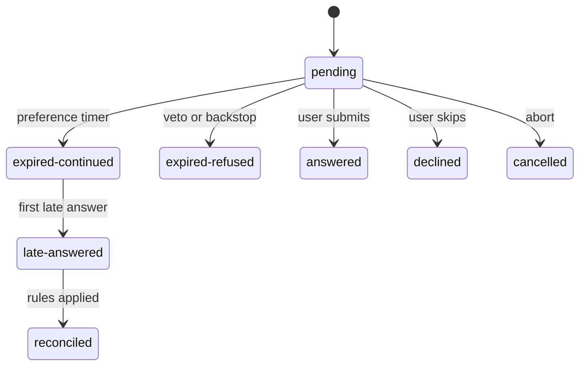

# ADR-077：偏好问题到点按默认继续，迟到回答仍送达

- 状态：**草稿·待爸拍板**
- 单号：N-ASKUSER-TIMED-CONTINUE
- 基线：`origin/main@9d459282dd19`
- 相关：ADR-075（前台 run 的 parked 是 `waiting` + 中断原因，与本题的 24 小时停车兜底不是同一个词）、N-STOP-ALWAYS-PARK、N-RESUME-STOP-STATUS-FLIP、N-ASKUSER-REPEAT-REPLAY（同 run 回放缓存，已在基线上）、N-ASKUSER-ORDERFLIP、N-ASKUSER-STEPWISE

已拍板、本文不再开口：审批与不可逆动作确认到点只安全拒绝，超时不等于批准；只有偏好或缺失信息可以按假定默认继续；默认可等到 10 分钟，模型可传 1–60 分钟，越界钳制并在工具结果里写明；迟到的偏好答案以插话送达，并与已经按假定做过的工作对账。

## 术语

| 词 | 含义 |
|----|------|
| 偏好题 | 配色、语气、章节取舍这类缺失信息。到点可以按假定默认继续 |
| 审批形 | 删除、支付、发送、发布、批准，以及任何会被运行时否决成「超时不得当成同意」的问句。含成本确认 |
| 计时继续 | 偏好题的短计时先到：工具调用返回，运行继续，`awaitingUserInput` 不置位 |
| 假定默认 | 单选的推荐项，否则第一项。多选见「本稿自行取舍」 |
| 问句未答冻结 | `ToolAttemptTrace.awaitingUserInput`。置位后非 read 工具被拦，只放行 `AskUserQuestion` |
| 停车兜底 | 有交互界面时 `INTERACTION_TIMEOUTS.PARKED_APPROVAL`（24 小时）后的安全拒绝。不是 ADR-075 的 parked run |
| 插话 | `runtimeInput.mode = 'supplement'` 的用户消息，带 `RUNTIME_INPUT_SUPPLEMENT_LINE`。不是改道 |
| 问题记录 | 挂在已落库消息 `metadata` 上的结构化结算。真源不是内存里的过期 id 表 |
| 对外效果 | `isExternalSideEffectTool` 为真的调用，加上已经发生的扣费和已经执行完的审批写 |

## 现状锚点

基线 `9d459282dd19`。锚点是这个树上 `git grep -n` 的行号。

| # | 事实 | 锚点 |
|---|------|------|
| 1 | `promptUserInChat` 在无交互界面且无语音/手机路由时直接 `no-renderer`。有交互界面时定时器是 `PARKED_APPROVAL`，到期 `reject` 的消息是 `parked-timeout`。没有交互界面但有路由时，定时器是 `opts.timeoutMs ?? USER_QUESTION`，到期消息是 `timeout` | `userQuestionPrompt.ts:99` `promptUserInChat`；`:121-123`；`:128`；`:130-140`；`:141-146` |
| 2 | `USER_QUESTION` 为 300_000（5 分钟），`PARKED_APPROVAL` 为 86_400_000（24 小时）。注释写明 24 小时用于无人值守与语音派停车审批 | `timeouts.ts:82` `USER_QUESTION`；`:89-93` `PARKED_APPROVAL` |
| 3 | `PromptUserOptions.timeoutMs` 只声明覆盖无交互界面路径。`executeAskUserQuestion` 调用时不传它。入参 schema 没有期限字段 | `userQuestionPrompt.ts:50-54` `timeoutMs`；`askUserQuestion.ts:121-128`；`askUserQuestion.schema.ts:12-54` |
| 4 | 到期同时 `cancelRegisteredUserQuestion(..., {outcome:'expired'})` 与 `markDecisionRequestExpired`。之后的应答进 `settleUserQuestionResponse`，pending 已空则只调 `notifyIfLateDecisionResponse`。答案正文不进代理 | `userQuestionPrompt.ts:132-134`、`:142-144`、`:72-76` `settleUserQuestionResponse` |
| 5 | 过期 id 在进程内 `Map`，上限 `MAX_EXPIRED_REQUESTS` 200，提示一次后删除。通知码 `interaction_response_expired`，toast 文案是「已经按规则处理，这次迟到的应答未生效」 | `userDecision.ts:6` `MAX_EXPIRED_REQUESTS`；`:41`；`:49-55`；`:62-68` `notifyIfLateDecisionResponse`；`AgentNoticeToast.tsx:44`；`notices.ts:93` |
| 6 | 工具超时返回 `ok:false`、`USER_INPUT_TIMEOUT_CODE`、`meta.awaitingUserInput:true`。无界面返回 `ok:true` 且同样置位。用户跳过返回 `ok:true`，不置位 | `askUserQuestion.ts:130-139`；`:144-153`；`:155-164`；`userDecision.ts:4` `USER_INPUT_TIMEOUT_CODE` |
| 7 | `meta` 在执行器里抄进 `metadata`。`ToolAttemptTrace.finish` 见到 `metadata.awaitingUserInput === true` 就置位，只置真。`reset` 在 `resetRepairGate`，每条用户消息和 run 起点各清一次 | `toolResolver.ts:184`、`:190`；`toolAttemptTrace.ts:54` `reset`；`:69` `finish`；`toolExecutionEngine.ts:131-133` `resetRepairGate`；`agentLoop.ts:340`；`conversationRuntime.ts:828` |
| 8 | 冻结判断在 `shouldFreezeNonReadWhileAwaitingUser`：非 read 且不是 `AskUserQuestion` 则拦截，并注入 `AWAITING_USER_FREEZE_NOTICE`。台账写的 639 行在本基线上是空行，判断在 641 | `toolAttemptTrace.ts:9` `shouldFreezeNonReadWhileAwaitingUser`；`:25` `AWAITING_USER_FREEZE_NOTICE`；`toolExecutionEngine.ts:641`、`:649-651` |
| 9 | 跳过文案要求按已有信息继续、采用合理默认、写明假设、不要再问同一题。推荐标记来自 `recommended` 或标签后缀 `(推荐)` / `(Recommended)`。卡片上的推荐项只拿焦点，不写入答案 | `src/shared/contract/askUserQuestion.ts:22` `ASK_USER_QUESTION_DECLINED_OUTPUT`；同文件 `:7`、`:13` `normalizeUserQuestionOption`；`UserQuestionCard.tsx:236` |
| 10 | `promptUserInChat` 的生产调用方还有成本确认和语音协调器两处。成本确认只有明确点到确认文案才返回 true。语音两处非 `answered` 直接 return，不做后续动作 | `generationCostConfirm.ts:47` `promptUserInChat`；`:53-56`；`voiceAgentCoordinator.ts:1133`、`:1138`；`:1296`、`:1301` |
| 11 | 手机卡是 pending map 的投影。`offer` 登记，`cancel` 删除并 `settle`。`expired` / `cancelled` 把手机状态收成 `closed`。`respond` 要求状态仍是 `pending` 且 `offered` 里还有回调 | `CompanionQuestionService.ts:21`；`:36` `offer`；`:44` `cancel`；`:86` `settle`；`:112` `respond` |
| 12 | 语音念题路由同样挂在 `registerUserQuestionRoute`。`cancelVoiceQuestion` 只按 requestId 清掉正在念的题，不看 settlement | `voiceLiveCapability.ts:38-41`；`voiceQuestionBridge.ts:167` `offerVoiceQuestion`；`:200` `cancelVoiceQuestion` |
| 13 | loop 轮把 `AskUserQuestion` 与 `ask_user_question` 放进 `deniedToolNames`。子代理禁用名单含这两个名字。`unattendedTurn` 时 `filterToolsByRunPolicy` 把它们从工具面拿掉。`src/host/cron/` 下没有这两个名字 | `loopController.ts:520`；`spawnGuard.ts:1233` `SUBAGENT_DISABLED_TOOLS`、`:1242`；`toolRunPolicy.ts:29` `filterToolsByRunPolicy`、`:37-41`；`src/shared/constants/tools.ts:92` `ASK_USER_QUESTION_TOOL_NAMES` |
| 14 | 实时通话的主 run 隐藏 `requiresUserPresence` 工具；语音派出的 auxiliary run 放行 AskUserQuestion 两个别名。schema 上 `requiresUserPresence: true` | `askUserQuestion.schema.ts:61`；`toolDefinitions.ts:421` `getUserPresenceToolNames`；`routingToolPolicy.ts:89-97` `buildLiveVoiceToolDenylist`；`agentOrchestrator.ts:912` `assembleTurnDenylist` |
| 15 | cron/heartbeat 的审批停车走 24 小时兜底；跑完用 `takeUnattendedApprovalTimeout` 取原因码。这是审批终态，不是问句 | `unattendedApprovalTerminal.ts:7` `noteUnattendedApprovalTimeout`；`cronService.ts:866`、`:922` |
| 16 | 运行中的用户插话有两条：`ConversationRuntime.steer` 注入用户消息并重新推理；`SteerRejectedError` 在 run 已结算时抛出。`steerOrQueue` 接住这个错误，把原话写入 `queued_inputs`，成为下一回合 | `conversationRuntime.ts:95` `SteerRejectedError`；`:1191` `steer`；`:1199`；`steerQueueFence.ts:152` `steerOrQueue`；`:169-189`；`src/host/services/core/database/schema.ts:1086` `queued_inputs` |
| 17 | `steer` 调用 `abortInference`，不调用 `abortRun`。工具的中止父信号是 `runAbortController`，因此这次中止不取消已发出的工具。`interruptAndContinue` 会发「正在调整方向」 | `conversationRuntime.ts:1207-1209`；`controlState.ts:61` `abortInference`；`toolExecutionEngine.ts:779`；`agentOrchestrator.ts:373` `interruptAndContinue` |
| 18 | 补充与改道是两句现成指令。主 run 在 `runtimeInput.mode` 为 `supplement` 时注入补充句。手机普通消息已经用 `steerOrQueue` 加 `runtimeInputMode: 'supplement'` | `runtimeInput.ts:5` `RUNTIME_INPUT_SUPPLEMENT_LINE`；`:8` `RUNTIME_INPUT_REDIRECT_LINE`；`workbenchTurnContext.ts:168-174`；`companionMessageSend.ts:5` `steerOrQueueCompanionMessage`、`:19` |
| 19 | 同 run 回放缓存是进程内 Map，键含 sessionId 与 runId，上限 200，`finalizeRun` 按 run 清除。回放的是上次工具输出，不区分「用户答的」和「假定的」 | `askUserQuestionReplay.ts:57` `lookupAskUserQuestionReplay`；`:67` `recordAskUserQuestionAnswer`；`:81` `clearAskUserQuestionReplay`；`runFinalizer.ts:331` `clearAskUserQuestionReplay` |
| 20 | 消息 `metadata` 列已经会落库。对外效果的现成判据是 `isExternalSideEffectTool`（native 名单现仅 `mail_send`，加一批 IM 发送）。它不改变审批放行 | `cliDatabaseSchema.ts:102-104`；`externalSideEffect.ts:28` `EXTERNAL_SIDE_EFFECT_TOOLS`；`:68` `isExternalSideEffectTool`；`toolReplaySafety.ts:28` |
| 21 | 问句卡的答案在最后一步经 `USER_QUESTION_RESPONSE` 一次提交。消息流记录只认跳过前缀和 `User responses:` | `UserQuestionCard.tsx:193` `respond`；`:209` `handleSubmit`；`askUserQuestionRecord.ts:67` `buildAskUserQuestionRecord` |
| 22 | `withApprovalTrace('ask_user')` 包住整段等待。结果对象上没有 `approved` 字段时，span 被记成 resolved | `userQuestionPrompt.ts:127` `withApprovalTrace`；`telemetryService.ts:570` `withApprovalTrace`；`:600-606` |

## 时序

```mermaid
sequenceDiagram
  participant Model
  participant Ask as AskUserQuestion
  participant Prompt as promptUserInChat
  participant Card as QuestionCard
  participant Loop as AgentLoop
  Model->>Ask: preference question
  Ask->>Ask: class allows timing
  Ask->>Prompt: onExpiry continue
  Prompt->>Card: USER_QUESTION_ASK
  Note over Prompt: short timer fires first
  Prompt-->>Ask: expired-continued
  Ask-->>Loop: result without awaitingUserInput
  Loop->>Loop: later tools run under the assumption
  Card->>Prompt: late USER_QUESTION_RESPONSE
  Prompt->>Loop: supplement after in-flight tools commit
  Loop->>Model: reconcile
```

模型发出一张偏好卡。分类通过后，`executeAskUserQuestion` 才把 `onExpiry: 'continue'` 传给 `promptUserInChat`。短计时先到时，工具调用以计时继续返回，循环接着跑，随后的工具在假定默认之下执行。用户之后的答案走原来的 `USER_QUESTION_RESPONSE`。它不再结算已经结束的那次工具 Promise，而是在已发出的工具结果落进历史之后，作为补充插话进入下一次推理。模型按对账规则处理已经做完的工作。

审批形、没有可辩护默认、无界面，都不走这条返回。它们仍以今天的拒绝或无界面结果结束，并置上问句未答冻结。

卡片是否显示剩余时间、到期那句用户文案怎么写，见文末 Decision needed，不在这张图里当成已定。

## 问题记录的状态



`pending` 只存在于工具调用还没返回的时候。用户提交进 `answered`，跳过进 `declined`，运行取消进 `cancelled`。这三态今天就有，计时继续不改变它们。

`expired-continued` 只从可计时的偏好题来：短计时获胜，假定默认写进工具结果，运行已继续。第一条迟到答案进 `late-answered`，对账消息被模型看到之后进 `reconciled`。第二条答案不再改状态，只给用户一行「已经收下」。

`expired-refused` 来自三类：运行时否决（审批形）、没有可辩护的默认、以及短计时没有结算时 24 小时兜底获胜。这三态的结局都是今天的安全拒绝加冻结。此后的点击不进入 `late-answered`，不把正文送进代理。

同一 requestId 的结算是同步临界区：定时器回调和 `settleUserQuestionResponse` 都在第一个 await 之前改完 pending。先进入的一方获胜。不会出现「工具已按默认返回，同时又被当成及时回答」。

## 哪类问题可以到点继续

分类在 `executeAskUserQuestion` 发问前做完。名称施工时可改，下面三步的合同不能改。运行时可以否决模型。

1. 模型可选声明 `decisionClass`：`preference` 或 `approval`。不传不等于审批，也不等于「不要计时」。
2. 运行时否决优先。下面任一成立，就是审批形，`expiryMinutes` 被忽略，问题按今天的停车路径走：
   - `decisionClass` 为 `approval`
   - header、question、各 option 的 label 做 NFKC 后拼接，命中中文 `/(?:确认|是否).{0,16}(?:删除|清空|覆盖|支付|付款|扣款|扣费|购买|发送|发布|批准|授权)/`
   - 同一拼接命中英文 `/\b(?:delete|pay|charge|approve|publish)\b/i`，并且选项标签里同时有肯定侧与否定侧
   - 选项标签里同时有 {删除, 支付, 付款, 扣费, 批准, 发布, 发送} 之一和 {取消, 保留, 拒绝} 之一
3. 剩下的题里，多选且没有任何推荐项：没有可辩护的默认，不计时，走今天的拒绝加冻结，但原因不是审批。单选，或多选里至少有一个推荐项：可以计时。

option 的 description 不参与拼接。schema 已写「只问分支、不要收集审批字段」（`askUserQuestion.schema.ts:10`）。这句话给模型看，不是安全边界。边界是上面的否决。

否决发生在发问前。有交互界面时仍用 24 小时兜底，然后安全拒绝并冻结。没有交互界面、只有语音或手机路由时，维持今天的 5 分钟，然后安全拒绝并冻结。用户卡上不显示倒计时。结算时的工具结果加一句：计时继续已否决，原因是审批形或没有可辩护的默认；超时不是批准。

模型把审批标成可计时：第 2 步照样否决。推荐标记打在「删除」上也不采用。

偏好例。问句「幻灯片主色用哪套？」，header「主色」，选项「墨蓝 (推荐)」「暖灰」，不传 `expiryMinutes`。文本不命中否决。10 分钟后假定「墨蓝」（后缀去掉，`recommended` 为真）。返回 `ok: true`，不带 `awaitingUserInput`。代理可以继续改本地稿。

审批例。问句「确认删除生产库里的订单表吗？」，header「删库」，选项「删除 (推荐)」「保留」，`decisionClass: 'preference'`，`expiryMinutes: 10`。文本同时含「确认」和「删除」，并且选项是「删除 / 保留」。否决。有界面则停到 24 小时，然后 `ok: false`、`USER_INPUT_TIMEOUT`、`awaitingUserInput: true`，非 read 工具被冻住。迟到的「删除」不是批准。

无默认例。问句「这次要同时改哪些章节？」，`multiSelect: true`，选项「开头」「中段」「结尾」，都没有推荐标记。不计时。第一项不是一份完整答案。

成本确认不进入这个分类。`confirmGenerationCost` 继续只有点中确认文案才返回 true（`generationCostConfirm.ts:53`）。`confirmAction`、权限卡、工作流启动确认、MCP 授权都不加 `onExpiry`。

## 期限

工具入参顶层增加可选数字 `expiryMinutes`，与 `questions` 并列，不进每一题。一张卡一个期限。schema 不写 minimum / maximum：越界要钳制并写进工具结果，不能被现有 schema 门挡成参数错误。

可计时且未传、或传入的不是有限数字：用 10 分钟。传入的有限数字先向零取整，再钳到 1–60。取整或钳制改变了原值时，工具结果带一行 `[expiry] requested <原值>, clamped to <使用值>.` 用户在时限内答完，这行也要出现，否则模型看不到钳制。无界面回退的 output 前缀已进夜跑库，一字不改；期限未生效只留在 meta。

三条计时并存的方式：

| 路径 | 短计时 | 24 小时兜底 | 5 分钟 |
|---|---|---|---|
| 可计时偏好，有交互界面 | 使用值。先到则计时继续，并取消兜底 | 武装。只有短计时没有结算时才获胜，获胜是安全拒绝加冻结 | 不用 |
| 可计时偏好，无交互界面但语音或手机已把卡递出 | 使用值，替换今天的 5 分钟 | 不加。这条路径今天就没有 24 小时 | 不用 |
| 审批形或无默认，有交互界面 | 不武装 | 今天的 24 小时，然后安全拒绝 | 不用 |
| 审批形或无默认，只有语音或手机路由 | 不武装 | 不加 | 今天的 5 分钟，然后安全拒绝 |
| 无路由 | 不武装 | 不武装 | 不武装。立即 `no-renderer`，output 不变，冻结保持 |

常量进 `INTERACTION_TIMEOUTS`：默认 600_000、下限 60_000、上限 3_600_000。业务代码不写这三个字面量。

`promptUserInChat` 增加 `onExpiry`，缺省 `refuse`，行为与今天相同。只有分类结果为可计时才传 `continue`，并带上已经算好的假定默认和毫秒数。成本确认与语音协调器的两处调用不传。

## 到期之后运行怎么继续

计时继续的工具结果：

- `ok: true`
- output 以新常量 `ASK_USER_QUESTION_TIMED_CONTINUE_OUTPUT` 开头，语义与跳过文案同一族：按下面的假定默认继续，在回复里写明假设，不要再问同一题；稍后可能有补充插话，须对账；这不是任何不可逆动作的批准
- 紧接着 `Assumed default:` 和 `[header]: 标签` 行，再是 `Deadline: <使用的分钟> minutes.`
- 有钳制时加 `[expiry]` 行
- 再回显原问句，便于插话引用
- meta 带 `assumedDefault`、`expiryMinutesUsed`、钳制前后的值。不带 `awaitingUserInput`，不带 `permissionDecision: 'deny'`

这串 output 不得以 `ASK_USER_QUESTION_DECLINED_OUTPUT` 开头，否则消息流记录会把它画成跳过。`buildAskUserQuestionRecord` 增加 kind `timed-continued`。以 `[expiry]` 或 `Assumed default:` 开头的行不得并进上一题的答案正文。用户及时答完时，output 仍以 `User responses:` 开头，钳制行用同样的 `[expiry]` 前缀，解析在这个前缀处停下。

`ToolAttemptTrace.finish` 只在 `metadata.awaitingUserInput === true` 时把冻结置真（`toolAttemptTrace.ts:69`）。计时继续不置这个字段，所以 `shouldFreezeNonReadWhileAwaitingUser` 保持假，`AWAITING_USER_FREEZE_NOTICE` 不注入。代理可以调用本 run 现有 denylist、allowlist 和权限档已经允许的全部工具，包括 write 和 execute。不新增第二套冻结，也不新增放行名单。

冻结留在两条旧路径上：审批形或无默认的超时（`ok: false` 加该字段），以及 `no-renderer`（`ok: true` 加该字段）。计时继续不会把已经置上的冻结清掉。`reset` 仍只发生在下一条用户消息和 run 起点。同一 run 里先超时拒绝、后计时继续，后面的工具仍被冻住。

后到的权限卡、成本确认、`canUseTool` 都不因这次返回而放行。`permissionClassifier` 不改。假定默认不是批准。

假定期间的写需要标记，不是额外的门。从这条工具结果落库起，到对账完成或 run 结束，每个后续工具结果的 metadata 写上 `underAssumedDefaultRequestId`。问题记录里留这些 toolCallId。标记用来对账，不参与放行。

同 run 再问字面相同的题：把计时继续的 output 写入现有回放缓存，避免再开一张卡、再武装一个计时。缓存值要能看出这是假定不是用户答案。迟到的真答案到达后，用 `User responses:` 那份替换缓存。`clearAskUserQuestionReplay` 仍在 run 结束时清缓存，不清消息 metadata。

## 迟到回答怎么送达

只处理状态为 `expired-continued` 的记录。审批形和无默认的迟到点击保持今天的 toast，正文不进代理。送进去会被当成补发的同意。

通道用现成的 `steerOrQueue`，不用新的 IPC。`USER_QUESTION_RESPONSE` 已经带 requestId 和答案。`settleUserQuestionResponse` 在 pending 缺失时先查问题记录：命中 `expired-continued` 且还没有收下过，就走插话；否则才是今天的 `notifyIfLateDecisionResponse`。

插话的形状与 `steerOrQueueCompanionMessage` 相同：`workbench.runtimeInputMode = 'supplement'`，`runtimeInput.mode = 'supplement'`。这样主 run 注入 `RUNTIME_INPUT_SUPPLEMENT_LINE`，不注入改道句。不走 `interruptAndContinue`，避免「正在调整方向」和改道回执。

正文至少包括：requestId、每一题的 header 和原问句、当时的假定默认、用户现在的答案、从发问时间戳到回答时间戳的毫秒数。对账三句写在同一条正文里，见下一节。

次序：回答到达时记下 `getActiveToolNames` 里的 toolCallId。调用 `abortInference`，让模型不要再派新的工具。不调用 `abortRun`，已发出的工具继续跑完（它们的父信号是 run 控制器，`toolExecutionEngine.ts:779`）。这些 id 全部离开 active 集合、结果已经进历史之后，再 `injectSteerMessage` 并把补充放在这些结果后面，然后 `requestReinference`。模型不会先看见答案、后看见一条按旧默认执行的结果，也不会改写已经发出的参数。

run 已经结算，或等待期间变成结算：`steer` 抛 `SteerRejectedError`，`steerOrQueue` 把同一正文写入 `queued_inputs`，下一回合作为用户消息派出。这就是 run 结束后的新回合。`TURN_CHANGED` 同样进这个队列，不丢正文。

`conversationRuntime.ts`、`agentOrchestrator.ts`、`messageProcessor.ts` 都已超过 1000 行。等待和组包放在新小模块里。按 sessionId 取当前 orchestrator 的方式与 `cronService.ts:828` 相同，再把插话交给 `steerOrQueue`。这三个文件若必须接一条委托，同一刀里删掉至少同样行数，净增为零。不改 `steer` 现有的「立刻中止推理并马上插入」语义。用户亲手改道仍走原来的 `steer`。

问题记录写在持有该工具调用的助手消息的 `metadata` 上。列已经存在（`cliDatabaseSchema.ts:102-104`）。字段：requestId、sessionId、toolCallId、askedAt、expiresAt、使用的分钟数、钳制前的值、class、state、各题 header 与问句与假定标签、迟到答案、`underAssumedDefault` 的 toolCallId 列表、是否已收下。渲染进程重载和宿主重启都能从这条消息读回。内存里的过期 id 表不存问句、不存答案、提示一次就删，不能当记录。

不写入 `pending_approvals`。那是审批收件箱，偏好题放进去会把超时画成批准。不新建表。

记录的更新先于插话。宿主若在插话发出前退出，重开会话时 state 已是 `late-answered` 而还不是 `reconciled`，下一次 run 开头补上同一条正文。`queued_inputs` 负责「下一回合一定能看到」；消息 metadata 负责「对账对象还在」。

发问后、工具还没返回时，记录还不能放进工具结果消息。这段时间宿主进程还在，pending map 仍在。渲染进程重载时，对已连接的窗口重发一次现有的 `USER_QUESTION_ASK`（带上 `expiresAt`），不新开通道。宿主在工具返回前崩溃，这次提问随 run 恢复走 ADR-075，本文不另做一张表。

找不到记录、又不是审批形迟到点击时：把用户原文作为新的用户回合送出，并写明对不上某次假定。不弹完 toast 就丢掉正文。

回放缓存与记录的去重：插话之前先替换本 run 的缓存项。run 结束后缓存已清，下一回合只靠插话正文，不靠缓存。同一 requestId 只插话一次。

## 对账

插话正文里的三句，模型必须照做。

答案与假定默认按 header 相同（多选忽略顺序）时，只告诉用户已经按这个默认在做，不重做。

答案不同，且标记列表里的工具都不是对外效果时，重做受影响的本地修改，并说明改了什么。本地文件编辑属于这一类。`mail_draft` 不在 `isExternalSideEffectTool` 名单里，也属于这一类。

答案不同，且任一标记工具是 `isExternalSideEffectTool`，或费用已经扣下，或一张审批卡已经被同意并且写已经执行完时：停下来，说明已经发出去的是什么，问用户怎么处理。不自动再调用那个工具，不自动撤回。迟到答案本身也不是下一张审批卡的同意。卡若还挂着，仍由用户点。

三例：

1. 假定「墨蓝」，用户后来也选「墨蓝」。代理补一句已经按墨蓝在做。不改文件。
2. 假定「墨蓝」，代理已经改了工作区里的样式文件。用户改口「暖灰」。代理再改这个文件，并写明从墨蓝改到暖灰。
3. 假定「用邮件发周报」，代理已经调用 `mail_send` 并且信已发出。用户改口「改放文档」。代理不发第二封信，也不把改口当成撤回。它停下来说明信已经出去，问下一步。本地若只存了草稿，按例 2 改草稿。

## 手机、语音、无人值守

到期前，手机卡仍是今天的 pending 投影，preview 为问句 JSON。可计时的卡在 `USER_QUESTION_ASK` 上多一个 `expiresAt`，preview 里带上假定默认的标签，使用户能看见「不到点会按哪一项继续」。

可计时而且已经 `expired-continued`：不把手机决策收成 `closed`。`UserQuestionSettlement.outcome` 增加 `expired-continued`。`CompanionQuestionService.cancel` 见到这个 outcome 时保留 `pending`，重写 preview，不再调用原来的工具 Promise。之后的 `respond` 走迟到插话。第一份答案收下。状态不再是 pending 的第二份按今天的 `approval_conflict` 处理，并给用户一行已收下，不第二次插话。

审批形和无默认：仍 `cancel(..., {outcome:'expired'})`，手机状态 `closed`。再点不构成批准，toast 用现有的 `interaction_response_expired`。

语音念题在到期时照今天 `cancelVoiceQuestion` 停掉。到期后的下一句语音不自动当成该题答案。迟到回答走桌面卡、手机卡，或已经变成的用户文字回合。原因：语音匹配只接受能唯一对应到选项的句子，到期后的下一句经常是别的指令。

语音协调器里「排队还是替换」和「停哪件 / 改哪件」两处 `promptUserInChat` 不传 `onExpiry`。替换和点名都会作用到正在跑的任务，没有可辩护的默认。今天非 `answered` 就是什么都不做，保持这样。

实时通话的主 run 仍由 `buildLiveVoiceToolDenylist` 拿掉 AskUserQuestion。语音派出的 auxiliary run 可以提问，分类和计时与桌面同一套；念题到期即停，卡留下给迟到回答。

无人值守不使用计时继续。loop 的 denylist、子代理禁用名单、`unattendedTurn` 的工具面过滤，已经让这些轮叫不到 AskUserQuestion。`src/host/cron/` 没有这个工具名。cron 的 24 小时是审批停车。这些轮没有可以晚一点来改口的人。若在这里按默认继续，会在无人看管时把假定做成对外动作。工具保持不在面上。即便调用漏进执行器，无路由结果仍是 `no-renderer` 加冻结，不解释成计时继续。

## 用户看见的一行字，以及遥测

文案进 `src/renderer/i18n/`，这里只定用户看见的那一句。倒计时是否出现见 Decision needed。

- 等待中的可计时卡，若产品选择显示期限：剩余时间用分钟，不用秒。
- 到期后的卡：写明已按哪一个标签继续，并且现在还能改。
- 消息流里的计时继续记录：与跳过记录分开，写明假定的标签。
- 审批形迟到点击：保持「{kind}已经按规则处理，这次迟到的应答未生效。」
- 同一题的第二份迟到答案：「已经收下。」

遥测只加属性，不新造通道。`approval:ask_user` 的 span 按状态写 `answered`、`declined`、`expired-continued`、`expired-refused`、`no-renderer`、`aborted`。计时继续不得因为结果对象没有 `approved: false` 就被记成批准（今天 `telemetryService.ts:600` 会这样）。另计：运行时否决次数、钳制次数、插话送达、重复答案、审批形迟到被挡住。

## 方案对照

| | A 到期后留着 pending，迟到仍结算它 | B 到期就关掉，迟到当普通插话 | C 工具调用关掉，问题记录留下 |
|---|---|---|---|
| 迟到还能对上原题 | 能，只要进程还在且条目没被 200 上限挤掉 | 靠客户端自己引用标题。重启后若引用没写全，对不上假定默认 | 能。记录在已落库的消息 metadata 上，按 requestId 查找 |
| 重启之后 | 不能。pending 和过期表都在进程内存 | 工具输出若已落库，下一回合还能看见字符串，但没有结构化状态 | 工具一旦返回，记录随消息在。未返回就崩溃的，仍交给 ADR-075 |
| 手机 | 必须不把卡收成 closed，否则 `respond` 今天会冲突 | 卡已经关闭，没有条目可答，还是要加一条特殊路径 | 卡保持可答，`respond` 进同一条插话 |
| 对冻结的波及 | 改的是共享的 `promptUserInChat`。开关默认 `refuse` 时成本确认不变；默认写错就会把超时变成继续 | 交互界面今天忽略 `timeoutMs`，10 分钟仍要改共享函数。冻结本身只看工具结果里的字段 | 与 A 一样改共享函数，但默认 `refuse`。冻结只看结果字段，计时继续不置位 |
| 测试量 | 共享等待的现有用例都要证明默认仍是拒绝，再加留条目的迟到路径 | 看起来小，手机和重启各要补一块，最后和 C 的记录重复 | 分类与结果形状、插话、手机三块可以分开钉 |

A 把「答案还能送到」绑在已经证明会丢正文的内存表上。B 在手机 `respond` 和重启后的对账上仍然需要同一份记录，省不下那一块。C 让工具调用返回（运行继续、冻结不置位），把对账对象放进已经会落库的消息 metadata，送达复用 `steerOrQueue` 和 `queued_inputs`。

推荐 C。选择本身见 Decision needed [顺序]。

不改 `permissionClassifier`、`canUseTool`、权限卡流程。不新增 IPC：`USER_QUESTION_RESPONSE` 能把迟到答案送回宿主，`AGENT_NOTICE` 能对审批形弹出现有 toast，`steerOrQueue` 能在 run 还活着时插话、结算后写入 `queued_inputs`。

## Decision needed [顺序]

选项：

1. A。到期后保留 pending 条目，迟到答案仍结算该条目再转给代理。
2. B。到期关闭工具调用，迟到答案当成普通插话，不保留结构化记录。
3. C。到期关闭工具调用；问题记录写在消息 metadata；迟到答案走 `steerOrQueue` 的补充插话，run 已结算则进 `queued_inputs`。

推荐：C。迟到答案要对上假定默认和已经做完的工具，这份状态必须活过渲染进程重载，而现有过期表做不到。

## Decision needed [产品口径]

到期时用户看见的那一句。

选项：

1. 「你还没选。已先按「{label}」继续，回来可以改。」
2. 「等待已结束，已按「{label}」做完。你现在的选择会覆盖它。」
3. 「已跳过这个问题。」

推荐：1。它写出假定的标签，并说明还能改。第 2 句把可能还在跑的工作说成做完。第 3 句和今天的跳过分不开。

## Decision needed [产品口径]

可计时的卡要不要显示剩余时间。

选项：

1. 不显示。只有到期时换成上一块选定的那句。
2. 显示剩余分钟，数字按分钟变化，不按秒跳动。
3. 按秒倒计时。

推荐：2。用户需要知道不选会按哪一项、大约何时开始。秒级倒计时把一道可以离开的偏好题变成催促。

## Decision needed [默认值]

10 分钟要不要进设置。

选项：

1. 不进设置。默认 10 分钟只放在 `INTERACTION_TIMEOUTS`，模型仍可在 1–60 分钟内覆盖。
2. 设置里一个分钟数，自身钳在 1–60，模型传入后再钳一次。
3. 设置里只有开和关。开着时固定 10 分钟。

推荐：1。10 分钟已经拍板。设置项要另做持久化和文案，不改变「人离开时这一问不再卡住整轮」。

## 施工刀拆分建议

1. 工具入参、分类否决、短计时和计时继续的结果形状。范围：`expiryMinutes` 与 `decisionClass`、`onExpiry` 缺省拒绝、可计时才继续、结果不置 `awaitingUserInput`，并让消息流解析认得新前缀。主文件：`askUserQuestion.schema.ts`、`askUserQuestion.ts`、`userQuestionPrompt.ts`、`src/shared/contract/askUserQuestion.ts`、`timeouts.ts`、`askUserQuestionRecord.ts`，外加一个纯函数文件放否决规则。钉住的测试：偏好例返回继续且 meta 无 `awaitingUserInput`；审批例即使带 `expiryMinutes` 和 `(推荐)` 仍是 `USER_INPUT_TIMEOUT` 且置位；无推荐的多选同样拒绝；90 钳成 60 且结果含 `[expiry]`；`confirmGenerationCost` 超时仍为 false；无界面 output 前缀不变。反向变异：拿掉审批形否决后，审批例会返回计时继续，该断言变红。依赖：无。这刀先落地。

2. 迟到插话、对账正文、消息 metadata 记录、回放缓存替换。范围：`expired-continued` 的第一条答案在在途工具落结果后以 supplement 注入；run 已结算则进 `queued_inputs`；记录随工具结果消息落库；真答案替换假定缓存。主文件：`userQuestionPrompt.ts`、新的小模块、`askUserQuestionReplay.ts`、消息 metadata 的现有写入点。`conversationRuntime.ts`、`agentOrchestrator.ts`、`messageProcessor.ts` 已超过 1000 行，这刀不给它们净增行。钉住的测试：继续之后的 `USER_QUESTION_RESPONSE` 产生一条含原问句、假定默认和用户答案的 supplement，且排在快照里的工具结果之后；`isSettled` 时写入 `queued_inputs` 而不是只发 toast；第二条不产生第二条正文；审批形迟到不产生 supplement。反向变异：删掉正文中的用户答案字段，第一条测试变红。依赖：刀 1。

3. 手机卡在计时继续之后仍可答。范围：`expired-continued` 保持 pending 并改 preview；审批形仍 closed。主文件：`hostCapabilityPorts.ts` 的 `UserQuestionSettlement`、`CompanionQuestionService.ts`。钉住的测试：继续结算之后手机 `respond` 仍 accepted，并走到刀 2 的插话；`expired` 结算之后 `respond` 不是 accepted。反向变异：继续路径也调用 `outcome: 'expired'` 的 cancel，前一条测试变红。依赖：刀 1、刀 2。

4. 渲染文案和重载后的卡。范围：按已拍板的两块产品口径显示等待句或到期句；kind `timed-continued` 的消息流记录；渲染进程重载时重发仍在 pending 的 `USER_QUESTION_ASK`，并从消息 metadata 恢复 `expired-continued` 的卡。主文件：`src/renderer/i18n/userQuestion.ts`、`UserQuestionCard.tsx`、`askUserQuestionRecord.ts`、重发所在的现有窗口连接处。钉住的测试：继续 output 解析成 `timed-continued` 而不是 declined；i18n 含拍板后的那一句；重载夹具里 pending 请求会再收到一次 `USER_QUESTION_ASK`。反向变异：删掉这句 i18n，文案断言变红。依赖：刀 1。文案的具体句子依赖两块产品口径拍板；拍板前用 Decision needed 里的推荐句做夹具，拍板后只改词条。

5. 分类边界的契约夹具。范围：只锁模型可见的 output，不再改行为。偏好例含计时继续常量且不含冻结字段；删库例含否决句且含 `USER_INPUT_TIMEOUT`；无推荐多选例走拒绝不走继续。主文件：`tests/unit/tools/modules/planning/` 下的契约测试，生产代码不改。钉住的测试就是这三个夹具。反向变异：把删库例的期望改成计时继续常量，测试变红（期望写错时）——施工时反向变异应改生产否决而不是改期望：暂时让否决函数对「删除」返回可计时，删库夹具变红，再改回。依赖：刀 1。可与刀 2 并行。

## 本稿自行取舍

- 审批形在「没有交互界面、只有语音或手机路由」时维持 5 分钟后安全拒绝，不抬到 24 小时。24 小时只描述有交互界面的兜底。任务书要求写明台账里的 24 小时只对交互路径成立，并且不许改审批流。
- 多选没有推荐项时不计时。多选有推荐项时，假定默认是全部推荐项，不是第一项。单选有多个推荐项时，取列表顺序中的第一个。这是「没有可辩护的默认」在多选上的最小解释；单选仍遵守「推荐项，否则第一项」。
- 非整数向零取整后再钳制。schema 不设 minimum / maximum。
- 否决偏严。误伤的结果是多等用户，不是按默认去做删除或发送。description 不参与匹配，避免「不会删除」这类说明触发否决。
- 可计时偏好在有交互界面时，短计时与 24 小时兜底同时武装。兜底只有在短计时没有结算时生效，并且结局是安全拒绝加冻结。
- 一张卡一个期限。向导中途已经点过、但还没经 `USER_QUESTION_RESPONSE` 提交的选择，宿主看不到，不猜测。到期后整卡按假定默认继续，用户用迟到回答改口。不为此新开 IPC。
- 假定默认永远不是「其他」输入框。
- 语音念题到期即停，不把后一句语音自动当成答案。
- 审批形和无默认的迟到正文不进代理，只保留现有 toast。计时继续的迟到正文必须进代理。前者若送进去，会破坏「超时不等于批准」。
- 及时 `answered` 之后的第二次提交只提示已收下，不再插话。
- 问题记录放在消息 `metadata`，送达队列复用 `queued_inputs`。不新建表，不写 `pending_approvals`。
- 无界面回退的 output 一字不改。期限未生效只进 meta。
- 找不到问题记录时，非审批的用户原文仍作为新用户回合送出，并注明无法对账。
- N-ASKUSER-STEPWISE 与 N-ASKUSER-ORDERFLIP 的任务书不在本工作树。本稿不改提问卡的分步顺序，也不改消息流里问题行与后续工具行的先后。迟到回答是其后的新消息。ORDERFLIP 在基线上只看到验收脚本 `scripts/acceptance/n-askuser-orderflip-evidence.mjs`，它检查的是问题行与后续工具行的视觉顺序。
