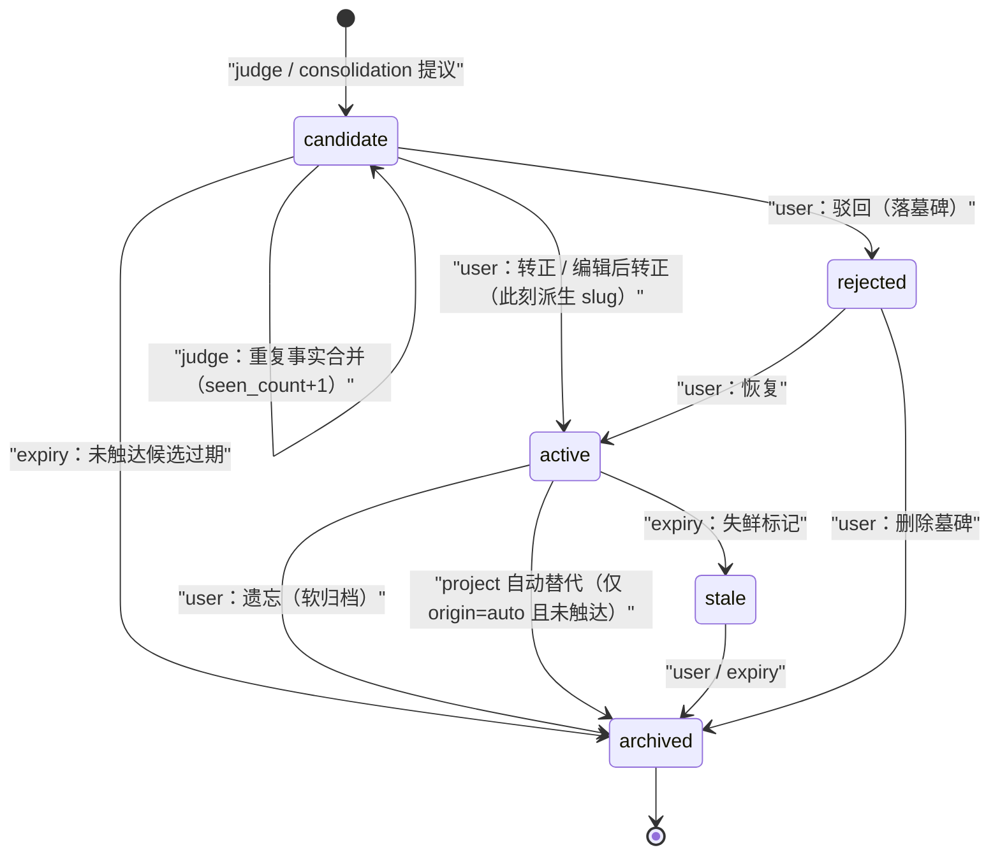
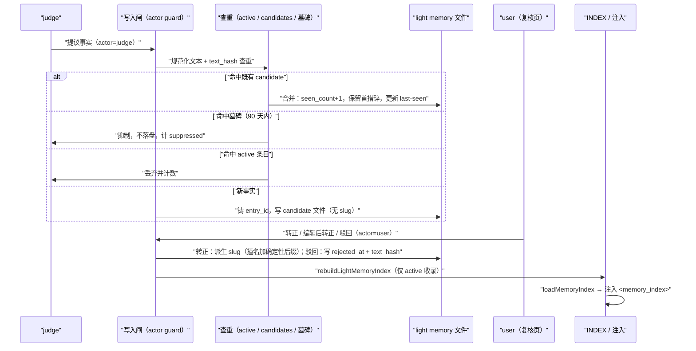

# ADR-078：候选记忆复核——身份、状态机与驳回墓碑

- 状态：**草稿·待爸拍板**
- 单号：N-MEM-CANDIDATE-REVIEW
- 基线：`origin/main@9d459282dd19`（锚点核对于 `c6c025bfe43b`，两基线间记忆相关文件零改动）
- 相关：N-MEM-WRITECONF（#2138，置信度门 r5 砍掉 candidate 档）、N-MEM-PROJECTKEY（项目记忆分区键，并行在飞）、N-MEM-CITEBACK-WRITEBACK（引用回写，并行在飞）、N-SELFAWARE-TRIGGER（并行在飞）、ADR-075（重启续跑，同批复 ADR 的格式先例）

## 术语

| 词 | 含义 |
|----|------|
| 候选 candidate | 自动流程提出、尚未被用户处置的记忆条目，状态 `candidate`。不注入、不进 INDEX |
| 墓碑 tombstone | 状态 `rejected` 的条目：保留规范化文本与 `text_hash`，90 天内抑制同一事实被再次提议 |
| 不变量 | **已确认/已编辑/已驳回的条目永不被自动流程改写**。本 ADR 全部规则由此推导 |
| user-owned | 用户碰过的条目：`touched_by_user_at` 非空（转正、编辑后转正、驳回、恢复任一动作都会打上），或按迁移规则被收编的 legacy 文件 |
| auto-active | `origin=auto` 且从未被用户触碰的 active 条目；唯一允许被 `project` 类自动替代（auto-supersede）的对象 |
| 写入闸 | `writeLightMemoryFile` 前的一层显式 `actor` 守卫，不变量的唯一强制执行点 |
| 转正 | 用户在复核页把 candidate 置为 active；此刻才派生文件名 slug，且之后不再重新派生 |
| 触达 touched | 用户对该条目的任何处置动作（转正/编辑/驳回/恢复/删除墓碑） |

## 背景：为什么需要这张 ADR

N-MEM-WRITECONF（#2138）原设计是三档置信度门，其中 candidate 档在连续五轮审查中每轮都被发现新的用户记忆丢失路径，第五轮整体砍掉了 candidate 档（`durableFactWriter.ts:1-10` 头部注释）。五个洞（来自该单与台账记录）：

1. 同 slug 覆盖：两条事实派生出相同文件名，互相覆盖；
2. 无 `status` frontmatter 的 legacy 文件被当作 active，可被 candidate 覆盖；
3. `supersedes` 自动归档可能归档掉用户确认过的 directive；
4. candidate 转正时重新派生文件名，可能再次覆盖别的条目；
5.（第五轮结论）任何「文件名 = 身份」的 candidate 设计都会不断长出上述变种。

本 ADR 把产品规则与状态机定死，给下一次施工一个可以锚定的不变量。并行在飞的 N-MEM-PROJECTKEY / N-MEM-CITEBACK-WRITEBACK / N-SELFAWARE-TRIGGER 会改动这些文件附近的代码，本稿只描述合同，不与它们抢实现。

## 现状锚点（@c6c025bfe43b）

| # | 事实 | 锚点 |
|---|------|------|
| 1 | candidate 档已被移除：低于 `DROP_BELOW` 丢弃留痕，其余一律写 active 且不写 `status`；同名原地覆盖；`supersedes` 只记录链接不消费 | `src/host/lightMemory/durableFactWriter.ts:1-10`（头部注释）、`writeDurableFacts` `:47`、`resolveSupersedeLink` `:37` |
| 2 | 唯一写盘入口：`writeLightMemoryFile` 用 `sanitizeLightMemoryFilename` 规范化文件名后原子覆盖目标路径；frontmatter 键含 `entry_id`/`status`/`deprecated_by`/`supersedes`/`source`/`memory_tainted`；directive 持久化授权在写入前断言 | `src/host/lightMemory/lightMemoryIpc.ts:302`（`writeLightMemoryFile`）、`:322`（`assertDirectivePersistenceAuthorized`）、`:326`（sanitize）、`:368`（`archiveMemoryFile`） |
| 3 | INDEX 只收录 `status` 为 active（缺省按 active）的条目；注入前再过一遍 `filterInactiveIndexEntries` | `src/host/lightMemory/lightMemoryIpc.ts:586`（`rebuildLightMemoryIndex` 内过滤）；`src/host/lightMemory/indexLoader.ts:42`、`:77`（`loadMemoryIndex`） |
| 4 | 条目身份今天是 `file.entryId || light:<filename>`——没有 `entry_id` 的 legacy 文件身份就是文件名；`memoryEntryFilenameForId` 由 id 派生 `memory-<id>.md` | `src/host/memory/memoryEntryRuntime.ts:252`（`memoryEntryIdForLightFile`）、`:259`（`memoryEntryFilenameForId`） |
| 5 | 用户编辑经 `updateMemoryEntry` 写回 `current.source.filePath`（不重新派生文件名）；删除 = `status: 'archived'` 软归档 | `src/host/memory/memoryEntryRuntime.ts:840`（`updateMemoryEntry`）、`:850`（light_file 分支）、`:909`（`deleteMemoryEntry`） |
| 6 | 复核只受理 `candidate`；approve 拒绝 directive（`directive-requires-explicit-confirmation`）与缺 projectPath 的 project 条目（`project-binding-required`） | `src/host/memory/memoryEntryReview.ts:12`（`batchReviewMemoryEntries`）、`:30-35`；IPC `src/host/ipc/memory.ipc.ts:552`（`handleMemoryEntryBatchReview`） |
| 7 | 判断器路径：会话收尾调 `judgeConversation` 再 `writeDurableFacts`；喂给 supersedes 的现有文件清单已排除 directive | `src/host/agent/runtime/runFinalizer.ts:939`、`:949`；`src/host/lightMemory/conversationJudge.ts:267`、`:291`（`judgeConversation`） |
| 8 | consolidation 写合并结果卡（status active），随后归档来源卡（含 directive，带 `directiveConfirmedByUser`），冲突来源被改写内容并降级为 candidate/archived | `src/host/lightMemory/consolidation.ts:651`（写结果卡）、`:663`（归档来源）、`:681`（冲突降级）；染污守卫 `:643` |
| 9 | failure journal 是固定文件名 `failure-journal.md`，每次整体重写 | `src/host/lightMemory/failureJournal.ts:111`；`src/shared/constants/memory.ts:244`（`JOURNAL_FILENAME`） |
| 10 | 导入 `applyImportMemoryBundleV2` 由用户发起（IPC handler）；测试助手 `memoryEval.ts` 也直写文件 | `src/host/memory/memoryEntryRuntime.ts:948`；`src/host/ipc/memory.ipc.ts:620`；`src/host/testing/memoryEval.ts:91` |
| 11 | directive 有独立显式确认门；染污输入由 `skipAutomaticMemory` 拦截 | `src/host/memory/directiveMemoryConfirmation.ts:69`；`src/host/memory/automaticMemoryPolicy.ts:27` |
| 12 | 注入只发生在系统提示组装：`loadMemoryIndex` 结果包进 `<memory_index>`；candidate/rejected/archived 因 #3 不会出现在 INDEX 里 | `src/host/agent/runtime/contextAssembly/messageBuild.ts:447` |
| 13 | 状态与类型枚举已含 `candidate`；复核页与批量转正助手已存在 | `src/shared/contract/memory.ts:38`（`MemoryEntryStatus`）、`:40`（`MemoryEntryKind`）；`src/renderer/components/features/settings/tabs/MemoryEntriesManager.tsx`、`MemoryEntriesManager.helpers.ts:12` |
| 14 | SQLite 镜像由 light 文件重建，不是独立真源 | `src/host/memory/memoryEntryRuntime.ts:464`（`rebuildMemoryMirrorFromLightFiles`） |

### 自动流程能力矩阵（现状）

| 流程 | 可新建 | 可改既有 | 可归档 | 触及 directive | 锚点 |
|------|--------|----------|--------|----------------|------|
| judge（会话判断器） | 是（active） | 是（同名覆盖） | 否 | 否（清单已排除） | `durableFactWriter.ts:47`；`conversationJudge.ts:267` |
| consolidation | 是（合并结果卡） | 是（冲突降级改写内容） | 是（归档来源卡，含 directive） | 是 | `consolidation.ts:651`、`:663`、`:681` |
| failure journal | 固定一个文件，整体重写 | 仅自身文件 | 否 | 否 | `failureJournal.ts:111` |
| import（用户发起） | 是 | 是（同 entry 覆盖） | 否 | 按 bundle 内容 | `memoryEntryRuntime.ts:948` |
| 用户编辑 | — | 是（写回原路径） | 是（删除=软归档） | 经确认门 | `memoryEntryRuntime.ts:840`、`:909` |
| directive 确认 | 是（交互确认后） | — | — | 是（唯一授权路径） | `directiveMemoryConfirmation.ts:69`；`lightMemoryIpc.ts:322` |

## 已拍板的产品规则（编排 2026-09-30，定为既决）

不变量：**已确认/已编辑/已驳回的条目永不被自动流程改写**。以下四条全部由它推导，写作既决文本，不再列选项。

(a) **身份**：稳定的记忆 id（`entry_id`）在 candidate 创建时铸造，终身不变。文件名 slug 只在转正那一刻派生一次，之后绝不重新派生。转正时撞名取确定性后缀（当时决定、写入 `slug` 字段存盘），永远不覆盖别的条目——文件名从此与身份脱钩，洞 1/2/4/5 的共同根被挖掉。

(b) **驳回留墓碑**：被驳回的事实以 `rejected` 状态保留：规范化文本 + `text_hash`，90 天内抑制同一事实再次被提议进候选；墓碑在复核页「已驳回」列表对用户可见，可恢复。90 天后墓碑停止抑制但仍可见，直到用户主动删除。「规范化」= 去首尾空白、连续空白折叠为一个空格、统一小写、去除句末标点、全角字符转半角。措辞变体与语义近重复不在抑制范围（见 Decision needed 之外的既决说明）。

(c) **重复合并**：与既有 candidate 重复的事实合并进该 candidate——`seen_count` 加一、保留首次措辞、更新 last-seen 时间——绝不新建文件。与已 active 条目重复的事实直接丢弃并计数，不落盘。

(d) **类型与自动替代**：`user`、`feedback`、`directive` 三类永远先过候选页由用户审（directive 在其上再叠加自己的显式确认门）。只有 `project` 类允许自动替代（auto-supersede）旧条目，且目标必须满足「`origin=auto`、无 `touched_by_user_at`、status 为 active」三项；`supersedes` 仍是记录在新条目上的链接，归档只在这条规则下发生并以 `deprecated_by` 留痕。

## 状态机

禁止的迁移（ prose 层面钉死）：

- 任何 actor ≠ user 的流程不得把 `active(user-owned)`、`rejected` 迁往任何状态，也不得改写其内容——这是不变量的状态机表述。
- `candidate → active` 只能由 user 触发；`seen_count` 再高也不自动转正（规则 e）。
- directive 不经 `candidate → active` 的批量路径：复核代码已拒绝（`memoryEntryReview.ts:30-31`），必须走 directive 自己的交互确认门。
- consolidation 不得把任何条目迁往 `archived`，除非目标满足规则 (d) 的三项测试（见「(g) consolidation 的收缩」）。
- `rejected → candidate`（同一事实 90 天内再来）不存在：墓碑在查重阶段直接抑制，不产生新文件。

## 提议到注入的时序

candidate / rejected / archived 不出现在 INDEX，也就永远不会被 `loadMemoryIndex` 注入系统提示（现状锚点 #3、#12 已保证这一半；本 ADR 保证另一半——它们不会被自动流程改回 active）。

## 设计细则

### (a) 身份模型

字段一览（F = light 文件 frontmatter，D = SQLite 镜像列/元数据）：

| 字段 | 位置 | 含义 |
|------|------|------|
| `entry_id` | F + D | candidate 创建时铸造，终身不变；身份的唯一真源 |
| `origin` | F + D | `auto`（judge/consolidation/import 等自动流程）或 `user`（用户手建/导入确认） |
| `touched_by_user_at` | F + D | 用户首次处置时间；空 = 未被触碰。一旦写入永不清空 |
| `seen_count` | F + D | 重复事实合并次数 |
| `first_wording` | F | 首次措辞（合并时保留它作为正文） |
| `text_hash` | F + D | 规范化文本的哈希；查重与墓碑抑制的键 |
| `rejected_at` | F | 驳回时间；墓碑 90 天窗口的起点 |
| `promoted_at` | F | 转正时间 |
| `slug` | F | 转正时派生的文件名（不含 `.md`），此后不改 |

镜像（`rebuildMemoryMirrorFromLightFiles`，现状锚点 #14）是从 light 文件重建的派生品，以上字段以 frontmatter 为真源，镜像只承担查询/列表加速。

**legacy 收编**：无 `status`、无 `entry_id` 的存量文件按**读时默认**迁移——读取时视为 `origin=user`、`status=active`、identity 为铸造的 `entry_id`（写回时才落盘），并视为 user-owned 受不变量保护。不做批量重写：读时默认零风险、可回滚，批量重写本身又会是一次「自动流程改写用户条目」。这正面回答洞 2：legacy 文件从此是不可覆盖的 user-owned 条目，而不是可被顶替的默认 active。

### (b) 写入闸：不变量的唯一强制执行点

五轮审查证明逐调用方检查必然泄漏（每个洞都是某个调用方少检查了一条）。因此在 `writeLightMemoryFile` 前加一层薄守卫，要求每个调用方显式传 `actor`（`judge` / `consolidation` / `import` / `user` / `failure-journal` / `test`），守卫在写盘前读出现有文件并裁决：

- 目标不存在 → 放行（新建）。
- 目标存在且 user-owned（`origin=user` 或 `touched_by_user_at` 非空或 status 为 `rejected`）且 `actor ≠ user` → **拒绝**，抛带稳定 code 的错误（建议 `MEMORY_USER_OWNED_IMMUTABLE`），调用方按既有错误路径上抛/留痕；对 judge 这类后台流程表现为「该事实本次放弃写入并计数」，绝不降级为换名另写。
- 目标存在且满足规则 (d) 三项（`origin=auto`、无 `touched_by_user_at`、active）且 actor 是带 `supersedes` 的 `project` 类写入 → 放行，旧条目归档并写 `deprecated_by`。
- 豁免名单内的固定文件（见 (h)）→ 跳过守卫。

`directive` 确认门（`assertDirectivePersistenceAuthorized`）保留在守卫之后、写入之前，两者正交：守卫管「能不能碰这条目」，directive 门管「能不能产生 directive 权威」。

### (c) candidate 生命周期

- 创建：judge（未来恢复 candidate 档时）与 consolidation 的降级冲突来源；创建即铸 `entry_id`、`origin=auto`、`seen_count=1`、`first_wording`、规范化文本 + `text_hash`。
- 可见性：复核页「待复核」tab（见 (j)）；不进 INDEX、不注入。
- 过期：长期未被处置的 candidate 归档清理，默认值见 Decision needed [默认值] #1。过期是 `candidate → archived`，不是删除，历史可查。
- 驳回：`candidate → rejected`，写 `rejected_at` 与 `text_hash`，进入墓碑逻辑（(d) 节）。

### (d) 墓碑匹配与 90 天窗口

- 匹配键 = 规范化文本的 `text_hash`。规范化定义见规则 (b)：大小写、空白、句末标点、全半角差异被抹平后相同的事实共享同一 hash，**这些措辞变体同样在抑制范围内**（既决，不再问）；语义近重复（换说法表达同一偏好）不做匹配，是明确的范围外项（既决，不再问）——同一事实换了说法会再次成为 candidate，由用户再驳回一次，这是设计取舍而非漏洞。
- 窗口：`now - rejected_at < 90 天` 内命中墓碑 → 抑制（不落盘、计 `suppressed`）；超过 90 天 → 不再抑制，事实可重新成为 candidate；墓碑本身继续可见直到用户删除。
- 恢复：用户在「已驳回」里点恢复 → `rejected → active`（`touched_by_user_at` 早已写入，恢复后是 user-owned active），墓碑同时退出抑制集合。
- 同措辞事实在用户**驳回后**再来：被抑制；在**转正/编辑后**再来：命中 active 查重，丢弃计数（规则 c）。三条路径共同构成不变量测试锚（见后）。

### (e) 重复合并规则

- 命中既有 candidate（同 `text_hash`）：`seen_count+1`、正文保留 `first_wording`、更新 last-seen；不产生新文件、不改 `entry_id`。
- 命中 active 条目：丢弃，计 `dropped_duplicate`，不写盘。
- 命中墓碑：按 (d)。
- `seen_count` 只影响复核列表里的排序权重（高频候选排前面），**永远不触发自动转正**——转正只由用户做出（不变量）。

### (f) auto-supersede 的类型白名单与「未触达」判定

- 允许自动替代的只有 `project` 类；`user` / `feedback` / `directive` 永远走候选页。
- 「自动写入且从未被用户触碰」的精确判定：`origin=auto` 且 `touched_by_user_at` 为空 且 `status=active`，三项同时成立。
- `supersedes` 保持为链接语义（现状锚点 #1）；归档动作只在上述判定通过时发生，旧条目写 `status=archived` + `deprecated_by=<新 entry_id>`。判定不通过时新事实照常成为 candidate，由用户裁决，旧条目纹丝不动。

### (g) consolidation 的收缩

推荐：consolidation 只允许触碰 `origin=auto` 且未触达的条目；user-owned 条目一律原样保留，与之相关的合并/冲突以「报告的冲突」形式出现在 consolidation report 里，由用户处置。

现状会断的地方：冲突降级分支（`consolidation.ts:681`）今天会改写冲突来源的内容（`conflictMarkedContent` 在正文里打冲突标记）并降级其状态——对 user-owned 来源这直接违反不变量，施工时该分支对 user-owned 条目必须改为「只报告、不动盘」；归档来源卡分支（`:663`）今天连 directive 也归档，同样收缩到三项判定通过的条目。判断器侧已做好的部分（supersedes 清单排除 directive，`conversationJudge.ts:267`）保留。

### (h) failure journal：显式豁免，不沉默

failure journal 是固定文件名的系统文件（`failure-journal.md`，现状锚点 #9），每次整体重写——它在不变量**之外**，但靠显式豁免名单而不是靠沉默：写入闸的豁免名单列出 `failure-journal.md`（`actor=failure-journal`），名单本身是代码里的常量、加条目要过审查。journal 不是用户记忆条目（无 `entry_id`、不进复核页），用户不可编辑它，因此「用户碰过」这一前提对它不成立；若未来它变得可编辑，必须先移出豁免名单。

### (i) 与 INDEX 及 N-MEM-PROJECTKEY 的关系

- INDEX 只收录 active（现状锚点 #3），注入只读 INDEX（#12）：candidate/tombstone 天然不进系统提示，本 ADR 不改变这条链路，只要求施工刀不得绕开 `rebuildLightMemoryIndex` 另造收录逻辑。
- project 作用域的 candidate 在 approve 前必须有项目绑定：现有复核代码已强制执行 `project-binding-required`（`memoryEntryReview.ts:34-35`），本 ADR 沿用。N-MEM-PROJECTKEY（并行在飞）若改变 project 条目的分区键，candidate 的绑定判定跟随其键定义，本稿不重复规定。

### (j) 复核页：用户看到什么

只定用户面，不做组件设计：

- 三个 tab：**待复核**（candidates，按 `seen_count` 加权排序）、**已确认**（active）、**已驳回**（墓碑，含「距今 N 天 / 剩余抑制天数」）。
- 动作：**转正**、**编辑后转正**（编辑即 `touched_by_user_at`，转正时派生 slug）、**驳回**（落墓碑）、**恢复**（已驳回 → 已确认）。
- directive 条目在待复核里可见但不可批量转正（现状锚点 #6），逐条走 directive 确认门。

## 不变量测试锚

后续施工刀的合同（本单不写代码）：

1. **锚测试**：对同一措辞的事实，分别走完 转正 / 编辑后转正 / 驳回 三条路径后，让 judge 再次提出同措辞事实——三个条目在磁盘上字节不变，且不出现任何新文件。
2. 每个自动流程一条「不能改写 user-owned 条目」的测试：judge、consolidation（合并归档与冲突降级两分支）、import、failure journal（豁免名单不覆盖普通条目）、`memoryEval` 测试助手。
3. 反向变异：移除写入闸的 `actor` 守卫 → 锚测试必须变红。
4. 墓碑窗口：`rejected_at` 在 90 天内同 hash 事实被抑制；伪造 `rejected_at` 到 91 天前 → 重新成为 candidate。
5. 撞名：转正时人为预置同 slug 文件 → 派生确定性后缀，原文件字节不变。

## Decision needed

### Decision needed [默认值] #1：未触达 candidate 的过期时长

- 选项：30 天 / 90 天 / 永不过期只设条数上限
- 推荐：**90 天**，与墓碑窗口对齐（一套时间口径），过期走 `candidate → archived` 可恢复可查，不硬删。30 天对低频用户容易误杀还没来得及看的候选；永不过期会让待复核列表失去意义。

### Decision needed [默认值] #2：candidate 产生速率上限

- 选项：每会话 N 条 / 每天 N 条 / 不设限
- 推荐：**每天 20 条**（全局，超出部分按 `seen_count` 排序截断，被截的只计数不落盘）。复核疲劳是真实成本；上限按天而不是按会话，避免多会话日被反复打扰，也给突发高产日留余量。

### Decision needed [产品口径] #3：新 candidate 的通知策略

- 选项：仅 badge（复核页入口红点）/ 会话结束时汇总提示 / 即时打断式通知
- 推荐：**仅 badge**。记忆复核是低优先级后台事务，打断式通知违背「不打扰」的产品基调；badge 让待复核积压可见但不索取注意力。若爸认为用户根本不会主动进设置页，可退到「会话结束汇总提示」一档，仍不要即时打断。

## 施工刀拆分建议

按预期收益排序，每刀至多一个 PR；仅建议，不建单。

1. **写入闸 + `actor` + 来源字段**：scope 一句话——在 `writeLightMemoryFile` 前加 actor 守卫，落地 `entry_id`/`origin`/`touched_by_user_at` 字段与 legacy 读时收编。主文件：`src/host/lightMemory/lightMemoryIpc.ts`、`src/host/memory/memoryEntryRuntime.ts`、`src/shared/contract/memory.ts`。钉它的测试：不变量测试锚 #1、#2。反向变异：去掉守卫 → 锚测试红（测试锚 #3）。依赖：无，**先落**——它连今天的 candidate-less 流程也保护（consolidation 归档 directive 是现存洞）。
2. **candidate 写路径 + 查重合并**：scope——judge/consolidation 提议走 candidate 档，落 `text_hash`/`first_wording`/`seen_count` 与三路查重（active/candidate/墓碑位）。主文件：`durableFactWriter.ts`、`memoryEntryReview.ts` 上游、`lightMemoryIpc.ts`。测试：合并不新建文件、命中 active 丢弃计数。反向变异：删掉查重 → 同措辞事实产生两个文件，测试红。依赖：刀 1（字段与守卫）。
3. **墓碑 + 已驳回列表**：scope——`rejected_at`/`text_hash` 抑制、90 天窗口、复核页已驳回 tab。主文件：`memoryEntryReview.ts`、`memoryEntryRuntime.ts`、`MemoryEntriesManager.tsx`。测试：测试锚 #4。反向变异：去掉墓碑查重 → 驳回后同措辞事实再次成为 candidate，锚测试红。依赖：刀 2（查重框架）。
4. **复核页编辑/恢复**：scope——编辑后转正（编辑即 touched）、驳回恢复。主文件：`MemoryEntriesManager.tsx`、`memory.ipc.ts`、`memoryEntryReview.ts`。测试：编辑后同措辞事实再来，条目字节不变。反向变异：编辑不写 `touched_by_user_at` → 守卫放行自动改写，测试红。依赖：刀 1、刀 3。
5. **consolidation 收缩**：scope——consolidation 只碰 `origin=auto` 未触达条目，user-owned 冲突只报告。主文件：`consolidation.ts`。测试：测试锚 #2 的 consolidation 两条分支。反向变异：恢复冲突降级改写 → user-owned 条目被改，测试红。依赖：刀 1。
6. **project auto-supersede 规则**：scope——`project` 类三项判定通过才允许自动替代并归档。主文件：`durableFactWriter.ts`（`resolveSupersedeLink` 消费侧）、`lightMemoryIpc.ts`。测试：满足三项 → 归档留 `deprecated_by`；任一不满足 → 旧条目不动。反向变异：去掉三项判定 → user-owned 条目被 supersede 归档，测试红。依赖：刀 1；建议与 N-MEM-PROJECTKEY 落定后排期。

顺序理由：刀 1 是不变量本体，先落先保护；刀 2/3 恢复 candidate 的产品价值但依赖字段与守卫；刀 4 补用户面闭环；刀 5/6 是把现存自动流程逐一收进不变量，风险递增故排后。

## 本稿自行取舍

- 写入闸的错误 code 取名 `MEMORY_USER_OWNED_IMMUTABLE`（最小具体化，施工时可改）。
- legacy 收编的 `entry_id` 铸造时机取「读时默认、写回落盘」，而非启动批量迁移（理由见 (a) 节）。
- candidate 过期走 `archived` 而非硬删（与墓碑「可见直到用户删」同一口径）。
- 墓碑抑制计数（`suppressed`）与重复丢弃计数（`dropped_duplicate`）只要求留痕计数，未规定暴露到 UI 的位置——归入复核页施工刀的产品细节。
