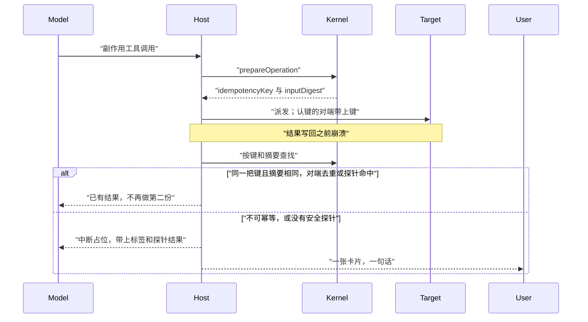
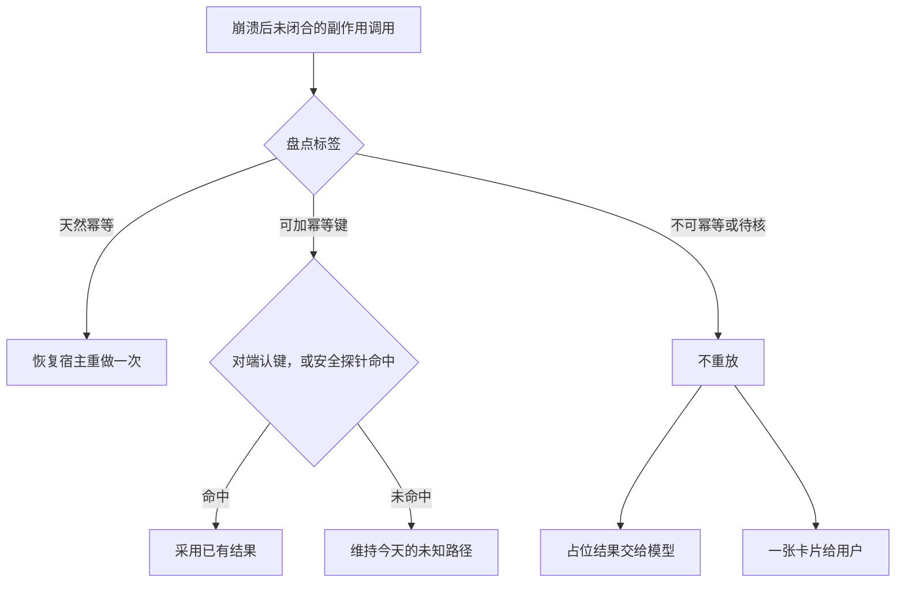

# ADR-079：副作用工具的幂等

- 状态：**草稿·调研**
- 单号：N-TOOL-IDEMPOTENCY-KEY-RESEARCH
- 基线：`origin/main@869f4918b361`
- 相关：ADR-037（durable kernel）、ADR-068（进程内断流续接）、ADR-075（未知写不重放；外部副作用默认 `guard_halt`；N-RESUME-PARKED-RECLAIM / N-RESUME-PARKED-RECLAIM-2）、N-CRASH-OUTCOME-TIERS（台账标题仍是两档，代码已撤）、N-RUNENTRY-IDEMPOTENT（入口层 `clientMessageId`，本稿只引用）、N-PAY-ONESHOTCARD（支付工具未进注册表）

崩溃或断流之后，恢复层往往不知道副作用工具到底做完没有。今天的合同是「结果未知」：运行时不重放未知写，模型自己核实，或者人点继续。本稿调研的是另一条：让重做本身安全，模型既不必盲重做，也不必反复问人。这是草稿，不是已经拍板的决定。

## 术语

| 词 | 含义 |
|----|------|
| 幂等键 `idempotencyKey` | durable 操作行上、跨 attempt 稳定的键。同一逻辑操作的重试必须复用 |
| 参数摘要 `inputDigest` | 工具参数的摘要，和键分开存。同一 `toolCallId` 换了参数就不能再当成同一次调用 |
| 重放 | 恢复宿主把同一个工具再执行一次。ADR-075 禁止对未知写做这件事 |
| 结果未知 | 占位串那一档。缺一条 begin 不能证明「没跑过」 |
| 对外副作用 | `isExternalSideEffectTool`。离开本机、发出去收不回的调用 |
| 探针 | 重做之前的只读查询，用来看效果是否已经落上。不是撤销 |
| 天然幂等 | 同样的参数再做一次，不会多出一份效果 |
| 可加幂等键 | 对端能按客户端键，或按调用里已经有的自然键，去掉重复 |
| 不可幂等 | 再做一次会多一份效果，或本仓证明不了不会 |

## 现状锚点

行号对 `869f4918b361`。重放类按工具名计算，不按 action 拆开。

| # | 事实 | 锚点 |
|---|------|------|
| 1 | 本机工具：对外副作用 → `forbidden`；MCP 走注解；`readOnly` 且没有本机副作用 → `automatic`；其余 `unknown`。自动重放要求存储值和当前值都是 `automatic` | `classifyToolReplaySafety` `src/host/tools/toolReplaySafety.ts:24`；`canAutomaticallyReplayTool` 同文件 `:40` |
| 2 | MCP：`destructiveHint` → `forbidden`；`readOnlyHint` 或 `idempotentHint` → `automatic`；缺注解 → `unknown`。注解注释写明 hint 不保证属实 | `classifyMcpToolReplaySafety` `src/host/mcp/mcpToolSafety.ts:14`；`MCPToolAnnotations` `src/host/mcp/types.ts:126` |
| 3 | 对外名单今天只有 `mail_send`。IM 只认 server `lark` / `feishu` / `slack` / `telegram` 加发送名模式。日历、`github_pr` 被注释明确排除 | `EXTERNAL_SIDE_EFFECT_TOOLS` `src/host/tools/externalSideEffect.ts:28`；`MESSAGING_MCP_SERVERS` `:38`；`MESSAGING_SEND_PATTERN` `:47` |
| 4 | 超时「结果未知」名单是那 16 个小写名字。判定是 `toLowerCase()` 后的全等。注册名 `Write` / `Append` / `Edit` / `Process` 对不上 `write_file` / `append_file` / `edit_file` / `process_write` | `TOOL_EXECUTION_OUTCOME_UNKNOWN_NAMES` `src/shared/constants/timeouts.ts:433`；`isToolExecutionOutcomeUnknown` `:443` |
| 5 | `prepareOperation` 的键是 `sha256(JSON.stringify({runId, kind, logicalOperationId}))`。`inputDigest` 另存，不进键。`sideEffect && !canDeduplicate` 才置 `requiresHumanConfirmation` | `prepareOperation` `src/host/runtime/durableRunKernel.ts:483`；`checksum` `:564` |
| 6 | `prepareToolOperation` 把 `logicalCallId` 同时当成 operation id 和 logical id。生产上的本机工具检查点不走这个包装，走 `prepareOperation`，operation id 是 `tool:${logicalOperationId}`，并且 `canDeduplicate: true`、不写 `inputDigest`。因此本机副作用工具在准备时并不会因为「不能去重」而要求人工确认 | `prepareToolOperation` `src/host/runtime/durableRunKernel.ts:515`；`checkpointNativeToolOperation` `src/host/runtime/runRegistry.ts:491` |
| 7 | 检查点的 logical id 是 `toolCallId ?? executionId`，`providerOperationId` 是账本 `executionId` | `prepareNativeToolCheckpoint` `src/host/tools/nativeToolCheckpoint.ts:43` |
| 8 | 唯一把参数摘要写进 durable 操作的生产路径是 MCP task：`inputDigest: digestValue(args)`，且 `canDeduplicate: false`。摘要是键排序后的 sha256 | `createMcpTask` `src/host/mcp/mcpDurableTask.ts:261`；`digestValue` `:823` |
| 9 | 遥测 `tool.idempotency_key_digest` 是 `sha256(runId:toolCallId)` 的前 24 位十六进制，只打在 span 上，不参与去重 | `annotateToolExecution` `src/host/tools/toolExecutionTelemetry.ts:34` |
| 10 | 恢复：查到成功 complete 就采用。continuation 不可用且 `sideEffect` 时 review，原因 `unknown_write_side_effect`。`mcp-task:v1:` 的副作用未知则 `guard_halt`。其它 `sideEffect`（含 `mail_send`）在 continuation 可用时走 interrupt 占位，不重放；只有非副作用且两边都是 `automatic` 才 `dispatchPrepared` | `recoverOperation` `src/host/runtime/nativeRecoveryHost.ts:497`；`guardHalt` 落账 `:402` |
| 11 | interrupt 的模型文案固定是崩溃占位串。旁边注释写「恒为 OUTCOME_UNKNOWN」。自动重放走的是另一函数，不会进这条注释 | `interrupt` `src/host/app/nativeRecoveryHost.ts:572` |
| 12 | 占位串逐字固定。注释写明 begin 写入失败也不能推出「从未开始」，N-CRASH-OUTCOME-TIERS 返修撤掉了分档。仓内已无 `crashRecoveryTier` / `NOT_STARTED` 占位符。台账单标题仍写 NOT_STARTED 与 OUTCOME_UNKNOWN 两档。代码与标题不一致，本稿不解决 | `INTERRUPTED_TOOL_CALL_PLACEHOLDER` `src/host/agent/runtime/cancelledToolCallClosure.ts:12`；注释 `:6`；启动清算 `src/host/services/core/database/startupMaintenance.ts:107` |
| 13 | 桌面 `tool_execution_events` 有 `tool_call_id`、`replay_safety`。CLI 的建表没有这两列，CLI sink 的 INSERT 也不写它们。注释写两边用同一个 `code-agent.db`。未闭合 = `phase='begin'` 且不存在同 `execution_id` 的 `complete`。begin 行的 status/error 为空 | 桌面 `src/host/services/core/database/schema.ts:414`；CLI `src/cli/cliDatabaseSchema.ts:401`；`createCliLedgerSink` `src/cli/cliLedgerSink.ts:34`；`getOpenExecutions` `src/host/services/core/repositories/ToolExecutionEventRepository.ts:152` |
| 14 | 补偿登记和撤销快照是另一条答案。成功之后才 `registerCompensation`。日历/提醒在更新前可以抓 before 快照。操作行上的 `input_json` 被写成字面量 `'null'`，参数正文不落这张表 | `registerCompensation` `src/host/tools/toolExecutionLedger.ts:51`；`ToolEmissionDescriptor` `src/shared/contract/tool.ts:61`；`captureCalendarBefore` `src/host/tools/modules/connectors/undoMetadata.ts:35`；`replaceOperations` `src/host/services/core/repositories/DurableRunRepository.ts:562` |
| 15 | `delegate_task` 的 `submission_key` 由模型提供，是既有的模型键，不是恢复宿主的键。入口层 `clientMessageId` 在 N-RUNENTRY-IDEMPOTENT，本稿不重写 | `delegateTaskSchema` `src/host/tools/modules/commandCenter/sessionCommandCenter.schema.ts:21`；ADR-072 对 N-RUNENTRY-IDEMPOTENT 的引用 `docs/architecture/decisions/ADR-072-cross-session-coordination.md:318` |
| 16 | `retryToolCall` 用原参数再 `client.callTool`。唯一生产调用点是连接错误重连之后，且当时分类必须已经是 `automatic`。对外发送名在分类前就是 `forbidden`，到不了这里。cua-driver 的非只读工具另有抑制 | `retryToolCall` `src/host/mcp/mcpToolRegistry.ts:691`；调用 `src/host/mcp/mcpClient.ts:1123`；`shouldSuppressCuaAutoReplay` 同文件 `:148` |
| 17 | 工具注册表里没有支付工具。设计单 N-PAY-ONESHOTCARD 未合入 | 对 `src/host/tools` 检索支付工具名为空 |
| 18 | 用户看见的重启中断徽章是「已中断 / 应用重启时中断」。`guard_halt` 的继续前有一张模态，一句人话。模型占位要同时含 `process crashed` 和 `result was recorded`，renderer 才认 | `outcomeWords` `src/renderer/i18n/outcomeWords.ts:72`；`durableGuardContinueMessage` `src/renderer/i18n/chatTranscript.ts:76`；`isToolInterruptionPlaceholder` `src/renderer/utils/toolExecutionPresentation.ts:71` |
| 19 | 无人值守（cron / heartbeat / channel）和语音派的工具审批先停车，不自动放行。对外发送没有因为「无人值守」而跳过这道闸 | `src/host/agent/orchestratorPermissions.ts:371` |
| 20 | ADR-075 已拍板：本地文件写喂「中断/结果未知」、禁止重放；外部/不可逆写默认 `guard_halt`；外部副作用不进崩溃自动续跑。锚点 10 的实现比这窄：只有 mcp-task 副作用未知才 `guard_halt`，其它副作用在 continuation 可用时是 interrupt 后回到 loop | ADR-075 `docs/architecture/decisions/ADR-075-foreground-restart-resume.md:261`；N-RESUME 修订 `:276` |

## 盘点

范围是任务书点名的那几类，加上超时名单里的 `xlwings_execute`，以及已经带模型键的 `delegate_task`。重放类是整颗工具名的今天分类。名单列写的是超时常量是否含这个注册名。

| 工具 | 标签 | 一行理由 | 今日重放类 | 超时结果未知名单 | 键可以搭在哪 |
|----|------|----------|------------|------------------|--------------|
| `git_commit` `commit`（非 amend） | 天然幂等 | 索引已干净时再次 commit 失败，不会造出第二个提交 | `unknown` | 否 | 无。可先 `git status` 看有没有新提交 |
| `git_commit` `amend` | 不可幂等（需人确认） | amend 改写已有提交 | `unknown` | 否 | 无 |
| `git_commit` `add` | 天然幂等 | 同一路径再次 `git add` 不增加第二份暂存 | `unknown` | 否 | 无 |
| `git_commit` `push` | 天然幂等 | `handlePush` 只拼 `git push`，没有 `--force`；同一提交再推是 up-to-date | `unknown` | 否 | 无。实现见 `src/host/tools/modules/shell/gitCommit.ts:291` |
| `Bash` 里的删除/移动 | 不可幂等（需人确认） | 没有独立的 delete/move 工具；`rm` / `mv` 只走 Bash，确认门另认 `rm -rf` 和 `mv` | `unknown` | 否 | 无 |
| `Bash` 里的 `git push` | 不可幂等（需人确认） | 与上一行的 `git_commit` push 不同：Bash 可以带 `--force`。确认门把 `git push` 视为高风险 | `unknown` | 否 | 无 |
| `mail_send` | 不可幂等（需人确认） | 真发邮件。schema 没有客户端键。补偿动作是事后补救，不是去重 | `forbidden` | 是 | 无 |
| `mail_draft` | 不可幂等（需人确认） | 只存草稿、不发送，但每次创建是一封新草稿 | `unknown` | 否 | 无 |
| `calendar_create_event` | 不可幂等（需人确认） | AppleScript `make new event`，uid 由日历分配，入参没有客户端 uid | `unknown` | 是 | 无。探针可用 `list_events` / `get_event` |
| `calendar_update_event` | 天然幂等 | 按 `event_uid` 把字段设成绝对值；目标不在则失败，不会新建 | `unknown` | 是 | 自然键 `event_uid` |
| `calendar_delete_event` | 天然幂等 | 按 uid 删除；目标不在则失败，不会把事件造回来 | `unknown` | 是 | 自然键 `event_uid` |
| `reminders_create` | 不可幂等（需人确认） | 按 list + title 新建，入参没有客户端 id | `unknown` | 是 | 无。探针可用 `list_reminders` / `get_reminder` |
| `reminders_update` | 天然幂等 | 按 `reminder_id` 设绝对值 | `unknown` | 是 | 自然键 `reminder_id` |
| `reminders_delete` | 天然幂等 | 按 id 删除；目标不在则失败 | `unknown` | 是 | 自然键 `reminder_id` |
| `tmeetMeetingCreate` | 不可幂等（需人确认） | `tmeet meeting create` 每次创建一场。schema 没有客户端键。回执是创建成功之后的产物 | `unknown` | 是（小写 `tmeetmeetingcreate`） | 无。只读旁路是 `tmeetMeetingList` / `tmeetMeetingSearch`，主题可能撞车，不能单独当去重证明 |
| `github_pr` `create` | 不可幂等（需人确认） | 未配置上游时先 `git push -u`，然后 `gh pr create`。仓内不先查已有 PR | `unknown` | 是（整颗工具，含 view/list） | 无 |
| `github_pr` `comment` / `review` | 不可幂等（需人确认） | 每次拼一条新的 `gh pr comment` 或 review | `unknown` | 是 | 无 |
| `github_pr` `merge` | 待核 | 仓内无「已合并则跳过」，直接 `gh pr merge`。第二次调用在对端是空操作还是又一次合并，本仓不能证明 | `unknown` | 是 | 无 |
| `jira` `create` | 不可幂等（需人确认） | `POST /issue`，载荷里没有客户端去重字段 | `unknown` | 是（整颗工具，含 query/get） | 无 |
| `http_request` 非 GET | 不可幂等（需人确认） | 任意 URL。宿主不注入、也不校验幂等头。GET 默认也不在 `readOnly` | `unknown` | 否（它在长耗时名单，不在结果未知名单） | 请求头可以被模型自己填，那不是恢复键 |
| `Write` | 天然幂等 | 原子整文件替换。同一内容写两次，文件字节相同；写到临时文件中途崩溃不替换原文件 | `unknown` | 否。常量里是 `write_file`，注册名 `Write` 对不上 | 无 |
| `Append` | 不可幂等（需人确认） | 同一段再追加一次会重复 | `unknown` | 否。常量是 `append_file` | 无 |
| `Edit` | 不可幂等（需人确认） | 精确 `old_text` 消失时会失败，但模糊匹配可能打到另一处。原子写只保证不写出半截文件 | `unknown` | 否。常量是 `edit_file` | 无 |
| `notebook_edit` `replace` | 天然幂等 | 同一单元格写成同一段 source，结果相同 | `unknown` | 否 | 无 |
| `notebook_edit` `insert` / `delete` | 不可幂等（需人确认） | 插入会多一格；删除再做一次打到旁边的格 | `unknown` | 否 | 无 |
| `terminal_write` | 不可幂等（需人确认） | 键击送进用户的活会话。成功只表示送到，不表示程序接受 | `unknown` | 是 | 无 |
| `Process` `write` / `submit` / `kill` | 不可幂等（需人确认） | 往 PTY 写字节、提交一行或杀掉进程。注册名是 `Process`，不是名单里的 `process_write` | `unknown` | 否 | 无 |
| `browser_navigate` | 不可幂等（需人确认） | 打开 URL、前进后退、开关标签。遗留路径本身没有 durable owner | `unknown` | 是 | 无 |
| `browser_action` 里会改页面或外部状态的动作 | 不可幂等（需人确认） | 点击、输入、上传、清 cookie 再做一次不是同一次。目录里部分动作标了 `external_side_effect` | `unknown` | 是 | 无 |
| `computer_use` / `Computer` | 不可幂等（需人确认） | 鼠标键盘打到当前前台。同一坐标再点一次是另一次点击 | `unknown` | 否 | 无 |
| `xlwings_execute` 的 `write` / `run_macro` / `create_chart` | 不可幂等（需人确认） | 写打开中的工作簿、跑宏、建图表。`check` / `read` 不是副作用 | `unknown` | 是（整颗工具） | 无 |
| MCP 发送名（上述四个 IM server） | 不可幂等（需人确认） | 名字命中发送模式即 `forbidden`，注解救不回来。仓内没有把键传给这些工具 | `forbidden` | 否 | 无。夜间脚本的 `lark-cli --idempotency-key` 不在这条工具路径上 |
| MCP `destructiveHint` | 不可幂等（需人确认） | 注解优先判 `forbidden` | `forbidden` | 否 | 无 |
| MCP 仅 `idempotentHint`（且不是上面的发送名、也不是 destructive） | 待核 | 今天会因此变成 `automatic`，连接断开时 `retryToolCall` 会原样再调一次。hint 注释说不保证属实，仓内也没有对端去重合同 | `automatic` | 否 | 无独立键字段，只有布尔 hint |
| MCP 写工具但缺注解 | 待核 | 缺 hint 得到 `unknown`，恢复不重放。对端是否幂等本仓不知道 | `unknown` | 否 | 无 |
| `delegate_task` | 可加幂等键 | 模型提供的 `submission_key` 已是去重键。这是入口层的键，不是本稿要换掉的恢复键 | `unknown` | 否 | 参数 `submission_key` |
| 支付 | 不可幂等（需人确认） | 注册表中不存在。前瞻一行，避免以后被当成可自动重做 | 不适用 | 否 | 无 |

本仓能证明「对端会按客户端键去重」的副作用工具：没有。`delegate_task` 的键由本进程的指挥台核对，请求不出这台机器。`http_request` 的 headers 是模型自由字段。MCP 的 `idempotentHint` 只是布尔，不是键。

## 对照

下面四行外部系统是 **orchestrator-provided background**：任务书给了行为摘要，本仓对不上字段名，不能当成核对过的事实。Neo 这一行只写本仓。

| 系统 | 键的形状 | 存在哪 | 重试时谁查 | 未决的不安全步骤在模型眼里 | 在用户眼里 |
|------|----------|--------|------------|----------------------------|------------|
| Pydantic AI step persistence（orchestrator-provided background） | 步骤记录上的幂等键；字段名未核对 | 每个模型请求和工具调用的步骤检查点，带「已开始」标记 | 对端按同一把键去重；崩溃后发现「已开始但没有结果」就用同一把键再驱动 | 未核对 | 未核对 |
| LangGraph durable execution（orchestrator-provided background） | 没有单独的对外键；完成的结果留在检查点 | 按 thread、在步骤边界 | 调用方。从最后检查点恢复；飞到一半的节点从头再跑。做完的不重执行 | 未核对 | 未核对 |
| Claude Code 中断恢复（orchestrator-provided background） | 无 | 无 | 无去重。模型自己决定 | 没有结果的工具调用被收成一条合成的 interrupted | 单一结果档，没有键 |
| Temporal activity（orchestrator-provided background） | 跨重试稳定：workflow id + activity id；例：支付的 Idempotency-Key 头 | 工作流状态 | 对端必须去重。活动至少一次。心跳和超时限制失联多久 | 未核对 | 未核对 |
| Neo 今天 | `sha256({runId, kind, logicalOperationId})`。参数不进键。遥测另有一个 24 位摘要，不参与判定。`delegate_task` 另有模型提供的 `submission_key` | durable 操作行的 `idempotency_key`；`input_digest` 列在，本机工具检查点不填。工具账本没有键列 | 恢复宿主在重放之前查重放类和账本里有没有成功 complete。不把键交给工具，也不交给模型核对。`retryToolCall` 在 hint 为 automatic 时不带键再调一次 | 占位：`interrupted: process crashed before a result was recorded; do not assume it ran or succeeded`。超时另有一句 outcome unknown | 工具格徽章「已中断」。`guard_halt` 才有模态：「上次对外部系统的操作可能已经执行，继续可能重复执行。确认外部系统的状态后再继续。」 |

## 方案

### （a）键怎么来

提议 `idempotencyKey = sha256(runId, toolCallId, canonicalArgumentDigest)`。摘要算法沿用 MCP task 已有的做法：对象键排序后 sha256（`digestValue`），不新造一套规范化。

摘要必须进键。模型再生时可能沿用同一个 `toolCallId` 却改了参数。只哈希 run 和 call id，会把两次不同的效果当成同一次，该做的不做，或者把旧结果安到新参数上。

本机工具的键由宿主算，模型不提供、也不能覆盖。模型提供的字符串可以漏、可以伪造、也可以在重试时换一把。`delegate_task` 的 `submission_key` 保持现状：那是指挥台入口的模型键，和恢复宿主这把键不是同一层。N-RUNENTRY-IDEMPOTENT 的 `clientMessageId` 同样只引用、不在这里重做。

摘要同时写入已有的 `inputDigest`。键变了，列上也要能看见「为什么变」。

### （b）键存在哪

不新建表。键和摘要放回 durable 操作行（`idempotency_key`、`input_digest`）。工具账本继续当执行相位的证据：有没有 begin、有没有成功 complete。

崩溃之后的事实源是 durable 操作行。恢复宿主读的是它：这是哪一次逻辑调用、键是什么、参数摘要是什么、状态是 dispatched 还是 unknown。账本回答「成功 complete 写上了没有」。两边会不一致，因为 begin 写入是失败也吞掉的；操作行在派发前的检查点里，账本行可能根本没有。所以不能把账本当成键的事实源。今天操作行的 `input_json` 被写成字面量 `'null'`，参数正文本来也不在那里，摘要列就是该放指纹的地方。

CLI 与桌面共用库文件时，CLI 的 begin 行没有 `tool_call_id` / `replay_safety`。查未闭合执行不能假设这两列一定有值。

### （c）重试时谁查

恢复宿主在重放之前查，不交给模型。模型看到的是已经决定过的结果。

本仓没有任何副作用工具把客户端键交给外部系统。因此「认键则透传」今天没有可透传的本机行。`delegate_task` 的键停在本进程。将来只有盘点里新出现、且仓内能看到透传字段的行，才把宿主算出的键放进那个字段。模型自由填写的 `http_request` headers 不算。

没有透传字段时，只在下面这些已有只读入口上做探针，命中就采用已有结果，不第二次创建：

- 日历：`list_events`，已有 uid 时 `get_event`
- 提醒：`list_reminders`，已有 id 时 `get_reminder`
- 会议：`tmeetMeetingList` / `tmeetMeetingSearch` 只作候选。只按主题命中不够，撞车就当没探到

探不到、或根本没有安全探针的，走今天的未知路径：不重放。文件类不在宿主探针里自动改盘；`Write` 若被标成可重做，是因为它整文件替换天然幂等，不是因为先去读一遍再决定。

### （d）崩溃之后给人看什么

模型看到的仍是现在这条占位家族，必须留着 `process crashed` 和 `result was recorded`，否则 `isToolInterruptionPlaceholder` 不认，徽章会掉。建议在句尾加上标签和探针，例如：

`interrupted: process crashed before a result was recorded; do not assume it ran or succeeded; label=unsafe; probe=none`

探针命中时不发这句，改为把查到的结果写成工具结果。`label` 用盘点的三类，待核与不可幂等同走不重放。

用户只看到一张已有的卡片，一句话，不出现键、探针、重放这类词。建议文案：「这一步可能已经做完，我没有自动再做一次。」`guard_halt` 的继续模态保持现有那句，不再叠第二张卡。

### （e）和 ADR-075、N-RESUME 的关系

ADR-075 已拍板：未知写运行时不重放；外部副作用不进崩溃自动续跑；`guard_halt` 的继续要先过模态。N-RESUME-PARKED-RECLAIM 与 N-RESUME-PARKED-RECLAIM-2 已拍板：这种停靠重启后认领为可继续，但不自动跑；确认继续时把工具 op 收成 abandoned。

本稿只放宽「标成天然幂等，或探针命中」的那些行，让恢复宿主重做一次或采用已有结果。不放宽其余行。不把今天已经禁止的重放再收窄。未拍板前，运行时维持锚点 10，包括「非 mcp-task 的副作用是 interrupt 后回到 loop」这一条与 ADR-075 字面并不完全重合的实现。那是现状，不是本稿要顺手改的行为。

### （f）无人值守和 cron

无人值守没有人点卡片。不可幂等和待核的调用维持未知，不静默重做。天然幂等或探针命中的，才允许恢复宿主重做。外部发送即使将来有了键，也仍然先过现有的审批停车，不因为轮次是 cron 就自动放行。cron 不走「用户新消息把停靠 run 让掉」那条路，停靠的收口仍按 ADR-075。

### （g）MCP 的 `retryToolCall`

这是进程内的第二次 `callTool`，参数原样，没有键。它和崩溃恢复是两条路，但分类必须同一套：今天 `idempotentHint === true` 就会在重连后重试，写工具只要声明了这个 hint 就能走到。destructive、缺 hint、对外发送名、被抑制的 cua 写工具走不到。方案是这条路径服从同一张盘点：没有宿主键、也没有「天然幂等」声明的写工具，不在这里重试。

### （h）非目标

- 不承诺跨服务商的恰好一次
- 不把 `registerCompensation` 和日历/提醒的 before 快照做成幂等键。那是事后撤销
- 不做支付。注册表里没有这个工具

## Decision needed [顺序]

哪些行先做键。

选项：

1. 先做对外发送（邮件、PR、Jira、会议、IM），因为重复发送最显眼。
2. 先做本机天然幂等的 `Write`、按 uid/id 的日历与提醒更新删除，以及日历/提醒创建的探针。对外发送排到有对端去重测试之后。
3. 先做全部 MCP `idempotentHint` 的自动重试。

推荐：2。对外发送在仓内没有去重合同，先做它们花的是联调和事故成本；`Write` 与按 id 更新已经能在本仓证明再做一次不会多一份效果，日历/提醒创建有现成的 list/get。

## Decision needed [安全边界]

带键的重放能否不经用户确认就发出对外发送。

选项：

1. 只要键稳定，邮件、PR、IM、会议都可以自动重放。
2. 对外发送在对端去重被测试证明之前，一律不自动重放。键先用于本机天然幂等、带 `idempotentHint` 且本仓能复核的声明、以及日历/提醒。
3. 所有副作用，包括 `Write`，都继续等人点继续。

推荐：2。键只说明「我们会用同一把身份再试一次」，不能代替对端真的去掉重复。外部发送维持 ADR-075 的不自动重放，直到有一条测试钉住对端去重。

## Decision needed [默认值]

键记录留多久。

选项：

1. 单独的短 TTL，例如 24 小时。
2. 与 durable 操作行同一寿命。仓内没有 `durable_runs` 的过期删除；停靠 run 按 ADR-075 不设过期，靠新消息让位。
3. 永久另表保存。

推荐：2。键是操作行上的列，分开过期会让恢复读到行、却丢了键。不为此新增清扫任务。

## 施工刀拆分建议

刀 1 是 durable 续跑和重试熔断共用的去重底座：键里带上参数摘要之后，恢复重放和 `retryToolCall` 才能问同一句话「这是不是同一次调用」。

1. 把参数摘要算进 `idempotencyKey`，并写入 `inputDigest`；通过工具上下文把宿主算出的键交给执行层，不放进模型参数。主要文件：`src/host/runtime/durableRunKernel.ts`、`src/host/runtime/runRegistry.ts`、`src/host/tools/nativeToolCheckpoint.ts`。测试钉住同一 `toolCallId`、参数不同则键不同，参数相同则键相同。反向变异：从哈希里拿掉摘要，不同参数的断言必须红。依赖：无。
2. 在 `classifyToolReplaySafety` 旁边用一处声明标出本机工具里哪些是天然幂等，不在每个 schema 上加字段。主要文件：`src/host/tools/toolReplaySafety.ts`。测试钉住声明行分类为 `automatic` 仍要求存储值和当前值一致，未声明的写工具保持 `unknown`。反向变异：把 `unknown` 一律当成 `automatic`，未声明写工具的断言必须红。依赖：无。与刀 1 并行。
3. 日历/提醒在重做创建之前先做只读探针；命中则不第二次创建，未命中走今天的未知路径。主要文件：`src/host/runtime/nativeRecoveryHost.ts`、`src/host/app/nativeRecoveryHost.ts`，读现有 connector 的 list/get。测试钉住已有同键事件不会再 `make new event`，探不到不会自动创建。反向变异：跳过探针直接创建，重复事件的断言必须红。依赖：刀 1。
4. 只有声明了接受宿主键的 MCP 工具才在重试时带上键；`idempotentHint` 单独不再放行写工具重试。主要文件：`src/host/mcp/mcpToolSafety.ts`、`src/host/mcp/mcpClient.ts`、`src/host/mcp/mcpToolRegistry.ts`。测试钉住未声明的写工具不进入 `retryToolCall`，声明行的重试参数里能看到宿主键。反向变异：所有 MCP 调用都带键或都重试，未声明写工具的断言必须红。依赖：刀 1。
5. 不安全调用的用户卡片用一句话，模型占位保持现有两个子串并带上标签。主要文件：`src/host/app/nativeRecoveryHost.ts`、`src/renderer/i18n/chatTranscript.ts`、`src/renderer/utils/toolExecutionPresentation.ts`。测试钉住占位仍映射 `interrupted-restart`，卡片文案不含键和探针这类词。反向变异：删掉 `result was recorded`，占位识别断言必须红。依赖：刀 2 的标签词。

## 本稿自行取舍

- Decision needed（a）只开「顺序」一块。成本写在推荐句里，不另开一块。
- 盘点不逐行展开记忆写入、生成类和 `spawn_agent`。它们不在任务书点名的类别里。
- `Edit` 因为模糊匹配标成不可幂等，不因为「精确匹配失败就返回」标成天然幂等。
- 参数摘要的规范化直接沿用 `digestValue` 的键排序，不另选一种。
- 四家外部系统整节保持 orchestrator-provided background。仓内出现的 LangGraph 字样是设计灵感注释，不是那份 durable 合同。
