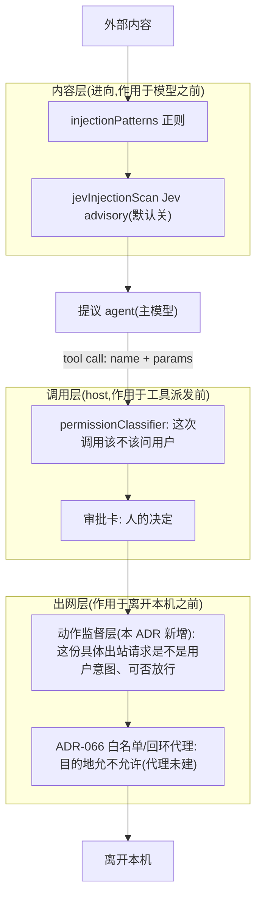
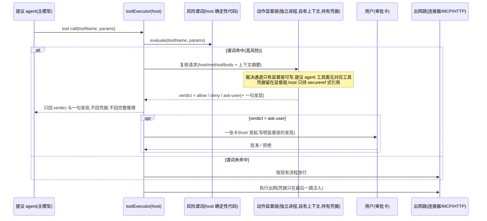

# ADR-080：不可逆出站动作的动作监督层（action supervisor）

- 状态：**草稿·待爸拍板**（施工单待爸拍板后立）
- 单号：N-ACTION-SENTINEL-ADR（document-only，本 ADR 只定形状，不改代码）
- 基线：`origin/main@8fa6affdfa41`
- 相关：ADR-066（出网白名单与凭据哨兵——**与本 ADR 的"sentinel"是两个东西**，见术语表）、ADR-067（peer 消息来源铸造与权限洗白闸）、ADR-050（MCP `secureref:`）、ADR-057（审批拒绝来源不许自报）、ADR-075（前台续跑，无人值守审批停车同族）、N-JEV-INJECT-LAYER（内容层 Jev 注入第二层）
- 来源：台账单 N-ACTION-SENTINEL-ADR，竞品对标对象为 Muse（引用其信任模型，口径见术语表与 §问题）

## 术语

| 词 | 含义 |
|----|------|
| 动作监督层 / action supervisor | **本 ADR 的主题。**独立复核出站动作（host / method / body）的一方：与提议 agent 分进程、分上下文，持有凭据，只回裁决（allow / deny / ask-user）。文中一律用「动作监督层」，英文 action supervisor |
| secret sentinel（ADR-066） | **另一个东西。**ADR-066 的凭据占位符方案：配置里存 `secureref:env.NAME` 占位符，出网跳才换回真值。它是"凭据对子进程不可见"的机制，不是"出站动作复核者"。两者名字都含 sentinel，职责正交，实施时可能共用同一批 secretRef 基础设施 |
| Montana Labs sentinel 信任模型 | 竞品 Muse 的信任模型。本 ADR 无法离线核验其原文，按任务书口径只采信三条性质（as stated in the ticket）：①复核方与提议 agent 分进程、分上下文；②凭据在复核方手里，提议方永远看不到；③提议方与批准方永不为同一 agent。本 ADR 不发明该模型的其它细节 |
| 不可逆外部效果 | 产生离开本机、发出去收不回效果的动作：发邮件、发 IM、付款、对外发布、开 PR / 发评论。判据挂接现有 `isExternalSideEffectTool`（B1 风险类）口径 |
| 风险谓词 risk predicate | 决定一个工具调用是否进入监督的确定性判据（§成本与启用判据）。host 侧纯代码评估，不调模型、不听提议 agent 的自述 |
| 提议 agent | 发起工具调用的主模型。本 ADR 的威胁模型核心：它可能已被注入操纵，所以它的任何自述（"这封邮件没问题"）都不构成证据 |

## 问题

今天的四道控制全部在**主模型可以影响的信息面**上工作：permissionClassifier 看的是工具调用参数（模型写的）、审批卡上呈的是模型提出的动作描述（模型组织的）、内容层扫描扫的是进来的内容、出网白名单看的是目的地。**一旦主模型被注入操纵，提议和辩护是同一个脑子**：模型编一个理由、卡片照抄、用户在信息不对称下点批准。ADR-067 已在 peer 消息面承认同构问题（"proposer 不能批准自己"）；出站动作面上还没有对应物。

Montana Labs sentinel 信任模型（按任务书口径的三条性质）给出的答案是结构性的：复核方与提议方分进程分上下文、复核方持凭据、两方永不为同一 agent。本 ADR 把这个形态翻译进 code-agent 的现状：一个**动作监督层**，只对**高风险不可逆动作**启用，在出网前以独立上下文复核具体的 host / method / body。

**本 ADR 对 ADR-066 的假设**：ADR-066 状态仍是"待爸拍板"，其回环代理刀（文本里称刀 3）与 `approved_domains` 白名单**均未施工**（`git ls-tree -r origin/main --name-only | grep -i egressProxy` 与 `git grep -n approved_domains -- src` 在本基线上都为空）；但其 D5 刀 0 文本预检 `egressPrecheck.ts` 已在树上。因此本 ADR：①Bash 的 wire 级拦截**依赖** ADR-066 代理刀，未建前只敢主张命令文本级（见 §拦截点位清单）；②凭据隔离直接复用 ADR-050 / ADR-066 D4 的 `secureref:` 占位符形状，不另造机制；③两 ADR 落地顺序见 Decision needed（顺序）。

## 现状锚点（@8fa6affdfa41）

| # | 事实 | 锚点 |
|---|------|------|
| 1 | 权限分类三段：cache → 规则快路径（deny/ask/approve）→ Jev LLM 档 → 默认 ask | `src/host/tools/permissionClassifier.ts:595-650` |
| 2 | C1 连接器写回确定性逐次 ask：`permissionLevel==='write'` + `isConnectorToolName` → ask，理由来自 `connectorExternalWriteReason` | `src/host/tools/permissionClassifier.ts:668-687`（use 在 `:671`）；实现在 `src/shared/contract/workbenchTools.ts:89` |
| 3 | Jev 档头注：只缩小 ask 桶、不扩 approve、不做 deny、官方自认对抗输入能带偏、"不是安全边界"，报错回落 ask | `src/host/tools/permissionClassifierJev.ts:1-13` |
| 4 | toolExecutor 审批请求里连接器写回边界 `connector.external_write` | `src/host/tools/toolExecutor.ts:2628-2645` |
| 5 | 出网白名单只在 `permissionLevel==='network'` 且 `params.url` 为字符串时检查，bash 的 curl 无 `params.url` 整层跳过 | `src/host/tools/toolExecutor.ts:2795-2799` |
| 6 | `checkNetwork` 对 `network.allowed_domains` 做 hostname / `*.` 后缀匹配 | `src/host/security/policyEnforcer.ts:75` |
| 7 | 审批卡发送点 `requestPermission`（交互审批无 deny 超时，agentLoop 一直等） | `src/host/agent/orchestratorPermissions.ts:315` |
| 8 | 无审批 UI 的环境（非交互 CLI / web headless）对需确认操作 fail-closed 拒绝，并明确告诉模型"用户没看到" | `src/host/tools/toolPermissionClassification.ts:204-215`（`HostReasonCode.PermissionDeniedNoApprovalUi`） |
| 9 | `bypassPermissions` 放手档：跳过全部权限检查；无人值守会话被单点钳制降回 `acceptEdits` | `src/host/permissions/modes.ts:28,158,328` |
| 10 | 内容层正则：注入模式分类与混淆模式 | `src/host/security/patterns/injectionPatterns.ts:5,44` |
| 11 | 内容层 Jev 第二层：deterministic 正则之上的 advisory，never allow、never 删文本，默认关（`CODE_AGENT_JEV_INJECTION_SCAN=1` 才开），只认远端来源工具 | `src/host/security/jevInjectionScan.ts:1-2,18-29,31-33` |
| 12 | 注入 advisory 的决策槽呈现（N-JEV-INJECT-LAYER-MOCK 已落）：只提示，绝不参与放行/拒绝 | `src/renderer/utils/jevInjectionAdvisory.ts:1-13` |
| 13 | 沙盒网络是布尔：`resolveSandboxNetworkPolicy` 命中 `NETWORK_COMMANDS`（25 项）→ `allowNetwork=true`，无域名粒度 | `src/host/sandbox/networkPolicy.ts:1,40` |
| 14 | OS 沙盒**默认开启**（`OS_SANDBOX_ENABLED=false` 才关，紧急关闭用）——与 ADR-066 写作时的"默认关"相反 | `src/shared/constants/sandbox.ts:10-17`（`isOsSandboxEnabled`） |
| 15 | bash 沙盒调用链：`allowNetwork` 布尔来自 `resolveSandboxNetworkPolicy` → `applySandbox` → `wrapCommandForSandbox` | `src/host/tools/modules/shell/bash.ts:506,510,452`；`src/host/sandbox/manager.ts:617` |
| 16 | ADR-066 D5 刀 0 已落：`egressPrecheck` 从 curl/wget/nc/netcat/ssh/scp 等字面 argv 抽 host 喂 `isPrivateOrLocalHost`，产出 private-host / unresolvable-target 两类发现，只升 high 确认、不硬毙 | `src/host/security/egressPrecheck.ts:1-19`；消费方 `src/host/security/commandSafety.ts:33` |
| 17 | SSRF 守卫 `isPrivateOrLocalHost`：私网/环回/链路本地/元数据；fetch 侧 7 个消费方 + 文本预检 egressPrecheck | `src/host/security/ssrfGuard.ts:25` |
| 18 | MCP 调用单点：`client.callTool` 与 `retryToolCall` | `src/host/mcp/mcpToolRegistry.ts:648,691` |
| 19 | MCP 凭据引用：`secureref:` 前缀，连接前由宿主解引用，解不开 fail-closed 禁止回落空串（ADR-050） | `src/host/mcp/secretRef.ts:4,40,84` |
| 20 | MCP 工具只读/重放安全分类 | `src/host/mcp/mcpToolSafety.ts:3,6,14` |
| 21 | EXTERNAL 风险类打标（B1）：native 清单 v1 只收 `mail_send`；IM MCP 出站按 server 白名单（lark/feishu/slack/telegram）+ 发送动作模式；宁可漏标不错标；不改审批行为只打标 | `src/host/tools/externalSideEffect.ts:28-30,38,47,68` |
| 22 | B4 target 粒度授权目标抽取（收件人/频道），B2 无人值守停车与 B4 透传进审批层 | `src/host/tools/externalSideEffect.ts:149`；`src/host/tools/toolExecutor.ts:2001-2006` |
| 23 | 连接器写回工具族：mail（含 mailSend `permissionLevel:'write'`）、calendar、reminders、tmeet | `src/host/tools/modules/connectors/`；`mailSend.schema.ts:55` |
| 24 | `http_request` 方法集 GET/POST/PUT/DELETE/PATCH/HEAD/OPTIONS，三者均为 `permissionLevel:'network'` | `src/host/tools/modules/network/httpRequest.ts:27`；`httpRequest.schema.ts:62`、`githubPr.schema.ts:117`、`jira.schema.ts:95` |
| 25 | 浏览器动作 / 桌面动作工具族与统一 surface 执行注册 | `src/host/tools/vision/browserAction.ts`、`computerUse.ts`；`src/host/services/surfaceExecution/SurfaceProviderRegistry.ts` |
| 26 | peer 消息洗白闸已拍板（accepted）：来源感知权限，同"提议者不能自批"主题 | `docs/architecture/decisions/ADR-067-peer-message-provenance-and-laundering-guard.md:3` |
| 27 | webSearch / webFetch 是 network 读、不是 external，EXTERNAL 打标刻意不收 | `src/host/tools/externalSideEffect.ts:11-12` |

## 现有三道控制与监督层的位置

先看一个出站动作今天的路径，以及动作监督层落在哪里：



要点：内容层管**进来的**内容会不会操纵模型；调用层管**这次调用**要不要问人；出网层管**这份请求**去哪、是什么。动作监督层是出网层的第二格——它不替代前三格中的任何一格（§边界）。

## 监督流程



流程要钉死的性质，全部来自 Montana Labs 三条（按任务书口径）：

1. **提议 agent 永远看不到凭据。**凭据由监督层进程持有；host 传给监督层的是脱敏后的请求与 `secureref:` 式引用（ADR-050 / ADR-066 D4 形状），真值只在出网最后一跳注入。
2. **提议 agent 永远看不到 verdict 之外的监督推理。**回到主模型上下文的只有 verdict 与一句人话发现；监督层的完整推理留在监督进程内，防止主模型（或注入它的对手）根据推理迭代下一轮提示。
3. **提议方与批准方永不为同一 agent。**监督层不是主模型的子调用：它不接受主模型的指令性输入（上下文摘要由 host 组装，不是主模型自由文本），它的裁决通道不在 agent 工具面上，主模型没有任何工具能写它。

## 边界：与现有三道控制谁管什么（验收 ①）

| 层 | 回答的问题 | 看到什么 | 不做什么 |
|----|-----------|---------|---------|
| `permissionClassifier` | **这次工具调用**该不该问用户 | toolName + args（模型写的参数） | 不看线上字节；ask 不是对"用户意图"的判定 |
| 审批卡（`requestPermission`） | 对**呈现给人的那次调用**，人的决定是什么 | host 组装的审批请求（参数、理由、target） | 批的是"所述调用"，不是 wire 字节；人不逐字读 body 是常态 |
| N-JEV-INJECT-LAYER（`jevInjectionScan`） | **进来的内容**是否在操纵模型（内容层） | 远端来源工具的返回文本 | warn-only、默认关、不是安全边界；不管出站 |
| ADR-066 白名单/代理 | **目的地**允不允许（目的地层） | host（域名） | 不看 body、不判意图 |
| 动作监督层（本 ADR） | **这份具体出站请求**（host/method/body）是不是用户意图、可否放行（出网层）；持有凭据 | 具体请求 + host 组装的上下文摘要 | 不重算该不该问（classifier 的）、不替人决定（卡的）、不扫内容层注入、不做目的地白名单 |

逐对重叠与不重复：

- **classifier × 监督层**：重叠在都可能产出 ask。监督层**不**重新计算 read 工具的 approve/ask/deny（那是 classifier 的规则层，已含 C1 连接器确定性 ask）；监督层只在谓词命中后看 wire 级内容与意图。分歧时：classifier 说 ask、监督层说 allow → **仍 ask**（监督层永远不能放宽下层）；classifier 说 approve、监督层说 deny → **deny**（最严者胜）。
- **审批卡 × 监督层**：卡是人的决定，监督层是机器预审。verdict=ask 时卡片由 **host** 发起并**署监督层的发现**（不是主模型的自我辩护，同 ADR-057"拒绝来源不许自报"精神）；人可以基于卡片批准一个监督层 deny 的动作——人是最高层，机器层之间才是"最严者胜"。
- **N-JEV-INJECT-LAYER × 监督层**：一进一出，无重叠。监督层不复扫 body 里的注入模式；它问的是"这份出站内容与后果是否是用户要的"。
- **ADR-066 × 监督层**：重叠在都看 host。白名单是二值（在不在表上），监督层看这份请求在做什么。分歧时：host 不在白名单 → ADR-066 拒绝，监督层**不能**批准它（监督层只有 deny 与升级给用户两个方向，永远不能推翻下层的拒绝）；host 在白名单但监督层 deny → deny。

总原则一句话：**最严者胜；监督层只能拒绝或升级给人，永远不能放宽任何下层已做的限制。**

## 拦截点位清单（验收 ②）

| 点位 | 钩子位置（锚点） | 那里可见什么 | 今日覆盖 | 监督层后覆盖 | 已知旁路 | 覆盖度 |
|------|----------------|-------------|---------|-------------|---------|-------|
| 连接器写回（mail / calendar / reminders / tmeet / 飞书 IM） | 工具本体 `src/host/tools/modules/connectors/`；C1 确定性 ask（`permissionClassifier.ts:668-686`）；B2 停车 / B4 target（`toolExecutor.ts:2001-2006`） | 完整工具参数：收件人、正文、事件、频道 | 逐次 ask + 无人值守停车 + target 长期授权；**无人审内容与意图，卡片理由是连接器元数据** | 参数即 wire 载荷，host/method/body 全可见，单模块单点 | 无绕过工具本体的路径（连接器凭据由 host 持有）——最干净的钩子 | 强 |
| MCP 工具调用（按 server 信任） | 单点 `client.callTool` / `retryToolCall`（`mcpToolRegistry.ts:648,691`）；`secureref:` 连接前解引用（`secretRef.ts:84`） | server + tool 名 + 全部 arguments | 按注册权限级审批；IM 类出站有 EXTERNAL 打标；**无按 server 的出站内容审查** | 参数全可见、单点；IM 出站（lark/feishu/slack/telegram 发送动作）谓词命中即监督 | 监督的是"我们发给 server 的调用"，server 自身的网络行为不归这层管 | 强 |
| `http_request` / web 工具 | `toolExecutor.ts:2795-2799`（`checkNetwork`，仅 `params.url`）；本体 `httpRequest.ts:27` | host、method、body（工具参数即载荷） | 只查目的地白名单；**method/body 无人看**；GET 之外的写方法与读同权 | 谓词命中（写方法 + 白名单外 host）即监督，host/method/body 全可见 | 无（单点）——但读类 GET 不命中谓词，保持现状 | 强（写方法）/ 现状（读） |
| GitHub / Jira | `githubPr.ts` / `jira.ts` 本体；`permissionLevel:'network'`（`githubPr.schema.ts:117`、`jira.schema.ts:95`） | PR 标题/正文/评论、issue 操作参数 | 只走目的地白名单；**`github_pr` 被 EXTERNAL v1 刻意不收**（`externalSideEffect.ts:24-25`） | 谓词扩清单后参数全可见、单模块 | 无（token 由 host 持有） | 强（入谓词后） |
| Bash 出网（沙盒内，默认态） | 命令文本：`egressPrecheck`（`egressPrecheck.ts:1-19`，ADR-066 刀 0）；沙盒布尔：`bash.ts:506` → `networkPolicy.ts:40` | **只有命令文本**：字面 argv 抽出的 host | 私网/环回命中升 high 确认；沙盒网络全开/全关布尔，无域名粒度 | 仍是命令文本级：谓词可在文本级命中（curl POST 带 body 的外发），但 body 经 `$VAR` / 管道喂入时看不见 | 变量拼接、`xargs` 管道、`curl -K` 配置文件、解释器（python/perl）内嵌出网——egressPrecheck 自己就承认 unresolvable-target 类 | 弱（文本级，非 wire 级） |
| Bash 出网（未沙盒 / 沙盒降级） | 同上（`egressPrecheck` 挂在 `commandSafety`，不依赖沙盒是否生效） | 同上：只有命令文本 | 同上 + 无 OS 兜底 | **诚实口径：非沙盒 bash 无法在 wire 上拦截，只能在命令文本层预检**。wire 级必须等 ADR-066 回环代理刀（未建）；本 ADR 不主张文本预检等于出网监督 | 同上 + 沙盒逃逸类 | 弱 |
| 浏览器动作 | `browserAction.ts` / `browserNavigate.ts`，统一 surface 执行（`SurfaceProviderRegistry.ts`）；上传已有 `browserUploadApproval.ts` | **动作语义**：navigate(url)、click、type、上传文件——不是页面发出的 HTTP 字节 | 动作按权限级审批；上传有专门审批 | 语义级监督（导航去哪、提交什么表单字段）；**页面自身 JS 的 fetch/XHR 对监督层不可见** | 页面内脚本自由发请求、扩展、页面驱动的链式跳转 | 弱（语义级） |
| computer use / 桌面动作 | `computerUse.ts` / `ComputerTool.ts`，surface 执行同上 | 动作语义：点哪、输什么、快捷键 | 动作按权限级审批 | 同浏览器：语义级；**GUI 里点"发送"等价于不可逆出站，监督层看不到那一下** | 任何 GUI 应用的发送/提交按钮 | 弱 |
| 本地文件写（工作区外） | `policyEnforcer.checkFilePath`（`toolExecutor.ts:2790-2793` 调用） | 路径 | 文件策略层已有 | **超纲**：本 ADR 管出站，不管本地写；文件面由现有 policy + write-fence 管 | — | 不适用（声明超纲） |

诚实声明集中在 Bash 与浏览器两行：**凡是没有单点模块持有凭据和载荷的地方，监督层最多做到"语义/文本级"，做不到 wire 级。**wire 级覆盖的扩张依赖 ADR-066 的回环代理（Bash）与浏览器引擎的内嵌网络钩子（另立），本 ADR 不虚报。

## 信任与进程设计

### 「独立进程」在本仓的两种落法

| 维度 | 方案 A：host 内独立模型调用 | 方案 B：独立 OS 进程（推荐） |
|------|---------------------------|---------------------------|
| 形态 | toolExecutor 在谓词命中后调一个独立上下文的模型调用（独立 system prompt、不带主模型历史），同进程 | 监督层跑在子进程 / sidecar，host 经本地 IPC（stdin/stdout 或 loopback socket）递请求、收 verdict |
| 成本 | 一次额外模型调用（仅命中时）+ 无 IPC | 同左 + 一次 IPC 往返（毫秒级，相对模型调用可忽略） |
| 隔离 | 弱：与主模型同进程同内存。提示注入虽不能直接写 verdict 变量，但凭据若在 host 内存里，「提议者永不见凭据」只是约定不是边界 | 强：凭据留在监督进程，host 只持引用；「提议者永不见凭据」与「裁决通道提议者不可写」变成 OS 边界 |
| 故障面 | 模型调用失败/超时 → fail-closed 落 ask | 进程挂/慢/不在线 → 同样 fail-closed 落 ask；多一层进程管理（崩溃重启、版本协商） |
| 离线 | 监督模型不可达 → 谓词命中即 ask（不 deny：可能是误报，交人裁） | 同左 |
| 可验证性 | "凭据主模型看不到"无法用进程边界测试钉死 | 可以：监督进程不暴露任何凭据查询接口；host 侧断言内存无明文（`filterSecretEnvVars` 同思路） |

**推荐方案 B（独立进程）。**这条层的存在意义就是"主模型被注入也无法自批"；若监督者与被监督者共享进程与内存，核心性质退化为约定。IPC 面刻意收窄为一条：一个复核请求进、一个 verdict 出，没有工具注册、没有自由文本回流。

### 凭据放哪

复用 `secureref:` 引用（ADR-050 已建、ADR-066 D4 同形）：host 与监督层之间只传引用，真值由监督进程在出网最后一跳解析注入。连接器 token、MCP 凭据的解析点从 host 挪到监督侧是施工刀 3 的范围（见拆分），形状不新造。

### 「提议者永不副署」的技术强制

1. **裁决通道**：verdict 只由监督进程写出、host 只读；agent 工具注册表里不存在任何能写该通道的工具。
2. **审批卡由 host 发起**：监督动作的卡片走 `requestPermission`（`orchestratorPermissions.ts:315`），卡面文案由 host 按监督层的结构化发现（finding key + 参数）生成，**不是主模型的自由文本**——与 ADR-057（拒绝来源不许自报）、ADR-067（peer 消息 origin-aware）同族约束。
3. **上下文摘要由 host 组装**：给监督层的上下文（本轮用户指令、被批动作的参数）由 host 从会话记录截取，主模型没有"给监督层带话"的输入位。

### 无人值守 / cron

现状 B2 已把 EXTERNAL 工具在无人值守下停车挂起等人工（`externalSideEffect.ts` 头注 B2、N-CRON-APPROVAL-PARK 家族，ADR-075 续跑同族）。监督层叠加其上：无人值守下 verdict=ask 不放行、不自动批，**停车**；verdict=deny 直接拒并留痕。fail-closed（监督进程不可达）时谓词命中动作视同 ask → 无人值守即停车。**任何路径下监督层都不引入新的自动放行。**

### 用户看到什么

一张卡，人话。例：「这封邮件要发给 <target>。独立监督层复核了收件人与正文，发现：<一句>。」拒绝时：「监督层拦下了 <动作>：<一句原因>。」卡上不出现监督层内部推理、凭据、评分。产品口径细化见 Decision needed（产品口径）。

## 成本与启用判据（验收 ③）

**为什么设门（METR 数字口径）**：按台账来源注记（"muse 公开API替代调研"，2026-09-28）转述、编排方提供的背景数字、**未独立核验**：监督模型**逐动作**检查时延迟约 +43%、成本约 +85%。这两个数只用于论证"不能逐动作全开"，本 ADR 不从它们衍生任何其它数字。

**风险谓词（已拍板口径：只对高风险动作启用，非逐调用、非读操作）**：

```text
isSupervisedAction(toolName, params) = 以下任一命中：
  1. isExternalSideEffectTool(toolName)                    // 现成判据：mail_send + IM MCP 出站
  2. 连接器写回且 target 含用户本人之外的对象                // mail 收件人 ≠ 用户、会议含外部参与者
  3. http_request 且 method ∈ {POST,PUT,DELETE,PATCH}
     且 host ∉ 出网白名单（ADR-066 建成前：写方法一律命中）
  4. github_pr / jira 的写动作                              // 开 PR、评论、改状态（EXTERNAL v1 未收，谓词补收）
  5. 付款 / 计费域动作                                      // 现 native 无此类；MCP 带来时按 server+tool 模式收
  6. 对外发布类动作                                         // 发布/上传产物到外部服务
不命中：一切只读（webSearch/webFetch/http GET/文件读）、工作区内本地写、只读 MCP。
```

**谓词在哪评、谁评**：在 toolExecutor 构造审批请求的同一 host 侧段落评（B1 打标同位，`toolExecutor.ts:1778-1782` 一带），**host 的确定性代码**执行：纯函数、零模型调用、微秒级、结果进 decisionTrace 可审计。**不由提议 agent 评**——模型的任何自述（"这是低风险"）不是输入；也不由 Jev 评（它自认不是安全边界，锚点 3）。

**量级估算（只按清单推理，不新测、不付费调用）**：典型会话的工具 mix 以读为主（检索、读文件、只读 bash），谓词命中的是发信、发 IM、开 PR、http 写这类低频动作——命中率量级在百分之一以下。逐动作监督的成本是常数项（+85%）；门后监督成本 ≈ 命中率 × 单次监督调用，从常数项降为偶发项。延迟同理：未命中路径零额外延迟（谓词是代码）；命中路径加一次模型调用（秒级），而这类动作今天本来就要过人手审批卡，监督调用与卡片的等待期并行，边际体感近零。

**kill switch 与默认**：开关进 `src/shared/constants/`（禁止硬编码规矩），环境变量形如 `CODE_AGENT_ACTION_SUPERVISOR`。**默认 off**——直到施工刀 1 在录制的真实 run 上给出命中率与误报率、爸看过数再翻（Decision needed「成本」）。

## Decision needed

**Decision needed [安全边界]** 进程隔离级别：方案 A（host 内独立模型调用）还是方案 B（独立 OS 进程）？
- A：便宜、少一层运维；但"提议者永不见凭据"退化为进程内约定。
- B：多一条 IPC 与进程管理；核心性质变成 OS 边界，可测试钉死。
- 推荐：B。这条层的全部价值就在隔离，省这一层等于没建。

**Decision needed [成本]** 默认开/关与首发动作类：
- 默认 on（信任谓词）／默认 off 待数据（刀 1 上量后再拍）。
- 首发收窄：只收连接器写回 + IM MCP 出站 + github/jira 写（钩子已存在且全是不可逆）；http 写、付款类后续批次。
- 推荐：默认 off，首发只收上述三类。谓词先证明自己（命中率、误报率），再谈默认值。

**Decision needed [顺序]** 等 ADR-066 回环代理刀之后建，还是独立先建连接器 / MCP 钩子？
- 等 ADR-066：能从第一天就覆盖 Bash wire 级；但 ADR-066 本身待爸拍板，排期不可控，且不可逆动作大头（发信/发 IM/开 PR）根本不走 bash。
- 独立先建：连接器 / MCP / http_request 的钩子已存在（拦截清单前三行全是"强"），覆盖的恰是不可逆动作；Bash wire 级等 ADR-066 代理刀后作为增量刀。
- 推荐：独立先建。钩子在、动作不可逆、不依赖任何未拍板工程；ADR-066 代理刀落地后再补 Bash 行。

**Decision needed [产品口径]** 监督层拒绝时用户看到什么？
- 只说"已拦截"（极简，但用户无法判断是否误拦）；一张卡：一句发现 + 出路（改后重试 / 明确手动放行）；暴露完整监督报告（信息多，但等于把监督推理回灌给可能被注入的主模型能看到的面）。
- 推荐：一张卡、一句人话发现 + 出路，不暴露完整推理。用户要有裁量权，但监督推理不回流到主模型可见面（性质 2）。

## 施工刀拆分建议（验收 ④）

每刀一个 PR，按预期收益排序。**全部为建议，本 ADR 不立任何施工单。**

1. **刀 1：风险谓词 + decisionTrace 打标（纯确定性，零行为变化）**。在 toolExecutor 审批构造段（B1 打标同位）落 `isSupervisedAction`，命中进 decisionTrace，默认不改变任何审批行为。主文件：`src/host/tools/actionSupervisorPredicate.ts`（新）、`toolExecutor.ts` 打点。钉住测试：谓词表驱动单测（mail_send 命中、webSearch 不命中、http POST 命中、GET 不命中、github_pr 写命中）。反向变异：从谓词清单去掉 mail_send → 上述测试红。依赖：无（不依赖 ADR-066）。
2. **刀 2：监督通道 + verdict 协议（fail-closed）**。谓词命中 → 调监督层（按 Decision needed「安全边界」的推荐为独立进程；若爸选 A 则先 host 内骨架）→ allow/deny/ask；deny/ask 走现有审批卡与 B2 停车；监督不可达/超时/坏形状一律落 ask。主文件：`src/host/tools/actionSupervisor/`（新）、`orchestratorPermissions.ts` 卡文案。钉住测试：mock 监督返回 deny → 动作被拦；mock 超时 → 落 ask 不放行。反向变异：把 fail-closed 改 fail-open → 超时测试红。依赖：刀 1；无 ADR-066 依赖。
3. **刀 3：凭据隔离**。连接器 / MCP 凭据解析点挪到监督侧，host 只持 `secureref:` 引用（ADR-050 / ADR-066 D4 形状），出网最后一跳注入。主文件：`mcp/secretRef.ts` 消费侧、connectors 凭据解析。钉住测试：host 侧断言请求组装路径无明文凭据（`filterSecretEnvVars` 同思路）。反向变异：把引用直解成明文回 host → 断言红。依赖：刀 2；形状与 ADR-066 D4 对齐（ADR-066 未拍板不阻塞，但两 ADR 谁先施工谁定引用注册表）。
4. **刀 4：谓词上量与默认值拍板材料**。在录制 run / eval 上统计命中率与误报，产出给爸拍默认值的数。主文件：`scripts/` 统计脚本。钉住测试：脚本输出的表含命中率/误报率/样本数三列。反向变异：统计口径改成只数命中的分母 → 脚本自检红。依赖：刀 1。
5. **刀 5（增量）：Bash wire 级监督**。ADR-066 回环代理刀落地后，监督层消费代理事件，把拦截清单 Bash 行从"弱"升"强"。主文件：代理事件消费 + `egressPrecheck` 衔接。钉住测试：代理事件里 body 与文本预检不一致时以 wire 为准。反向变异：优先级反转（文本覆盖 wire）→ 测试红。依赖：**硬依赖 ADR-066 刀 3（回环代理，未建、ADR-066 本身待爸拍板）**。

以上为拆分建议：**施工单待爸拍板后立。**

## 本稿自行取舍

- 任务书说 `http_request` 方法为 GET/POST/PUT/DELETE/PATCH；代码实际七种（多 HEAD/OPTIONS，`httpRequest.ts:27`），按代码写，谓词仍只收写方法四种。
- 任务书的验证命令证明 ADR-066 的回环代理与 `approved_domains` 未建；但树上已有其 D5 刀 0 `egressPrecheck.ts`。本稿按"ADR-066 待拍板、代理未建、刀 0 已落"如实记（锚点 16），并把"OS 沙盒已默认开"（锚点 14，与 ADR-066 正文写作时的"默认关"相反）一并修正。
- `N-JEV-INJECT-LAYER` 的台账 spec 在本机不可读（无 fleet CLI）；按任务书口径写，并补树上已落事实（`jevInjectionScan.ts` 默认关、renderer advisory 已上，锚点 11/12）。
- `bypassPermissions` 放手档下监督层 deny 是否仍生效：任务书未覆盖，本稿取最小口径——**监督 deny 不被 bypassPermissions 解除**（bypass 是人对"问用户"层的豁免，不是对"凭据隔离 + 出网复核"层的豁免；人仍可经卡片明示放行），此点随本 ADR 一并待爸拍板。
- 台账验收原文要求引 METR 数字，本稿按任务书规定的口径（编排方提供的背景、引自来源注记标题、未独立核验、只用于论证设门）执行。
