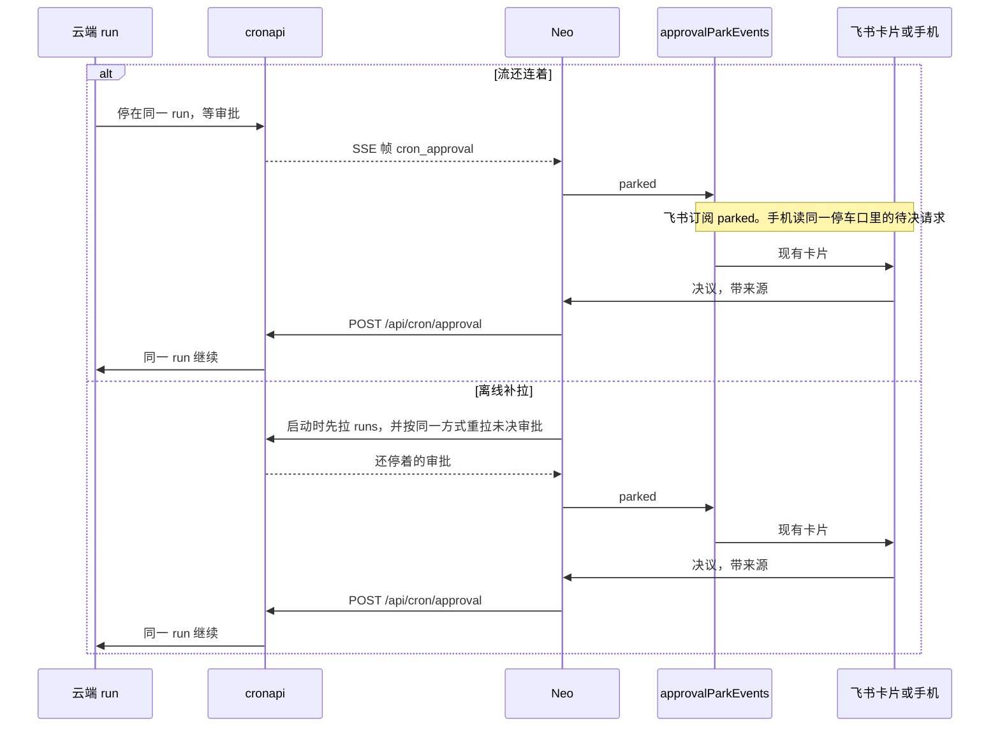

# ADR-082：云端定时任务的审批往返

- 状态：**草稿·待爸拍板**
- 单号：N-CLOUD-CRON-APPROVAL-DESIGN
- 基线：`origin/main@a567f8513`（`a567f8513c60412a965ca692f14ddb96aad36219`）
- 相关：ADR-075（同一 run 上的停车与续跑）、[ADR-076](./ADR-076-execution-environment.md)（执行环境；N-CLOUD-ENV-ADR 在写，本单不改那个文件）、N-CLOUD-CRON-APPROVAL-PROBE（实测，写本 ADR 时证据档缺失）、N-CLOUD-CRON-APPROVAL-IMPL（拍板后的施工单，依赖本单）

## 术语

| 词 | 含义 |
|----|------|
| 窄门 | cronapi 对云端只暴露一份显式名单。名单里没有的方法进不去。禁止用前缀匹配把「像 cron 的名字」放进来 |
| 审批帧 | 云端 run 停住等人时，cronapi 转发给 Neo 的一条 SSE。事件名 `cron_approval`。载荷只有最小集那一行，不带会话正文 |
| 同一 run | 批准之后继续的是已经停着的那次云端 run。Neo 不再发一次 `cron.run`，也不新开一次 agentTurn |
| 离线补拉 | Neo 重新连上时，先把错过的运行记录拉回来，再用同一模式把还停着的审批拉回来，然后才听流 |
| 停车时限 | 现有无人值守停车的 24 小时兜底。云端审批沿用这一限，不另定一个数 |
| 待核 (部署侧) | 要网关或集群才能证实的行为。code-agent 与本机能打开的树都证不了 |

审批帧载荷最小集：jobId runId approvalId tool riskClass parkedAt

## 现状锚点

行号在基线 `a567f8513` 上打开文件核对过。任务书里的约数有漂移，下表以打开后的行为准。

lobster-sealos 不在本机。任务书给出的检出路径打不开；全盘、本账号可见的远端仓库、私档里都没有 `cronapi/server.mjs`。下表 cronapi 行只写文件与标识符，行号写「未复核」，不把任务书里的约数抄成已核对的行号。

| # | 事实 | 锚点 |
|---|------|------|
| 1 | 显式白名单这个名字，编排方指到 cronapi 的 `ALLOWED_METHODS`。本机未打开该文件 | `lobster-sealos/cronapi/server.mjs:ALLOWED_METHODS:未复核` |
| 2 | 只读子集这个名字，编排方指到 `READ_ONLY_METHODS`。本机未打开 | `lobster-sealos/cronapi/server.mjs:READ_ONLY_METHODS:未复核` |
| 3 | 未列入的方法应 404，错误码 `method_not_allowed`。编排方指到 `handleRpc`。本机未打开 | `lobster-sealos/cronapi/server.mjs:handleRpc:未复核` |
| 4 | 事件流把事件名写死成 `event: cron`。编排方指到 `handleEvents`。本机未打开 | `lobster-sealos/cronapi/server.mjs:handleEvents:未复核` |
| 5 | 路由正则被编排方写成 `^/api/cron/([a-z]+)$`。按这个形状，`/api/cron/approval` 会映到方法名 `cron.approval`，今天不在名单里就会 404。正则本身未复核 | `lobster-sealos/cronapi/server.mjs:route:未复核` |
| 6 | 网关链路上只转发 `frame.event === 'cron'`。编排方指到过滤处与 `onEvent`。本机未打开，也没有 `~/.zagent/openclaw` 可对 | `lobster-sealos/cronapi:frame.event:未复核` |
| 7 | 「只有 cron 事件离开 pod」写在 cronapi README。本机未打开 README | `lobster-sealos/cronapi/README.md:non-leak:未复核` |
| 8 | 锁住白名单形状的测试，编排方指到 `server.test.mjs`。本机未打开 | `lobster-sealos/cronapi/server.test.mjs:allow-list-shape:未复核` |
| 9 | Neo 看到的运行记录没有审批字段，也没有预算字段 | `src/host/cron/cronApiClient.ts:CronApiRun:8` |
| 10 | 声明到云端的载荷是 `agentTurn` 或 `command`。函数体里没有 `maxRunBudget`，也没有审批字段 | `src/host/cron/cronApiClient.ts:actionToCronApiPayload:72` |
| 11 | 云端任务固定 `sessionTarget: 'isolated'` | `src/host/cron/cronApiClient.ts:sessionTarget:136` |
| 12 | 创建请求体是声明键加上上面的可变字段，仍然没有预算、没有审批 | `src/host/cron/cronApiClient.ts:buildCronApiAddParams:147` |
| 13 | 客户端类。实际打到的路径是 add、update、remove、list、run、`runs?scope=all`、`/api/cron/events` | `src/host/cron/cronApiClient.ts:CronApiClient:237` |
| 14 | 拉运行记录的方法是 `listRuns` | `src/host/cron/cronApiClient.ts:listRuns:281` |
| 15 | 每次连上流之前先 `listRuns()`，再打开 SSE | `src/host/cron/cronApiClient.ts:connectOnce:301` |
| 16 | 帧解析只认 `event: cron`。其它事件名直接丢掉 | `src/host/cron/cronApiClient.ts:parseEventFrame:366` |
| 17 | 云端运行时把帧投影成执行记录。文件里没有 approval，也没有 park | `src/host/cron/cronCloudRuntime.ts:CronCloudRuntime:48` |
| 18 | 投影只处理 started / finished，不处理审批 | `src/host/cron/cronCloudRuntime.ts:projectRun:199` |
| 19 | 云端地址和令牌来自设置 `cronCloud.baseUrl` / `cronCloud.token` | `src/host/cron/cronService.ts:cronCloud:120` |
| 20 | 设置里这两项是可选字符串。注释写明租户和凭据归属还没定 | `src/shared/contract/settings.ts:cronCloud:257` |
| 21 | 本地执行才套上单次美元闸。云端分支只调用 `cloudRuntime.runJob`，不套这道闸。这次调用返回后，本地执行记录被标成 completed，那是触发回执；云端 agent 的 started / finished 另由 SSE 投影 | `src/host/cron/cronService.ts:runsOn:706` |
| 22 | 函数本体在这一行。只有本地 agent 路径在 857 行调用它。云端分支在 706 行走 `runJob`，不会建这个会话 | `src/host/cron/cronService.ts:createCronAgentSession:1066` |
| 23 | 单次美元闸的调用点在本地 `sendMessage` 外面 | `src/host/cron/cronService.ts:runWithCronJobBudget:899` |
| 24 | 任务定义上的 `maxRunBudget` 只在本仓做数值校验，创建请求不把它带出本机 | `src/shared/contract/cron.ts:maxRunBudget:71` |
| 25 | 停车总线。事件名就是 `parked` 与 `resolved` | `src/host/agent/approvalParkEvents.ts:approvalParkEvents:31` |
| 26 | 飞书继电器订阅 `parked`。`start` 从 131 行开始。文件在通道目录，不在 `src/host/agent/` | `src/host/channels/feishu/approvalFeishuRelay.ts:parked:134` |
| 27 | `resolved` 的订阅在这一行 | `src/host/channels/feishu/approvalFeishuRelay.ts:resolved:137` |
| 28 | 没有 `sessionId` 就不发飞书卡片。`onParked` 从 146 行开始。收件箱仍可处理 | `src/host/channels/feishu/approvalFeishuRelay.ts:sessionId:154` |
| 29 | 进程级启动入口 | `src/host/channels/feishu/approvalFeishuRelay.ts:initApprovalFeishuRelay:296` |
| 30 | 飞书按钮在 `onCardAction`（200 行）里汇入现有裁决口 | `src/host/channels/feishu/approvalFeishuRelay.ts:resolveParkedApproval:251` |
| 31 | 停车裁决口。重复决议以台账更新行数为准，第二次作废 | `src/host/agent/orchestratorPermissions.ts:resolveParkedApproval:183` |
| 32 | 目录扩权进 `parkApproval`。`requestPermission` 从 315 行开始 | `src/host/agent/orchestratorPermissions.ts:parkApproval:337` |
| 33 | 无人值守与语音派走 `parkApproval`，并写入 `pending_approvals` | `src/host/agent/orchestratorPermissions.ts:parkApproval:374` |
| 34 | `parkApproval` 本体。超时用现有停车时限或旧的 60 秒终态 | `src/host/agent/orchestratorPermissions.ts:parkApproval:501` |
| 35 | 停车时限常量：24 小时。注释写明 cron 在这段时间内保持同一 run | `src/shared/constants/timeouts.ts:PARKED_APPROVAL:93` |
| 36 | 手机卡是本机待决请求的投影，类注释写在上一行 | `src/host/services/companion/CompanionApprovalService.ts:CompanionApprovalService:16` |
| 37 | 没有 `sessionId` 的请求，手机不展示卡片。判断在下一行 | `src/host/services/companion/CompanionApprovalService.ts:card:42` |
| 38 | 手机点允许或拒绝从这里进本机投递 | `src/host/services/companion/CompanionApprovalService.ts:respond:109` |
| 39 | 面板或 API 创建的任务可以没有源会话 | `src/host/cron/cronAutomationBridge.ts:readCronSourceSessionId:44` |

云端运行时文件用 `approval` 与 `park` 检索，零命中。这与第 17、18 行一致。

## 已定

下面六条是 2026-09-30 编排已定的口径。写在这里的是定论。

1. 白名单继续逐项枚举。永远不改成前缀匹配。要放进窄门的名字必须单独出现在名单里，并有测试把形状锁住。
2. 推荐放宽的幅度就是两项，不多不少：转发一条新的 SSE，事件名 `cron_approval`；增加一个决议入口 `POST /api/cron/approval`。这两项进不进窄门，是下面那一处拍板。
3. 审批帧只带最小集那六个字段。不带会话正文、提示词、工具参数或文件内容。这是为了保住「只有 cron 事件离开 pod」：离开 pod 的仍然是 cron 事件，只是多一种事件名，载荷里没有会话内容。
4. Neo 把这条帧转成现有的 `parked` / `resolved`，复用飞书继电器和手机审批。不新做卡片格式。接法按现有代码，不另起一条通道：
   - `approvalId` 映射到停车事件的 `id`，`tool` 与 `riskClass` 原样映射。`jobId`、`runId` 和停车时刻留在停车记录里，供补拉和 POST 使用，不写进卡片文案。
   - 飞书与手机都要一个它们已经认得的 `sessionId`。有源会话就用 `readCronSourceSessionId`。飞书还要求这个会话是飞书或 Lark 通道会话，否则继电器按今天的规则不发卡片。
   - 手机不订阅停车总线，它读的是本机尚未解决的审批请求。帧必须进现有停车口（`pending_approvals` 加上内存里的待决请求），只 emit 一个没有会话的事件到不了手机。
   - 没有源会话的任务，收件箱仍是主入口。不为它们新做卡片，也不新开一轮 agent。
5. 离线补拉复用启动时先 `listRuns()` 再打开流的顺序。未决审批用同一次启动拉取补上，不依赖「流没断过」。读法：网关如果已经在 `cron.runs` 的响应里带上未决审批，就折进这次 `listRuns`，不增加第三项名单。网关今天不带的话，在同一个 `approval` 路径上用 GET 去读。这会不会变成名单上的第三项，取决于名单是按方法名还是按方法名加动词。本机打不开 cronapi，网关响应里有没有未决审批也看不到，两处都标待核 (部署侧)。推荐形态仍然是折进 `cron.runs`，避免第三项。
6. 拍板之后的施工单是 `N-CLOUD-CRON-APPROVAL-IMPL`，依赖本单。一行范围：Neo 的 `parseEventFrame` 学会 `cron_approval`，转成停车事件，并把决议 POST 回去；lobster-sealos 加上这两项显式入口和 `server.test.mjs` 用例，并做一次反向变异。本单不写那张施工单的任务书。

## 令牌能碰到什么

今天这份云端令牌只随定时任务进出。Neo 用它创建、修改、删除、列出、触发任务，拉运行记录，听 `event: cron`。客户端没有审批读，也没有决议写。编排方称 cronapi 名单是八个显式方法（get、list、status、add、update、remove、run、runs），未列入的方法 404。方法名单的文件行号未复核；Neo 侧能证实的是上面这张调用表。

放宽成 A 之后，同一枚令牌还能读到审批元数据（最小集，没有会话正文），并能替一次已经停着的动作提交决议。拿到令牌的人可以批准那次停车，让云端 run 把正在等的动作做完。动作本身可能是写文件、跑命令或访问网络，停在那里就是因为它过不了现有审批。

推荐把下面四条和 A 绑在一起。少一条，就不该放宽。

| 缓解 | 做什么 | 理由 |
|---|---|---|
| 一次性随机数 | 每个审批一个随机数，绑在 `approvalId` 与 `runId` 上。POST 没有这个数就拒绝。用过即废 | 偷到令牌还不等于能批。没有这次停车发出去的数，决议不成立 |
| 过期 | 与停车时限对齐，24 小时。过期后的 POST 拒绝，这次 run 按拒绝收口 | 停着的审批不能无限期被批 |
| 幂等 | 同一个 `approvalId` 第一次决议生效。重复 POST 返回同一结果，不执行第二次 | 飞书重推、手机重试、补拉重放都不能让动作跑两遍 |
| 来源记账 | 决议写明飞书、手机或本机界面。超时记成超时，不记成真人 | 事后要能看出是谁批的 |

这四条是 A 的做法，不是另一处拍板。B 或 C 不放宽窄门，令牌的能力维持今天这样。

## 语义

批准：云端继续同一次 run。Neo 不调用 `runJob`，不新声明一次 agentTurn。网关是否真的按同一个 `runId` 接着跑，两仓都证不了，标待核 (部署侧)。设计要求是这一条；证不了的部分留在部署侧，不改成「再跑一遍」。

超时：沿用 `PARKED_APPROVAL`（24 小时）。普通无人值守走的是这档兜底，不是旧的 60 秒终态。到点按拒绝收口。网关侧要不要自己计这 24 小时，标待核 (部署侧)。本机到点就不再 POST 允许。

人不在本机界面：飞书或手机把同一次审批做完，来源按真实入口记账。进程还在时，这就是现有继电器和手机投影已经在做的事，云端帧接进同一口即可。

本机进程不在：现有飞书点击和手机 `approval.respond` 都终结在本机 Neo。进程不在，卡片没有接收方，POST 也发不出去，云端 run 只能继续停着，直到本机按离线补拉把未决审批拉回来。网关有没有一条不经本机的审批入口，本机没有 `~/.zagent/openclaw`，cronapi 也没打开，标待核 (部署侧)。

来源：POST 里带飞书、手机或本机界面。今天的裁决口不记录这个来源；手机把设备号记在自己的决定上，飞书成功点击也不把「飞书」写进运行记录。`CronApiRun` 没有来源字段。IMPL 在 POST 和本机投影里写上来源。网关是否把来源落进云端 run 记录，标待核 (部署侧)。记账必须真实：飞书点的不能写成手机，超时不能写成人。

## PROBE 三种结果

写本 ADR 时，`N-CLOUD-CRON-APPROVAL-PROBE` 的证据档不存在，任务书旁边也没有副本。文件不是 BLOCKED，也不是 INVALID，就是缺失。三种处置都写在下面。实测支持的一支：**待 PROBE 证据**。三支都还不能勾。

| 实测结果 | 处置 |
|---|---|
| 被拒 | A 仍是让云端审批成立的那条路。只有拍板拒绝放宽时，B 或 C 才临时顶上 |
| 静默放行 | 危险。B 立刻成为过渡防线：云端任务禁止走要审批的动作，创建时告警。直到 A 落地再撤掉这道禁令 |
| 卡死，或静默拒绝而且窄门不能放宽 | C。这次 run 以摘要结束，说明有一件事要人批；人再手工触发一版已经批过的任务。不放宽窄门，也不续上同一次 run |

`maxRunBudget`：本仓已经能看的结论是不传。`actionToCronApiPayload` 与 `buildCronApiAddParams` 的请求体都没有这个字段；本地执行才用 `runWithCronJobBudget`，云端执行不套它。含义是：云端 agentTurn 在本机这道单次美元闸外面。共享的无人值守预算池也包在本机这次 `sendMessage` 上，云端那次模型调用看不到它。云端 `cron.get` 回读里有没有这个字段，是 PROBE 的活体结论，**待 PROBE 证据**。

## Decision needed [安全边界]

是否放宽云端窄门。放宽的话只加两项：转发 `event: cron_approval`，以及 `POST /api/cron/approval`。

推荐 **A**。

- **A。** 加上面这两项，并带上「令牌能碰到什么」里的四条缓解。云端 run 可以停住，本机用现有卡片问人，批准后再续上同一次 run。代价：令牌从「只能动定时任务」变成「还能读审批元数据、还能提交决议」。缓解不齐就不要放。网关能不能按同一 `runId` 续跑，仍是待核 (部署侧)；这一条证不了之前，IMPL 可以先把帧和 POST 接上，但不能宣称续跑已经在集群上证实。
- **B。** 不放宽。云端任务不得使用要审批的动作。在 `actionToCronApiPayload` 交给云端的提示里写明，并在创建云端任务时告警。审批只留在本机。代价：云端任务遇到要人拿主意的步骤做不完；人得到本机去做。静默放行一旦被 PROBE 证实，B 要立刻顶上，不等拍板的空窗把危险动作放出去。
- **C。** 不放宽，改成一问一答。这次 run 正常结束，摘要写明要人批准什么。人再手工触发一版已经批过的任务。代价：续不上同一次 run。停之前已经发生的副作用还在，第二次是新的 run，可能重复劳动。窄门加不了、或者云端只会卡死时，用 C，避免永远停在 `started`。

## 非目标

- 本单不改代码。
- 不部署集群。只有爸明确要求时才部署。
- 不改飞书卡片的格式。

## 施工单

`N-CLOUD-CRON-APPROVAL-IMPL` 依赖本单。范围就一行：Neo 的 `parseEventFrame` 学会新帧并转成停车事件、把决议 POST 回去；lobster-sealos 加上 `event: cron_approval` 与 `POST /api/cron/approval` 以及对应的 `server.test.mjs` 用例；做一次反向变异。
