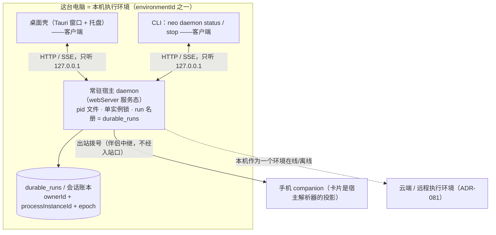
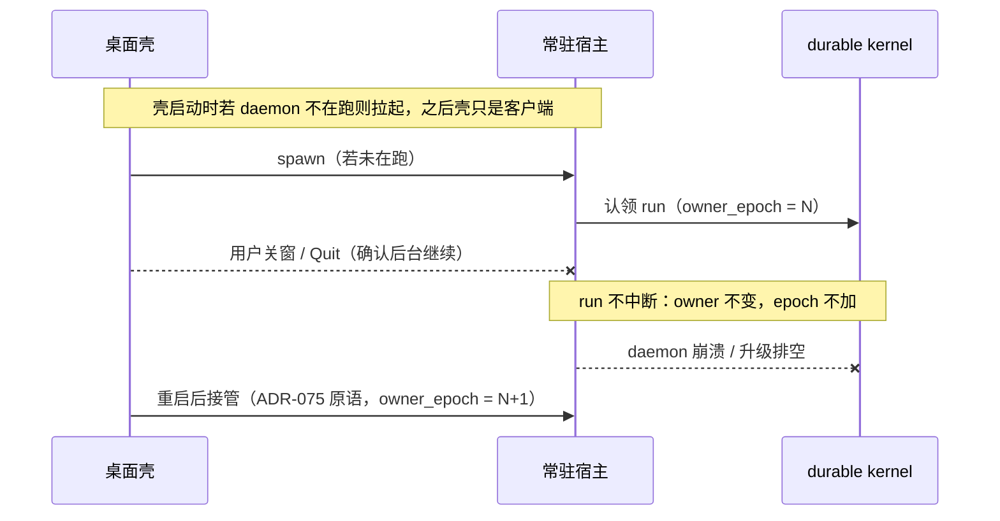

# ADR-083：桌面常驻宿主（执行进程与 Tauri 壳解耦）

- 状态：**草稿·待爸拍板**
- 单号：N-RESIDENT-HOST-ADR（只定架构，不施工；本文不含任何代码改动）
- 基线：`origin/main@d9f25f664`（`d9f25f66482a`，HEAD 即基线，工作树干净）
- 证据：本机证据档 `~/work/evidence/N-RESIDENT-HOST-ADR.md`。竞品（Codex）事实按任务书文本引用，逐条标注「per ticket text, not re-verified」——本机无私档原文与 codex-rs 树，未复核
- 相关：ADR-037（durable kernel，一 run 一 owner）、[ADR-075](./ADR-075-foreground-restart-resume.md)（进程真死之后的续跑；其划界把本单点名为邻居）、[ADR-081](./ADR-081-execution-environment.md)（执行环境；本机是其中之一）、N-QUIT-RUNNING-CONFIRM（Quit 确认，未施工）、N-CLOUD-HANDOFF（合盖续跑，未施工）、N-COMPANION-KILLSWITCH-HOST（在途，本单不碰其文件）

## 拓扑与 run 归属（先图后文）

图一：常驻宿主落地后的进程拓扑。虚线框内是同一台电脑；**run 的活主人由 `owner_epoch` 决定，不由「谁开着窗口」决定**。

图二：主人怎么换。常驻化**不新增** owner 概念，只是让换主人这件事更少发生；真发生时走 ADR-075 已有的接管原语。

## 现状锚点

行号在基线 `d9f25f664` 上核对过；以后以 grep 为准。

| # | 事实 | 锚点 |
|---|------|------|
| 1 | 关窗已经被拦下：`CloseRequested` 里 `prevent_close()` + 最小化，壳与 webServer 都活着，run 不中断 | `src-tauri/src/main.rs:4160-4167` |
| 2 | 真正的杀点是 Quit：托盘菜单 `.quit()` 与 Cmd+Q 走 `ExitRequested` → `cleanup_server`，停掉 webServer | `src-tauri/src/main.rs:3477`、`:4172-4174`、`:2261-2264` |
| 3 | 升级是计划内的杀：安装前由渲染器显式调 `shutdown_web_server_for_update` 优雅停；Windows 上 updater 的 install 内部直接 `std::process::exit(0)`，cleanup 只能靠这条先行命令 | `src-tauri/src/main.rs:2266-2290` |
| 4 | 宿主只防闲睡不防合盖：注释原文「Lid-close sleep is OS-owned」 | `src/host/services/desktop/idleSleepInhibitor.ts:14` |
| 5 | 单实例闸在壳层：第二个实例直接退出并聚焦已有窗口 | `src-tauri/src/main.rs:3942-3952`（tauri-plugin-single-instance） |
| 6 | webServer 默认只听 `127.0.0.1:8180`，HOST 可被 `WEB_HOST` 覆盖 | `src/shared/constants/webServer.ts:7-10`；`src/web/webServer.ts:1097` |
| 7 | 服务模式已存在：`CODE_AGENT_SERVICE_MODE` + tini 常驻的 Linux 镜像，ENTRYPOINT 就是 webServer 入口 | `src/shared/constants/webServer.ts:16`；`scripts/ci/Dockerfile.linux-web-server:39-52` |
| 8 | 一 run 一 owner：`ownerId + processInstanceId + epoch`，租约到期后 epoch 加一交接，旧 owner 的后续写入全部 fail-closed | `docs/architecture/durable-run-kernel.md:116-120`；ADR-037 决策 2 |
| 9 | CLI 二进制名是 `neo`（bin 指到 `dist/cli/index.cjs`）；现有命令没有 daemon 子命令，`serve` 是另一套 CLI 自带 HTTP 服务 | `package.json:8-10`；`src/cli/commands/` |
| 10 | 手机卡片是宿主进程解析器的投影，审批权威在宿主（桌面）侧 | ADR-081 锚点 12（`CompanionApprovalService.ts:15`） |
| 11 | Windows 上 webServer 子进程被 Job 对象收编（壳死子进程死），这是常驻化在 Windows 的结构前提 | `src-tauri/src/main.rs:390`、`:3937-3941` |

## Ownership：主从关系与 owner 判定

**主从。** 常驻宿主是**主**：run 的执行体、账本写者、回环端口的持有者。桌面壳、CLI、手机 companion 是**从**（客户端）：壳是带窗口的客户端，CLI 是无窗口客户端，手机是经中继的投影端。今天这个「主」其实已经存在——就是壳 spawn 出来的那个 webServer 子进程——只是它的生死被壳挟持。本 ADR 不新造第二个引擎进程，把**同一个进程**的生死与壳解耦。

**owner 判定。** 不引入新的 owner 概念。run 的活主人照旧是 durable kernel 的 `ownerId + processInstanceId + epoch`（锚点 8）：**`owner_epoch` 高者为当前主人**；租约内别人不能认领，交接必经 epoch 加一，被换下的旧 owner 一切写入 fail-closed。常驻化之后 ownerId 稳定为 daemon 的 processInstanceId，效果是「换主人」更少发生——关窗不再触发任何交接；只有 daemon 崩溃、升级排空、用户显式 stop 才走 epoch 加一的接管，而接管原语就是 ADR-075 已拍板的那套，本 ADR 不另写第二套。

**端口与单实例。** 单实例从一层变两层：壳层维持现状（tauri-plugin-single-instance 保证「双击图标只有一个窗口」，锚点 5）；daemon 层新增 pid 文件 + 回环端口探测，保证只有一个执行体，重复拉起直接退出并把自己交给已有 daemon。壳死而 daemon 活是合法状态（任务继续）；daemon 死而壳在，壳下次启动负责拉起。daemon 永远只听回环（锚点 6），不因常驻而多开任何入站口。

**Tauri 打包与自启。** node 运行时与 webServer 都在 app bundle 内，daemon 不需要新二进制，就是今天被 spawn 的那个入口；要改的是生命周期语义——壳退出时对 webServer 的处理从「无条件杀」改为「按配置留活」。登录自启（macOS LaunchAgent / Windows Run 键）是否默认开见 Decision needed。竞品形态：pid 文件 + 单实例 + 启动即自拉起为默认开（per ticket text, not re-verified）。Windows 有结构前提要先解：webServer 子进程今天被 Job 收编（锚点 11），常驻化在 Windows 首刀要么重估 Job 边界要么不做，见 First cut。

**与 VPS 服务模式的关系。** `CODE_AGENT_SERVICE_MODE=1` 的 Linux 容器（tini + `node dist/web/webServer.cjs`，锚点 7）是**同一个 webServer 入口**的服务器形态，由容器编排器管生命周期。任务书说 VPS 部署把 `WEB_HOST` 钉在 127.0.0.1、无 ingress（per ticket text, not re-verified；仓内镜像内环境是 `WEB_HOST=0.0.0.0` + `EXPOSE 8180`，钉扎发生在部署侧、不在仓内，`Dockerfile.linux-web-server:41-45`）。两者的关系：共用入口与服务模式合同，**互不管理**——VPS 的主人是编排器，桌面的主人是用户会话；桌面 daemon 不从 VPS 模式继承任何生命周期约定，也不给它新增入站面。

## Four situations：关窗 / Quit / 合盖 / 升级

| 情形 | 今天：正在跑的任务 | 落地后：正在跑的任务 | 用户看到什么 |
|---|---|---|---|
| 关窗（点关闭按钮） | 不中断。`CloseRequested` 被 `prevent_close()` 拦下并最小化（锚点 1），壳与 webServer 都活着 | 不中断，且壳从此可有可无：run 由 daemon 持有，重开窗口即续看 | 与今天一致：窗口收起、任务继续、托盘还在；差别在重开窗口不再依赖原壳进程活着 |
| Quit（Cmd+Q / 托盘退出） | 直接杀：`ExitRequested → cleanup_server` 停 webServer（锚点 2），run 被终止，无任何确认 | **有任务在跑必须先弹确认对话框**（对齐 N-QUIT-RUNNING-CONFIRM）。方案 A 下确认框给两个出口：「后台继续」（只关壳，run 转 daemon 继续跑）与「停止并退出」（优雅排空后真停）；无任务在跑时 Quit 直接退、不弹框 | 今天：有任务也被无声杀掉。落地后：先见确认框，说清「还有 N 个任务在跑」及两个出口的后果，不会无声丢活 |
| 合盖 | OS-owned：宿主只防闲睡不防合盖（锚点 4），合盖睡眠由操作系统决定，本机执行体全部暂停 | 不变，仍 OS-owned——常驻宿主**不**试图阻止合盖睡眠，本机环境随睡眠离线 | 本机离线；已升到云端的轮继续由云端工人跑完（ADR-081 §断线、心跳、会话保留）。合盖后的本机续跑属 N-CLOUD-HANDOFF，本 ADR 不做 |
| 升级（自动更新） | 计划内中断：安装前显式优雅停 webServer（锚点 3）；Windows 上 updater 内部 `exit(0)`，优雅停只能靠渲染器先行调用那条命令 | 仍计划内中断，但停机窗口收窄：daemon 优雅排空（未决 op 收口，语义同 ADR-075）后停，新壳首启拉起新 daemon，run 按既有 sweep 语义接回 | 「更新装完会接着跑」而不是「更新杀了我的任务」；等待期间 run 显示暂停/续跑信号，不显示失败 |

## Relation to ADR-081：本机是执行环境之一

- **不新增地点种类。** ADR-081 的三态里「这台电脑」就是本机执行环境，`environmentId` 包含本机。常驻宿主是环境之下的进程拓扑，不是新的地点；它只把「本机环境在线」的窗口拉长——ADR-081 §断线、心跳、会话保留已写明「常驻宿主若以后让关窗不等于杀进程，只改变『本机环境离线』的时刻，不改变云端轮的续跑」，本 ADR 就是那句话的落地件。
- **合同字段原文照用，不造平行对象。** daemon 之上的一轮仍写 ADR-081 的 `TurnEnvironmentSelection`：`environmentId`、`cwd`、`workspaceRoots`、`config`，外层 `protocolVersion: 'environment-selection/1'`。daemon 不出现在这份合同里；本 ADR 不新增第二个地点字段、第二套路径对象或第二个 `environmentId` 发号者。
- **账本不换边。** 关窗前后是同一条 `sessionId`、同一个 `runId`（ADR-033 决策 4″，经 ADR-081 引用）。attach 是重新订阅同一条流，不产生新会话、不拷贝会话副本。

## First cut：首张施工单的范围与验收

本票只写本 ADR，无代码。首张施工单（单号由编排取）只做最小刀，mac 先行：

**范围**

1. daemon 存活性：壳退出（含 Quit 确认「后台继续」）不杀 webServer 进程；pid 文件 + 单实例锁；空闲去留与自启按下述 Decision needed 的拍板结果
2. Quit 确认：有任务在跑时弹确认（交互与文案对齐 N-QUIT-RUNNING-CONFIRM，那张单定稿）
3. attach 与观测：壳重启后 attach 回同一 `runId` 的 live 流（复用 ADR-075 接管原语）；`neo daemon status` 列在跑的 run（读 `durable_runs` 名册）、`neo daemon stop` 走优雅排空

**不做**：合盖（OS-owned，任何「防合盖」逻辑都不加）；手机接管的任何扩展（配对权威进程随 webServer 变成 daemon，手机侧协议无感，能力不扩）；云端侧任何施工（ADR-081 的七张单自管）；Windows Job 重估（单独开单，见 Decision needed）；IdleSleepInhibitor 不动。

**验收**

- 关窗 + Quit「后台继续」后，任务仍在跑且继续写账本；`neo daemon status` 可见
- 杀 daemon，壳重启后 run 被 sweep 按 `crash_or_quit` 接回，`owner_epoch` 加一，账本无 stale owner 写入
- 有任务在跑时 Quit 不弹框直接停 = 红；daemon 停止时不收口未决 op = 红
- 合盖行为与今天完全一致（不新增任何抑制逻辑）

### Decision needed [架构] 常驻宿主从哪里来

- **方案 A（任务书候选，本 ADR 推荐）**：把现有 webServer 服务态升格为 daemon——pid 文件、单实例锁、`durable_runs` 当 run 名册；桌面与 CLI 变客户端；新增 `neo daemon status/stop` 与 session attach / logs；`owner_epoch` 决定 daemon 与壳谁是当前主人。理由：不造第二个进程、不造第二套引擎；durable kernel、回环监听、服务模式合同（锚点 6-8）都已存在；接管复用 ADR-075。风险：Windows Job 收编与升级 cleanup 语义要重估，首刀限 mac。
- **方案 B**：壳继续拥有进程，只补 Quit 确认对话框（N-QUIT-RUNNING-CONFIRM 的最小做法）。代价：收益句不成立——关窗虽然已不杀，但 Quit、壳崩溃、升级仍然打断，用户仍要为长任务保持 app 开着；壳一崩还是得靠 ADR-075 事后恢复。
- **方案 C**：本机不做常驻，把续跑推给云端（N-CLOUD-HANDOFF）。代价：云端合同刚接受、尚未施工；把「在这台电脑上跑」变成「把活儿送上云」，威胁模型、凭据边界、成本全变；人在电脑前只是关了窗口的场景，用云端接是杀鸡用牛刀。
- **推荐**：A（首刀 mac）。Quit 确认对话框独立于三个方案都要做，随首刀并入。

### Decision needed [默认值] 空闲去留、自启、排空宽限

- 空闲（无 run、无配对伴侣、无等审批）时 daemon 是否随壳退出：推荐**随壳退出**（空闲不驻留）；配对伴侣在线时除外——今天配对就在防闲睡，常驻与它同向。备选：常驻到登出。
- 登录自启：推荐**默认关、设置里可开**。默认驻留一个能执行命令的进程属于要用户知情的选择。竞品默认开（per ticket text, not re-verified），不照抄。
- 优雅停排空宽限：竞品默认 60 秒、上限 300 秒（per ticket text, not re-verified）。本 ADR 不钉数，数值由首张施工单定并进 `shared/constants`；恢复语义由 ADR-075 定（`crash_or_quit` 自动续），不照抄竞品「崩溃不自动恢复」的口径。

## 划界

| 邻居 | 它管 | 本 ADR 管 | 互不吸收 |
|---|---|---|---|
| ADR-075 | 进程**真的死了**之后怎么续跑 | 让进程**不必死**（解耦） | 常驻宿主减少 ADR-075 的触发，不代替它；接管一律走 ADR-075 原语，本 ADR 不引入 daemon 专属恢复路径 |
| ADR-081 | 逐轮选地点的合同 | 本机环境之下的进程拓扑 | `TurnEnvironmentSelection` 字段照用不新造；常驻只改变本机环境离线的时刻 |
| N-CLOUD-HANDOFF | 合盖后的云端续跑 | 关窗 / Quit 的本机续跑 | 合盖仍 OS-owned，两条线不叠 |
| N-QUIT-RUNNING-CONFIRM | Quit 确认的交互与文案 | 确认之后任务的归宿 | 对齐点：任务在跑必弹框；A 之下确认框多给「后台继续」出口 |
| N-COMPANION-KILLSWITCH-HOST | 在途 | 不碰其文件 | 权威进程从壳内 webServer 变为 daemon，配对语义不变 |

## 预期收益

关窗不打断任务：用户让电脑干一个长活儿时，**不必为一个还在跑的任务保持窗口开着**——关掉窗口去干别的，任务继续跑、账本继续写、回来重开窗口就续上（同一条会话、同一个 run）。配对手机上的审批卡照常到达，因为权威进程还活着。配套收益：Quit 不再无声杀任务（N-QUIT-RUNNING-CONFIRM 的确认框有了「后台继续」这个不丢活的出口），升级的停机窗口收窄到排空所需的时间。
