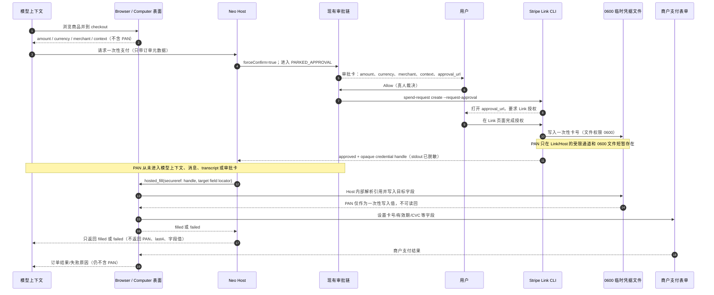
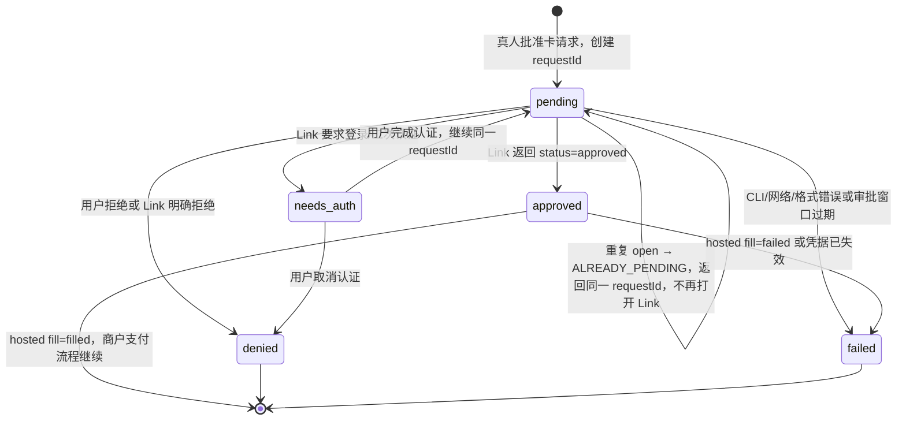

# ADR-084：人审一次性支付凭据原语（Stripe Link）

- 状态：**草稿·待爸拍板**
- 单号：N-PAY-ONESHOTCARD
- 基线：origin/main@8dbf437dbe6586422dca991c32be27a7e413573e
- 证据：~/work/evidence/N-PAY-ONESHOTCARD.md
- 相关：ADR-046（Surface Execution）、ADR-050（凭据引用 secureref:）、ADR-066（出网与凭据哨兵）、ADR-075（durable run 与审批停车）

## 已定口径（本 ADR 只记录，不重新决策）

- 2026-08-30 已决定做，但不是 P0；先出 ADR，后续再施工。
- 连接器包裹官方 @stripe/link-cli，调用 spend-request create --request-approval；实现可落在 MCP 或 skill，但不自行发卡。
- 依据 2026-09-28 的官方限额研究：单笔/单日上限 500 美元，月上限 20,000 美元，审批窗口 10 分钟。卡号只写入权限 0600 的文件，stdout 脱敏，永不进入对话；status 不是 approved 就不产生可填入的卡。HTTP 402 走 mpp pay，不把 PAN 交给付款端。
- 消费者侧只做美国/加拿大。中国大陆支付轨道是另单 N-PAY-ALIPAY-AGENT，但复用本 ADR 的审批卡。
- 本 ADR 不创建 Stripe 账号、不安装依赖、不调用 Stripe；私档竞品材料 code-agent-private-archive/docs/competitive/2026-08-30-Grok-Bot-0.30-代买小组模板-实现挖潜.html 在本机不可读，以下以任务书摘要和仓内锚点为证据。

## 问题、边界与现状

支付需要一个可审计的人工放行点，又不能让模型拿到可复用的卡号。目标是让用户在已有审批卡上看到金额、商户和用途，亲自打开 Link 授权；Link 负责铸造一次性虚拟卡，Neo 只在受限的托管填表通道里短暂使用它。

范围只包括一笔由真人批准的、一次性消费凭据和它在商户支付表单中的托管填入。它不包括通用发卡、保存 PAN、让模型复制卡号、自动争议款项、中国大陆支付轨道或绕过现有权限链。

仓内现状给出三条硬约束：

1. 审批必须挂在同一条权限链：request.forceConfirm 在 orchestratorPermissions.ts:354-391 让自动批准让路；无人值守/停车审批经 parkApproval 写入 pending approval（orchestratorPermissions.ts:507-523）；allow_standing 的长期授权铸造只在已有裁决口发生（orchestratorPermissions.ts:241-249）。支付不得另造第二个审批系统，也不得因为 Link 是连接器就获得 standing grant。
2. 凭据引用的唯一前缀是 MCP_SECRET_REF_PREFIX = secureref:（src/shared/constants/misc.ts:134-135）。敏感检测器已把 Stripe secret key 识别为 stripe_key（src/host/security/sensitiveDetector.ts:34-36、253-259）；这只证明现有密钥检测，不等于允许 PAN 进入日志或上下文。
3. 当前 Browser/Computer 工具没有“模型看不见值”的填表入口。本轮对 browserControl、computerUse、browser infra 和 desktop 工具做的精确 grep 无命中；现有 schema 仍是普通 type/set_value 之类的模型可见输入。因此托管填表必须作为新的、带 secret fence 的原语设计，而不是给现有 type 动作塞一个特殊字符串。

## 端到端顺序与 PAN 边界

图中的“PAN 只在受限通道”是必须可测试的边界：Link CLI 的 stdout、Host 日志、审批事件、工具结果、模型请求、transcript、截图/DOM/AX 观察和错误对象均不得承载 PAN。若 status 不是 approved，Host 不创建或暴露任何可填入凭据；只把失败原因投影给模型。

## 状态机与幂等

- pending 是唯一允许打开 approval_url 的状态。ALREADY_PENDING 是 Host 的并发闸：同一 runId、merchant、amount、currency 和未结束 requestId 再次请求时只返回既有状态，不产生第二张卡或第二个 Link 窗口。
- needs_auth（NEEDS_AUTH）是同一回合的可恢复等待，不是 run 终止。用户回到 Link 完成认证后，Host 继续原 requestId；模型只看到等待/失败的稳定投影，不会被迫拿 PAN 重试。
- approved 只表示 Link 已批准并把一次性凭据交给受控填表通道，不表示商户已扣款；商户结果仍由 Browser/Computer 表面返回。
- denied 和 failed 都 fail-closed：不得回落到明文卡号、普通 type 或模型自行重试。是否允许用户显式发起一次新的审批请求，见默认值待拍板块。

## 连接器形状：MCP server 与 skill

| 方案 | 形状 | 优点 | 主要风险 |
|---|---|---|---|
| MCP server 包装（推荐） | Host 启动受控的 @stripe/link-cli MCP wrapper，暴露 typed request/status/approve 结果 | 能复用 MCP 生命周期、权限审计、结构化状态和幂等 requestId；连接器输出可在 Host 边界统一脱敏 | 需要维护子进程生命周期、版本锁和 schema；MCP 服务故障要给出稳定失败码 |
| skill 包装 | skill 编排 CLI 命令、用户提示和重试 | 适合解释流程，初期文案迭代快 | prompt 级编排更容易把 CLI 输出带进模型；难把 ALREADY_PENDING、NEEDS_AUTH 和 secret fence 做成强类型合同 |

推荐先落 MCP wrapper，skill 只作为后续的人话引导层，不能成为凭据边界。该推荐仍需爸爸在下方“顺序”块拍板；两者都必须调用官方 CLI，不得复制发卡协议。

凭据与环境约定：

- 配置、审批卡和 MCP server 参数只存 secureref: 引用（例如 secureref:mcp.stripe_link.token），不存 secret 值；引用解析只能在 Host 的 SecureStorage 边界内完成。
- Host 在启动 CLI 子进程时按最小环境注入真实值；命令行参数、工作目录、MCP tool result、stdout/stderr、审计日志和 transcript 都不得出现 secret 或 PAN。stdout 即使 CLI 意外返回卡号，也要在 wrapper 边界丢弃并记录稳定失败码。
- 0600 文件只放短生命周期、不可被模型读取的凭据材料；文件路径不进模型消息。成功填入、失败、超时或 run 结束时立即清理；清理失败必须 fail-closed 并告警。
- Stripe key 的识别继续复用 sensitiveDetector 的 stripe_key 规则；新增 connector secret 名称走 secureref，不在业务代码硬编码真实 key。

## 托管填表原语（新能力）

### 建议接口

新能力名暂定 hosted_fill，属于 Host 的 Surface Execution 控制面，首期只向 Browser 工具暴露；Computer 工具作为同一 Host 合同的后续适配器，不直接复用普通 type。模型可见的输入和输出应保持如下窄合同：

    hosted_fill({
      credentialRef: "secureref:<opaque-payment-handle>",
      target: {
        surface: "browser",
        sessionId: "<opaque-session-id>",
        fieldLocator: { kind: "role|css|elementRef", value: "<locator>" },
        fieldKind: "card_number|expiry|cvc|cardholder|postal_code"
      },
      approvalId: "<opaque-approval-id>"
    }) -> { status: "filled" | "failed", failureCode?: "<stable-code>" }

credentialRef 只接受 secureref: 句柄，target locator 只选择已观察且仍有效的字段引用；模型不得传入明文值。接口绝不回传 `value`、last4、DOM value、AX value、截图或可逆编码。

### fence

1. Host 先校验 runId、approvalId、region、merchant scope、字段类型和 locator 的新鲜度，再在内存中解析 secureref；解析结果只流入一次性写入函数，禁止进入通用 ToolResult、logger、telemetry、transcript 或上下文 assembler。
2. Browser 适配器使用受控的 DOM/协议级 set-value 通道；Computer 适配器（若后续启用）使用绑定的 AX elementRef。两者都禁止 clipboard 回读、get_value、DOM snapshot、AX value 读取和把输入事件回显给模型。
3. 写入后只验证字段存在、目标页面/表单身份和宿主返回的成功信号；观察、截图、OCR、辅助功能树和浏览器快照对 payment field 一律 redact 或拒绝。模型收到的唯一结果是 filled 或 failed 加稳定 failureCode。
4. 任何异常路径（状态不对、Link 未认证、文件权限不符、页面换 tab、locator 过期、商户拒绝）都清理临时文件并返回 failed；不得为了诊断把 PAN 写入错误文本。
5. 普通 browser type、computer type 和 screenshot 仍保留原语义，但不能接受 secureref: 作为“让模型自己填”的旁路。支付只允许 hosted_fill。

### 反向变异测试

施工单必须带一个 reverse-mutation 测试：用不可混淆的 PAN、有效期、CVC、cardholder、approval_url、merchant、amount、currency 和 context 哨兵值构造 card object，逐一把每个字段反向注入 transcript serializer、model context assembler、tool result、logger、event payload 和截图/DOM 投影；只要任何字段出现在模型请求或会话 transcript，测试就必须变红。测试本身通过的条件是“注入被 fence 捕获并使断言失败”，不能靠事后 redact 把泄漏变成绿色。还要断言正常 hosted_fill 的模型投影严格等于 filled 或 failed。

## 风险与待拍板事项

### 地域、发卡与安全

- 地域硬边界是美国/加拿大消费者侧；运行前校验用户、商户和 Link 账户区域，不满足则 failed，不降级到中国大陆轨道。
- Neo 不发卡、不保存 PAN、不把 PAN 写入云端或 durable run；官方 Link 负责铸造一次性虚拟卡，Neo 只持有短生命周期的受控 handle/文件。
- 支付请求始终 forceConfirm，走 PARKED_APPROVAL/现有 approval card；allow_standing 不得使支付免审。审批卡只展示 amount、currency、merchant、context、approval_url 与状态。
- HTTP 402 是 mpp pay 的支付流程，不能把 PAN 当作 HTTP 402 的补救参数；这两条路径必须在代码和审计事件上分开。

### 超时、退款与争议

官方审批窗口是 10 分钟。窗口内未完成、Link 需要认证但用户未完成、CLI 无法确认 approved，均不得填表或猜测“已扣款”；应清理 handle，回传稳定失败原因并保持原 run 可继续。商户扣款后的退款/争议属于商户和发卡网络/Link 的既有路径，Neo 只保存不含 PAN 的订单引用和用户可操作的支持入口。

### 必须爸爸拍板的块

> **Decision needed [产品口径]**
>
> **推荐：** 面向用户称“人审一次性支付卡”，审批卡只展示金额、币种、商户、用途和 Link 授权入口；模型与用户可见的结果只用“已填入/填入失败”，不展示卡号、last4 或“已扣款”承诺。退款入口展示商户订单/Link 支持入口，不在 Neo 内做自动争议。
>
> **证据：** owner 已定一次性凭据、PAN 不进对话、402 走 mpp pay；现有系统把审批与工具结果分开，仓内没有可安全显示 PAN 的协议。

> **Decision needed [默认值]**
>
> **推荐：** 10 分钟内未得到 status=approved 统一进入 failed，稳定码为 APPROVAL_EXPIRED；不自动重开、不自动重试，用户只能主动创建新的审批卡。needs_auth 保留同一 requestId 并继续原 run，认证取消才进入 denied。
>
> **证据：** 官方限额研究给出 10 分钟窗口；ALREADY_PENDING 要求单 requestId 幂等；现有停车审批有 fail-closed 计时和稳定裁决口（orchestratorPermissions.ts:507-535）。

> **Decision needed [安全边界]**
>
> **推荐：** 支付请求一律 forceConfirm，不允许 autoApprove 或 allow_standing；只允许 Browser 首期的 hosted_fill，Computer 适配器须另过同一 fence 和真实表单测试；任何 PAN/字段值出现在 transcript、模型上下文、日志、事件或观察结果都视为发布阻断。
>
> **证据：** forceConfirm 在现有权限链中会让自动批准让路（orchestratorPermissions.ts:354-405）；MCP_SECRET_REF_PREFIX 已提供 secureref: 边界；本轮 grep 证明现有工具没有 masked-fill/secureref-aware fill。

> **Decision needed [成本]**
>
> **推荐：** 在官方 Link 费用、网络费、退款/争议成本和 Neo 是否加价未由 owner/财务核实前，产品不显示具体费用、不承诺“免费”；先显示“费用以 Link/商户结算为准”，把实际费率和归属作为上线前阻断项。
>
> **证据：** 本单禁止外部账户和 Stripe 调用；任务书只给出限额，没有可引用的费用合同或仓内价格表。未知费用不能被 ADR 猜成 0。

> **Decision needed [合规]**
>
> **推荐：** 首期只在美国/加拿大消费者场景做受控试点；上线前由 owner/法务确认消费者披露、KYC/AML、支付服务边界、数据留存、商户条款、退款和争议责任；未确认前不扩区、不做中国大陆轨道、不让 Neo 代替发卡方或争议处理方。
>
> **证据：** owner 已定 US/CA-only 与中国大陆另单；本 ADR 只包裹官方 CLI，不掌握发卡/网络合规事实，私档竞品原文也不可读，不能替法务下结论。

> **Decision needed [顺序]**
>
> **推荐：** 按 connector → approval card → hosted fill → real-account E2E 的顺序施工；先 MCP wrapper，skill 只在 typed connector 与 fence 通过后补人话引导。任何一步未过逆向泄漏测试，不进入下一步；真实账户 E2E 必须由 owner 提供并授权。
>
> **证据：** owner 已定“ADR first, build later”和官方 @stripe/link-cli；Hosted fill 依赖 approved handle 与现有审批链，无法先做安全 E2E。仓内 approval chain、secureref 和 surface execution 可作为施工锚点。

## 施工单（ADR 拍板后）

1. **Connector：** 包裹官方 @stripe/link-cli spend-request create --request-approval，先做 MCP typed wrapper、版本/进程生命周期、secureref 注入、stdout 脱敏和稳定错误码。
2. **Approval card：** 复用 forceConfirm + PARKED_APPROVAL/现有裁决口，落 amount、currency、merchant、context、approval_url、requestId 和五态机，加入 ALREADY_PENDING 与 needs_auth 不杀 run。
3. **Hosted fill：** 在 Surface Execution Host 新建 Browser 首期 hosted_fill，接 secureref、locator fence、payment field redaction、0600 文件生命周期和 reverse-mutation 测试。
4. **E2E：** 先用无网络 fixture 覆盖状态、幂等、泄漏与失败路径；再由 owner 提供真实 US/CA Link 账户和可退款测试商户，做一次完整授权、填表、超时、拒绝和退款路径验收。没有 owner 的真实账户授权，不创建账号、不伪造“真实通过”。

## 交付判据

- ADR-084 与 ADR 索引状态均为草稿待拍板；本单不改代码、不安装依赖、不调用 Stripe。
- Mermaid 序列图明确标出 PAN 的唯一存在边界以及不进入模型上下文/transcript 的证据点；状态图覆盖 pending、approved、denied、needs_auth、failed 和 ALREADY_PENDING。
- Connector 对比、secureref 环境处理、hosted_fill fence、reverse-mutation 测试合同、US/CA/发卡/合规/退款/争议/超时/成本风险均有文字合同。
- 施工顺序和真实账户 owner 前置条件已列出，所有未决产品/默认/安全/成本/合规/顺序选择均用带类型的 Decision needed 块标记。
