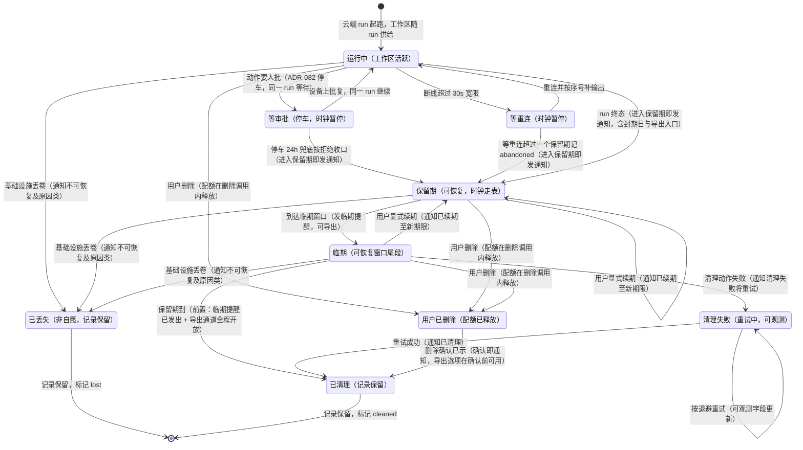

# 云端 run 工作区保留期设计稿

- 状态：**草稿·待爸拍板**
- 单号：N-CLOUD-RUN-RETENTION-DESIGN
- 基线：`origin/main@305266f2c`
- 相关：[ADR-081 执行环境](../decisions/ADR-081-execution-environment.md)（已接受：不变量 5、等审批不卸载、配额 2）；[ADR-082 云端定时任务审批往返](../decisions/ADR-082-cloud-cron-approval.md)（已接受：停车 24h 兜底）；本仓已有保留期分层先例见 `docs/ARCHITECTURE.md` §9（遥测 14 天 / 语音录音 7 天 / 声纹 90 天）；版式对照 `docs/architecture/designs/jev-cu-step.md`
- 性质：只设计，不改代码、不改 UI、不做服务端实现、不定价、不改两份 ADR（本文只链接）。正文里跟着 ADR 已定规矩走的句子不另开槽；七个开放点是后面的 Decision needed（D1–D7）

## 一句话问题

云端 run（ADR-081 的交互云端轮与 `runsOn: 'cloud'` 的定时 run）跑完之后，它的工作区——未提交改动、装进现场的工具——今天没有任何保留期、起算点、提醒、续期、导出或清理的定义。仓内 grep `retention|expiresAt|ttl|purge` 在 `src/host/cron/` 与 `src/shared/contract/cron.ts` 只命中 run-limit 次数上限（`src/host/cron/cronRunLimit.ts:settleCronRunLimit`），与时间无关；「清理」今天无处挂靠。本稿把七个空位一次填齐，主人拍一次板。

**竞品口径及其证据等级。** 任务书给的参照是「最后一次活动后 7 天内可恢复」。私档源文（`docs/competitive/2026-09-30-OpenAI-DevDay-场景清单.md` S-C05）不在本机私档副本里：`docs/competitive/` 仓内只有 grok-codex 借鉴清单，`code-agent-private-archive` 下 find 无命中。7 天这个数字只来自任务书文本，本文把它当参照点，不当结论，也不单独作为任何推荐的论据。

## 术语

| 词 | 含义 |
|---|---|
| 工作区 | 一次云端 run 的执行现场：未提交改动 + 装进现场的工具。挂在 `runId` 上，run 级 |
| 环境对象 | ADR-081 的可复用执行环境（Draft → PendingConfirm → Publishing → Published → Retired），可共享。**不是**本保留期的对象：清理只碰 run 工作区，不碰环境对象，否则共享环境上别人的 run 会被误伤 |
| 保留期 | 工作区在清理之前保持可恢复的窗口。时钟在服务端 |
| 起算点 | 保留期时钟开始走表的时刻（D1） |
| 挂起 | 等审批、等重连期间时钟暂停（D1） |
| 终态 | run 完成、失败、停车 24h 兜底收口、abandoned、用户删除 |
| 清理 | 服务端删除工作区内容；run 记录保留并标记 `cleaned`（D6） |
| 丢失 | 非自愿失去工作区（基础设施丢卷等），标记 `lost`，不冒充 `cleaned` |
| 可恢复 | 导出与应用到本机仍可用的工作区状态，即保留期窗口内 |
| 导出 | 拿到含未跟踪文件、可 `git apply` 的变更补丁（形状是 ADR-081 已定：结果进同一会话、未跟踪文件要进结果） |
| 续期 | 用户显式把保留期延长一个完整周期（D4） |
| 触发回执 | `cronService` 云端分支在 `runJob` 返回后即标 `completed` 的那条本地执行记录，不代表云端轮结束 |

## 现状锚点

每行都是 `文件:标识符`，标识符能在该文件里被 grep 到。基线 `origin/main@305266f2c`。

| 锚点 | 它证明什么 | 核对 |
|---|---|---|
| `src/host/cron/cronRunLimit.ts:settleCronRunLimit` | cron 域唯一的「上限」逻辑是次数（max_runs），与时间保留无关 | 已在 origin/main 核对 |
| `src/host/cron/cronCloudRuntime.ts:RECONCILE_INTERVAL_MS` | 对账周期 60s，注释写明是任务清单的保底 fallback（云端丢了任务就复注册） | 已在 origin/main 核对 |
| `src/host/cron/cronCloudRuntime.ts:removeJob` | 删除判据是「云端现在还有没有这条」，先 list 再 remove；一次性任务跑完被云端清掉时 not found 算正常 | 已在 origin/main 核对 |
| `src/host/cron/cronCloudRuntime.ts:isSpentOneShot` | 花掉的一次性任务不复注册；其工作区没有任何本地机制跟着收尾 | 已在 origin/main 核对 |
| `src/host/cron/cronApiClient.ts:sessionTarget` | 云端声明钉 `isolated` | 已在 origin/main 核对 |
| `src/host/cron/cronApiClient.ts:不带 sessionId` | 云端 run 的会话在服务端，本地 `sessions` 表没有那一行（注释记 2026-08-24 外键实测） | 已在 origin/main 核对 |
| `src/host/cron/cronService.ts:runsOn` | 云端分支调 `cloudRuntime.runJob` 后本地执行记录随即标 `completed`，是触发回执 | 已在 origin/main 核对 |
| `src/shared/constants/timeouts.ts:PARKED_APPROVAL` | 无人值守停车审批 24h 兜底，等待期间保持同一 run | 已在 origin/main 核对 |
| `docs/architecture/decisions/ADR-081-execution-environment.md:不变量 5` | 删除云端 run 立刻对账并释放配额；60s 对账只做崩溃补救 | 已读原文 |
| `docs/architecture/decisions/ADR-081-execution-environment.md:断线、心跳、会话保留` | 等审批的会话永远不卸载；宽限只决定连着还是等重连 | 已读原文 |
| `docs/architecture/decisions/ADR-081-execution-environment.md:已拍板 6` | 阶段 1 每用户在飞配额 2，第 3 条起排队 | 已读原文 |
| `docs/architecture/decisions/ADR-082-cloud-cron-approval.md:停车时限` | 云端审批沿用现有 24h 停车兜底，不另定一个数；到点按拒绝收口 | 已读原文 |
| `docs/ARCHITECTURE.md:保留期分层` | 本仓已有「同类数据定保留期并写进常量」的先例：遥测 14 天、语音录音 7 天、声纹 90 天 | 已读原文 |

## 图

一次云端 run 工作区的寿命。可恢复窗口是 `retention` 与 `near_expiry` 两段；不可恢复有两条出口：`lost`（非自愿）与 `cleaned`（到期或删除后，均已通知）。

注：等审批、等重连、清理失败状态下用户同样可以删除 run，边同标签，图里不重复画。`user_deleted` 里短期授权作废是 ADR-081 已定（删除调用内作废），不因工作区清理另做一套。

## 工作区归谁、本地可以假设什么

**工作区只存在于服务端。** 本仓证据：云端 run 的会话在服务端、本地 `sessions` 表没有那一行（`cronApiClient.ts:不带 sessionId`）；本地执行记录只是触发回执（`cronService.ts:runsOn`）。因此保留期时钟、清理动作、清理失败的可观测字段全部住在**服务端 run 记录**上；清理 sweep 是服务端后台角色，不是 run 的 owner（ADR-037 一 run 一 owner），不写会话账本，只动工作区存储与 run 记录的工作区字段。

**本地客户端可以假设：**

1. run 记录与变更清单文本的可见性不随工作区清理消失（账本只追加，见 D6）。
2. 「应用到本机 / 导出」入口必须容忍 `workspaceStatus = cleaned | lost`，降级时给稳定码与日期，不给死链。
3. 清理与续期的判定权威在服务端；本地不跑自己的到期定时器，不自己算到期日。

**本地客户端不可以假设：**

1. 工作区还在——任何时刻都可能是 `lost`（非自愿）。
2. 本地能预先知道到期日——时钟起点挂在服务端的终态时刻，本地没有这份活动数据。
3. cron 云端 run 今天能「看见」工作区状态——ADR-082 帧最小集六个字段里没有工作区字段，现状下本地连「已清理」都不可见。这是缺口，由后续投影施工单接（见文末），本文不给 SSE 帧加字段。

## 冲突清单

对着 ADR-081 / ADR-082 的已定规矩逐条过。每行给结论与化解规则；规则进了施工合同，不是口头安抚。

| # | 对面规矩 | 出处 | 冲突与否 | 化解规则 |
|---|---|---|---|---|
| 1 | 删除云端 run 立刻对账并释放配额；60s 对账只做崩溃补救 | ADR-081 不变量 5 | **无冲突** | 配额跟「运行中」走，不跟工作区保留期走：run 一进终态，配额即放（删除路径照旧）；保留期里工作区不是运行中的 run，不占配额；到期清理与失败重试都不碰配额。用户删除仍是同一调用内释放配额 + 作废短期授权（ADR-081 已定），工作区随后清理 |
| 2 | 等审批的会话永远不卸载 | ADR-081「断线、心跳、会话保留」 | **无冲突（靠挂起规则让路）** | 等审批期间保留期时钟**暂停**，保留期永不清理停车中的 run。等审批自身由 24h 停车兜底收口（ADR-082 / `PARKED_APPROVAL`），收口即终态，时钟才起表。若未来出现没有 24h 兜底的等审批，保留期对其永不清理——宁可囤积，不卸载 |
| 3 | 云端 cron run 停车等审批（parked），批准后续同一 run | ADR-082 全文 | **无冲突** | 同第 2 条：parked 即挂起。停车帧、离线补拉、决议路径全部不动；保留期不新增 SSE 帧、不碰窄门（本地投影是后续施工单的事） |
| 4 | 60s 对账：云端清单里没了就复注册 | `cronCloudRuntime.ts:RECONCILE_INTERVAL_MS` | **无冲突** | 对账对象是**任务清单**（job declaration），不是工作区：清理不删任务，复注册不复活工作区；任务下次触发时供给全新工作区。花掉的一次性任务（`isSpentOneShot`）不复注册，其工作区照常走保留期 |
| 5 | 每用户在飞配额 2 | ADR-081 已拍板 6 | **无冲突** | 保留期内工作区不是「运行中的云端 run」，不占配额；清理失败重试同样不占。配额计数口径仍是 ADR-081 的「同时处于运行中」 |
| 6 | 环境对象可共享、可复用 | ADR-081「可复用的环境对象」 | **无冲突，但有边界** | 清理只碰 `runId` 挂着的 run 工作区（未提交改动 + 装进现场的工具），不碰 Published 环境对象；装进环境镜像的工具随环境生命周期走。否则共享环境上别人的 run 会被误伤 |
| 7 | 本地执行记录是触发回执；云端会话在服务端 | `cronService.ts:runsOn`；`cronApiClient.ts:不带 sessionId` | **无冲突** | 回执不动：工作区状态是服务端 run 记录上的独立字段（`workspaceStatus` 等），本地只做投影，不回写 `cron_executions` 的 `completed`，也不往本地 `sessions` 表补行 |

## Decision needed [起算点]：D1 时钟从哪一刻起算

- 选项 A：**终态起算 + 挂起规则。** 时钟只在 run 处于终态（完成 / 失败 / 停车 24h 兜底收口）之后走表；等审批与等重连期间时钟暂停。等重连连续超过一个保留期长度记 `abandoned`（终态），通知后起表。
- 选项 B：最后活动起算（竞品「after last activity」口径）。任何读写都刷新起算点。
- 选项 C：固定事件起算（run 创建时刻或结束时刻后固定宽限一次），不看状态也不看活动。

**推荐：选项 A。** 选项 B 会把「等审批的会话永远不卸载」变成空话：停车期间没有活动，时钟照走就会过期一条 ADR-081 明说不许卸载的会话；要让 B 成立必须另写挂起规则，等于绕回 A。选项 C 对「跑了六天的长任务」只按创建点算，等于没收保留期。A 把「不可卸载」与「可回收」的边界放在同一个状态判据（终态）上，时钟不需要理解审批内部。abandoned 判定复用 D2 的时长，不新开数字；等重连期间配额本就不占（ADR-081：只有同时在等审批才继续占），abandoned 收口不动配额，只收工作区。

## Decision needed [默认值]：D2 保留多长

- 选项 A：7 天。
- 选项 B：14 天。
- 选项 C：30 天。

**推荐：选项 A（7 天）。** 竞品 7 天只是参照，不是理由本体。理由：① 本仓已有同类保留期先例——语音录音 7 天（`docs/ARCHITECTURE.md` 保留期分层），同属「用户可能还想要」的数据档；② 清理后真正不可再生的只有工作区**现场**，变更清单文本长期留在会话账本里（ADR-081 已定：结果进同一会话、含未跟踪文件），损失边界是「重新跑一遍」，不是「丢结果」；③ 工作区带着装好的工具，存储成本随天数线性涨，配额定 2 说明主人对云端成本从紧。14 / 30 天是主人按成本改数字即可，合同形状不变——与 ADR-081 配额 2 同一地位：给实现一个有限默认，不是容量测算。

## Decision needed [提醒时机]：D3 什么时候提醒

- 选项 A：**两次。** 进入保留期即发一次（含到期日与导出入口），临期（到期前 24 小时）再发一次。
- 选项 B：只发临期一次。
- 选项 C：不发推送，只在界面常态显示倒计时。

**推荐：选项 A。** 只有选项 B 的话，用户若整个保留期没打开产品，唯一一次提醒也看不见——提醒的意义是在**还有时间导出**时到达。选项 C 把「知道要过期」变成「主动去看」，而无人值守场景（cron 云端 run、合盖后的云端轮）没有常驻界面。临期取 24 小时：保证收到提醒时至少还剩一整个工作日可导出，与 `PARKED_APPROVAL` 的天级粒度一致；D2 改长时粒度不变。两次提醒都走现有通知面（ADR-082 的飞书 / 手机卡片通道已在），不新做渠道。

## Decision needed [续期]：D4 怎么续期

- 选项 A：**显式续期。** 用户点「再保留一个周期」，每次续一个完整周期；续满上限（默认 2 次）后只能导出或任其清理。导出、浏览、应用都不续期。
- 选项 B：隐式续期。任何活动（浏览 / 导出 / 应用）都重置时钟——竞品「last activity」口径的另一半。
- 选项 C：不续期，到期即清理。

**推荐：选项 A。** 选项 B 让「看一眼」就能无限囤积工作区，成本没有上界，且「导出也续期」逻辑倒挂——导出之后用户已拿到数据，恰恰是最不需要保留的时刻。选项 C 对「出差一周没看手机」太硬。上限默认 2 与 D2 同为成本杠杆（同 ADR-081 配额 2 的地位），主人可改；最长在飞寿命 ≈ 三个周期。

## Decision needed [安全边界]：D5 到期前的导出门（无静默清理）

- 选项 A：**提醒前置 + 导出前置双门。** 清理动作只有在（i）进入保留期与临期两次提醒都有发送记录、（ii）整个保留期导出通道开放（含临期当天）之后才允许执行；任一门不满足就转入 `cleanup_failed` 的重试轨道，不静默放过。
- 选项 B：只要求提醒发过，不卡导出通道。
- 选项 C：不做前置，到期即清理，导出是用户自己的责任。

**推荐：选项 A。** 选项 B 里提醒发出 ≠ 导出可用：临期当天导出通道坏了，用户收到提醒也没用。选项 C 就是静默删除——「静默降级叠加成黑箱」的同款事故形状（错题本 2026-08-14）。前置判据用**发送记录**，不用送达回执：送达回执今天没有通道，不发明。「无静默清理」是本稿的主不变量：每条进 `cleaned` 的边必须带提醒 / 通知 / 导出 / 确认标注（验收⑤用即弃脚本锁这条）。

## Decision needed [记录形态]：D6 清理后保留什么

- 选项 A：**记录全留 + 工作区标记。** run 记录、会话账本行、变更清单文本全部保留；run 记录上写 `workspaceStatus: 'cleaned'`、`cleanedAt`、`cleanedBy`（`retention` | `user-delete` | `retry`）。「应用到本机」与再导出在 `cleaned` / `lost` 下降级为「工作区已清理（日期）」，带稳定码。
- 选项 B：清理时连 run 记录一起删（真·遗忘）。
- 选项 C：清理后只留一行墓碑（「曾有一个云端 run」），丢变更清单文本。

**推荐：选项 A。** 选项 B 与账本只追加相抵（ADR-081 语义：删除 run 也是记下删除，不抹历史）。选项 C 丢掉的变更清单本来就已经免费留在会话里，省不下多少存储，却断了「当时改了什么」的回查。降级用稳定码 + renderer i18n（host 只回码），不新做 UI 组件。

## Decision needed [可观测]：D7 清理失败怎么可观测

- 选项 A：**四个字段 + 退避重试 + 有界升级。** 工作区记录上写 `lastCleanupAttemptAt`（末次尝试时刻）、`cleanupErrorClass`（错误类，闭集：`storage-unavailable` | `permission` | `partial` | `other`）、`cleanupAttemptCount`（尝试次数）、`nextCleanupRetryAt`（下次重试时刻）。重试按退避走；连续失败累计超过一个保留期长度仍不成功的，停止自动重试，转「清理失败待人工」终态并通知，字段保留。字段就这四个，不加更多。
- 选项 B：只留一个 `cleanupFailed` 布尔。
- 选项 C：失败即放弃，不告警。

**推荐：选项 A。** 选项 B 判因只能靠猜（错题本：降级分支要留可区分的原因，装载失败要带每条路径的真实错误）。选项 C 会留下「到期但永远不清理」的僵尸工作区：占着存储、不在任何面板上、也没人知道。字段全部住在服务端 run 记录上；本地投影是后续施工单的事，本文不给 cron SSE 帧加字段。

## 预期收益

保留期从「没人定过」变成「主人拍一次板」：七个开放点各有选项与推荐，拍板后四张施工单可直接开工，不用再翻 cron 对账代码与 ADR-081 不变量。对用户：云端跑完的东西有一个明确的「还能拿回来到哪天」，到期前有两次提醒和一条始终开着的导出通道；对系统：清理有了挂靠点（服务端 run 记录的工作区字段），失败可观测、有界重试、不碰配额、不卸载任何等审批的会话。

要单独记账、不能当成已经有的能力：

- 服务端没有任何保留期代码；本稿拍板前，「清理」无处挂靠。
- cron SSE 帧与 ADR-082 最小集里没有工作区字段，本地今天看不见 `cleaned` / `lost`。
- 竞品 7 天未经本机复核（私档源文缺失），只作参照。

## 后续施工单

名字是提议。依赖按推荐顺序；每张标无人值守可否。

| 单 | 范围 | 依赖 | 无人值守可跑？ |
|---|---|---|---|
| N-CLOUD-RUN-RETENTION-SRV | 服务端：终态起表、挂起规则、abandoned 判定、清理 sweep、D5 双门、D7 四字段。合同测试全 mock | 本稿拍板 | **可**：纯服务端代码 + 密闭单测，无人判断点；部署侧联调标待核 (部署侧) |
| N-CLOUD-RUN-RETENTION-EXPORT | 服务端：导出端点，产出含未跟踪文件、可 `git apply` 的补丁（形状沿用 ADR-081 已定）；`cleaned` / `lost` 降级稳定码 | N-CLOUD-RUN-RETENTION-SRV | **可**：补丁形状 ADR-081 已定，无新决策 |
| N-CLOUD-RUN-RETENTION-INVARIANTS | 测试：把冲突清单 1–5 钉死——停车中不过期、清理不碰配额、对账不复活工作区、每条进 `cleaned` 的边有前置、`lost` 不冒充 `cleaned`；单内做反向变异 | N-CLOUD-RUN-RETENTION-SRV | **可**：纯测试单，红绿自证 |
| N-CLOUD-RUN-RETENTION-PROJECTION | 本地：cron 帧扩展带 `workspaceStatus`、renderer 提醒与降级文案（i18n）、「应用 / 导出」入口降级 | 本稿拍板 + SRV | **否**：动 SSE 协议，ADR-082 窄门要两边同步加显式名单并真帧联调；提醒文案与时机用户可见，要人核一眼再上 |
