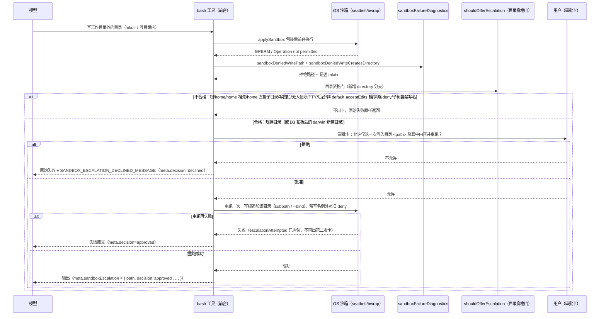

# 沙盒一次性扩权·目录子树版设计稿

- 状态：**草稿·待爸拍板**
- 单号：N-SANDBOX-ESCALATE-DIR-DESIGN
- 基线：`origin/main@a00a39c04`
- 相关：单文件版已上线（私档证据 N-SANDBOX-DENY-ESCALATE-2026-10-03，PR #2191）；敏感路径清单与「代理不许改自己的笼子」先例在 `src/host/sandbox/sensitivePaths.ts`；版式对照 `docs/architecture/designs/cloud-run-retention.md`
- 性质：只设计，不改任何 `src/`、`tests/`、常量与 UI 组件，不改既有 ADR。开放的产品取舍全部进文末 Decision needed（D1–D6），本文不替主人拍板

## 图

一次被沙箱拒掉的**目录写**（目录本体或 mkdir），目录子树版的完整往返。单文件版只有 `subpath` 换 `literal`、目录资格换文件资格两处差别，其余路径完全共用。后文不再改这条顺序。

## 现状锚点

每行 `文件:标识符`，标识符均已在工作树 `a00a39c04` grep 核对（核对脚本输出见证据档）。行号会漂，标识符是真源。

| 锚点 | 它证明什么 |
|---|---|
| `src/host/tools/shell/sandboxEscalation.ts:shouldOfferEscalation` | 资格门：沙箱内 + 前台 + 非 PTY/后台/无人值守/写围栏 + default·acceptEdits 档 + 绝对路径，缺一不出卡 |
| `src/host/tools/shell/sandboxEscalation.ts:escalationTarget` | 目标三分 `file / missing / other`；`lstatSync().isFile() ? 'file' : 'other'`——目录、软链、特殊文件一律 `other`，永不offer |
| `src/host/tools/shell/sandboxEscalation.ts:writePathPolicyBlocksEscalation` | 出卡前先过 `denyConcreteShellWritePath`；策略拒绝或判不了的一律不出卡（审批不许覆盖策略） |
| `src/host/tools/shell/sandboxEscalation.ts:SANDBOX_ESCALATION_DECLINED_MESSAGE` | 拒绝后的英文指引常量，单复用、不含路径 |
| `src/host/tools/shell/sandboxEscalation.ts:SandboxEscalationMeta` | meta 形状今天只有 `path` + `decision` |
| `src/host/tools/shell/sandboxFailureDiagnostics.ts:sandboxDeniedWritePath` | 只认 EPERM 形状的**写**拒绝才提路径；`npm path` 行、shell 重定向、写工具各有正则 |
| `src/host/tools/shell/sandboxFailureDiagnostics.ts:sandboxDeniedWriteCreatesDirectory` | mkdir 拒绝单独标记；今天配上它**永不**出卡（子树授权会让重跑在里面造任意名字——这正是本稿要打开的口子，所以边界必须补齐） |
| `src/host/tools/shell/writePathPolicyDeny.ts:denyConcreteShellWritePath` | 一个具体写路径的硬 deny 真源：active policy `checkFilePath('write')` + 用户路径 deny 候选拼写 |
| `src/host/tools/modules/shell/bash.ts:applySandbox` | 三个执行路径统一包装；第三参 `extraWriteFile` 是单文件版唯一的扩权通道 |
| `src/host/tools/modules/shell/bash.ts:readWriteFiles` | `extraWriteFile ? [extraWriteFile] : undefined`——注释明说「只放开这一个文件（不含子孙）」 |
| `src/host/tools/modules/shell/bash.ts:escalationAttempted` | 批准后置位；同一调用内再失败直接 rethrow，不出第二张卡 |
| `src/host/tools/modules/shell/bash.ts:sandbox_escalate_once` | 卡的 `details.action`，单文件版唯一动作名 |
| `src/host/tools/modules/shell/bash.ts:escalationReason` | 单文件卡文案真源：`沙盒拦截了这一步：它想写入文件 <path>。允许仅这一次写入这个文件并重跑？` |
| `src/host/sandbox/seatbelt.ts:generateProfile` | darwin profile：`(deny file-write*)` 全拒后按写根放行；`(allow default)` 与 sensitive `deny file-read*` 并存，证明 deny 规则压过 allow 放行 |
| `src/host/sandbox/seatbelt.ts:writeFiles` | 单文件授权 = `(allow file-write* (literal "<path>"))`，只开这一个路径 |
| `src/host/sandbox/seatbelt.ts:realPath` | seatbelt `subpath` 按 realpath 匹配，软链必须解析（/var→/private/var）——子树授权天然只认真实落点 |
| `src/host/sandbox/bubblewrap.ts:readWriteFiles` | bwrap 单文件授权 = `--bind` 且**只绑普通文件**（绑目录等于整树放行，注释明说） |
| `src/host/sandbox/bubblewrap.ts:readWritePaths` | bwrap 写根 = `--bind` 现存目录；目录子树授权在 linux 就是这一行，机制现成 |
| `src/host/sandbox/manager.ts:supportsNewFileWriteGrant` | 只有 darwin 能授权「还不存在的文件」（literal 不需要存在）；bwrap 只能绑现存——新**目录**授权同受此约束 |
| `src/host/sandbox/manager.ts:wrapCommand` | 包装选项真源：`readWriteRoots`（子树）、`readWriteFiles`（单文件）、`deniedReadRoots`（读黑名单） |
| `src/host/sandbox/sensitivePaths.ts:HOME_SECRET_DIRS` | 家目录敏感目录清单现成：`.ssh/.aws/.gnupg/.kube/.docker/.config/gh/.config/gcloud` |
| `src/host/sandbox/sensitivePaths.ts:HOME_SECRET_FILE_PREFIXES` | 家目录敏感文件前缀：`.env*`、`id_rsa*` 等 |
| `src/host/sandbox/sensitivePaths.ts:isProtectedWritePath` | 「不许改自己的笼子」清单现成：policy.toml、exec-policy.json、hooks、`.git/config`、`code-agent-policy.toml` 等 |
| `src/host/sandbox/sensitivePaths.ts:isSensitiveCredentialPath` | 纯词法、不依赖文件存在的凭据路径判据（审批不能依赖时机） |
| `src/host/runtime/runContext.ts:resolveCanonicalRunPath` | 卡上显示与重跑授权共用同一个 canonical 化真源（父目录软链先解到真实路径） |
| `tests/unit/tools/modules/shell/bash.test.ts:never offers a directory` | 单文件版把「目录永不 offer」钉死——本稿落地时此测试改钉新边界（见断言清单 A12） |
| `tests/unit/tools/modules/shell/bash.test.ts:asks once, grants only the denied file` | 单文件主路径钉死：一次卡、`forceConfirm`、reason 含路径、重跑 wrapper 参数只加该文件 |
| `tests/unit/tools/modules/shell/bash.test.ts:shows and grants the real file when a parent directory is a symlink` | 父目录是软链时，卡与授权都落在真实文件——「所见即所开」已有测试先例 |

## 一句话问题

今天一张扩权卡只敢开**一个文件**：目录本体、mkdir、子树全被 `escalationTarget` 归为 `other` 永不 offer（`sandboxEscalation.ts:escalationTarget`），mkdir 拒绝更被显式排除（`sandboxFailureDiagnostics.ts:sandboxDeniedWriteCreatesDirectory`）。结果是把构建产物挪到工作区旁、在 home 下建缓存目录这类正当诉求，用户只能一遍遍批同一个目录里的不同文件。本稿把「目录子树一次性授权」补成第二档粒度，三条边界一次定清，主人拍一次板。

## 边界

三条边界都是「规则 + 反例（绝不可授权的形状）」。反例不是取舍，是红线：任何一条被突破，整档粒度不 offer。

### 边界一：子树里的禁写名

**规则**：子树授权≠子树内全开。卡无法罗列子孙（这正是当年不敢开目录的原因），所以禁写名走**机制**不走期望：凡命中禁写清单的现存路径，在授权子树内仍保持不可写——darwin 在 profile 里补 `(deny file-write* …)` 行（deny 压过 subpath allow，先例见锚点 `generateProfile` 里 `(allow default)` 与 sensitive deny 并存）；linux 在 rw `--bind` 之后按参数序补 `--ro-bind` 盖掉（挂载顺序即遮蔽顺序，先例注释在 `bubblewrap.ts` 的 tmpfs 段）。

禁写清单不新造，复用两份现成清单（锚点 `HOME_SECRET_DIRS` / `HOME_SECRET_FILE_PREFIXES` / `isProtectedWritePath`）再补目录版特有的名字（`.git/hooks`——git 钩子是持久化执行向量；`.zshrc/.bashrc/.profile` 等 shell rc——登录即执行）。**补哪些是 D1，待拍板**。

**反例（必须不可授权）**：批准「写入 `~/proj/vendor`」后，重跑能覆盖 `~/proj/vendor/.git/hooks/pre-commit`——下次用户自己在该仓库里 git commit 就替代理执行了任意脚本。子树内新建名字的残余风险与处置见 D1 选项。

### 边界二：可写范围

**规则**：授权根 = 拒绝路径本身（canonical 化后），**绝不向上推断祖先**。darwin 开 `(allow file-write* (subpath "<dir>"))`（与 `writePaths` 同形，锚点 `generateProfile`）；linux 开 `--bind <dir> <dir>`（锚点 `readWritePaths`）。子树内 mkdir 新目录、新建文件自此允许——这正是 mkdir 拒绝今天被排除、本稿要打开的点。子树内新建的软链指向子树外：darwin 按 realpath 匹配落点在子树外→仍拒（锚点 `realPath`）；linux 目标没绑写挂载→落在只读基线上仍拒。写围栏（writeFence）、evalRealRoot、无人值守、PTY、后台、非 default·acceptEdits 档全部沿用单文件资格门，一个不松（锚点 `shouldOfferEscalation`）。策略 deny 的目录本体一律不出卡（锚点 `writePathPolicyBlocksEscalation`）；**审批永远不能覆盖 `denyConcreteShellWritePath`**——本体命中即无卡，子孙命中的处置是 D2。新建（尚不存在）目录：darwin 待 D3 实测定，linux 无条件不 offer（bwrap 绑不了不存在的路径，锚点 `supportsNewFileWriteGrant` 的同款限制）。

**反例（必须不可授权）**：mkdir 拒绝的是 `/a/b/c`，授权却绑最近现存的祖先 `/a`——用户批的是 `c`，沙箱开的是 `/a` 整树，家目录都可能在里面。**授权根必须恰是拒绝路径的 canonical 形式**，差一级都不行。

### 边界三：home 及其周边

**规则**：授权根为下列任一者，永不 offer：`/` 根；home 本尊；home 的任何祖先（含 `/Users`——它的子树包住 home）；home 的**直接子目录**（`~/.ssh`、`~/Library`、`~/Downloads`、数据目录 `~/.code-agent*` 全在这一层）。单文件版已有根与 home 本尊两条（`shouldOfferEscalation` 里 spelled 与 resolved 各查一次），目录版因粒度变粗必须加祖先层与直接子目录层。此外任何「子树包住上述禁区」的授权根同样拒绝（祖先检查已覆盖 home 与根；包住 `~/.ssh` 的只有 home 本尊与更上层，同被拒绝）。

**反例（必须不可授权）**：批准「写入 `~/Library`」——子树授权会把钥匙串旁路状态、Application Support、LaunchAgents 一锅端；`~/.ssh` 同理是全部密钥。home 直接子目录一刀切不逐个评判：这一层的名字就是 macOS 攻击面的目录版，且默认会话 cwd = HOME（`bash.ts` 的 #1997 注释），从这里出卡太容易撞上。

## 卡片文案

规则：**卡片说的就是重跑打开的**，一字不差、方向只许偏小（开口子 ⊆ 卡面承诺）。

| 粒度 | 卡片文案（中文原文） | 对应沙箱规则 |
|---|---|---|
| 单文件（现状，不变） | `沙盒拦截了这一步：它想写入文件 <path>。允许仅这一次写入这个文件并重跑？` | `(allow file-write* (literal "<path>"))`；bwrap `--bind <file> <file>` |
| 目录子树（本稿新增） | `沙盒拦截了这一步：它想写入目录 <path>（含其中全部内容）。允许仅这一次写入这个目录及其中内容并重跑？` | `(allow file-write* (subpath "<path>"))`；bwrap `--bind <dir> <dir>` |
| 不放大（拒绝） | 无卡片，原始失败原样返回 | 无新规则；现拒绝面一个不松 |

`<path>` 一律显示 canonical 绝对路径（锚点 `resolveCanonicalRunPath`；先例测试 `shows and grants the real file when a parent directory is a symlink`）。若 D1 选了带禁写名例外，目录卡在第二句后追加「（其中凭据与配置类文件仍不可写）」——卡面必须如实反映开口子比承诺小，见自检反例。

## 与单文件版的差异

| 维度 | 单文件版（现状） | 目录子树版（本稿） |
|---|---|---|
| 资格门 | `escalationTarget` 取 `file`/`missing`；mkdir 标记直接排除 | 新增 `directory` 分支（lstat 是目录，或 mkdir 拒绝）；其余旗标一个不动 |
| 卡 reason | `…写入文件 <path>。允许仅这一次写入这个文件…` | `…写入目录 <path>（含其中全部内容）。…写入这个目录及其中内容…` |
| `details.action` | `sandbox_escalate_once` | `sandbox_escalate_dir_once`（D4；区分度供遥测与 UI 鉴别，不共用旧名） |
| `applySandbox` 第三参 | `extraWriteFile` → `readWriteFiles: [path]` | 新 `extraWriteRoot` → 并入 `readWriteRoots`（不进 `readWriteFiles`） |
| seatbelt 规则 | `(literal …)` 只开该路径 | `(subpath …)` 开整子树 + 禁写名 deny 行 |
| bwrap 规则 | `--bind` 普通文件 | `--bind` 现存目录 + 禁写名 `--ro-bind` 盖 |
| 重跑次数 | 恰一次；`escalationAttempted` 拦第二张卡 | 完全相同（同一旗标、同一处 rethrow） |
| meta 形状 | `{ path, decision }` | `{ path, decision, granularity: 'directory' }`（D4；旧调用方不读新字段，零破坏） |
| 拒绝后文案 | `SANDBOX_ESCALATION_DECLINED_MESSAGE`（与路径无关） | 同一常量复用，不改字 |
| 新建目标 | darwin 可（literal 不需存在）；linux 不可 | 现存目录两平台皆可；新建目录 darwin 待 D3 实测、linux 不可 |

## 单文件行为不变的断言清单

每条都可写成测试断言；「已钉死」给出钉住它的现存测试名（`tests/unit/tools/modules/shell/bash.test.ts` 除非另注）。

- **A1** 现存普通文件的写拒绝，卡片 reason 逐字等于现文案、`details.action === 'sandbox_escalate_once'`、`forceConfirm: true`。已钉死：`asks once, grants only the denied file, and retries once after approval`。
- **A2** 单文件批准后的重跑，wrapper 选项仍只含 `readWriteFiles: [<path>]`，`readWriteRoots` 不新增条目。已钉死：同上测试（断言 mocked `wrapCommandForSandbox` 参数）。
- **A3** 拒卡后结果 `ok:false`、原始错误保留、meta `decision === 'declined'`、尾部附 declined 常量。已钉死：`preserves the original failure and explains a declined or thrown approval`。
- **A4** 批准后的重跑再失败：不出现第二张卡，失败原文返回。已钉死：`does not open a second card when the approved retry fails`。
- **A5** 批准不跨调用记忆：同命令下次再拒再出新卡，无任何持久化白名单。已钉死：`does not remember an approval across invocations`。
- **A6** 不合格面（无人值守、bypass/readOnly 档、写围栏、沙箱未套、PTY、后台、相对路径、无路径）零扩权卡。已钉死：`does not offer escalation for ineligible sessions, modes, paths, or execution modes`。
- **A7** home 本尊与祖先永不 offer。已钉死（文件版）：`does not offer an ancestor of the home directory`；目录版同判据加测。
- **A8** 软链目标、缺父目录的 missing 文件不 offer；父目录是软链时卡与授权都落真实路径。已钉死：`does not offer a symlink or a file whose parent directory is missing`、`shows and grants the real file when a parent directory is a symlink (ai-review round 5)`。
- **A9** 平台不支持新文件授权时 missing 文件不 offer。已钉死：`offers only existing files when the sandbox cannot grant a new file (bubblewrap)`；目录版（新建目录）加同款测试。
- **A10** 策略 deny 的路径不 offer；仅 deny 兄弟目录时文件照常 offer。已钉死：`does not offer a file that a user Edit deny or filesystem policy forbids`、`still offers a file when policy only denies a sibling directory`；另 `tests/unit/tools/shell/sandboxEscalation.test.ts` 的 `still hard-denies denied_paths after another workspace rebinds the singleton to null`。
- **A11** 读拒绝（泛化 `cmd: path` 形）不出卡；写工具形、npm EPERM path 行照常出卡。已钉死：`does not offer escalation for a read denial in the generic command: path form`、`still offers escalation for a write utility denial in the command: path form`、`still offers escalation when npm reports EPERM on a path line`。
- **A12** **文件通道永不产出子树**：`details.action === 'sandbox_escalate_once'` 的卡，其重跑 wrapper 永远不含新增写根。这是 `never offers a directory, whether it exists or is about to be created` 改写后的新形态——旧测试的意图（文件卡不开树）保真，对象从「不 offer 目录」移到「文件授权永远是 literal」。

## Decision needed

### D1 [禁写名清单]：子树内哪些名字必须保持不可写

- 选项 A：**两份现成清单原样复用**——`HOME_SECRET_DIRS` / `HOME_SECRET_FILE_PREFIXES`（凭据类）+ `isProtectedWritePath` 全集（笼子类），再加 `.git/hooks`。
- 选项 B：A + shell rc（`.zshrc/.bashrc/.profile/.zprofile/.bash_profile`）+ LaunchAgents 目录（`~/Library/LaunchAgents` 虽在边界三被拒，子树若更深仍可能包到）。
- 选项 C：A + B + 全部 `.env*` 家族的**新建**也禁（darwin 对词法路径补 deny 行）。

**推荐 B。** A 漏掉 shell rc 与 launch agent 这两类「写一次、之后替代理执行」的持久化向量，与 `.git/hooks` 同险不配同待遇；C 禁「新建 .env」挡住的是代理自己写配置的正常动作（目标目录若正当，新建 `.env` 是业务行为），且 linux 无机制对等、两平台行为分裂。子树内**新建**禁写名（D1 不含）的残余：现清单按现存路径 deny，新建名挡不住——与工作区今天的执行层一致（沙箱不逐写策略检查，策略在目标提取层），如实写进实现单的已知残余。

### D2 [策略互动]：策略 deny 命中子树内的**子孙**时怎么办

- 选项 A：**本体照旧查、子孙不预判**——授权根过了 `denyConcreteShellWritePath` 即可出卡；子孙的策略 deny 与工作区内今天的执行层同待遇（静态目标提取层拦，沙箱层不拦）。
- 选项 B：策略含任何可能与子树相交的 deny glob 时整个不出卡（证不相交才出）。
- 选项 C：出卡，但把词法可判的 deny 子孙编译成 profile deny 行 / ro-bind 盖。

**推荐 A，理由是既有对称而非省事**：工作区内部的 deny glob 今天就不在沙箱层逐写强制（沙箱只认写根），子树授权后的区域与工作区同律，用户在卡上看到的是同一承诺；B 会被常见的 `**/.env*` 类 deny 一票否掉所有目录卡，功能落地即死；C 的词法可判集合在 glob 语义下不可完备（新文件名匹配 glob 无法预列），给出「看似有门、实际有洞」的假安心。

### D3 [新建目录]：mkdir 拒绝的**不存在**目录，darwin 是否出卡

- 选项 A：**先实测再定**——实现单先写真机 seatbelt 试验（`subpath` 对不存在路径的创建是否放行），证可行则 darwin 出卡、linux 不出（平台差异如实标注），不可行则两平台一致只认现存目录。
- 选项 B：一律只认现存目录（mkdir 拒绝不出卡，维持现状）。

**推荐 A。** mkdir 拒绝是目录版最高频的触发形状，二话不说放弃等于砍掉一半收益；而 seatbelt `subpath` 是否需要存在没有仓内试验记录，拍脑袋写进合同不如把试验做成实现单的验收第一格。B 是试验失败后的自动回退位，不是独立首选。

### D4 [动作名与 meta]：`details.action` 与 `SandboxEscalationMeta` 怎么扩

- 选项 A：**新动作名 `sandbox_escalate_dir_once` + meta 加可选 `granularity: 'file' | 'directory'`**（旧卡不写该字段或写 `'file'`）。
- 选项 B：共用 `sandbox_escalate_once`，只靠 meta 新字段区分。
- 选项 C：只加动作名，meta 不动。

**推荐 A。** 遥测/UI/审批审计按动作名分流最省事（B 需要每个消费方都记得看第二字段）；C 让事后排障只能反推「路径是目录吗」——软链与大小写会骗过这种反推。旧字段全保留，renderer 现有消费零改动。

### D5 [卡面禁写名提示]：目录卡是否写明例外

- 选项 A：**写明**——D1 选带例外时，卡面追加「（其中凭据与配置类文件仍不可写）」。
- 选项 B：不写，例外失败时靠重跑错误自明。

**推荐 A。** 卡是用户唯一的信息面；不写则用户批的想象范围与实际开口子一致（例外只会更小，方向安全），但重跑在子树内撞禁写名失败时，用户与模型都会困惑「批了整树为何还 EPERM」。写明的成本是一句话，买到的是失败可解释（错题本 2026-08-14：降级必须留可区分的原因）。

### D6 [触发形状]：对**文件**拒绝（路径是文件、父目录在笼外）是否也升级为父目录卡

- 选项 A：**v1 不动**——文件拒绝仍出单文件卡（A1–A12 全保真）；父目录卡单列后续单，因为那必然改变「文件拒绝看到哪张卡」的现行为，需要独立拍板。
- 选项 B：父目录在笼外时直接出目录卡（同一次拒绝换卡面）。

**推荐 A。** 本稿的验收明说单文件行为一字不变，B 与该验收直接冲突；且 B 的卡面从「一个文件」跳到「整个目录」，用户感知变化大，不该搭车。npm 装到笼外 node_modules 这类「连打一串文件」的痛点真实存在，A 把它显式留给下一单，不假装已解决。

## 自检反例

**一个「所见 ≠ 所开」的方案**：mkdir 拒绝 `/Volumes/data/proj/out`，资格门图省事取「最近现存祖先」`/Volumes/data/proj` 作为授权根绑进 `--bind`，卡面却仍显示拒绝路径 `/Volumes/data/proj/out`。用户批的是 `out` 这个新建输出目录，沙箱实际开的是 `proj` 整树——工作区、`.git`、别的项目的数据全在开口子里，而卡面一个字没提。

**被哪条设计准则拒绝**：边界二的「授权根必须恰是拒绝路径的 canonical 形式，绝不向上推断祖先」直接否掉取最近现存祖先；「卡片说的就是重跑打开的」（卡片文案一节的规则）否掉卡面与授权根不一致的一切写法——开口子必须 ⊆ 卡面承诺。同族反例二则，同被否：卡面写工作区相对拼写（`shared/config.yml`）而授权 canonical 落点（`~/elsewhere/shared/config.yml`）——被「`<path>` 一律显示 canonical 绝对路径」拒绝，单文件版已有测试钉死（`shows and grants the real file when a parent directory is a symlink`）；卡面承诺「目录及其中全部内容」却对凭据名静默降级不提——被 D5 拒绝（降级必须写上卡面，不许静默收窄）。

## 后续施工单拆分

名字是提议。依赖按推荐顺序；每张标无人值守可否。

| 单 | 范围 | 文件 | 依赖 | 无人值守可跑？ |
|---|---|---|---|---|
| N-SANDBOX-ESCALATE-DIR-SEATBELT | D3 真机试验：seatbelt `subpath` 对不存在路径的创建放行与否；产出结论行进本稿 D3 | 新增一次性脚本 + 试验记录，不改产品码 | 本稿拍板 | **可**：`sandbox-exec` 无头可跑，无 UI 判断点 |
| N-SANDBOX-ESCALATE-DIR-HOST | 资格门 directory 分支 + mkdir 标记接通 + 卡文案 + `extraWriteRoot` 通道 + meta/action 扩展（D4） | `sandboxEscalation.ts`、`sandboxFailureDiagnostics.ts`、`bash.ts`、`osSandboxPolicy.ts`（如需类型） | 本稿拍板 + D3 结论 | **可**：全密闭单测；卡文案在拍板时已定字，无需运行中人工裁量 |
| N-SANDBOX-ESCALATE-DIR-FORBIDDEN | 禁写名例外（D1 清单）：seatbelt deny 行 + bwrap `--ro-bind` 盖 + 清单常量归位 | `seatbelt.ts`、`bubblewrap.ts`、`sensitivePaths.ts`、`manager.ts` | DIR-HOST | **可**：机制可密闭断言；新建名残余按 D1 记录在案 |
| N-SANDBOX-ESCALATE-DIR-TESTS | 边界钉死：三条边界反例、A1–A12 全量、home 直接子目录、`/Users` 祖先；单内做反向变异 | `tests/unit/tools/shell/`、`tests/unit/tools/modules/shell/` | DIR-HOST + DIR-FORBIDDEN | **可**：纯测试单，红绿自证 |
| N-SANDBOX-ESCALATE-DIR-COPY | 卡面人工过目：Dev 测试包里真触发一次目录卡，主人看一眼文案与路径呈现 | 无码改动，验收记录 | DIR-HOST | **否**：卡面是用户可见文案的最终仲裁，需要主人肉眼拍板（D5 的例外句尤其要看） |

## 预期收益

目录子树从「永不 offer」变成「三边界内可一次性批准」：正当的笼外构建/缓存诉求一次批复到位，不再同目录逐文件轰炸审批；边界一保住凭据与笼子，边界二保住「批哪开哪」，边界三保住 home 周边零开口。拍板后五张施工单可直接开工，D1–D6 各有推荐与理由，无需再翻沙箱代码；单文件版十二条断言全数由现存测试钉住，回归面清零。
