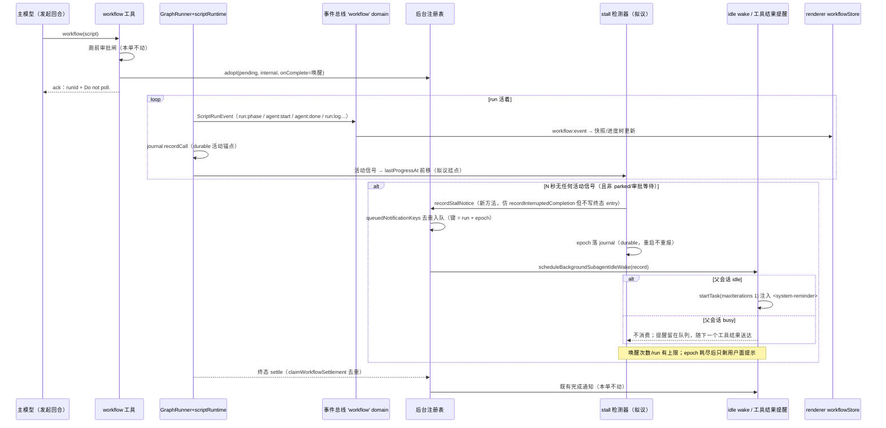

# 后台 dynamic workflow 卡住提醒设计稿

- 状态：**草稿·待爸拍板**
- 单号：N-WORKFLOW-BACKGROUND-STALL-DESIGN
- 基线：`origin/main@8d8da70f8`（任务书验证锚点 `305266f2c` 已含其中；行号会漂，grep 为准）
- 相关：母单 N-WORKFLOW-BACKGROUND 的第三条承诺「卡住的 run 用通知唤醒主 agent」；前作 N-WORKFLOW-BACKGROUND-A（PR #2243，runId 即返 + 终态走后台完成通知）；恢复件 `docs/architecture/dynamic-workflow.md`、`src/host/runtime/dynamicWorkflowRecovery.ts`
- 性质：只设计 + 一条故障注入测试（`tests/unit/agent/workflowStallNotificationDuplicateDelivery.test.ts`，已随本单提交）。不改 `src/`、不实现检测器、不做付费 A/B（N-WORKFLOW-BACKGROUND-AB）、不做 UI。①⑥ 在正文「图」一节；②⑤ 在「去重键与重启论证」；③ 在文末 Decision needed；④ 在「后续施工单」。

## 现状锚点

每行都是 `文件:标识符`，标识符能在该文件里被 grep 到。基线 `origin/main@8d8da70f8` 核对。

| 锚点 | 它证明什么 | 核对 |
|---|---|---|
| `src/host/tools/modules/multiagent/workflow.ts:handWorkflowRunToBackground` | 审批通过后把 pending run adopt 进 `getBackgroundSubagentRegistry()`，`completionKind: 'internal'`，`onComplete: scheduleBackgroundSubagentIdleWake`；刻意不传 parent runId | 已核对 |
| `src/host/tools/modules/multiagent/workflow.ts:announcedWorkflowSettlements` | 终态去重是**进程内 Set**，键 `${runId}:${terminalStatus}`，注释自述「进程内守卫，重启随注册表一起清空」 | 已核对 |
| `src/host/tools/modules/multiagent/workflow.ts:backgroundWorkflowAck` | ack 文案已要求模型不要轮询（`Do not poll.`） | 已核对 |
| `src/host/tools/modules/multiagent/workflow.ts:deps.emit` | 全部 `ScriptRunEvent` publish 到事件总线 `'workflow'` domain（带 sessionId，`bridgeToRenderer:false`；代码注释自称「8 类」，契约实际 9 类，以契约为准），其中 `run:phase` / `agent:start` / `run:log` 三类另映射 onProgress | 已核对 |
| `src/host/tools/modules/multiagent/workflow.ts:new GraphRunner` | 工具直发路径的 GraphRunner **没有传 `persistCheckpoint`**——活跑期间没有 durable graph checkpoint（见「重启论证」第 3 步） | 已核对 |
| `src/shared/contract/scriptRun.ts:ScriptRunEventType` | 事件全集 9 类：`run:start` `run:phase` `run:log` `agent:start` `agent:done` `agent:error` `run:done` `run:cancelled` `run:error`（后三类是终态） | 已核对 |
| `src/shared/contract/scriptRun.ts:ACTIVITY_TYPES` | 仓里**已有**「活动事件」定义：`run:phase` `run:log` `agent:start` `agent:done` `agent:error`——正是停滞判定要的活动信号，不用新造 | 已核对 |
| `src/host/orchestration/adapters/dynamicWorkflowExecutor.ts:emitNestedGraph` | 每条嵌套图事件都走 `context.saveCheckpoint` + `context.progress`（→ `node_progress` → 兼容适配器 → `deps.emit`）：**checkpoint 写与 progress 事件是同一条链** | 已核对 |
| `src/host/agent/scriptRuntime/runService.ts:startRun` | 每个 `agent()` 调用成功后经 `onCallComplete` → `journalRepo.recordCall` 写一行 durable journal（SQLite，`INSERT OR REPLACE` 幂等） | 已核对 |
| `src/host/services/core/repositories/WorkflowJournalRepository.ts:startRun` | run 开始写 `workflow_runs` 占位行（`INSERT OR REPLACE`，带 `status`/`sessionId`/`workingDir`）；`finishRun` 收终态；**未收口的 run 行 durable 地停在 running** | 已核对 |
| `src/host/agent/backgroundSubagentRegistry.ts:queuedNotificationKeys` | 完成通知队列的入队去重：`Set<dedupeKey>`，**纯内存、drain 后也不清**（进程内单调） | 已核对 |
| `src/host/agent/subagentCompletionNotification.ts:dedupeKey` | 键构成 `${sessionId}:${runId}:${treeId}:${agentId}:${status}:${finishedAt}` | 已核对 |
| `src/host/agent/backgroundSubagentRegistry.ts:recordInterruptedCompletion` | 已有的 out-of-band 通知入口（重启收口用）：构造 record → `queuedNotificationKeys` 去重入队 → **副作用**是补一条 failed 终态 entry（`ParentGone`） | 已核对 |
| `src/host/runtime/durableRecoveryHandlers.ts:createBackgroundSubagentRecoveryHandler` | 重启投影的复用范式：`terminalDurable` → `recordInterruptedCompletion` → `scheduleBackgroundSubagentIdleWake(record)`——stall 通知抄这条流水线的前后两步，不抄 terminalDurable | 已核对 |
| `src/host/agent/backgroundSubagentIdleWake.ts:flushWake` | 单一消费点防双投递：父会话 busy 时不消费队列（留给工具结果提醒路径）；idle 时 `startTask(maxIterations: 1)` 注入 system reminder | 已核对 |
| `src/host/agent/runtime/toolExecutionEngine.ts:appendBackgroundCompletionReminder` | 工具结果路径的另一个 drain 消费点（session 级 scope） | 已核对 |
| `src/renderer/stores/workflowStore.ts:handleEvent` | renderer 按 `workflow:event` 通道折叠 `runs[runId]` 快照，WorkflowMonitor 面板渲染进度树——用户面 UI 已有，stall 呈现可以在 renderer 从快照新旧推导，**不动协议** | 已核对 |
| `src/host/agent/backgroundSubagentLiveProgress.ts:noteSubagentLiveProgress` | 注册表的 `noteLiveProgress` 只在 subagentExecutor 链上调用；workflow run 的 registry entry **没有**活进度回写 | 已核对 |
| `src/host/runtime/dynamicWorkflowRecovery.ts:createDynamicWorkflowGraphRecoveryHandler` | 恢复件：durable envelope + graph checkpoint 从断点重跑，readonly 工具面。本设计只引用它，不改它 | 已核对 |

## 图

一次后台 run 从发起到卡住提醒到收尾的顺序。stall 检测器（拟议）画在同一张图里，后文不再改这条顺序。

### 状态点亮表

run 状态 × 谁被通知 × 哪个 UI/队列元素点亮。「—」= 不通知（防唤醒环路的静默面）。

| run 状态 | 主模型看到什么 | 用户看到什么 | 点亮的元素（既有/拟议） |
|---|---|---|---|
| running·有活动 | —（ack 已说别轮询） | 进度树滚动、状态行 detail 更新 | `workflowStore.runs[runId]` 快照（既有）；journal 行增长（既有，不可见） |
| running·软停滞（活动间隔 > N_soft，UI-only） | —（**不唤醒**） | 状态行/进度树标「一段时间没有进展」（拟议，renderer 从快照 updatedAt 推导，零协议改动） | workflowStore 快照派生标志（拟议，renderer 内） |
| running·硬停滞（> N_hard，epoch E） | 一条 `<subagent_notification>` system reminder：run 标题 + 已等时长 + 「不要轮询，可 collect_agent 查看/决定放弃或等待」 | 时间线出现一条「后台工作流长时间无进展」事件 | `pendingNotifications` 队列（既有）+ `queuedNotificationKeys`（既有）；`drainCompletionNotifications` 由 idle wake 或工具结果路径消费（既有） |
| running·epoch 耗尽（≥ cap） | —（**不再唤醒**，防环路） | 用户面仍每次亮 | 仅 renderer 派生标志 |
| waiting / requires_review（parked，含恢复重跑挂起） | —（不算停滞，时钟停走） | 进度树按既有 requires_review 呈现 | graph checkpoint status（既有） |
| 终态 completed / failed / cancelled | 既有后台完成通知（claimWorkflowSettlement 去重，本单不动） | 既有时间线收尾 | 既有全部完成通道 |
| 重启后（本进程视角） | 恢复完成通知走既有通道；**stall 通知因 durable epoch 不重报** | 恢复提示既有 | `workflow_runs` durable 行 + 拟议 `workflow_stall_notices` durable 键 |

## ② 停滞判定

**什么算进展。** 三条既有信号，任一前移即刷新 `lastProgressAt`，全部锚在现状锚点表：

1. **活动事件**：`ScriptRunEvent` 里属于 `ACTIVITY_TYPES` 的五类（`run:phase` / `run:log` / `agent:start` / `agent:done` / `agent:error`）。挂点在 `deps.emit`（工具侧）或事件总线 `'workflow'` domain 订阅侧；`agent:error` 也算活动——出错是「有进展」，它随后自会走向终态，不该被 stall 抢跑。
2. **journal 行**：`onCallComplete` → `recordCall` 每写一行（`workflow_run_calls` 带时间戳）。这是**durable** 的活动锚点，重启后用来重建基线。
3. **checkpoint 写**：`DynamicWorkflowExecutor.emitNestedGraph` 里 `context.saveCheckpoint`——与活动事件同链，正常情况下被 1 覆盖，只作为 1 的兜底（事件 best-effort 丢过，见 scriptRun.ts 注释）。

注册表的 `noteLiveProgress` **不**算：workflow run 今天不回写它（现状锚点表末三行），设计不把不存在的信号当依据。

**判定式。** run 在注册表里仍为 `running` 且未 parked：`now − lastProgressAt > N_hard` → 硬停滞。推荐 `N_hard = 600s`：与 `SUBAGENT_EXECUTION_TIMEOUTS.FOREGROUND_TO_BACKGROUND_BUDGET`（600s，「前台转后台」的既有预算同量级）对齐——一个后台 run 里两次 agent 调用之间静默超过 10 分钟，在任何正常负载下都异常。软停滞 `N_soft = 120s`，纯 UI，不进判定式。

**不许误报的两类等待。**

- **等审批**：跑前审批闸在 adopt 之前完成（`requestApproval` 阻塞在工具入口，那时 runId 尚未进注册表），检测器只看注册表里的 run，天然测不到它。run 中途 park 到 `waiting` / `requires_review`（graph checkpoint 状态）时**时钟停走**：parked 不是停滞，是「等别人」。恢复重跑（`dynamicWorkflowRecovery`）期间的等待同此规则——恢复件自己有 `observing` 状态，检测器不与它抢。
- **长单节点**：一次 `agent()` 调用内部（推理 + 工具循环）合法地可能很久。规则：`agent:start` 本身刷新 `lastProgressAt`，所以「同一节点内部静默」要单算——单调用超过 `M = 1800s`（30 分钟）且期间零 `agent:done`/`agent:error`/`run:log`，才算硬停滞。`M` 的量级依据：`ROLE_EXECUTION_MINIMUM` 是 900s（子 agent 角色执行下限），单调用翻倍到 30 分钟仍未吐任何事件，才有把握说它不是慢而是卡住。`M`、`N_hard` 的最终数字见 Decision needed，不由本文拍死。

**判定器落点**：进程内、每 run 一个 timer（或统一扫描循环），挂 `handWorkflowRunToBackground` 的 adopt 之后；不进 GraphRunner（恢复件共用它，改它等于改三条线）。

## ③ 通道分工

**模型面**（走既有完成通知队列，不新开通道）：

- 投递：新方法 `recordStallNotice`（registry 上，形状仿 `recordInterruptedCompletion`）→ `pendingNotifications` + `queuedNotificationKeys` 去重 → `scheduleBackgroundSubagentIdleWake`。busy 会话不消费队列、随下一个工具结果由 `appendBackgroundCompletionReminder` 送达——两个消费点都是既有机制，stall 通知零新增消费路径。
- 文案：`kind: 'internal'` 的回应要求已是「没有后续动作时不要回复用户」；stall 通知正文沿用 `<subagent_notification>` 形状，`next_action` 指向 `collect_agent(runId)`（注册表 entry 仍在、状态 running，能查到），并复述 **Do not poll**。

**用户面**（不动协议，renderer 推导）：

- 软停滞提示由 renderer 从 `workflowStore.runs[runId]` 快照的事件时间戳推导「多久没动静」，不新增 `ScriptRunEventType`（加事件类型 = 模型可见协议变更 + 快照重录，收益不成比例）。
- 硬停滞在用户面同步亮一条时间线事件（同一判定经事件总线 `'workflow'` domain 发一条 UI-only 事件，或直接复用软停滞呈现——两种都零模型可见字节，取舍见 Decision needed）。

**不许唤醒模型的面**：

- 软停滞（UI-only）永不唤醒。
- 同一 epoch 只投一次（dedupeKey 挡）；新 epoch 需再等满一个 `N_hard`。
- **每 run 唤醒上限 `K = 3` 个 epoch**：耗尽后检测器转入静默（用户面照常亮），防「唤醒→模型 collect_agent→run 还在卡→再唤醒」的环路。collect_agent 本身不算活动信号（它不进 GraphRunner），不会错误地推迟停滞判定。
- stall 通知**不是**进展：投递不刷新 `lastProgressAt`，也不重置 epoch。

## ④ 复用清单

| 要什么 | 复用什么 | 新增什么（最小） |
|---|---|---|
| 通知入队与去重 | `pendingNotifications` + `queuedNotificationKeys` + `SubagentCompletionRecord` 形状 | `recordStallNotice` 方法：仿 `recordInterruptedCompletion` 的构造+去重入队两步，**去掉**「补 failed 终态 entry」副作用——run 还活着，终态留给真结算，否则 `collect_agent` 会把 running run 报成 failed |
| 唤醒 | `scheduleBackgroundSubagentIdleWake`（去抖 50ms、单消费点、busy 让路）全盘复用 | 无 |
| 消费 | idle wake `startTask` 路径 + `appendBackgroundCompletionReminder` 工具结果路径 | 无 |
| 停滞判定信号 | `ACTIVITY_TYPES` 五类事件 + journal `recordCall` 行 + executor checkpoint 写 | 进程内 per-run `{ lastProgressAt, epoch }`；journal 侧新查询 `listUnfinishedRuns`（`workflow_runs.status = 'running'`，今天只有按 runId 点查） |
| durable 去重键 | `workflow_runs` 表与 SQLite 通道 | 新小表 `workflow_stall_notices(run_id, epoch, announced_at)`，append-only；写入即宣布，重启后先查它再投 |
| 恢复 | `dynamicWorkflowRecovery` 整件不动 | 无（关系见下节） |

## ⑤ 去重键与重启论证

**stall 通知键 = `runId:stall:epoch`**（epoch 从 1 单调递增，每检测到一次新停滞 +1）。内存侧映射到既有 `SubagentCompletionRecord.dedupeKey`：同一 epoch 的重复上报靠构造时冻结的 `finishedAt`/身份字段保证键一致（本单故障注入测试钉死的正是这一层）；跨 epoch 的键天然不同（测试对照组）。durable 侧 `workflow_stall_notices` 一行一 `(run_id, epoch)`，**宣布前先写、写成功才投**——进程内 `queuedNotificationKeys` 与 durable 表双保险，前者管进程内重复，后者管跨重启重复。DB 未就绪（`getWorkflowJournalRepository()` 返 null）时 durable 键不可用，回落纯进程内去重——与现状终态同水位，不比现状差，但要在施工单里 warn 留痕（降级必须可区分，不许静默）。

**逐步反驳母单验收 ②**（原文：「after an app restart, running runs go through the existing dynamicWorkflowRecovery without being lost, and notifications are not repeated」）：

1. **重启时进程内全空。** `announcedWorkflowSettlements`（workflow.ts，注释自述重启清空）、`queuedNotificationKeys`、注册表 entries 全是内存态。任何只靠它们的「不重复」承诺在重启时刻归零——这是现状的诚实起点，不是本设计能绕过的前提。
2. **run 不丢的部分成立**：`workflow_runs` durable 行 + journal 调用缓存让 run 可发现、可 `resumeFromRunId` 重放（新 runId、命中调用不再推理）。
3. **但有一处现状缺口必须摆上台面**：工具直发路径的 GraphRunner **没接 `persistCheckpoint`**，且 grep 全仓找不到活跑路径写 `engine.kind='dynamic_workflow'` durable envelope 的代码（`createDynamicWorkflowDurableState` 只在恢复件内部调用）。即：**今天的后台 workflow run 重启后不是走 graph checkpoint 续跑，而是靠模型/用户拿 resumeFromRunId 重放**。母单验收 ② 的「goes through dynamicWorkflowRecovery」对工具直发路径目前只是部分事实——本设计的 stall 通知不押在它上面，durable 键挂 journal（run 起跑就有行），不挂 graph envelope（可能没有）。
4. **stall 通知不重报的论证**：epoch 落在 `workflow_stall_notices`（durable）。重启后检测器重建时从该表读「已宣布到第几 epoch」，只从 +1 继续。旧 epoch 的通知即使被任何路径重放，durable 键先挡（宣布前查表）。对比现状：终态通知跨重启**会**重（第 1 步），stall 通知跨重启**不会**——这是本设计对母单 ② 的加固而非继承。
5. **终态与 stall 的边界**：run 真终态后检测器停表（`getStatus(runId).status !== 'running'` 即撤 timer）；终态通知仍走既有 `claimWorkflowSettlement`（进程内语义，本单不动、不假装修好）。跨重启的终态重报是母单 ② 自己的遗留课题，记入后续单，不混进本设计。

## ⑨ 故障注入测试（已提交）

`tests/unit/agent/workflowStallNotificationDuplicateDelivery.test.ts`，只打既有代码，零 `src/` 改动：

- **主案**：同一条记录经真实 `recordInterruptedCompletion` → `queuedNotificationKeys` → `drainCompletionNotifications` 路径投两次，drain 只收到 1 条；drain 后再投同条仍被挡（`queuedNotificationKeys` 不随 drain 清空——「每 epoch 提醒一次」的机制依据）。挡住它的键就是 `SubagentCompletionRecord.dedupeKey`（`subagentCompletionNotification.ts` 构造，断言里逐字写出 `session:run:tree:agent:status:finishedAt` 全串）。
- **对照组**：epoch 不同（时钟推进 → `finishedAt` 不同）与另一 run 卡住（`agentId` 不同）时键不同，两条都送达。
- **反向变异**（证据档 fault-injection）：夹具给第二条记录盖不同 `finishedAt`（键随之不同）并按任务书允许移除键相等断言 → drain 收到 2 条，`toHaveLength(1)` 红，红行已贴证据档；从备份副本还原（非 `git checkout --`）后复绿。stall 设计依赖的正是这个键：`recordStallNotice` 只要保证同一 epoch 构造出键一致的记录、跨 epoch 构造出键不同的记录，重复投递就被既有机制挡住，无需新去重代码。

## Decision needed

每项带推荐，拍板后进施工单。

### D1 [阈值] N_hard / N_soft / M / K

- A：`N_hard=600s`、`N_soft=120s`、单调用上限 `M=1800s`、每 run 唤醒上限 `K=3`，常量进 `src/shared/constants/`（对齐既有 `SUBAGENT_*` 分组），数值首版后按误报率调。
- B：`N_hard` 取 300s，更快唤醒。
- C：只做软停滞（UI-only），模型唤醒整体缓期。

**推荐 A。** 600s 与既有后台预算同量级；300s 在慢推理 + 长工具循环下会误报；C 等于没做母单第三条承诺。

### D2 [文案] stall 通知正文与给模型的指令

- A：英文稳定串（对齐 `backgroundWorkflowAck` 风格）：标题=run 标题，正文给「no progress for Xs, last activity: <label>；Do not poll. Use collect_agent("<runId>") to inspect, then decide to wait or abandon.」；不替模型做取消决定。
- B：中文正文。
- C：正文里直接带 `cancel` 指令建议。

**推荐 A。** 模型可见文案仓内先例全是英文稳定串（host 中文留给用户面 i18n）；C 会诱导模型激进取消长任务，与「不许误报」立场矛盾。

### D3 [协议] stall 记录的 status 字段

- A：给 `SubagentCompletionStatus` 加 `'stalled'`（模型可见字节变更，施工单须跑 `acceptance:snapshot-replay:record`）。
- B：复用 `'failed'` + summary 里说明「仍 running」。
- C：stall 通知不走 `SubagentCompletionRecord`，另造一条纯文本提醒通道。

**推荐 A。** B 会让 `statusLabel` 打出「ended with failed」——run 明明还在跑，误导模型直接收尾；C 新开通道丢掉本单测试钉死的去重机制，等于推翻 ⑤。A 的快照成本一次性、可控。

### D4 [用户面呈现] 硬停滞在用户面怎么亮

- A：软/硬停滞都用 renderer 从快照推导的同一「无进展」标志，只是文案分档（>2min「暂无进展」/ >10min「长时间无进展，已提醒 Neo」）。
- B：host 经事件总线发一条 UI-only 事件，renderer 订阅。

**推荐 A。** 零协议、零新事件类型；B 要动 `'workflow'` domain 的事件面，收益不成比例。两者都不唤醒模型。

### D5 [顺序] durable 键先行还是检测器先行

- A：先做 `workflow_stall_notices` + `listUnfinishedRuns`（纯 journal 层，单测可密闭验证），再做检测器与通知。
- B：先做检测器（进程内），durable 键后补。

**推荐 A。** B 会先交付一个「重启后可能重报」的检测器，恰好违反本设计 ⑤ 的承诺；journal 层无模型可见字节，unattended-safe。

### D6 [范围] 终态通知的跨重启去重要不要并进本线

- A：不并。单开一张单处理 `claimWorkflowSettlement` 的 durable 化（动 workflow.ts 终态路径，风险面大）。
- B：顺手一起做。

**推荐 A。** 母单 ② 的终态半句是既有欠账，和 stall 通知共享 journal 通道但不同代码路径；混做会让一张施工单同时碰「新增通知」和「改既有终态语义」。

## 后续施工单

名字是提议。每张标注 unattended-safe（无人值守可跑）与否。

| 单 | 范围 | unattended-safe | 依赖 |
|---|---|---|---|
| N-WF-STALL-JOURNAL | journal 层：`workflow_stall_notices` 表 + `listUnfinishedRuns` 查询 + 单测。零模型可见字节 | 是（密闭 SQLite 单测） | 无 |
| N-WF-STALL-DETECTOR | 检测器：adopt 后挂 per-run timer、`ACTIVITY_TYPES` 事件刷新 `lastProgressAt`、parked 停表、epoch 推进与 `K` 上限。常量进 `shared/constants`。mock 时钟单测 + 反向变异（去掉去重→红） | 是（全部 mock，无真模型） | N-WF-STALL-JOURNAL |
| N-WF-STALL-NOTICE | `recordStallNotice`（无终态副作用）+ `'stalled'` status + D2 文案 + 复用 idle wake/工具结果两消费点；快照重录；本单测试文件扩为真路径回归 | 否（模型可见字节变更 + 快照重录，需人核对呈现） | N-WF-STALL-DETECTOR |
| N-WF-STALL-RESTART | 重启重建：从 `workflow_stall_notices` + `listUnfinishedRuns` 恢复检测器基线，跨重启不重报的集成测试 | 是（进程夹具重启模拟，参考 `tests/e2e/fixtures/backgroundSubagentProcessHost.ts` 形状） | N-WF-STALL-NOTICE |
| N-WF-STALL-SETTLEMENT-DEDUPE | D6-A：终态通知 durable 化（动 workflow.ts 终态路径） | 否（改既有终态语义，须多模型对抗审查） | 无（独立线） |
| N-WORKFLOW-BACKGROUND-AB | 付费 A/B（母单既定，非本设计产出） | 否（花钱，人值守） | 检测器全链落地后 |

## 预期收益

拍板后按上表开工，不用再翻注册表与恢复件。长跑后台 workflow 卡死时：主会话在 `N_hard` 内被既有唤醒链路叫醒并拿到可行动的 runId（而不是永远等一条不会来的完成通知）；用户面两档「无进展」提示先于模型唤醒出现；重启后已宣布过的 epoch 不再重报。检测器、通知、durable 键三层各自可单测，付费 A/B 之前不产生模型开销（软停滞与判定全在宿主侧）。

要单独记账、不能当成已经有的能力：

- 工具直发路径的 GraphRunner 没接 `persistCheckpoint`，durable graph envelope 在活跑路径 grep 不到——「重启走 checkpoint 续跑」对这条路径今天不成立（见 ⑤ 第 3 步），是独立缺口，本设计绕开而非修复。
- `claimWorkflowSettlement` 与 `queuedNotificationKeys` 都是进程内状态，现状跨重启会重报终态；本设计只给 stall 通知建 durable 键，终态欠账在 N-WF-STALL-SETTLEMENT-DEDUPE。
- workflow run 的 registry entry 没有活进度回写（`noteLiveProgress` 不在链上），「卡了多久」的展示精度受限于事件时间戳粒度。
