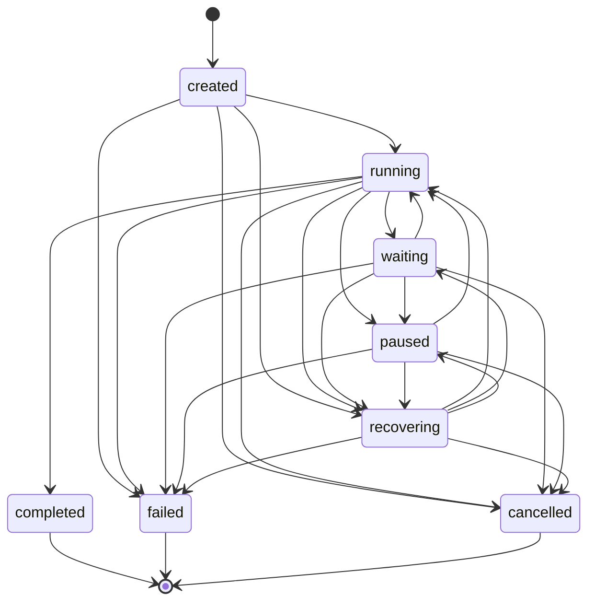
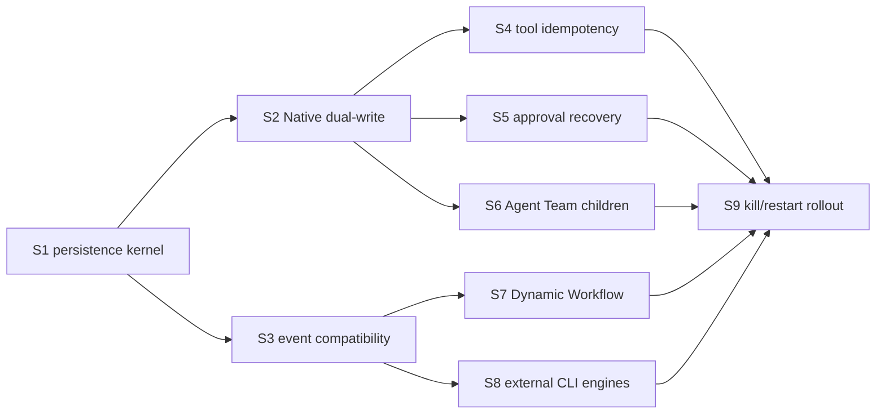

# Durable Run Kernel contract

S9.5 production implementation SHA: `a971fd8f5089a52263df202ef772f6b1218b0189`.

> S0 scope: contract, schema draft, narrow persistence ports, and crash-failure gold. Production recovery wiring starts in S1.

## Product contract

Agent Neo executes every logical node with **at-least-once** semantics. A crash may cause a node to run again. The kernel does not claim exactly-once execution.

Side-effecting tools add three controls on top of at-least-once execution:

1. Persist a stable idempotency key and `prepared` operation before dispatch.
2. Record dispatch/result in the execution ledger and reuse the key across attempts.
3. When the provider cannot query or deduplicate an uncertain result, stop in `waiting` and require a human decision before retrying.

`runId` identifies one logical execution and remains stable across recovery. `sessionId` identifies the conversation. Recovery creates a new process instance, increments `attempt`, and fences the previous owner with a higher owner epoch.

Native, Agent Team, Dynamic Workflow, and external CLI engines share `RunEnvelope`. Engine-specific cursors remain opaque, versioned payloads inside `RunCursor.engineCursor`; they cannot redefine run identity, event sequence, ownership, or terminal state.

## Contracts and ports

The public data contract lives in `src/shared/contract/durableRun.ts`:

- `RunEnvelope`: logical run identity and current durable projection.
- `RunStatus`: `created/running/waiting/paused/recovering/completed/failed/cancelled`.
- `RunAttempt`: one process instance's ownership interval.
- `RunCheckpoint`: a checksummed engine snapshot tied to an event boundary.
- `PendingOperation`: recoverable model/tool/approval/child/external operation with a stable idempotency key.
- `ChildRunRef`: parent-to-child relation without collapsing child identity into the parent.
- `RunCursor`: next event sequence, latest checkpoint sequence, and optional engine cursor.

The Host-only persistence ports live in `src/host/runtime/durableRunStores.ts`:

- `RunStore`: create, query, lease claim/renewal, fenced transition, and attempt append.
- `EventStore`: compare-and-append events using `expectedNextSeq`.
- `CheckpointStore`: latest checkpoint read and one atomic checkpoint commit.
- `RunRehydrator`: inspect recovery evidence, claim a new owner epoch, increment attempt, and return a recovery plan.

These ports deliberately exclude SSE, IPC, CLI, and database row types. Adapters preserve current public protocols while the kernel rolls out behind them.

The shared Host consumption boundary lives in `src/host/runtime/durableRunKernel.ts`:

- `createRun(DurableRunCreateInput)` creates any supported engine envelope with the same first attempt,
  owner epoch, lease, event cursor, and timestamps. `createNativeRun()` is the compatibility wrapper.
- `prepareOperation(PrepareOperationInput)` creates `tool_call`, `approval`, `child_run`, and
  `external_engine` projections with a key derived only from `runId`, operation kind, and stable logical
  operation identity. `prepareToolOperation()` is the compatibility wrapper.
- `createChildRunRef()`, `addChildRunRef()`, `assertChildRunProjection()`, and
  `projectChildRunTerminal()` are pure construction/projection helpers. Child projections become durable
  only when supplied to the existing fenced `checkpoint()` transaction.

Engine adapters consume this boundary. They do not construct `RunEnvelope` directly and do not call
`DurableRunRepository` directly.

## State machine

Terminal states have no outgoing transitions. A terminal write requires terminal metadata with the same status and a terminal event sequence. `completed` additionally requires all side-effecting operations to be resolved and all required children to be terminal. `failed` and `cancelled` may close uncertain operations only after recording them as `abandoned` or `unknown`; they cannot silently discard them.

## Atomic checkpoint boundary

One `CheckpointStore.commit()` transaction performs all of the following or none of them:

1. Verify `runId`, non-terminal status, active owner epoch, attempt, expected next event sequence, and next checkpoint sequence.
2. Append ordered run events under `(run_id, seq)`.
3. Replace the pending-operation and child-run projections represented by the snapshot.
4. Insert the checksummed checkpoint with its highest included `eventSeq`.
5. Advance `durable_runs.next_event_seq`, `checkpoint_seq`, status, envelope, and timestamp.

External model, tool, and child-process effects cannot join this SQLite transaction. A side effect therefore follows `prepare commit -> dispatch -> result commit`. A crash between dispatch and result commit produces an uncertain operation; the idempotency and human-confirmation rules decide whether recovery may retry.

The terminal event and terminal `durable_runs` projection must be written in one transaction. A process that emits a public terminal event before this transaction commits violates the contract.

## Event sequence and cursor rules

- Sequence is scoped to `runId`, starts at 1, and never resets when `attempt` increments.
- `(run_id, seq)` is unique. Append uses `expectedNextSeq`; stale writers fail rather than overwrite or skip ahead.
- A checkpoint's `eventSeq` is the highest event included in the same transaction. Its cursor points to the next append position.
- Public SessionEvent/SSE event ordering remains compatible. S3 will add an internal mapping to durable sequence without changing existing required fields.
- Existing `session_events` remains an evaluation/replay source. It is not promoted to the Durable Run event truth source because it lacks run identity and per-run sequence uniqueness.

## Owner lease and stale owner rules

- A live owner is identified by `ownerId + processInstanceId + epoch` and a lease expiry.
- Lease renewal is a compare-and-swap on the full owner tuple. Renewal never changes attempt or epoch.
- Before expiry, another process cannot claim the run.
- After expiry, recovery claims the run by comparing the previous epoch, incrementing epoch and attempt in one transaction, and writing a new `RunAttempt` with a new `processInstanceId`.
- Every state, event, checkpoint, pending-operation, child, and terminal write carries the expected owner epoch. A previous process becomes stale immediately after takeover and all its writes fail closed.
- Clock interpretation belongs to the store adapter. S1 must use one database/process clock source for claim and renewal comparisons and test boundary equality.

## Idempotency rules

- The stable key identifies a logical operation within a logical run, commonly `runId + logical call id`. It must not contain `attempt` or process identity.
- The database enforces uniqueness on `(run_id, idempotency_key)`.
- Pure model calls may be repeated after an uncertain crash, but duplicated provider output cannot be appended twice because event sequence and operation result commit are fenced.
- A side-effecting tool may auto-retry only when the tool/provider guarantees deduplication for the key or exposes a result lookup by that key.
- A side-effecting tool with an uncertain dispatch and no deduplication proof sets `requiresHumanConfirmation` and returns the run to `waiting`.
- Approval operations persist the question and checkpoint before waiting. Recovery never converts an existing wait into approval.
- Child creation uses the parent operation's idempotency key. Recovery first resolves the existing `ChildRunRef`; it does not spawn a second child blindly.

## Kill/restart failure gold

`tests/unit/host/runtime/durableRunFailureGold.test.ts` freezes six crash windows across five lifecycle areas:

| Kill point | Current evidence | Why crash resume is not yet safe |
| --- | --- | --- |
| Before model dispatch | `session_events` | No `runId`, attempt, per-run seq, or idempotency key proving that dispatch has not happened. |
| After model response, before result commit | `session_events` | No fenced result boundary, so retry may duplicate provider cost/output. |
| Between tool begin/end | `tool_execution_events` | Open execution can be detected, but cannot be fenced to a logical run/attempt or safely deduplicated. |
| Approval waiting | `pending_approvals` | Approval persists, but has no run attempt/checkpoint identity. |
| Child agent running | `swarm_run_ledger` | Child/team history has run seq, but no unified parent run, attempt, checkpoint, or owner epoch. |
| Terminal writeback | `sessions.status` + `session_events` | Session-level state and event insert cannot atomically prove a logical run terminal. |

The gold test should change only when a later slice wires the missing evidence and replaces the corresponding assertion with a kill/restart recovery test.

## Migration draft and rollback

`src/host/services/core/database/migrations/durableRun.ts` adds six isolated tables:

- `durable_runs`
- `durable_run_attempts`
- `durable_run_events`
- `durable_run_checkpoints`
- `durable_run_pending_operations`
- `durable_run_children`

S0 does not call the draft from `DatabaseService`. S1 owns activation, repositories, transaction implementation, and rollout gating. Existing sessions and ledgers remain authoritative until the relevant engine adapter dual-writes successfully.

Rollback has two levels:

1. Runtime rollback: disable Durable Run writes/read preference and continue using legacy stores. No old table or protocol changed.
2. Schema rollback: after runtime rollback and export/retention review, drop the six `durable_run_*` tables in dependency order. Existing tables and data remain untouched.

## S1–S9 migration and file ownership

Each slice owns only the listed files while active. Shared contract changes return to the S1 owner for review so engine slices cannot fork the model.

| Slice | Outcome | Exclusive file ownership while active | Must avoid |
| --- | --- | --- | --- |
| S1 | Activate migration, implement SQLite stores/transactions and rehydration plan | `src/host/services/core/database/migrations/durableRun.ts`, new `DurableRun*Repository.ts`, `databaseService.ts`, `src/host/runtime/durableRunStores.ts`, migration/repository tests | Agent loops, routes, public events |
| S2 | Native engine creates/updates `RunEnvelope` behind a flag and dual-writes | `src/host/runtime/runContext.ts`, `runRegistry.ts`, `src/web/routes/agent*.ts`, `src/host/agent/agentLoop*.ts`, Native run tests | Tool/approval/Team internals |
| S3 | Map durable seq/run identity to current SessionEvent, SSE, IPC, and CLI compatibility adapters | `src/host/protocol/**`, `src/web/helpers/sse.ts`, `src/host/evaluation/sessionEventService.ts`, `src/cli/**` event adapters, compatibility tests | Required public field removal or rename |
| S4 | Prepare/dispatch/result ledger and side-effect retry policy | `src/host/tools/toolExecutor*.ts`, `src/host/services/core/repositories/ToolExecutionEventRepository.ts`, tool ledger/idempotency tests | Approval and child scheduling |
| S5 | Persist approval wait checkpoint and resume the same operation | `src/host/agent/planApproval.ts`, `swarmLaunchApproval.ts`, `workflowLaunchApproval.ts`, `PendingApprovalRepository.ts`, approval tests | General event protocol changes |
| S6 | Bind Agent Team child runs and restore/reconcile child state | `src/host/agent/parallelAgentCoordinator*.ts`, `multiagentTools/**`, `SwarmLedgerRepository.ts`, Team checkpoint tests | Native route ownership |
| S7 | Adopt envelope/cursor in Dynamic Workflow journal and resume | `src/host/agent/scriptRuntime/**`, `src/host/services/core/repositories/WorkflowJournalRepository.ts`, workflow resume tests | External CLI adapters |
| S8 | Wrap Codex/Claude/MiMo/Kimi process attempts with the same envelope | `src/host/services/agentEngine/**`, `src/host/ipc/agentEngine.ipc.ts`, external-engine tests | Dynamic Workflow and Native loop internals |
| S9 | Run real process kill/restart matrix, enable read preference, document rollback and release evidence | `tests/e2e/**durable*`, new acceptance scripts, `src/host/app/init*` rollout wiring, release/architecture docs | New engine features or schema redesign |

## S1 as-built implementation

S1 activates the six-table migration in `DatabaseService` and implements the three SQLite ports in
`DurableRunRepository`. `DurableRunKernel` owns Native create, lease heartbeat/claim, atomic checkpoint,
terminal commit, release, startup recovery, and stable tool-operation idempotency keys. `RunRegistry`
keeps the existing `RunHandle` control API while treating durable owner/attempt records as the fact source
for its live cache.

The Web Native entry point commits run creation before SSE headers. A successful, failed, cancelled, or
pre-stream-disconnected run commits one fenced terminal event with its terminal projection. Startup scans
expired `running`, `waiting`, and `recovering` leases immediately and once more after the lease boundary;
the second process claims a higher epoch and attempt before exposing a recovery plan.

Recovery preserves approval waits and versioned engine cursors. An open side-effecting tool dispatch may
return to `prepared` only when a provider operation id proves deduplication/lookup support. Otherwise it is
persisted as `unknown`, the run remains `waiting`, and the operation appears in
`requiresHumanConfirmation`. Resolved tool results are never reopened.

`RunKernelAdapter` is the shared S4/S5/S6 consumption boundary. Tool, approval, child-run, and external
engine slices can create or prepare their durable projections and commit checkpoints without changing SSE,
IPC, CLI, or public `SessionEvent` fields. MCP long tasks remain `tool_call` operations and may retain a
provider operation id; they do not introduce a second operation kind. Agent Team coordination, external
engine launch, MCP dispatch, and child recovery remain outside the shared kernel.

## S3.5 frozen shared kernel

S3.5 generalizes S1's Native-only constructors without changing the six-table schema. `createRun()` accepts
the existing `RunEngineRef` union (`native`, `agent_team`, `dynamic_workflow`, `external_cli`) plus optional
initial status, versioned engine cursor, pending-operation projection, and child projection. It validates the
S0 envelope contract, then passes the envelope and first attempt together to `RunStore.create()` so the
repository retains one transaction.

`prepareOperation()` keeps the idempotency key stable across recovery attempts and process owners. An
uncertain side effect still requires human confirmation unless the caller supplies deduplication proof; the
kernel does not claim exactly-once external effects. Parent/child helpers reject self-reference and
conflicting duplicate identities, and terminal child projection leaves the parent run/session identity
unchanged. Persistence remains the responsibility of the existing atomic checkpoint boundary.

The result of `createRun()` exposes `runId`, `sessionId`, attempt, owner epoch, engine kind, parent run, and
process instance required by S3 `createRunTraceContext()`. S3.5 adds no trace identity and changes no trace
hierarchy, exporter, or production telemetry call site.

## S0 completion boundary

S0 supplies compile-time contracts, state-machine validation, narrow ports, an idempotent up/down migration draft, failure gold, and this rollout map. It does not claim process restart recovery. Production recovery requires S1 persistence wiring plus at least one engine adoption slice and S9 kill/restart evidence.

## S9 evidence boundary

The real-process harness now replaces the five legacy missing-column skeletons
and adds Dynamic Workflow, Agent Team/Auto Agent, External Engine, and MCP
variants. It proves epoch takeover, stale-owner rejection, monotonic event
sequence, stable operation keys, terminal uniqueness, completed-node reuse, and
runtime rollback without schema deletion.

Evidence does not promote an injected handler to product support. S9.5 removes
release-row overrides: Native model/tool/approval and Auto Agent startup run
through registered production Hosts, while deterministic fakes replace only
external ports. The real consumer round-trip proves
`productionReadPreferenceWiring`, so the rollout default is
`durable_preferred`. The operational contract is documented in
[S9 acceptance and rollback](durable-run-s9-acceptance-and-rollback.md).
