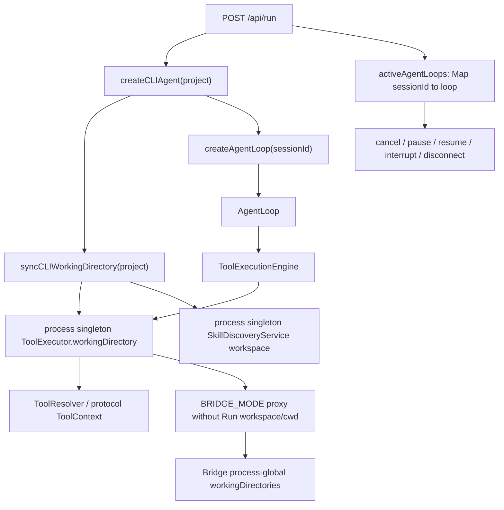
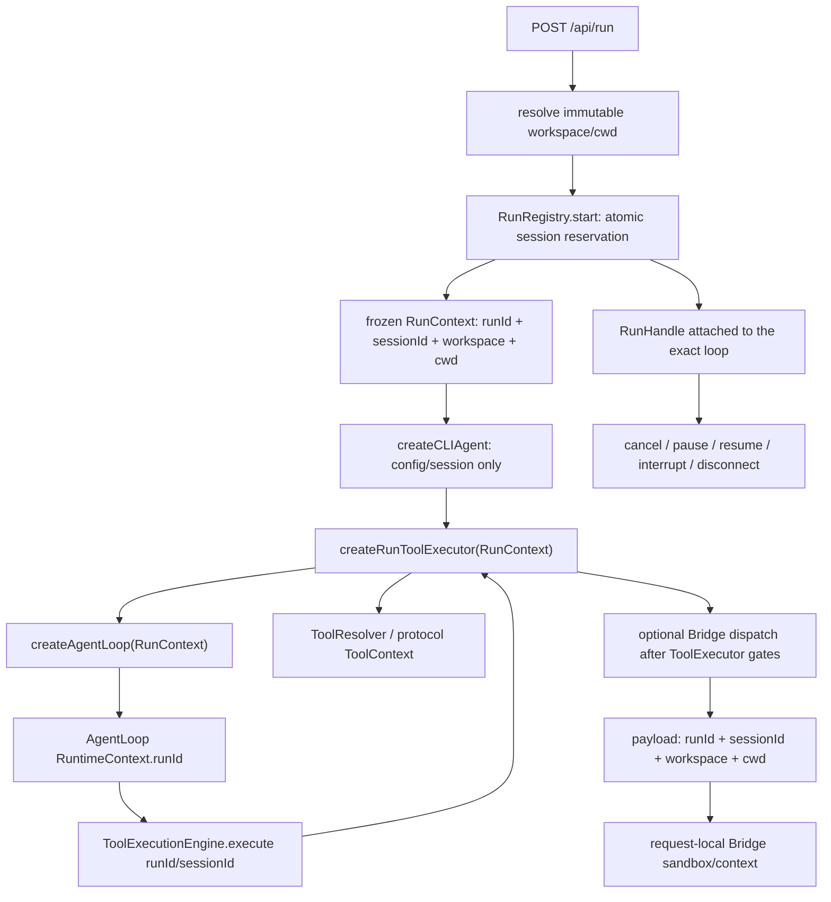

# Native Run execution contract (S2)

Source baseline: `origin/main` at `8800672281b3bf4d2e7847431d8000b11b31375c`.

## Previous ownership and call chain

The former Web route had two execution ownership defects:

| Mutable state | Owner | Previous behavior |
| --- | --- | --- |
| `ToolExecutor.workingDirectory` | CLI bootstrap process singleton | Every `createCLIAgent()` called `syncCLIWorkingDirectory()` and changed the cwd seen by every concurrent loop. |
| `activeAgentLoops` | Web server process, keyed by `sessionId` | A second run for one session replaced the first loop. Disconnect and controls looked the loop up again by session, so an old response could act on a newer loop. |
| `BridgeConfig.workingDirectories[0]` | Local Bridge process | Remote local tools defaulted to one mutable Bridge workspace because the Web payload did not carry the owning Run context. |

`currentAgentLoopSessionId`, `currentTelemetrySessionId`, and the skill discovery service are also process-level helpers. They are not run identity or workspace authorities under this contract.

## Current Native call chain

## Run contract

- `runId` is a generated execution identity and must differ from `sessionId`.
- `sessionId` remains the conversation and persistence identity.
- `RunContext` is frozen after construction. `cwd` must be the workspace itself or a descendant.
- `RunRegistry` is keyed primarily by `runId` and maintains a unique active-session index. `start()` fails closed with `RUN_SESSION_CONFLICT` when that session already owns a run.
- `RunHandle` may be reserved before an `AgentLoop` exists. A cancel received before `attach()` is remembered and delivered exactly once after attachment.
- Pause, resume, and steer fail closed after cancellation has been requested, while the registry reservation remains until the owning `/run` settles.
- Only the request that owns a handle may unregister it. Cleanup uses `unregister(runId, expectedHandle)`, so a stale completion cannot remove a replacement run.
- Cancel requests do not unregister eagerly; the `/run` owner unregisters after the loop settles.

## Workspace and cwd semantics

| Consumer | Fixed Run value |
| --- | --- |
| Relative Read/Write/Edit paths and file checkpoints | Resolve from `cwd`. |
| Protocol resolver context and default shell cwd | `cwd`. |
| Explicit relative Bash `working_directory` | Resolve from `cwd`; reject when it leaves `workspace`. |
| Policy ownership and permission boundary | `workspace`; path inputs are first resolved from `cwd`. |
| Permission-classifier cache | Namespaced by `workspace` and `cwd`. |
| Existing process-global tool-result cache | Bypassed by run-scoped executors because its legacy key has no Run/workspace namespace. |
| Write isolation | Workspace lock root with cwd-resolved target path. |
| Base64 artifact persistence | `<workspace>/.code-agent/artifacts/...`. |
| Bridge local tools | Receive the same Run `workspace`/`cwd`; the global Bridge config is only the outer allowlist. |

`RunContext` freezes the canonical workspace/cwd targets at creation. All later containment checks canonicalize symlink ancestors and fail closed on permission errors, loops, or excessive symlink depth. The legacy bootstrap executor and `syncCLIWorkingDirectory()` remain available only to direct-tool compatibility paths. Agent loops create a new immutable executor for every run. Legacy direct-tool cache behavior is unchanged; run-scoped executors bypass that process-global cache until a future contract gives it a Run-aware key.

## Web API behavior

- Native `task_start` SSE data contains both `runId` and `sessionId`.
- A request without `sessionId` receives a UUID-backed temporary session identity, independent of wall-clock timing.
- A second Native `/api/run` for an active session returns HTTP `409` JSON with code `RUN_SESSION_CONFLICT` before SSE headers are written.
- `/api/cancel`, `/api/pause`, `/api/resume`, and `/api/interrupt` accept `runId`; `sessionId` remains a compatibility selector. When both are supplied they must identify the same run.
- A selector-less control is compatible only while exactly one Native run is active. Multiple runs fail closed instead of selecting the latest run.
- SSE disconnect captures the exact handle created for that response. It never performs a later session lookup.
- Bridge tool cancellation is keyed by `runId` and `toolCallId`; renderer stream teardown aborts only requests owned by that stream's Run.

## Frozen and follow-up boundaries

- External Engine adapters are unchanged. External `task_start` does not publish the Native Host run identity; external runs do not enter the Native `RunRegistry`, do not receive Native `RunHandle` cancellation, and retain their existing same-session behavior.
- Bridge adapter capability semantics are unchanged, but Native local-tool requests now pass through the Run-scoped `ToolExecutor` before dispatch and carry the immutable Run context to a request-local Bridge sandbox. Legacy non-Agent Bridge calls remain supported without pretending that `sessionId` is a `runId`.
- `permission`, `memoryMode`, and `toolScope` entry alignment is reserved for S4. This S2 contract only fixes the execution identity and workspace authority consumed by those layers.
- Role-proactivity and other direct `createAgentLoop()` callers receive a fresh run context/executor but do not enter the Web registry.
- Skill discovery and session-level telemetry helpers remain process-scoped and are not advertised as run-aware. They must not be used as workspace or run identity by S4/S5.

## Automated evidence

- `tests/unit/host/runtime/runContextRegistry.test.ts`: immutable canonical context, symlink-retarget stability, distinct identity, session conflict, pre-attach cancellation, and stale cleanup.
- `tests/unit/tools/toolExecutor.runIsolation.test.ts`: concurrent real Protocol Read/Bash/Write in two temporary repositories, process-cache poisoning resistance, fresh read-after-write, nested cwd semantics, canonical workspace boundary, and immutable executor.
- `tests/unit/tools/toolExecutor.bridgeDispatch.test.ts`: Bridge success still passes permission, write isolation, resolver context, and artifact persistence in the owning Run.
- `tests/unit/bridge/runContextIsolation.test.ts`: request-local Bridge cwd isolation, legacy missing-directory compatibility, symlink/deep-link sandbox rejection, Grep symlink filtering, and shell process-tree cancellation.
- `tests/renderer/api/localToolAbortRegistry.test.ts`: concurrent renderer Bridge requests are cancelled by target `runId` only.
- `tests/unit/web/agentRouter.test.ts`: pre-SSE same-session rejection, UUID temporary sessions, `task_start.runId`, selector-less compatibility, multi-run selector fail-closed, target cancel, target disconnect, and cancellation before loop attachment.
- `tests/unit/web/agentBridgeToolDispatch.test.ts`: immutable Bridge payload, target pending-call cancellation, and same-Run local fallback.
