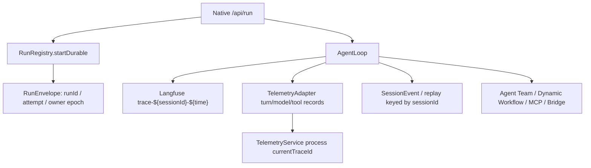

# Durable Run OpenTelemetry tracing

## S3 as-is audit

Before S3, Native execution has three unrelated observability identities:



- `TelemetryService.currentTraceId` is created at singleton construction, overwritten by
  `newTrace()` and `reset()`, read by `getTraceId()`, and copied by every `createSpan()`.
  Parallel runs therefore have no run-scoped authority.
- Langfuse starts a trace in `ConversationRuntime.initializeRun()`, iteration spans in
  `StreamHandler.setupIteration()`, generations in `contextAssembly/inference.ts`, and ends
  the trace in `RunFinalizer.finalizeRun()`. Its trace id is generated independently from the
  Durable Run.
- `RunRegistry.startDurable()` receives the created `RunEnvelope`, `RunAttempt`, owner epoch,
  and process instance. Recovery plans expose the same fields after `DurableRunKernel` claims
  the next attempt. This is the authoritative point for attempt tracing without a schema change.
- Model and turn boundaries live in `ConversationRuntime` and `messageProcessorTelemetry`.
  Tool and approval boundaries live in `ToolExecutionEngine` and `ToolExecutor`.
- Agent Team creates an immutable `SwarmRunScope` in `multiagentTools/spawnAgent.ts`; parallel
  children enter `SubagentExecutor.execute()` with `parentNativeRunId`, `treeId`, and agent id.
- Dynamic Workflow crosses the process boundary in `scriptRuntime/sandbox.ts`. Its init frame
  currently contains script, goal, budget, and a deny-only capability manifest. RPC frames contain
  only id, kind, and payload. The explicit legacy worker fallback has the same gap.
- MCP dispatch is centralized by `MCPClient.callTool()` and `MCPToolRegistry`; SDK requests carry
  tool arguments and timeout/abort state but no `traceparent` or `tracestate`.
- Bridge dispatch already binds `runId`, `sessionId`, workspace, and cwd. The renderer forwards
  them to `/tools/invoke`, but neither the request nor the Bridge `ToolContext` carries W3C trace
  context.
- Structured replay and trajectory export intentionally keep `buildSessionTraceIdentity()` as
  their stable compatibility identity. S3 must only add runtime trace correlation and must not
  replace this replay key.
- `@opentelemetry/api` is present only transitively through Sentry. There is no direct Context API
  dependency and no installed async-hooks context manager.

## S3 ownership

| Area | Integration owner | Compatibility boundary |
| --- | --- | --- |
| Run context and attempt lifecycle | `src/host/telemetry/runTraceContext.ts`, `runRegistry.ts` | No Durable Run schema/state transition changes |
| Turn/model/tool/approval | `telemetryService.ts`, `telemetryAdapter.ts`, Agent runtime, `toolExecutor.ts` | Existing telemetry collector rows remain intact |
| Langfuse | `langfuseService.ts` and current Agent runtime call sites | Existing public methods remain adapters |
| Agent Team | `SubagentExecutor` and immutable Team scope | No Team crash recovery |
| Dynamic Workflow | `scriptRuntime/types.ts`, `sandbox.ts`, `legacyWorkerSandbox.ts`, `runService.ts` | Script execution semantics and capability manifest unchanged |
| MCP | `mcpClient.ts`, `mcpToolRegistry.ts` | Local client span when remote propagation is unsupported |
| Bridge | Host dispatch, renderer client, `packages/bridge` request contract | Existing run/session/workspace/cwd fields remain required together |
| Replay/eval | Compatibility tests and additive correlation only | `UnifiedTraceIdentity` and replay key remain session-based |

The S3 worktree overlaps the completed S1 Native kernel in `runRegistry.ts` and the completed S2
process sandbox in `scriptRuntime/**`. Those dependencies were cherry-picked before this document;
the main worktree and the original dependency worktrees are not modified.

## S3 as-built contract

`RunTraceContext` is the runtime authority. It is an immutable value stored in an
OpenTelemetry `Context` carried by `AsyncLocalStorage`; every API also accepts an explicit context.
The logical trace id is a deterministic SHA-256-derived W3C trace id for `runId`, so a recovery
process reconstructs the same trace without changing the Durable Run schema. Every attempt and
child boundary receives a fresh random W3C span id.

```text
trace(runId, stable across recovery)
  run attempt(attempt + owner epoch + process instance)
    turn
      model
      tool
        approval
        MCP client
        Bridge client
        Agent Team run / parallel child agent
        Dynamic Workflow
          workflow RPC node
            workflow child agent
```

The public integration surface is exported from `src/host/telemetry/index.ts`:

- `createRunTraceContext()` and `createChildRunTraceContext()`
- `withRunTraceContext()` and `bindRunTraceContext()`
- `getActiveRunTraceContext()`
- `serializeRunTraceContext()` and `restoreRunTraceContext()`
- `withApprovalTrace()`

S4 tool idempotency can add its stable digest to the active tool span without serializing raw tool
arguments. S5 approval recovery can wrap its existing persisted wait/resume operation with
`withApprovalTrace()` and keep the same trace id while creating a new attempt span after recovery.

Only `@opentelemetry/api` is a direct dependency. S3 adds no SDK exporter, collector, or external
upload destination. The existing in-memory exporter, Langfuse adapter, telemetry tables, replay,
and trajectory consumers remain in place. Langfuse now uses the active W3C trace id and receives
metadata-only input/output summaries.

Serialized propagation is an allowlist containing W3C identity plus run/session/attempt/owner,
engine, workspace fingerprint, agent/parent, and process instance. Prompt text, model output, raw
tool arguments, authorization headers, cookies, API keys, and capability secrets are excluded.

Rollback is one local commit: revert S3 and remove the direct `@opentelemetry/api` declaration.
No Durable Run table, state transition, public SessionEvent field, SSE field, or required IPC field
is removed or renamed.
