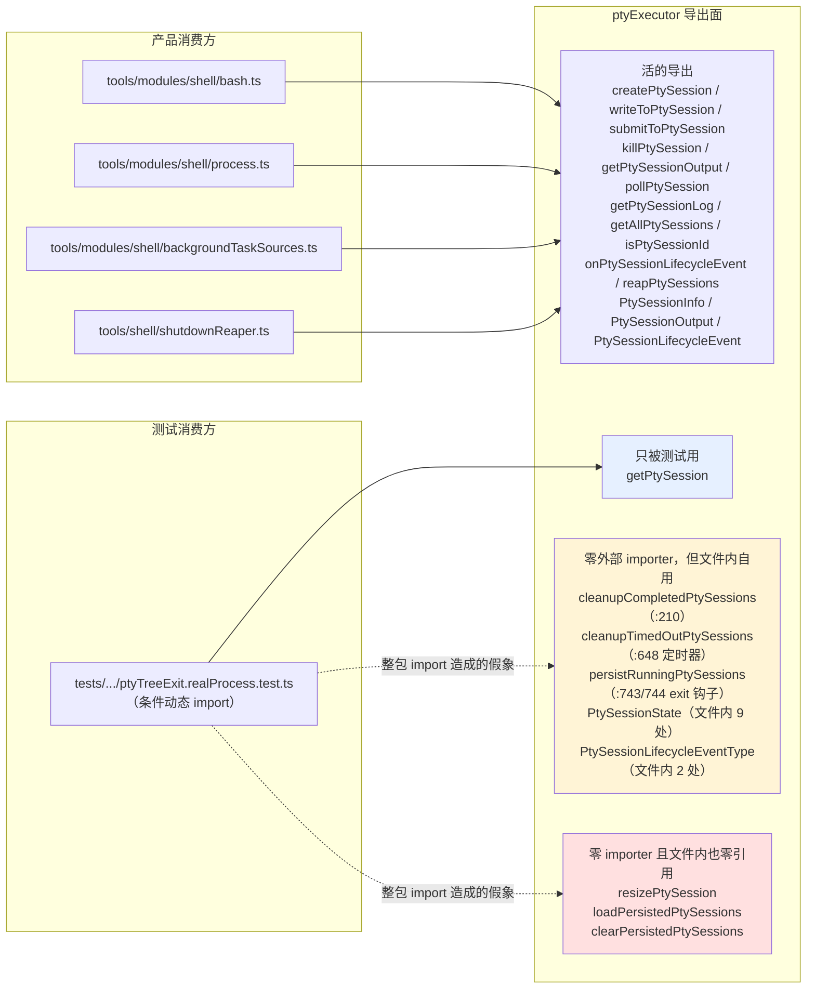
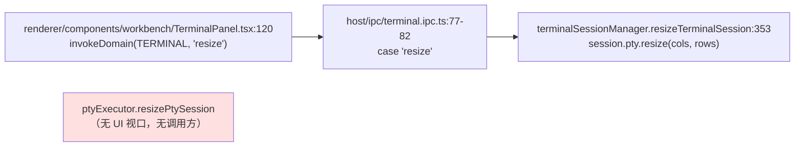
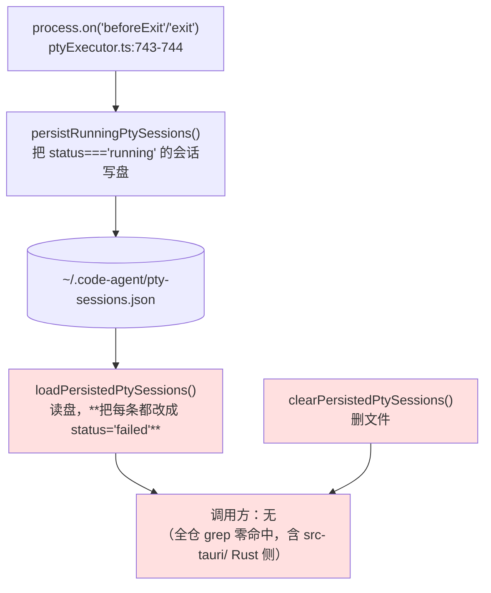

# ptyExecutor 导出面依赖图：谁本该调它、实际谁在调

`src/host/tools/shell/ptyExecutor.ts` 有 9 个符号在 dead-export 棘轮基线里，
却因为 `tests/unit/tools/shell/ptyTreeExit.realProcess.test.ts` 的**条件动态 import**
（`await import('.../ptyExecutor')`）被 knip 当成「整包被引用 ⇒ 每个导出都在用」，
从而在棘轮里显示成「存量已清理」——一个假象。

本图把这 9 个符号各自的**真实调用面**画出来，作为删/留判断的依据。

---

## 一、导出面现状（每个符号两种查法：直接名字 + 重导出/桶文件；另查过 IPC 表、工具注册表、字符串索引、`src-tauri/` Rust 侧）

## 二、逐符号判定

| 符号 | 外部 importer | 文件内引用 | 判定 | 处置 |
|---|---|---|---|---|
| `resizePtySession` | 0 | 0 | 真死代码（见下 §3） | 删实现 |
| `loadPersistedPtySessions` | 0 | 0 | 真死代码（见下 §4） | 删实现 |
| `clearPersistedPtySessions` | 0 | 0 | 真死代码（见下 §4） | 删实现 |
| `persistRunningPtySessions` | 0 | `:743` `:744` 的 `process.on('beforeExit'/'exit')` | 写方活着但**没有读方**（§4） | 连同 §4 整块删 |
| `cleanupCompletedPtySessions` | 0 | `:210`（会话数超限时清理） | 活的内部函数，只是导出多余 | 去掉 `export` |
| `cleanupTimedOutPtySessions` | 0 | `:648`（60s 清理定时器） | 同上 | 去掉 `export` |
| `PtySessionState` | 0（只在设计文档正文里出现过名字） | 文件内 9 处 | 同上 | 去掉 `export` |
| `PtySessionLifecycleEventType` | 0 | `:83` `:176`（消费方通过导出的 `PtySessionLifecycleEvent.type` 拿到这个联合类型） | 同上 | 去掉 `export` |
| `getPtySession` | **1（真实使用）**：`ptyTreeExit.realProcess.test.ts:95` 取会话拿 `pty.pid` | 0 | **不能删**，删了打掉 STOP3 的整树退出证明 | 保留导出 |

> 只去掉 `export` 而保留实现，仅适用于**文件内真有引用**的那 4 个；对文件内也零引用的符号，
> 去掉 `export` 只会换一道门（ESLint `no-unused-vars`）报红，所以那些一律连实现删掉。

## 三、`resizePtySession` 为什么没人调 —— 不是产品缺口

名字像终端功能、零命中很可疑，所以单独查了产品里「终端改尺寸」的真实链路：

**两个 PTY 子系统职责不同**：

- `terminalSessionManager` = **有视口**的终端面板（xterm.js ↔ IPC ↔ pty），resize 是它的真需求，且已完整接线。
- `ptyExecutor` = **无视口**的后台 shell 会话（Bash 工具的 PTY 模式），输出靠
  `getPtySessionOutput` 轮询取，没有会变化的窗口尺寸。`createPtySession` 建会话时定一次
  `cols/rows` 就够了。

⇒ resize 能力在产品里**存在且可用**，只是住在另一个子系统。ptyExecutor 这份是随
`feat(tools): add PTY pseudo-terminal support`（`a3a7cce47`）一次性铺出来的 CRUD 表面，
**自诞生起从未有过调用方**（`git log -S resizePtySession` 只有：引入它的那次 feat +
两次棘轮基线提交 + 一次测试注释提交，没有任何一次是加/删调用点）。不是欠账，是投机性 API 面。

## 四、PTY 会话跨重启恢复：不是「接线漏了」，是从来没有过读方

持久化三件套的实际形状：

判「功能不要了」而不是「接线漏了」，四条依据：

1. **从没接上过**：`git log -S loadPersistedPtySessions` 与 `resizePtySession` 同一组结果——
   引入它的 feat 之后，再没有任何一次提交改变过这个字符串在调用侧的出现次数。
   不存在「曾经接上、后来被拆掉」的历史。
2. **即使接上也恢复不了任何东西**：`loadPersistedPtySessions` 把读到的每一条都强制改成
   `status: 'failed'`（进程已随宿主死掉，PTY 句柄不可能跨进程复活）。它能提供的全部价值
   只有一句「上次退出时有 N 个后台会话没了」。
3. **STOP1/STOP3 之后连这句都不成立了**：停机路径现在会主动 `reapPtySessions()` 把在跑的
   PTY 会话逐个杀干净并确认退出，所以「上次退出时还在跑」按设计恒为空。
4. **真需要跨重启收尾的那个子系统已经自己做了**：`terminalSessionManager` 落盘的是 **pid**，
   启动时 `reapOrphanTerminals()` 带两道核对去收割孤儿——那是有读方、有用途的持久化。
   ptyExecutor 这份写的是会话元数据，没有读方。

⇒ 结论：**写方是一个无人读的副作用**（每次进程退出都往 `~/.code-agent/` 写一个没人看的 JSON）。
整块删掉，连带只服务于解析这份文件的 5 个私有 helper（`isRecord` / `readString` /
`readNumber` / `readStringArray` / `isPtyStatus` / `parsePersistedPtySession*`）和
`PersistedPtySession` 类型一起删。

### 顺带发现（不在本单范围，另记）

`src/host/tools/shell/backgroundTasks.ts` 有**完全同构**的一套：
`persistRunningTasks`（`:562`/`:581` 已接 exit 钩子）→ `~/.code-agent/` 落盘 →
`loadPersistedTasks` / `clearPersistedTasks` **零调用方**。同样是「有写方无读方」。
它们目前仍老实待在棘轮基线里（knip 认定为死导出，没有假象遮蔽），
本单不动它，避免把改动面扩到另一个子系统。

## 五、删完之后棘轮会怎么表现（先把预期写死，免得事后按结果编）

`scripts/knip-ratchet.mjs` 的判据是**集合差**：

- `added = 当前 − 基线` → 有值就 **red**
- `removed = 基线 − 当前` → 只打印「存量符号已清理」，**不影响绿红**

**符号被删掉之后同样不在「当前」集合里**，所以 `removed` 里那 11 条**不会减少**——
它从「因为测试整包 import 而假装被用了」变成「真的不存在了」。
这一点与工单原文「已清理数量下降到预期值」相反，**以本文为准**（工单已同步修正）。

因此验收判据改成正负成对的三条：

| # | 判据 | 期望 | 实测 |
|---|---|---|---|
| 1 正 | 删完跑两档棘轮（default + production） | `newlyIntroduced = 0`，门绿 | ✅ default 2667/2678，production 3919/3929，双绿 |
| 2 正 | 删完 `--update-baseline` 两档基线 | 基线各减 11 / 10 条，之后跑门 `removed = 0`、`added = 0` | ✅ 两档均「当前符号集合与基线一致」 |
| 3 负（变异） | 把 `resizePtySession` 原样加回去 | 棘轮报它是**新增** dead export，门 red | ⚠️ 见下，**预期只对了一半** |

## 六、🔴 变异验证推翻了工单前提：default 档的盲区**没有**随删除而解除

把 `resizePtySession` 原样加回去（`grep -c` 确认变异落地 = 1，且全仓零调用方，
目标条件成立）之后：

| 档 | 结果 |
|---|---|
| `node scripts/knip-ratchet.mjs`（default） | **绿**。当前符号数 2667，一个都没多 —— 它**根本看不见**这个新死导出 |
| `node scripts/knip-ratchet.mjs --profile production` | **红，exit 1**，点名 `ptyExecutor.ts: resizePtySession (export)` |

原因是盲区的成因本身没变：`ptyTreeExit.realProcess.test.ts` 的
`await import('.../ptyExecutor')` 依然在，knip 的 default 档依然把整包 import 当成
「每个导出都被使用」。删掉存量死导出只是**把基线里的假结论清干净了**，
并没有、也不可能让 default 档重新看见这个文件——除非退回静态 import（CI 分流不允许）。

⇒ **工单原文「删完盲区一并解除」不成立，以本文为准。**
真正守着这个文件的是 **production 档**（`knip.production-strict.json`，只认生产入口，
测试引用不算消费方——这正是 #1062 建它的理由：「抓生产已死但测试仍引用的导出」）。
两档都在 `scripts/gates-local.mjs:160/165` 和 `.github/workflows/swarm-ci.yml:280/285` 里跑，
所以覆盖是真的，只是来自第二道门而不是第一道。

副作用是一条真实的口径差异，记在这里免得下次又当成 bug 查：
`getPtySession` 在 default 档算「被使用」（测试用了），在 production 档算「生产已死」，
所以它**只从 default 基线里移除，仍留在 production 基线里**。这是两档定义不同，不是漂移。
