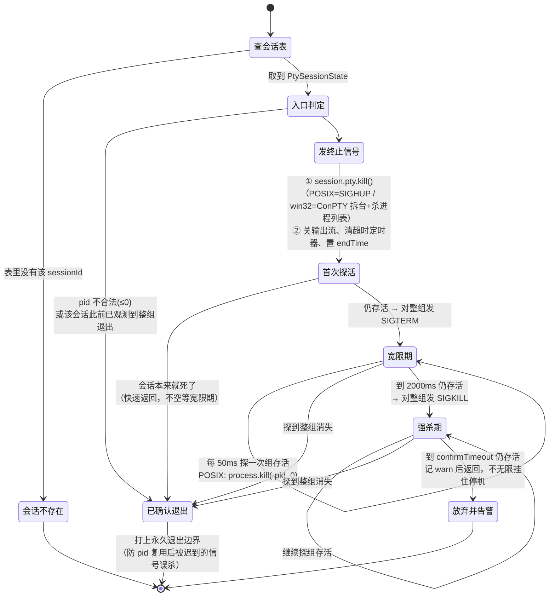
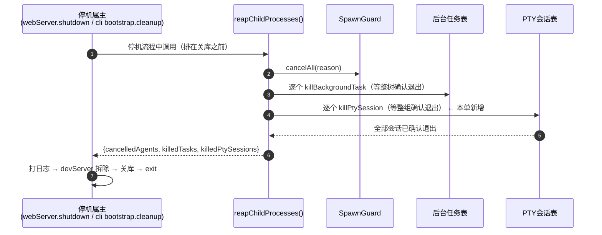

# PTY 会话终止：确认退出与停机收尸（T-028 设计图）

STOP1（T-018）给后台任务和 Bash 工具建了整树退出证明，但**放过了第三个会 spawn 进程的子系统：PTY 会话**。
改动前 `killPtySession` 发完一个信号就返回「已终止」，而 `reapChildProcesses()` 的收尸清单里根本没有 PTY。

---

## 一、先查清 node-pty 的终止语义（实测，不靠类比）

`pty.spawn` 走的不是 `child_process.spawn`，`killProcessTree` 要的 `exitCode`/`signalCode` 句柄它没有。
动手前先把三问答清楚——一手来源 = 读 `node_modules/node-pty` 的实现 + 真跑一次。

| 问 | 答 | 依据 |
|---|---|---|
| POSIX 上是否 setsid、子进程自成组？ | **是**，`pid == pgid`，PTY 会话是会话首进程 | darwin：`src/unix/pty.cc:705` 的 `posix_spawnattr_setflags(..., POSIX_SPAWN_SETSID)`；linux：`pty.cc:399` 的 `forkpty()`（内部 `login_tty` → `setsid`）。实测 `ps -o pid,pgid`：`42843 42843` |
| `IPty.kill()` 默认发什么信号？ | **SIGHUP**，且**异常被 node-pty 吞掉** | `lib/unixTerminal.js:226` `process.kill(this.pid, signal \|\| 'SIGHUP')` 外包 `try{}catch{}`。实测 `trap "exit 41" HUP` 的会话被 `kill()` 后 `onExit={"exitCode":41}` |
| PTY 里的子孙进程归谁管？ | 与 shell **同组**（`bash -c` 无 job control，`&` 起的后台任务也留在同一 pgid），因此 `kill(-pid, sig)` 收得到 | 实测：孙进程 `42847` 的 pgid = `42843` = shell pid |
| win32（ConPTY）是什么语义？ | `kill()` **忽略信号参数**，直接 `getProcessList` + 逐个 `process.kill`，无信号升级可言 | `lib/windowsPtyAgent.js:133-176` |

**由此得到的两个结论**：

1. **PTY 比普通子进程更容易收树**——普通 `child_process` 要 `detached:true` 才成组，PTY 天生就是组长。
   所以 `killProcessTree` 的 `posixGroupKill` 模式对它**天然成立**，不用改 spawn。
2. **裸 `kill()` 平时看着好用是靠运气**：会话首进程一死，内核给前台进程组补一发 SIGHUP，
   多数孙进程顺带被带走（实测确实带走了）。但只要有一个进程 `trap ""` 掉 HUP/TERM
   （实测 `trap "" HUP TERM INT; exec sleep 300` 的会话，裸 `kill()` 后整组原地存活），
   这条运气就断了，而**调用方拿到的仍然是 `success: true`**。

## 二、复用还是另写？

**复用 `killProcessTree`**，只补一层句柄适配。它已经实现了本单要的整套语义
（发信号 → 宽限 → 升级 → 轮询探活 → 永久退出边界 → 到上限记 warn 显式放弃），
差的只是句柄形状：`IPty` 有 `pid`/`kill`，缺 `exitCode`/`signalCode`。

适配层是一个**随会话长存的**对象（不能每次现造：`treeExitObserved` 是 `WeakSet`，
按对象身份记永久退出边界，现造的话防 pid 复用就失效了）：

```
PtySessionState.killable = {
  pid,                                  // 一次性快照，pty 退出后 IPty.pid 仍可读
  kill(signal)  → session.pty.kill(signal)
  get exitCode()  → session.exitCode ?? null      // 由 onExit 回填
  get signalCode() → null                          // node-pty 不给信号名，只给 exitCode
}
```

`pid > 0` 才允许走组模式：`UnixTerminal` 在 `pty.open()` 路径下会把 `_pid` 设成 `-1`
（`lib/unixTerminal.js:197`），而 `process.kill(-(-1))` = `process.kill(1)` = **打到 init 头上**。
本仓不用 `pty.open()`，但这道闸门是一行的事，不留。

## 三、PTY 会话终止状态机



### 存活判据

| 平台 | 探法 | 判死 | 判活 |
|---|---|---|---|
| POSIX | shell 未 onExit ⇒ 直接判活；已 onExit 则探整组 `process.kill(-pid, 0)` | `ESRCH` | 无异常 或 `EPERM` |
| win32 | 只能以 shell 自身 onExit 为边界（**降级**：ConPTY 无进程组语义） | onExit 已触发 | 未触发 |

### 和 STOP1 的 `killProcessTree` 状态机差在哪

| 维度 | 后台任务 / Bash（STOP1） | PTY 会话（本单） |
|---|---|---|
| 成组方式 | 要 `spawn(..., {detached: true})` 显式成组 | **天生成组**（node-pty setsid），无需改 spawn |
| 第一发信号 | `SIGTERM`（`killProcessTree` 自己发） | 先 `pty.kill()`（SIGHUP + node-pty 自身资源释放），再由 `killProcessTree` 发组 SIGTERM |
| 为什么要多这一发 | — | win32 上只有 `pty.kill()` 会拆 ConPTY、释放 agent 句柄；taskkill 拆不了 |
| 退出观测 | `ChildProcess.exitCode/signalCode` | `IPty.onExit` 回填到会话状态，再由适配层暴露 |
| 状态机本体 | 同一份 `killProcessTree` | 同一份 `killProcessTree` |

## 四、收尸接线



`reapChildProcesses()` 已被两个真停机属主调用，本单只往它里面加一步，
**不新挂任何 SIGTERM/SIGINT 处理器**（白名单门守着；反面教材见 `backgroundTasks.ts` 末尾
2026-08-08 那起「模块级信号处理器抢跑、干净关库一步没跑」的真机事故）。

## 五、已知降级边界（如实标注，不假装收得了）

- **win32**：没有进程组语义，「确认退出」只能确认到 shell 自身；ConPTY 进程列表里的子孙由
  node-pty 的 `getProcessList` 尽力而为，本层无法证明它们死透。
- **自己 setsid 逃逸的孙进程**（如 `nohup`、`setsid`、daemon 化的进程）：脱离了 PTY 的进程组，
  组杀收不到，本层也不追。这是 POSIX 语义的边界，不是实现缺陷。
- **`pty.kill()` 吞异常**：node-pty 内部 `try{}catch{}`，发信号失败无声。所以「已终止」的判据
  一律取**探活结果**，绝不取「kill 调用没抛」。
