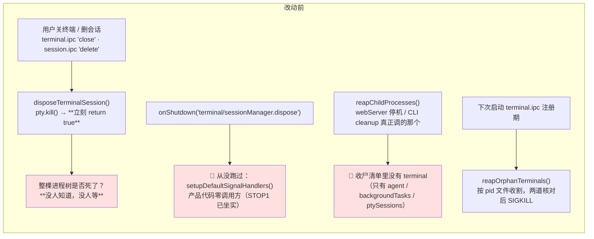
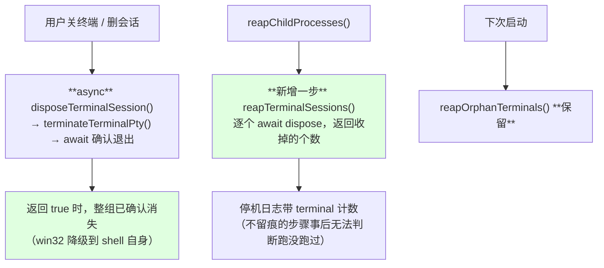
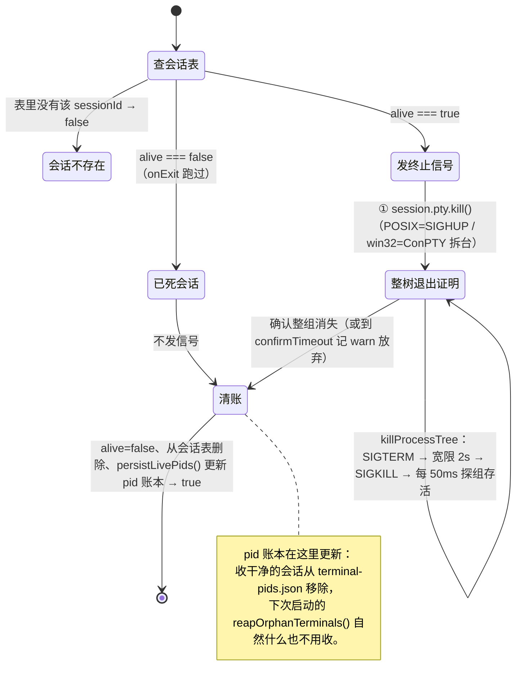

# Terminal 会话终止：确认退出 + 接进停机收尸（N-DSH-STOP4 设计图）

第四个会 `pty.spawn` 的子系统是 `src/host/services/terminal/terminalSessionManager.ts`
（会话级长生命周期交互 shell，用户和 Agent 共享同一个 PTY）。
STOP1 收了后台任务/Bash 工具，STOP3 收了 `ptyExecutor`，这一单把它按同一形态收口。

**node-pty 终止语义不再重查**，直接用 STOP3 实测结论
（见 `code-agent-private-archive/docs/evidence/2026-08-14-N-DSH-STOP3-PTY收尸.md` 第二节）：
POSIX 上 `pty.spawn` 天生 setsid 自成进程组（`pid == pgid`）⇒ `posixGroupKill` 无条件成立；
`IPty.kill()` 默认 SIGHUP 且**内部吞异常** ⇒ 判死只能看探活；win32 无组语义，确认边界降级到 shell 自身。

---

## 一、改动前的两条路径（一条从没跑过，一条只在下次启动才生效）

**危害比 ptyExecutor 轻一档**：残留不是永久孤儿，会活到下次启动被 `reapOrphanTerminals()` 收掉。

### 那为什么还要做？

停机时收干净的增量价值，三条：

1. **用户不重启就一直挂着**。这个子系统的会话是「用户挂了半天的 ssh / 登录态 CLI」，
   本模块**刻意不设 maxRuntime、不做周期性超时扫描**（文件头注释写明），
   所以除了 dispose 没有第二个人会收它。
2. **「活到下次启动」这段窗口本身会造成伤害**。2026-07-30 的孤儿 Chrome 事故正是这种形态：
   主进程停了，孤儿子进程按自己的重试逻辑继续拉起 GUI，90 秒连崩 25 次。
3. **四个 spawn 子系统里三个已收口，剩一个不一致本身是维护负债**——
   `reapChildProcesses()` 的返回值现在是「收了多少 agent / 后台任务 / PTY 会话」，
   读的人会合理地以为这就是全部子进程，而 terminal 不在里面。

## 二、改动后

删掉的是那条**从没跑过**的 `onShutdown('terminal/sessionManager.dispose')` 注册
和只服务于它的 `disposeAllTerminalSessions()`——它换了个位置就是新的
`reapTerminalSessions()`，挂在真正会被调用的那条路径上。
（与 STOP2 删 `lifecycle.ts` 同一判据：零调用方的收尾登记 = 让人以为收了、其实没收。）

## 三、与 ptyExecutor 状态机的差异

两边的**终止内核完全一样**（`pty.kill()` 拆台 → `killProcessTree` 组模式 → 宽限 → 升级 →
轮询探活 → 永久退出边界），差在外围三处：

| | `ptyExecutor`（工具调用型 PTY） | `terminalSessionManager`（用户交互型 PTY） |
|---|---|---|
| 谁会主动收它 | 10 分钟硬超时 + 每分钟扫描 + dispose + 停机收尸 | **只有** dispose + 停机收尸（刻意无超时，不能杀用户挂着的 ssh） |
| 会话表 | `PtySessionState`（含 status/outputStream/timeout） | `TerminalSession`（含 ring buffer / altScreen） |
| 跨重启兜底 | 无（STOP6 已把那套没有读方的持久化删掉） | **有**：`terminal-pids.json` + 启动时 `reapOrphanTerminals()` |

### `reapOrphanTerminals()` 留还是删 —— **留**

停机路径收干净之后它变成纯兜底，但**兜的是停机路径根本不跑的那些场景**：
进程被 SIGKILL、崩溃、断电、覆盖安装。那时 `onExit` 不跑、`dispose` 不跑、
`reapChildProcesses` 也不跑，唯一还成立的是「上次写下的 pid 文件还在盘上」。
它那两道核对（owner host 是否还活着 / pid 现在是不是还是那个 shell）是防误杀的，
按硬约束**一个字不动**。

## 四、验收判据（正负成对）

| # | 场景 | 期望 |
|---|---|---|
| 1 负 | 会话里跑忽略 HUP/TERM/INT 的进程，dispose | 改前立刻返回而进程还活着；改后等满宽限期升级 SIGKILL，确认死了才返回 |
| 2 正 | dispose 正常会话 | 快速返回，**且 SIGKILL 一次都没发出去**（盯真正发出的信号，不只看时间） |
| 3 负 | 会话内 spawn 孙进程后 dispose | `pgrep` 无残留；孙进程与 shell 同组（先取改前对照证据） |
| 4 正 | 真机：打包 webServer 收 `kill -TERM` | 停机日志带 terminal 计数；无残留；`-wal`/`-shm` 仍被 checkpoint 删净 |
| 5 反例守护 | 全仓新增 `process.on('SIGTERM'` / `SIGINT` | 0 新增（`killProcessTree.realProcess.test.ts` 的白名单门自动守） |
| 6 反例守护 | dispose 会话 | 宿主进程存活、宿主 pgid 不等于会话 pgid（对照 claude-code #45717） |
| 7 | CI 无真 PTY 时 | 真进程用例整组 skip，**接线守护那组照跑** |
