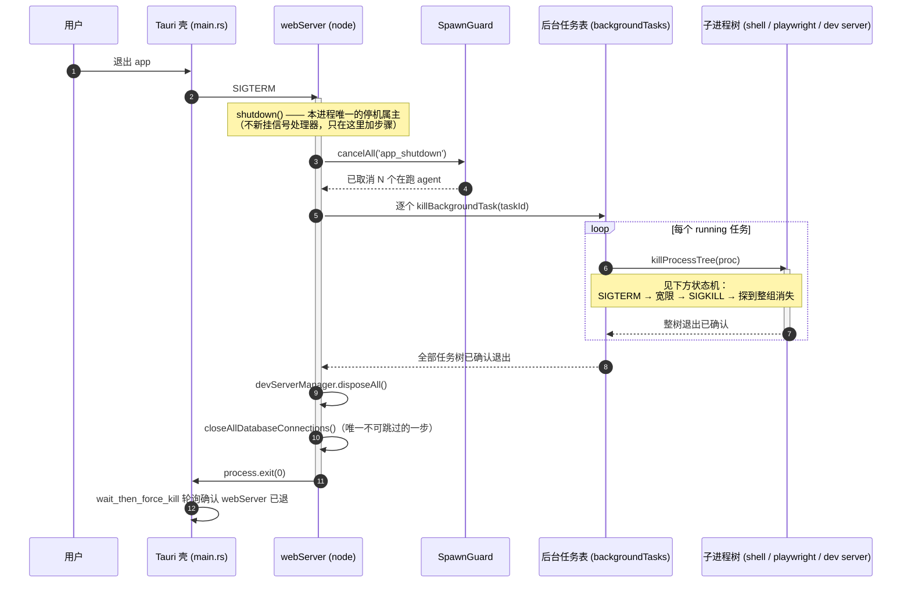
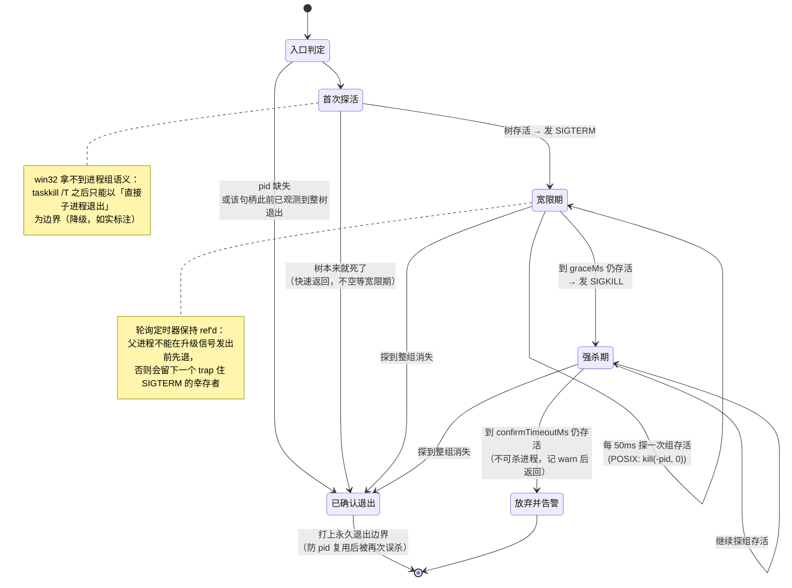

# 停机 / 取消：整树退出证明（T-018 设计图）

改动前的问题：`killProcessTree` 返回 `void`，发完信号就 return；三个子系统各自手写
「SIGTERM → 等 1~2 秒 → SIGKILL」的升级逻辑，**没有一个验证进程树真的死了**。
app 退出时既不取消在跑的 agent，也不杀后台任务的进程树。

## 一、停机时序：Tauri 壳 → webServer → 进程树



**关键点**：收尸步骤排在关库**之前**——关库是不设超时上限的最后一步，
排在它后面的任何步骤在真机上都可能永远轮不到。收尸各步有自己的时间上限（见状态机）。

CLI 侧同构：`cli/commands/serve.ts` 的 `shutdown` → `cli/bootstrap.ts` 的 `cleanup()`，
在原有的 MCP 断连之前插同一个收尸步骤。

## 二、`killProcessTree` 状态机：什么叫「确认退出」



### 存活判据（`treeAlive`）

| 平台 / 模式 | 探法 | 判死 | 判活 |
|---|---|---|---|
| POSIX + 组模式 | 组长未被回收时直接判活；组长已退则 `process.kill(-pid, 0)` | `ESRCH` | 无异常 或 `EPERM` |
| POSIX 非组模式 | 句柄 `exitCode`/`signalCode` | 二者任一非 null | 都为 null |
| win32 | 句柄 `exitCode`/`signalCode`（**降级**：无组语义） | 同上 | 同上 |

### 三个子系统改后各自做什么

| 调用点 | 改前 | 改后 |
|---|---|---|
| `backgroundTasks` 超时终止 / `killBackgroundTask` | 各自 `setTimeout(1000)` 手写升级，不验证 | `await killProcessTree(proc)`，`killTimeout` 字段整个删掉 |
| `bash.ts` 前台命令 abort/超时/溢出 | 单发信号 + `unref()` 的升级定时器 | `killChild()` 记下 promise，`finalize` 在 reject 前 `await` 它 |
| `scriptRuntime/sandbox.ts` `stopTree` | 手写同一套升级 | `await killProcessTree(child)` 后再 `finalize` |

### 施工时实测到的一条真事故形状

写正例用例时本想断言「正常进程 SIGTERM 后秒退」，结果稳定跑到 3 秒（等满宽限期才靠 SIGKILL 收掉）。
查下去发现是**真竞态**，不是测试环境问题：

```
bash -c 'echo up; sleep 30'   # detached 成组，看到 "up" 立刻对整组发 SIGTERM
→ ps -g <pgid>：63737  ppid=1  S  sleep 30      # bash 死了，sleep 活着，已被 init 收养
```

SIGTERM 落在 **bash 已 fork、`sleep` 还没 exec 完** 的那个窗口里，组内成员漏收了信号。
改前的 `killProcessTree` 在这里会立刻返回「已终止」，而 `sleep 30` 还要再跑 30 秒——
这就是孤儿 Playwright/Chrome 的微观形状。改后：探到组还活着 → 等到宽限期 → SIGKILL → 确认消失。

正例用例因此改用 `echo up; exec sleep 30`（组里自始至终一个进程，无竞态），
漏信号那条路径交给「孙进程一起收」用例覆盖。

**不新挂 `SIGTERM`/`SIGINT` 处理器**：本进程的终止权属主已经存在
（webServer / cli serve 各一个），新逻辑只往它们里面加步骤。
反面教材见 `backgroundTasks.ts` 文件末尾那段注释（2026-08-08 真机事故：
模块级 SIGTERM 处理器抢在 webServer 之前 `exit(0)`，干净关库一步没跑）。
