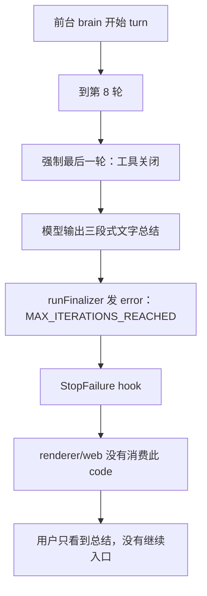
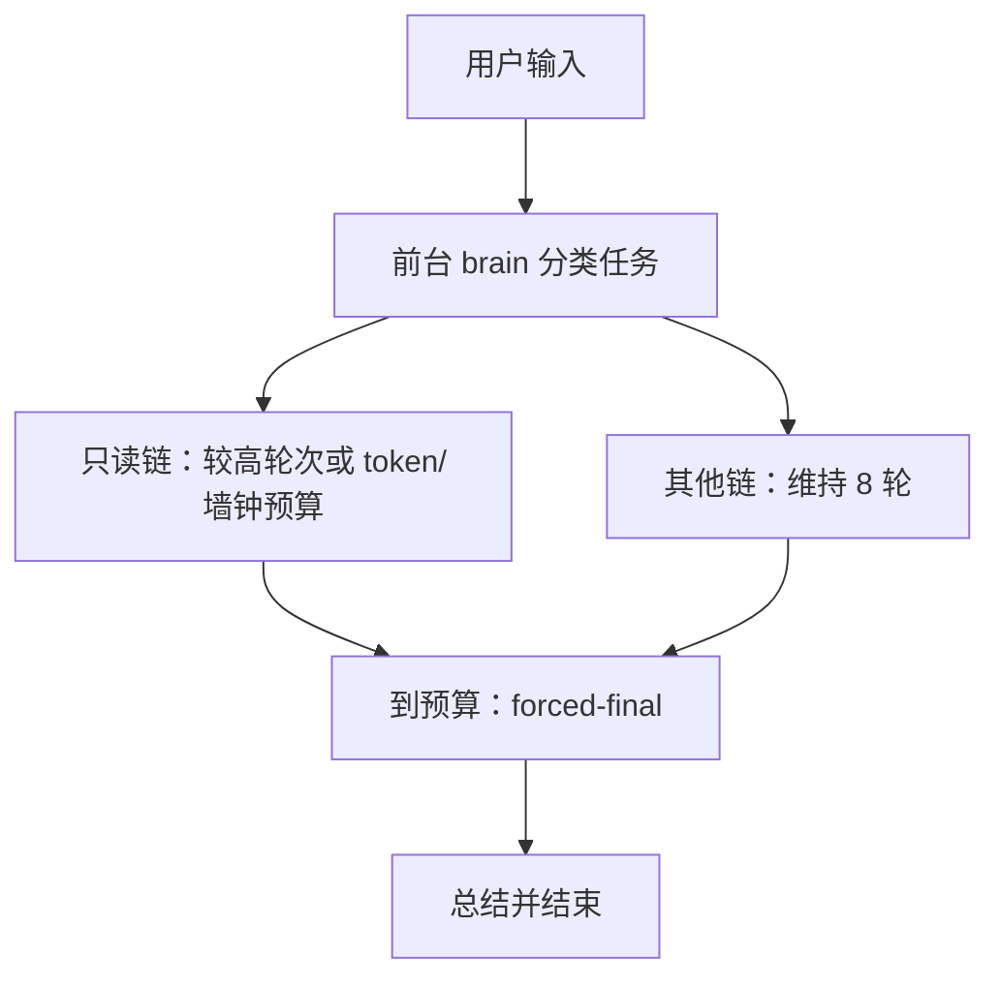
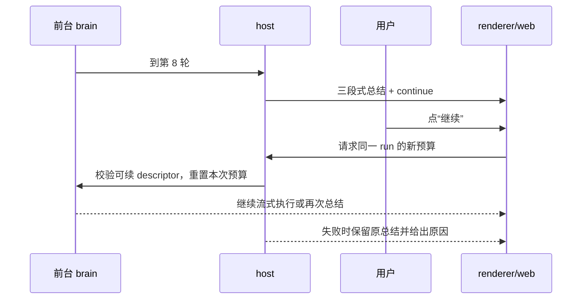
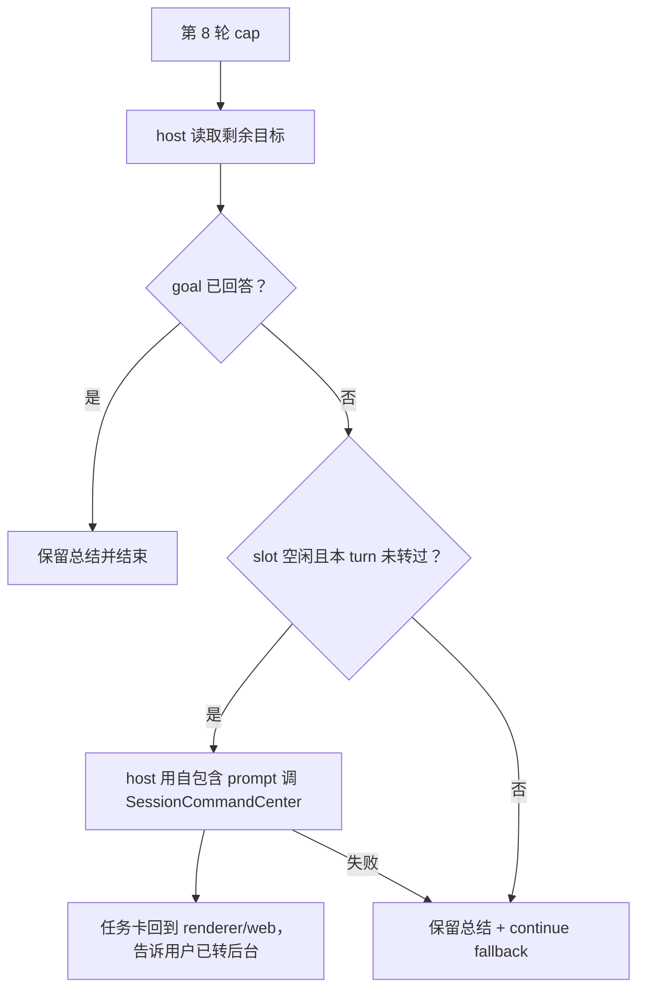

# 前台 brain 8 轮硬上限选项页

- 状态：**草稿·待爸拍板**
- 单号：N-BRAIN-STEPCAP
- 基线：`origin/main@b53d4bd9a04e`
- 相关：ADR-054（会话=指挥台）、ADR-056（前台只读工具）、ADR-059（前台短小写工具）、ADR-068（进程内流式断流续接）、ADR-075（重启后前台任务自动续跑）；N-STOP-ALWAYS-PARK、N-STOP-ABANDON-ENTRY、N-RESUME-STOP-STATUS-FLIP
- 本页性质：选项页，不是 ADR；只记录当前行为、选择、失败边界和施工切分，不改代码。

## 术语

| 术语 | 含义 |
|---|---|
| 前台 brain | 没有 `goal` 且用户输入不以 `/` 开头的文字 turn；它应快速回答或把长活交给后台。 |
| 硬上限 / cap | `SESSION_COMMAND_CENTER_BRAIN_MAX_ITERATIONS = 8`；调用方可降低，不能抬高。 |
| forced-final | 到最后一轮时关闭工具，要求模型只输出“已完成 / 未完成 / 建议下一步”的收尾轮。 |
| 后台 lane | `SessionCommandCenter` 管理的任务槽；同一 `lane_key` 串行，任务状态回流会话。 |
| `submission_key` | 当前 turn 内的稳定幂等键；同一次派发重试必须复用，避免重复任务。 |
| 转后台 | host 在 cap 处把尚未回答的剩余目标交给 `SessionCommandCenter`，再把任务卡告诉用户。 |
| 继续 | 用户点发送按钮的 continue 状态；接管已有 durable run 或按本页方案给一次新的前台预算。 |
| wake | 后台任务终态回流后唤醒前台；同一用户 turn 的 wake 最多 `MAX_CONSECUTIVE_WAKES = 3`。 |

## 现状锚点

| # | 事实 | 锚点 |
|---:|---|---|
| 1 | 前台 brain 上限是 8 轮；后台结果 wake 上限是 4 轮；同一会话连续 wake 最多 3 次。 | `src/shared/constants/sessionCommandCenter.ts:14` `SESSION_COMMAND_CENTER_BRAIN_MAX_ITERATIONS`；`:17` `SESSION_COMMAND_CENTER_WAKE_MAX_ITERATIONS`；`:23` `MAX_CONSECUTIVE_WAKES` |
| 2 | `isSessionCommandCenterTurn` 只在没有 goal 且 prompt 去掉前导空白后不以 `/` 开头时命中；注释明确桌面与 web 的配置形状不同，曾发生修一边漏一边。 | `src/shared/constants/sessionCommandCenter.ts:32` `isSessionCommandCenterTurn`（规则注释：`:27`） |
| 3 | brain context 要求：闲聊/现有上下文直接回答；只需读少量文件就自己读；命令、联网、多步骤、审批和长生成走 `delegate_task`。 | `src/host/app/sessionCommandCenterBrain.ts:5` `SESSION_COMMAND_CENTER_BRAIN_CONTEXT` |
| 4 | 桌面入口 `withSessionCommandCenterBrain` 用 `Math.min` 钳制 `maxIterations`，所以 caller 可以降低但不能超过 8。 | `src/host/app/sessionCommandCenterBrain.ts:28` `withSessionCommandCenterBrain`；`:34` `Math.min` |
| 5 | web 路由对同一 turn 判据设置前台工具面、上下文和同样的 8 轮 clamp。 | `src/web/routes/agent.ts:948` `commandCenterBrain`；`:954` `config.maxIterations` |
| 6 | 到 `iterations >= maxIterations && maxIterations > 1` 时，conversation runtime 激活 `activateMaxStepsFinalResponse`，最后一轮不再允许工具。 | `src/host/agent/runtime/conversationRuntime.ts:398` `activateMaxStepsFinalResponse(this.ctx)` |
| 7 | forced-final 的 prompt 要求纯文本三段式总结；若模型交白卷，`ensureMaxStepsWrapUp` 用已有产出合成部分结果消息。 | `src/host/agent/runtime/maxStepsFallback.ts:23` `buildMaxStepsPrompt`；`:47` `activateMaxStepsFinalResponse`；`:62` `buildMaxStepsPartialResultContent`；`:125` `ensureMaxStepsWrapUp` |
| 8 | 收尾后 `runFinalizer` 发 `error` 事件，`maxIterations > 1` 时带 `RUN_ERROR_CODE_MAX_ITERATIONS`；同时触发 StopFailure hook。 | `src/host/agent/runtime/runFinalizer.ts:481` `type: 'error'`；`:484` `RUN_ERROR_CODE_MAX_ITERATIONS`；`:489` `triggerStopFailure` |
| 9 | 稳定错误码值是 `MAX_ITERATIONS_REACHED`；当前只有 CLI adapter 将它映射成部分完成和退出码 2。 | `src/shared/constants/agent.ts:319` `RUN_ERROR_CODE_MAX_ITERATIONS`；`src/cli/adapter.ts:494-502` `isMaxIterationsPartial` |
| 10 | renderer、web routes 和 shared session contract 没有 `RUN_ERROR_CODE_MAX_ITERATIONS` 消费者；因此当前用户只拿到模型总结，没有继续入口。 | `git grep -n RUN_ERROR_CODE_MAX_ITERATIONS -- src/renderer src/web src/shared/contract`：无命中（当前树已复核） |
| 11 | durable session contract 暴露 `durableResume`；waiting run 在非 `crash_or_quit` 且可继续时投影 `mode: 'continue'`，host 由 `continueParkedDurableRun` 接管原 `runId`。 | `src/shared/contract/session.ts:138` `durableResume`；`src/host/app/durableRunReadService.ts:180` `canContinue`；`:184` `mode: 'continue'`；`src/host/app/durableRunContinuation.ts:28` `continueParkedDurableRun` |
| 12 | 进程内 stream-break 已在 `DecisionSlot` 提供 continue/abandon；它与本页的 max-iteration continue 是可借鉴的交互形状，不共用同一恢复语义。 | `src/renderer/components/features/chat/DecisionSlot.tsx:42` `onContinue`；`:89` `StreamInterruptionDecisionRow` |
| 13 | `delegate_task` 必须带 `title`、`short_name`、`lane_key`、`submission_key`、自包含 `prompt`；`queue_when_full` 只有用户明确选排队时才可传。 | `src/host/tools/modules/commandCenter/sessionCommandCenter.schema.ts:12` `delegate_task`；`:23` `queue_when_full`；`:25` `required` |
| 14 | 后台槽由全局并发池和每 session ledger 共同限制；默认全局 4、每 session 2、同 lane 1，满槽时返回 `requires_choice`，不会静默排队。 | `src/shared/constants/voice.ts:9` `SESSION_TASK_CONCURRENCY`；`:15` `SESSION_TASK_LANE_LIMIT`；`src/host/services/commandCenter/sessionTaskSlotLedger.ts:51` `requires_choice`；`:97` `perSessionLimit`；`:133` `requires_choice` |
| 15 | `SessionCommandCenter.spawn` 负责 admission、幂等复用和启动；任务终态再唤醒前台。 | `src/host/services/commandCenter/sessionCommandCenter.ts:151` `spawn`；`:486` `settle`；`:520` `wakeForegroundBrain` |
| 16 | “看看腾讯会议”跑到 cap 用时 4m33s 是用户报告，不能在本单重跑；仓内相关工具包括 `tmeetMeetingList`、`tmeetMeetingSearch`，具体调用链属于推断。 | `src/host/tools/modules/connectors/tmeetMeetingList.schema.ts:3` `tmeetMeetingListSchema`；`src/host/tools/modules/connectors/tmeetMeetingSearch.schema.ts:3` `tmeetMeetingSearchSchema`（“4m33s”仅为报告） |

## 今天第 8 轮会发生什么

这是一个确定的停止路径，不是模型是否愿意继续的问题。第 8 轮一开始就进入 forced-final，模型不能再用 `Read`、tmeet 或 `delegate_task`；模型能交付的只有文字总结。模型没有文字输出时，host 仍会用已有产出合成“部分结果 + 未完成说明”，随后 finalizer 发错误事件。CLI 能把它识别成部分完成，桌面 renderer 和 web 当前不会据此生成操作。

用户证据是：用户报告“看看腾讯会议”运行 **4m33s** 后到达上限。本页不把它写成可重跑的测试结果；从仓内工具名只能推断它可能使用了 `tmeetMeetingList` 或 `tmeetMeetingSearch`（以及连接器底层命令），这是工具面推断，不是该次运行的 trace。

## 选项一：按任务类别自适应上限

### 行为

用户说“看看腾讯会议”时，系统先判断它是只读链，再给较高 ceiling，或按 token/墙钟而不是原始轮数停。用户可能看到更多中间读取，最终仍是一个前台总结；如果墙钟预算先到，仍回到总结。这里的 4m33s 说明单看轮次数未必能表达等待成本，但它也不证明提高 ceiling 就能缩短等待。

### 机制

- 在“cap site”旁增加任务类别或预算策略，并让桌面 `withSessionCommandCenterBrain` 与 web `agent.ts` 同时消费同一策略。
- 在 runtime/finalizer 侧把停止原因从单一 `maxIterations` 扩为 count、token、wall-clock 等可解释原因；forced-final 和部分结果兜底继续保留。
- 需要一套轻量分类输入、预算计量和 UI 文案；brain context 仍应保持“能路由就不执行长活”的原则。

### 失败腿

1. 分类错把长活当只读链，会多烧时间和 token；分类器本身还要付一次调用成本。
2. 4m33s 是墙钟体验，单纯提高 count cap 不解决慢连接器、重试或等待；改成墙钟又要决定等待/审批是否计时。
3. 自适应逻辑会和“前台 brain 应路由而不是执行长活”的规则冲突：只读链较高 ceiling 可能把前台变成长任务执行器。
4. 桌面和 web 任一侧漏接策略，就会出现同一句话两个上限；这是已有的双装配风险。
5. 预算达到时若没有统一停止码，renderer 仍只看见一段文字，继续入口仍不会自动出现。

### 成本

token 和墙钟成本上升，用户注意力成本也上升；分类与计量带来小幅固定开销。收益是短只读链少一些“过早停”，但收益取决于分类准确率和连接器速度，难以在本页给出新测量。

### 与已定决定的关系

它仍可保留 `delegate_task` 路由原则，但第一版会引入概率分类和多种预算语义。与 ADR-054/056/059 的短时前台边界相比，风险是把“能读”逐渐解释成“可以一直读”；与 ADR-075 的 continue 形状没有直接冲突，却不能替代 durable resume。

## 选项二：cap 总结上放“继续”按钮

### 行为

用户说“看看腾讯会议”，到 4m33s 或第 8 轮时看到总结和“继续”。点一下后，系统沿用同一目标继续查；用户不点就停在总结。若第一次模型 dispatch 前没有可恢复 descriptor，按钮不可用，改显示“请重新描述目标”或保留当前总结。

### 机制

- 在 cap site 写入可继续所需的 durable descriptor，或把本次 run 转成可被 `continueParkedDurableRun` 接管的 waiting run。
- finalizer 需要把“达到 max iterations”投影成 renderer/web 可识别的 continue 状态；共享 session contract、desktop IPC 和 web route 要对称。
- renderer send button 复用 ADR-075 的 continue 状态和 `durableResume` 投影；host 继续时使用 fresh budget，不能重复执行未知写操作。
- 需要明确 counter reset：新 attempt 的预算重置，`runId`、源 user message、幂等和审计链保留。

### 失败腿

1. 用户可以反复点“继续”，形成成本循环；必须有单 turn 次数、token 或用户可见止损。
2. resumable durable descriptor 只有在第一次模型 dispatch 后才存在；在 dispatch 前撞到异常或 web 非 durable 路径，按钮没有可接管对象。
3. desktop 与 web 若只有一侧投影 `durableResume`，两端会出现一端可点、一端只显示总结的 parity 缺陷。
4. 与 N-STOP-ALWAYS-PARK 的顺序有硬依赖：每次 stop 都要先 park，continue 才能安全接管；`user_stop`、`budget_exhausted`、`guard_halt` 的原因不能混成普通失败。
5. counter reset 处理错误会让新 attempt 继承旧的 8 轮已用量，或把同一 run 无限续成没有边界的长跑。
6. 继续期间用户发新消息、run 被取消或 stream-break 再次发生时，按钮和 durable 状态可能互相覆盖。

### 成本

token、墙钟和用户注意力由用户主动承担；每次点击都会有新的模型预算，成本风险高于一次性总结。实现复用较多现有 durable 语义，长期维护成本较低，但状态转移和 recovery 测试成本高。

### 与已定决定的关系

最贴合 ADR-075 的“发送按钮呈继续态”语义，也能借用 ADR-068 的 continue/abandon 决策槽形状。它应作为选项三无法转后台时的手动 fallback；它不能假设任何 cap run 都已经是 durable 可续对象。

## 选项三：到 cap 自动转后台任务

### 行为

用户说“看看腾讯会议”，前台在第 8 轮还没给出完整答案时，host 自动把“继续找出相关会议并回传结果”交给后台任务。用户看到一条说明和任务卡，可以取消；后台终态回流后再把真实结果带回会话。若目标已由前台回答、并发槽已满、服务拒绝或本 turn 已经转过一次，则不再创建任务，改给“继续”按钮。

### 机制

- 在 cap site 增加一个纯决策函数：`cap reached`、`remaining goal not answered`、`slot free`、`turn not converted before` 四项同时为真才允许转换。
- 由 host（不是模型）调用 command-center service；forced-final 已关闭工具，不能指望模型在最后一轮调用 `delegate_task`。
- hand-off prompt 必须自包含，带用户原话、已完成部分、剩余目标、约束、`lane_key`、稳定 `submission_key` 和合适的 `short_name`。
- `SessionCommandCenter` 负责 admission、幂等、后台执行、终态回流；renderer 显示任务 chip 和取消入口，web 走同一协议。
- 一次用户 turn 最多转换一次；`MAX_CONSECUTIVE_WAKES` 仍限制回流 wake，避免“转换→唤醒→再转换”循环。

### 失败腿

1. 没有稳定的 `submission_key` 会重复建任务；它应由 run 和 turn 派生，重试原样复用。
2. 全局 4、每 session 2 或同 lane 1 任一容量已满时，admission 返回 `requires_choice`；自动路径不能偷偷把 `queue_when_full` 设为 true，应落到 continue fallback 或现有选择交互。
3. 后台读不到 brain context；prompt 不自包含会让任务丢失用户指代、已读文件和验收条件，必须由 host 补全。
4. 用户可能只想要一句短答；自动转换会增加任务卡和后台成本，因此“剩余目标已回答”必须在转换前判断，并提供可见 cancel。
5. 后台运行成本可能高于前台；预算 ceiling、长时间无终态、审批停车和 slot 回收都要有可见状态，不能把 accepted 写成完成。
6. `MAX_CONSECUTIVE_WAKES` 与 wake loop 必须按 user turn 计数；转换最多一次，回流不能再次无条件转后台。
7. forced-final 工具已禁用，若错误地把转换逻辑塞进模型，会得到“已要求转后台但没有任务”的假成功；决策和 hand-off 必须在 host。
8. 只改桌面或只改 web 会重现双路径漂移；两条路径要同时使用相同的 cap decision 和 hand-off contract。

### 成本

前台 token 和墙钟在第 8 轮止损，后台继续消耗 token、槽位和用户注意力；用户只需要看任务卡和最终回流。相较继续按钮，自动转换减少一次等待决策，但需要持续占用后台槽并承担后台预算风险。

### 与已定决定的关系

它直接兑现 ADR-054/056/059 的“前台负责路由，长任务进后台”原则，复用 `delegate_task` 的自包含 prompt、lane 和幂等合同。它不依赖 N-STOP-ALWAYS-PARK 才能把任务交给后台；option 2 作为转换不可行时的手动 fallback，才依赖 durable park/continue 的完整落地。

## 对比矩阵

“只做什么都不变 / 只把常量抬高”只作为基线：它没有新的用户出口，也无法解释 `MAX_ITERATIONS_REACHED`，只是把同一问题推迟并增加前台成本，所以不列为 numbered option。

| 方案 | 用户费力 | 成本风险 | blast radius（文件/路径） | 可测试性 | 依赖在飞单 | 机制失败时的 fail-safe |
|---|---|---|---|---|---|---|
| 基线：不变/抬高常量 | 低（仍只能重述） | 中到高，前台继续烧 | 常量、两处 cap | 高，但只能证明旧行为 | 无 | 现有三段式总结 |
| 1. 自适应上限 | 低到中 | 高，分类+更长前台 run | cap site、分类/预算、finalizer、两端装配 | 中，需覆盖误分类和预算边界 | 无硬依赖 | 回落 8 轮总结，但分类错时已付成本 |
| 2. cap 上继续 | 中，用户要点一次 | 中到高，可重复点击 | finalizer、durable contract/park、desktop/web renderer | 中到高，状态矩阵大 | N-STOP-ALWAYS-PARK；N-RESUME-STOP-STATUS-FLIP | descriptor 不全则禁用按钮并保留总结 |
| 3. 自动转后台 | 低，查看任务卡即可 | 中，后台预算和槽位 | cap decision、host hand-off、command-center、两端 renderer | 高，纯函数+幂等+容量故障易钉死 | N-STOP 系列非硬依赖；共享任务槽现有合同 | slot 满/服务失败/已转过则 continue fallback |

## 推荐

推荐 **选项 3：到 cap 自动转后台；选项 2：不能转换时的手动 fallback**。这条路径让前台继续遵守“短时、低副作用、负责路由”的边界，同时保留用户对不可转换情况的可见控制。

转换的精确触发条件是四项同时成立：**已达到 cap；剩余目标尚未被回答；后台 slot 有空位；本用户 turn 尚未转换过**。任一条件不满足，或 `SessionCommandCenter` admission/hand-off 本身失败，就不创建第二件任务，进入 continue fallback；`queue_when_full` 只有用户明确选择排队时才可使用。转换最多一次，后台终态回流受 `MAX_CONSECUTIVE_WAKES` 约束。

推荐转换并告知，不先弹确认；任务卡必须有可见取消。若产品最后选“先问再转”，只能把询问放在现有 `AskUserQuestion`/`DecisionSlot` 形状中，不另造审批卡。

转换成功时的用户文案：

> 前台这轮已经到 8 轮，我还没拿到完整答案，已把剩余目标转到后台任务「{short_name}」继续；你可以在任务卡上取消。

不能转换时的用户文案：

> 前台这轮已经到 8 轮，暂时没有把「{goal}」做完；你可以点“继续”给它一次新预算，或把任务拆小。

## Decision needed [产品口径]：选哪条路径

- 选项 A：只做选项 1，自适应 cap。
- 选项 B：只做选项 2，cap 上显示继续。
- 选项 C：选项 3 自动转后台，选项 2 作为 fallback。

**推荐：选项 C。** 它把长活送回既有后台 lane，保留前台 brain 的路由职责，并在 slot 或 hand-off 失败时给用户继续入口。

## Decision needed [产品口径]：转换前是否先问用户

- 选项 A：先问用户，用户确认后才转。
- 选项 B：直接转换并告知，任务卡提供可见取消。

**推荐：选项 B。** cap 已经说明前台无法在本轮收尾，直接交接减少再次等待；可见取消保留用户控制。

## Decision needed [默认值]：变更后的 cap

- 选项 A：首发保留 brain 8 轮，暂不加 adaptive logic。
- 选项 B：首发提高只读链上限。
- 选项 C：首发按 task class 使用不同 count/token/wall-clock 上限。

**推荐：选项 A。** 先把转换和 fallback 的行为闭环，避免把分类错误和预算语义一起引入；8 仍是可解释的硬边界。

## Decision needed [成本]：转后台任务的预算上限

- 选项 A：沿用普通 `delegate_task` 的既有 background budget ceiling。
- 选项 B：为 cap conversion 新设一个更高 ceiling。
- 选项 C：转换后不设独立上限，交给全局默认。

**推荐：选项 A。** 同一后台 lane 使用同一预算口径，先避免“到 cap 自动放大成本”；若现行配置没有可引用的 ceiling，再由实现单独提出数值。

## Decision needed [顺序]：与 N-STOP-ALWAYS-PARK 的先后

- 选项 A：选项 3 先做；选项 2 等 N-STOP-ALWAYS-PARK 落地后做。
- 选项 B：等 N-STOP-ALWAYS-PARK 落地后再同时做 3 + 2。
- 选项 C：先做选项 2，选项 3 后做。

**推荐：选项 A。** 自动 hand-off 不需要接管同一 durable run，能先降低 cap 的无出口问题；continue fallback 必须等 park/状态翻转契约稳定后再接线。

## 施工刀拆分建议

以下按推荐路径“3 → 2”拆分，每刀最多一个 PR；本页不创建工单。

1. **cap-site hook 与纯转换决策。** 在 desktop/web 两个 cap site 接同一纯函数，输入 cap、剩余目标是否已答、slot 是否可用、turn 是否已转换，输出 `convert | fallback | finish`，不执行 hand-off。主要文件：`src/host/agent/runtime/conversationRuntime.ts`、`src/host/app/sessionCommandCenterBrain.ts`、`src/web/routes/agent.ts`及新的共享 decision 模块。测试钉住四条件真值表、桌面/web 同输入同输出；反向变异把任一条件取反，断言必须出现 FAIL/AssertionError。依赖：无；依赖 N-STOP-ALWAYS-PARK：否。

2. **host hand-off 接 command-center service。** 由 host 生成自包含 prompt、稳定 `submission_key`、`lane_key` 和 `short_name`，调用 `SessionCommandCenter.spawn`，处理 `requires_choice`、reused、queued/started 和异常。主要文件：`src/host/services/commandCenter/sessionCommandCenter.ts`、`src/host/services/commandCenter/sessionTaskSlotLedger.ts`、cap decision 的 host adapter。测试钉住重复调用复用同一任务、满槽不静默排队、失败返回 fallback；反向变异去掉 `submission_key` 或把 `queue_when_full` 强置 true，断言必须红。依赖：第 1 刀；N-STOP-ALWAYS-PARK：否。

3. **用户总结与可见任务 chip。** 把转换结果和任务状态投影到 shared session contract，桌面/web 都显示“已转后台”、短名、真实 queued/running/terminal 状态和取消入口。主要文件：`src/shared/contract/session.ts`、任务投影与 renderer task chip/国际化文件、web session payload。测试钉住 accepted 不写成完成、终态回流才显示结果、取消后 chip 状态一致；反向变异把 accepted 当 completed，断言必须红。依赖：第 2 刀；N-STOP-ALWAYS-PARK：否。

4. **continue fallback。** 转换失败、slot 满、目标已答或用户触发取消时，复用 cap summary 的 continue 入口；只有存在可接管 descriptor 才启用。主要文件：`src/host/app/durableRunContinuation.ts`、`src/host/app/durableRunReadService.ts`、`src/renderer/components/features/chat/durableResume.tsx`、`src/renderer/components/features/chat/DecisionSlot.tsx`、desktop/web continue route。测试钉住同一 `runId`、新 attempt fresh budget、不可续时按钮禁用、continue/abandon 互斥；反向变异跳过 `resetDurableResumeBudget` 或绕过 park，断言必须红。依赖：N-STOP-ALWAYS-PARK、N-RESUME-STOP-STATUS-FLIP；第 3 刀可先行。

5. **desktop/web parity。** 对桌面 `withSessionCommandCenterBrain` 和 web `agent.ts` 做一对一契约检查：同样的 cap decision、同样的 hand-off prompt 字段、同样的 summary/fallback 事件。主要文件：`src/host/app/sessionCommandCenterBrain.ts`、`src/web/routes/agent.ts`、共享 contract/adapter。测试钉住自然语言非 slash、goal、slash 和 web/desktop 各一条 cap case 的输出一致；反向变异只改一侧 cap，断言 parity test 必须红。依赖：第 1-3 刀；N-STOP-ALWAYS-PARK：否。

6. **“每个用户 turn 最多转换一次”回归。** 用相同 run/turn 触发 cap、wake、重试和重复 finalizer，确认最多一个 `submission_key` 对应的 conversion task；新 visible user message 才开启新 turn。主要文件：转换状态记录、`SessionCommandCenter` 幂等 ledger、wake/foreground bridge。测试钉住 cap→wake→再次 cap 不重复建任务，跨新 user turn 可新建；反向变异清空“已转换”标记，断言必须红。依赖：第 2 刀和第 3 刀；`MAX_CONSECUTIVE_WAKES` 现有合同。

## 拍板记录（待填）

| 日期 | 选择方案 | 备注 | 决定人 |
|---|---|---|---|
|  |  |  |  |

## 本稿自行取舍

- 无。除 brief 已定的“选项 3 推荐、选项 2 fallback”外，本页没有替 owner 关闭新的产品决策。
