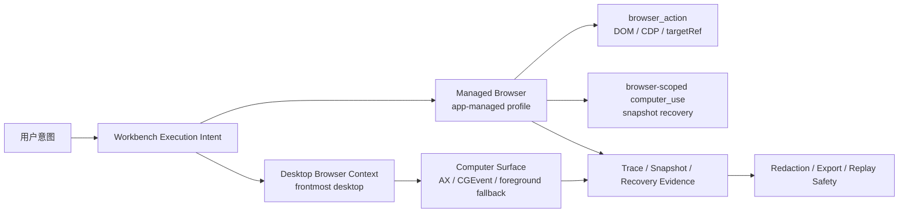

# Browser-Use Borrowing Boundary Map

日期：2026-05-01
状态：边界识别产物，作为后续实现切片的输入，不引入新 runtime dependency。
关联：Browser / Computer 现有生产化路线见 [2026-04-26-browser-use-production-roadmap.md](./2026-04-26-browser-use-production-roadmap.md)。

## 1. 结论

Browser Use 值得借的是产品对象边界：session、profile、tools registry、sensitive data、CLI/operator、live view/history。Code Agent 已经有 managed browser、Computer Surface、trace、recovery、redaction 的生产化基线，下一步应该把这些对象收成清楚的产品面，并保持 Browser Use 只作为参照源。

Code Agent 的目标边界：

默认 `Managed` 是 Code Agent 管理的隔离或持久 app profile；`Desktop` 是当前桌面上下文和前台浏览器读取；未来 `External Profile` 只能作为显式授权能力，不能悄悄复用用户真实 Chrome 登录态。

## 2. 产品边界矩阵

| Browser Use 能力 | Code Agent 当前状态 | 可借价值 | 风险 | 决策 | 目标层级 |
| --- | --- | --- | --- | --- | --- |
| Session / Profile | `ManagedBrowserSessionState` 已有 session/profile/lease/proxy/account/artifact 字段；persistent/isolated 基线已落。 | 把 session 生命周期、profile 归属、stop/save-state 做成用户可理解的状态。 | 误导用户以为真实 Chrome profile 会被自动复用。 | adapt | v1 |
| Tools Registry | 现有 `browser_action` 和 `computer_use` 是工具级入口，action schema 分散在 tool 实现和 UI preview。 | 建统一 Browser Action Catalog，给 action 增加 risk、scope、requiresSession、evidence、approval metadata。 | 过度抽象后绕开现有 ToolExecutor/permission 语义。 | adapt | v1 |
| Sensitive Data | 已有 `browserComputerRedaction` 覆盖 typed text、form data、trace/export/UI 多个 surface。 | 借 placeholder + domain scoped injection，真实 secret 只在执行层注入。 | 新 action 字段绕过脱敏；domain 匹配过宽导致泄漏。 | adopt with guard | v1 |
| CLI / Operator | 有 acceptance scripts 和 Desktop IPC，但普通用户缺轻量状态入口。 | 借 `open/state/screenshot/close/evaluate` 的 operator 体验，先做本地调试和 smoke 入口。 | 公开 SDK 太早会冻结错误接口。 | defer | v2 |
| Cloud Live View / Recording | 本地 trace、snapshot、recovery evidence 已有，durable recording/live sharing 未做。 | 借 live view/history 的可观察性语言，先产品化 session inspector 和 last trace。 | 云端共享、录屏保存牵涉隐私和成本。 | defer | v2 |
| Direct Browser Control / CDP | Managed provider 默认 System Chrome CDP；browser_action 已封装 DOM/snapshot/action。 | 借 CDP session/focus/target/frame 的对象模型补强 targetRef 和 frame 语义。 | 直接暴露 CDP 会让模型执行不可控 JS。 | adapt | v1/v2 |
| Skills / Site Integrations | Code Agent skill/MCP 是通用能力，不以 browser skills 为中心。 | 可借 domain-scoped custom action 的形态，后续把 Gmail/Docs 这类站点动作收进 connector/skill。 | 把生活/工作助手误扩成站点 RPA 平台。 | defer | v2 |
| Stealth / CAPTCHA / Residential Proxy | 当前明确无自动反 bot 能力。 | 只借 failure classification 和人工接管分流。 | 法务、成本和滥用风险高。 | reject | 不做 |
| External Browser Attach / Extension Bridge | 当前 `externalBridge` 明确 `unsupported`。 | 只保留未来显式授权插槽。 | 自动读取外部 cookies/profile 会破坏信任边界。 | reject for v1 | v2 评估 |
| Autonomous Browser Agent Loop | Code Agent 已有 chat/workbench/tool permission 主链路。 | 只借 action schema/history，不借 loop。 | 双 agent loop 会让审批、trace、recovery 归属混乱。 | reject | 不做 |

## 3. V1 借鉴包

| 借鉴包 | 用户可见行为 | 最小接口 | 主进程服务 | Renderer 呈现 | 验收方式 |
| --- | --- | --- | --- | --- | --- |
| Session Inspector | 用户能看到 Managed browser 是否 running、profile 模式、active tab、lease、proxy、last trace、recovery snapshot。 | 复用 `ManagedBrowserSessionState`，只补缺失的 summary 字段。 | `browserService.getSessionState()`、Desktop IPC recovery snapshot。 | Settings Browser 区或 failure card 中展示 Inspector 摘要。 | renderer test + `acceptance:browser-computer-app-host -- --json`。 |
| Browser Action Catalog | 用户能区分 read、browser action、desktop action；失败时看到可执行的 safe recovery。 | 新增内部 catalog DTO：`id`, `tool`, `action`, `risk`, `scope`, `requiresManagedSession`, `evidenceKind`, `approvalKind`。 | `browser_action` / browser-scoped `computer_use` 读取同一 catalog 做 preview/recovery。 | `ToolCallDisplay` 和 action preview 消费 catalog summary。 | unit 覆盖 catalog 映射；UI smoke 验证 preview 和 recovery。 |
| Secret Placeholder Injection | 用户可以让 agent 输入敏感值，但 trace、snapshot、export、UI 不出现真实值。 | `secretRef` 或 `<secret:name>` 只在 execution context resolve；domain scope 必填或显式 legacy fallback。 | credential resolver 在 tool execution 内注入；trace params 只记录 placeholder 和长度。 | preview 显示 placeholder / redacted length；不显示 raw secret。 | redaction unit + browser task benchmark `BT-07`。 |
| Trace / Recovery Evidence | 用户看到失败后准备好的 DOM/a11y 证据；系统不会自动重试危险动作。 | 复用 `WorkbenchActionTrace`，补充 recovery evidence summary 和 snapshot timestamp。 | `getManagedBrowserRecoverySnapshot` 与 Computer Surface read-only recovery。 | failure card 显示 preparing/success/failed 和 evidence summary。 | `toolDetailsComputerRecovery.test.ts` + app-host smoke。 |

V1 不做公开 SDK、远程浏览器池、真实 Chrome profile 自动复用、云端 live sharing，也不改变 ToolExecutor 的审批模型。

## 4. V2 候选

| 候选能力 | 进入条件 | 最小预留 |
| --- | --- | --- |
| Real Chrome Profile Import | 用户显式授权，且能清楚看到读取范围、profile 名称、退出方式。 | `ExternalProfileIntent` 只作为 future contract，不接默认路径。 |
| Recording Playback | V1 trace/recovery evidence 稳定，且 storage 不泄漏截图、cookies、local path。 | `WorkbenchActionTrace` 保留 `recordingRef` 可选字段。 |
| Shareable Live View | 本地 visible/headless inspector 稳定后再评估分享与权限。 | live view 只引用 session id 和 redacted tab summary，不带原始 DOM。 |
| Local Browser Workbench CLI | IPC/acceptance 命令稳定后，给开发者一个本地诊断面。 | 先围绕 `status/snapshot/close/evaluate-readonly`，避免公开自动动作 SDK。 |
| Domain Custom Actions | connector/skill 权限模型收口后，再让站点动作注册到 catalog。 | catalog 支持 `domainPatterns` 和 `connectorId`，默认不启用。 |

## 5. 决策表

| 能力 | 决策 | 原因 | 主要风险 |
| --- | --- | --- | --- |
| Managed session identity | adopt | 当前已有字段和 smoke，产品面需要讲清楚。 | 多 session 之前别承诺并行隔离。 |
| Profile lifecycle UI | adapt | persistent/isolated 已落，缺可见状态和清理语义。 | 用户误删或误读 profile。 |
| Account state raw access | reject for v1 | 只能展示 summary，不能让 UI/export 暴露 cookie/storage value。 | 凭据泄漏。 |
| Action registry | adapt | 统一 preview/recovery/approval 语言。 | 不能绕过现有工具权限。 |
| Secret placeholder injection | adopt with guard | 这是 browser-use 最值得借的安全路径。 | domain scope 错配。 |
| Operator CLI | defer | 当前先服务内部 smoke 和开发诊断。 | 太早公开会产生兼容负担。 |
| Live view / recording | defer | 需要 privacy/storage 设计先稳定。 | 截图和 DOM 持久化风险。 |
| External browser bridge | reject for v1 | 当前基线明确 unsupported，保住信任边界。 | 真实 profile/cookie 被误读。 |
| CAPTCHA / stealth / proxy rotation | reject | 不符合生活/工作助手当前产品边界。 | 滥用、成本、合规。 |
| Autonomous browser agent loop | reject | Code Agent 主链路已有 orchestration、approval、trace。 | 双 loop 造成责任归属混乱。 |

## 6. 后续实现切片

1. **Session Inspector Lite**
   - 产品入口：Settings 的 Browser 区和 browser failure card。
   - 改动：只消费现有 `ManagedBrowserSessionState`，展示 running、provider、profile、lease、proxy、active tab、last trace。
   - 验收：renderer test；`npm run acceptance:browser-computer-app-host -- --json`。

2. **Browser Action Catalog**
   - 产品入口：ToolCallDisplay action preview、recovery action。
   - 改动：新增内部 catalog，统一 `browser_action` 与 browser-scoped `computer_use` 的 risk/scope/evidence/recovery 描述。
   - 验收：unit 映射测试；`npm run acceptance:browser-computer-ui -- --json`。

3. **Secret Placeholder Injection**
   - 产品入口：能力说明、tool preview、export/replay。
   - 改动：在 execution 层解析 `secretRef`，trace/export/UI 只保留 placeholder 和长度；domain scope 默认必填。
   - 验收：redaction unit；`npm run acceptance:browser-task-benchmark -- --json` 中 `BT-07`。

4. **Recovery Evidence Stabilization**
   - 产品入口：Browser/Computer failure card。
   - 改动：snapshot recovery 固定输出 DOM heading count、interactive count、a11y availability、snapshot timestamp；desktop recovery 保持只读。
   - 验收：`toolDetailsComputerRecovery.test.ts`；app-host smoke recovery action 成功。

## 7. 参考源

- Browser Use GitHub: <https://github.com/browser-use/browser-use>
- Browser Use Sessions and Profiles: <https://docs.browser-use.com/guides/sessions>
- Browser Use custom tools: <https://docs.browser-use.com/open-source/customize/tools/add>
- Browser Use sensitive data: <https://docs.browser-use.com/open-source/examples/templates/sensitive-data>
- Browser Use CLI: <https://docs.browser-use.com/open-source/browser-use-cli>
- Code Agent managed browser: [browserService.ts](/Users/linchen/Downloads/ai/code-agent/src/main/services/infra/browserService.ts)
- Code Agent shared contract: [desktop.ts](/Users/linchen/Downloads/ai/code-agent/src/shared/contract/desktop.ts)
- Code Agent browser session UI hook: [useWorkbenchBrowserSession.ts](/Users/linchen/Downloads/ai/code-agent/src/renderer/hooks/useWorkbenchBrowserSession.ts)
