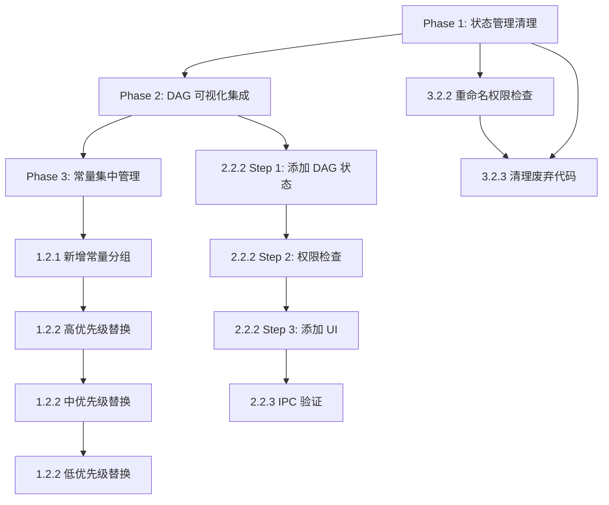

# 代码改进方案设计

> 本文档详细描述三类问题的改进方案，包括实现步骤、测试策略和风险控制。

---

## 目录

1. [常量集中管理](#1-常量集中管理)
2. [DAG 可视化集成](#2-dag-可视化集成)
3. [状态管理清理](#3-状态管理清理)
4. [实施顺序和依赖](#4-实施顺序和依赖)
5. [测试策略](#5-测试策略)

---

## 1. 常量集中管理

### 1.1 问题分析

当前代码中有 **60+ 处硬编码的超时/重试/阈值**，分散在不同模块中：

| 问题类型 | 示例 | 风险 |
|---------|------|------|
| 超时不一致 | MCP 连接 30s/120s/180s 分散定义 | 难以统一调整 |
| 重试冲突 | `MAX_RETRIES: 3` vs `defaultMaxRetries: 0` | 行为不可预测 |
| 魔法数字 | `30000`, `60000`, `120000` 含义不明 | 维护困难 |

### 1.2 设计方案

#### 1.2.1 新增常量分组结构

在 `src/shared/constants.ts` 中新增以下分组：

```typescript
// ============================================================
// 超时配置 - 按功能域分组
// ============================================================

/** MCP 连接超时配置 */
export const MCP_TIMEOUTS = {
  /** SSE 连接超时 */
  SSE_CONNECT: 30_000,
  /** stdio 连接超时 */
  STDIO_CONNECT: 120_000,
  /** 首次运行超时（需要安装依赖等） */
  FIRST_RUN: 180_000,
  /** 工具调用重试超时 */
  TOOL_RETRY: 30_000,
} as const;

/** DAG 调度器配置 */
export const DAG_SCHEDULER = {
  /** 默认超时 */
  DEFAULT_TIMEOUT: 120_000,
  /** 默认并行度 */
  DEFAULT_PARALLELISM: 4,
  /** 调度间隔 */
  SCHEDULE_INTERVAL: 100,
  /** 默认最大重试次数（统一为 0，显式配置重试） */
  DEFAULT_MAX_RETRIES: 0,
} as const;

/** Agent 执行超时 - 按角色 */
export const AGENT_EXECUTION_TIMEOUTS = {
  /** 默认超时 */
  DEFAULT: 180_000,
  /** 协调器超时（复杂任务） */
  COORDINATOR: 300_000,
  /** 研究类任务超时 */
  RESEARCHER: 120_000,
  /** 代码类任务超时 */
  CODER: 180_000,
  /** 测试类任务超时 */
  TESTER: 180_000,
  /** 动态 Agent 最大超时 */
  DYNAMIC_MAX: 600_000,
  /** 长时间运行任务 */
  LONG_RUNNING: 1_800_000,
} as const;

/** 服务初始化超时 */
export const SERVICE_TIMEOUTS = {
  /** MCP 连接 */
  MCP_CONNECT: 60_000,
  /** 容器初始化 */
  CONTAINER_INIT: 30_000,
  /** 生命周期操作 */
  LIFECYCLE: 30_000,
  /** 引导程序 */
  BOOTSTRAP: 30_000,
} as const;

/** 工具执行超时 */
export const TOOL_TIMEOUTS = {
  /** Bash 默认超时 */
  BASH_DEFAULT: 120_000,
  /** Bash 最大超时 */
  BASH_MAX: 600_000,
  /** Grep 超时 */
  GREP: 30_000,
  /** 截图超时 */
  SCREENSHOT: 30_000,
  /** 浏览器操作超时 */
  BROWSER_ACTION: 30_000,
  /** 图像分析超时 */
  IMAGE_ANALYZE: 30_000,
  /** 图像生成超时 */
  IMAGE_GENERATE: 60_000,
  /** 图像标注超时 */
  IMAGE_ANNOTATE: 60_000,
  /** 视频生成超时 */
  VIDEO_GENERATE: 300_000,
  /** 语音转文本超时 */
  SPEECH_TO_TEXT: 60_000,
  /** 文本转语音超时 */
  TEXT_TO_SPEECH: 60_000,
  /** HTTP 请求默认超时 */
  HTTP_DEFAULT: 30_000,
  /** HTTP 长请求超时 */
  HTTP_LONG: 300_000,
  /** 后台任务默认超时 */
  BACKGROUND_TASK: 30_000,
  /** 任务输出超时 */
  TASK_OUTPUT: 30_000,
} as const;

/** 用户交互超时 */
export const INTERACTION_TIMEOUTS = {
  /** 用户问题等待超时 */
  USER_QUESTION: 300_000,
  /** 确认操作超时 */
  CONFIRM_ACTION: 60_000,
  /** 权限请求超时 */
  PERMISSION: 60_000,
} as const;

/** 编排器超时 */
export const ORCHESTRATOR_TIMEOUTS = {
  /** 本地执行超时 */
  LOCAL_EXECUTOR: 120_000,
  /** 云端执行超时 */
  CLOUD_EXECUTOR: 180_000,
  /** Agent 委托超时 */
  AGENT_DELEGATION: 60_000,
  /** Agent 执行器超时 */
  AGENT_EXECUTOR: 180_000,
  /** 统一编排器默认超时 */
  UNIFIED_DEFAULT: 120_000,
  /** 统一编排器扩展超时 */
  UNIFIED_EXTENDED: 180_000,
} as const;

/** 其他服务超时 */
export const MISC_TIMEOUTS = {
  /** LSP 超时 */
  LSP: 30_000,
  /** 测试运行超时 */
  TEST_RUNNER: 60_000,
  /** LLM 摘要超时 */
  LLM_SUMMARIZER: 30_000,
  /** Git 下载超时 */
  GIT_DOWNLOAD: 30_000,
  /** Git 克隆超时 */
  GIT_CLONE: 120_000,
  /** 沙箱超时 */
  SANDBOX: 120_000,
  /** 并行 Agent 超时 */
  PARALLEL_AGENT: 120_000,
  /** 学习服务间隔 */
  LEARNING_INTERVAL: 60_000,
  /** Skill IPC 超时 */
  SKILL_IPC: 30_000,
  /** 数据源路由超时 */
  DATA_SOURCE: 30_000,
} as const;

/** 锁和资源管理 */
export const LOCK_TIMEOUTS = {
  /** 锁默认超时 */
  DEFAULT: 300_000,
  /** 锁清理间隔 */
  CLEANUP_INTERVAL: 30_000,
  /** Agent Bus 超时 */
  AGENT_BUS: 300_000,
  /** Agent Bus 清理间隔 */
  AGENT_BUS_CLEANUP: 30_000,
} as const;

/** 性能阈值（毫秒） */
export const PERFORMANCE_THRESHOLDS = {
  /** 快速响应阈值 */
  FAST_RESPONSE: 60_000,
  /** 慢响应阈值 */
  SLOW_RESPONSE: 120_000,
  /** 策略优化阈值 */
  STRATEGY_OPTIMIZATION: 300_000,
  /** 模型请求超时 */
  MODEL_REQUEST: 300_000,
  /** 任务队列超时 */
  TASK_QUEUE: 300_000,
} as const;
```

#### 1.2.2 修改清单（按优先级）

**高优先级（核心功能）**：

| 文件 | 行号 | 原值 | 替换为 |
|------|------|------|--------|
| `src/main/mcp/mcpClient.ts` | 207 | `30000` | `MCP_TIMEOUTS.SSE_CONNECT` |
| `src/main/mcp/mcpClient.ts` | 208 | `120000` | `MCP_TIMEOUTS.STDIO_CONNECT` |
| `src/main/mcp/mcpClient.ts` | 209 | `180000` | `MCP_TIMEOUTS.FIRST_RUN` |
| `src/main/mcp/mcpClient.ts` | 798 | `30000` | `MCP_TIMEOUTS.TOOL_RETRY` |
| `src/main/scheduler/DAGScheduler.ts` | 62 | `120000` | `DAG_SCHEDULER.DEFAULT_TIMEOUT` |
| `src/main/scheduler/DAGScheduler.ts` | 59 | `4` | `DAG_SCHEDULER.DEFAULT_PARALLELISM` |
| `src/shared/types/taskDAG.ts` | 326 | `0` | `DAG_SCHEDULER.DEFAULT_MAX_RETRIES` |

**中优先级（编排和 Agent）**：

| 文件 | 行号 | 原值 | 替换为 |
|------|------|------|--------|
| `src/main/orchestrator/localExecutor.ts` | 28 | `120000` | `ORCHESTRATOR_TIMEOUTS.LOCAL_EXECUTOR` |
| `src/main/orchestrator/cloudExecutor.ts` | 36 | `180000` | `ORCHESTRATOR_TIMEOUTS.CLOUD_EXECUTOR` |
| `src/main/orchestrator/agents/agentScheduler.ts` | 47 | `60000` | `ORCHESTRATOR_TIMEOUTS.AGENT_DELEGATION` |
| `src/main/orchestrator/agents/agentExecutor.ts` | 50 | `180000` | `ORCHESTRATOR_TIMEOUTS.AGENT_EXECUTOR` |
| `src/main/agent/agentOrchestrator.ts` | 740 | `60000` | `INTERACTION_TIMEOUTS.PERMISSION` |

**低优先级（工具和边缘功能）**：

其他 40+ 处按上述模式逐步替换。

#### 1.2.3 向后兼容策略

为避免一次性修改过多导致风险，采用**渐进式迁移**：

```typescript
// 阶段 1：新增常量，保留原硬编码
// 阶段 2：核心模块（MCP、DAG、编排器）替换
// 阶段 3：工具模块替换
// 阶段 4：删除废弃的 AGENT.TIMEOUT 等旧常量
```

### 1.3 测试要点

1. **单元测试**：为常量文件添加类型测试，确保导出正确
2. **集成测试**：验证 MCP 连接、DAG 调度、工具执行的超时行为
3. **回归测试**：确保修改后的超时值与原值一致（除非有意调整）

---

## 2. DAG 可视化集成

### 2.1 问题分析

DAG 可视化组件已完整实现，但存在以下问题：

| 问题 | 位置 | 影响 |
|------|------|------|
| 面板未渲染 | `App.tsx` 缺少 `WorkflowPanel` 渲染 | 功能不可见 |
| 状态复用 | `showPlanningPanel` 同时用于规划和 DAG | 语义混淆 |
| 按钮标签不准确 | "追踪" 按钮实际应控制 DAG 可视化 | 用户困惑 |

### 2.2 设计方案

#### 2.2.1 方案选择

**方案 A：复用 showPlanningPanel（最小改动）**
- 直接在 App.tsx 中添加 WorkflowPanel 渲染
- 保持现有按钮和状态
- 风险：语义不清，规划功能和 DAG 功能耦合

**方案 B：独立 DAG 面板状态（推荐）**
- 新增 `showDAGPanel` 状态
- 按钮改为明确的 "DAG" 或 "执行图"
- 清晰分离规划面板和 DAG 面板

**选择方案 B**，因为：
1. 规划面板（Planning）和 DAG 可视化是不同功能
2. 未来可能需要同时显示两者
3. 代码语义更清晰

#### 2.2.2 实现步骤

**Step 1：在 appStore 中添加 DAG 面板状态**

```typescript
// src/renderer/stores/appStore.ts

interface AppState {
  // ... 现有状态

  // DAG 可视化面板（新增）
  showDAGPanel: boolean;
}

// 初始值
showDAGPanel: false,

// 操作
setShowDAGPanel: (show: boolean) => set({ showDAGPanel: show }),
toggleDAGPanel: () => set((state) => ({ showDAGPanel: !state.showDAGPanel })),
```

**Step 2：在 useDisclosure 中添加权限检查**

```typescript
// src/renderer/hooks/useDisclosure.tsx

// 在 featureAccess 对象中添加
showDAGPanel: isAtLeast('advanced'),  // DAG 可视化需要 Advanced 模式
```

**Step 3：在 App.tsx 中添加 DAG 按钮和面板**

```typescript
// src/renderer/App.tsx

// 导入
import { WorkflowPanel } from '@renderer/components/features/workflow/WorkflowPanel';

// 获取状态
const { showDAGPanel, setShowDAGPanel } = useAppStore();
const { showDAGPanel: dagPanelEnabled } = useDisclosure();

// DAG 面板切换按钮组件
const DAGToggle: React.FC = () => {
  if (!dagPanelEnabled) return null;

  return (
    <button
      onClick={() => setShowDAGPanel(!showDAGPanel)}
      className={cn(
        'flex items-center gap-1 px-2 py-1 text-xs rounded transition-colors',
        showDAGPanel
          ? 'bg-blue-500/20 text-blue-400'
          : 'text-gray-400 hover:text-gray-300 hover:bg-gray-700/50'
      )}
      title="任务执行图"
    >
      <GitBranch className="w-3.5 h-3.5" />
      <span>DAG</span>
    </button>
  );
};

// 在面板渲染区域添加（约 405 行附近）
{showDAGPanel && dagPanelEnabled && (
  <WorkflowPanel
    height={400}
    closable={true}
    onClose={() => setShowDAGPanel(false)}
  />
)}
```

**Step 4：调整原有 ObservabilityToggle**

将原有的"追踪"按钮功能明确化，或考虑合并：

```typescript
// 方案 1：保留两个按钮
// ObservabilityToggle → 控制执行追踪/日志面板（如果有）
// DAGToggle → 控制 DAG 可视化面板

// 方案 2：合并为一个按钮（推荐，减少 UI 复杂度）
// 将 ObservabilityToggle 替换为 DAGToggle
// 移除 showPlanningPanel 相关逻辑（如果不再需要）
```

#### 2.2.3 IPC 连接验证

确认主进程是否正确发送 DAG 事件：

```typescript
// 检查位置：src/main/scheduler/DAGScheduler.ts
// 应该在任务状态变化时发送事件到渲染进程

// 如果缺失，需要添加：
import { BrowserWindow } from 'electron';
import { DAG_CHANNELS } from '@shared/ipc/channels';

private emitToRenderer(event: DAGEvent) {
  const windows = BrowserWindow.getAllWindows();
  windows.forEach(win => {
    win.webContents.send(DAG_CHANNELS.EVENT, event);
  });
}
```

### 2.3 测试要点

1. **功能测试**：
   - 点击 DAG 按钮，面板正确显示/隐藏
   - 运行包含多任务的 DAG，节点状态实时更新
   - 点击节点显示详情面板

2. **权限测试**：
   - Standard 模式下按钮不显示
   - Advanced/Expert 模式下按钮可见

3. **性能测试**：
   - 大量节点（50+）时渲染性能
   - 频繁状态更新时无卡顿

---

## 3. 状态管理清理

### 3.1 问题分析

| 问题 | 现状 | 理想状态 |
|------|------|----------|
| 命名混淆 | `showPlanningPanel` 同时用于权限和切换 | 分离命名 |
| 职责不清 | appStore 混合 UI 状态和业务状态 | 按职责分层 |
| 重复逻辑 | useDisclosure 和 appStore 有重叠 | 单一数据源 |

### 3.2 设计方案

#### 3.2.1 状态分层原则

```
┌─────────────────────────────────────────────────────────┐
│ Layer 1: 权限层 (useDisclosure)                         │
│ - 只读计算属性                                          │
│ - 基于 disclosureLevel 派生                             │
│ - 命名：*Enabled, *Available, can*                      │
└─────────────────────────────────────────────────────────┘
                           ↓
┌─────────────────────────────────────────────────────────┐
│ Layer 2: 用户偏好层 (appStore)                          │
│ - 用户可控的开关状态                                    │
│ - 持久化到本地存储                                      │
│ - 命名：show*, is*Open, *Visible                        │
└─────────────────────────────────────────────────────────┘
                           ↓
┌─────────────────────────────────────────────────────────┐
│ Layer 3: 会话层 (sessionStore)                          │
│ - 当前会话的临时状态                                    │
│ - 不持久化                                              │
│ - 命名：current*, active*, session*                     │
└─────────────────────────────────────────────────────────┘
```

#### 3.2.2 重命名计划

**useDisclosure.tsx 中的权限检查**：

```typescript
// 修改前
showPlanningPanel: isAtLeast('advanced'),

// 修改后
planningPanelEnabled: isAtLeast('advanced'),
dagPanelEnabled: isAtLeast('advanced'),
```

**appStore.ts 中的用户状态**：

```typescript
// 保持不变，但添加注释明确语义
/** 用户是否手动开启了规划面板 */
showPlanningPanel: boolean;

/** 用户是否手动开启了 DAG 面板 */
showDAGPanel: boolean;  // 新增
```

**App.tsx 中的使用**：

```typescript
// 修改前
const { showPlanningPanel: showPlanningPanelEnabled } = useDisclosure();
const { showPlanningPanel, setShowPlanningPanel } = useAppStore();

// 修改后（更清晰）
const { planningPanelEnabled, dagPanelEnabled } = useDisclosure();
const { showPlanningPanel, showDAGPanel, setShowDAGPanel } = useAppStore();

// 渲染条件
{planningPanelEnabled && showPlanningPanel && <PlanningPanel />}
{dagPanelEnabled && showDAGPanel && <WorkflowPanel />}
```

#### 3.2.3 清理废弃代码

检查 `showPlanningPanel` 的所有使用位置，确认是否需要保留：

| 文件 | 行号 | 当前用途 | 处理 |
|------|------|----------|------|
| `App.tsx` | 69-70 | 获取和设置 | 保留，用于规划面板 |
| `App.tsx` | 293 | ObservabilityToggle | 改为 DAGToggle |
| `ObservabilityPanel.tsx` | 599, 612 | 获取和设置 | 检查是否需要 |
| `useDisclosure.tsx` | 120 | 权限检查 | 重命名为 `planningPanelEnabled` |

### 3.3 测试要点

1. **编译检查**：`npm run typecheck` 确保类型正确
2. **功能回归**：
   - 所有面板开关正常工作
   - 权限控制正确（Standard 模式下高级功能不可见）
3. **状态持久化**：面板状态在刷新后保持

---

## 4. 实施顺序和依赖



**推荐顺序**：
1. **先做状态管理清理**（2-3 小时）：为 DAG 集成做准备
2. **再做 DAG 可视化集成**（3-4 小时）：核心功能可见
3. **最后做常量集中管理**（4-6 小时）：技术债务清理，可分多次完成

---

## 5. 测试策略

### 5.1 测试类型

| 类型 | 覆盖范围 | 工具 |
|------|----------|------|
| 类型检查 | 所有修改文件 | `npm run typecheck` |
| 单元测试 | 常量导出、状态操作 | Jest |
| 集成测试 | IPC 通信、面板交互 | Playwright |
| 手动测试 | UI 交互、视觉效果 | 人工验证 |

### 5.2 测试清单

#### Phase 1 测试（状态管理）

- [ ] `npm run typecheck` 通过
- [ ] 所有面板按钮正常响应
- [ ] Standard 模式下高级按钮不显示
- [ ] Advanced 模式下所有按钮可见
- [ ] 面板状态在页面刷新后保持

#### Phase 2 测试（DAG 可视化）

- [ ] DAG 按钮在 Advanced 模式下可见
- [ ] 点击 DAG 按钮，WorkflowPanel 显示
- [ ] 运行任务时，DAG 节点状态更新
- [ ] 点击节点显示详情
- [ ] 关闭按钮正常工作
- [ ] 50+ 节点时无明显卡顿

#### Phase 3 测试（常量管理）

- [ ] `npm run typecheck` 通过
- [ ] `npm run build` 成功
- [ ] MCP 连接正常（测试不同超时场景）
- [ ] DAG 任务执行正常
- [ ] 工具执行超时行为正确

### 5.3 回滚策略

每个 Phase 完成后创建 Git tag：

```bash
git tag -a v0.17.0-phase1-state-cleanup -m "State management cleanup"
git tag -a v0.17.0-phase2-dag-integration -m "DAG visualization integration"
git tag -a v0.17.0-phase3-constants -m "Constants centralization"
```

如果某个 Phase 出现问题，可以快速回滚到上一个稳定点。

---

## 附录：文件修改清单

### Phase 1 修改文件

- `src/renderer/hooks/useDisclosure.tsx`
- `src/renderer/stores/appStore.ts`
- `src/renderer/App.tsx`

### Phase 2 修改文件

- `src/renderer/stores/appStore.ts`
- `src/renderer/hooks/useDisclosure.tsx`
- `src/renderer/App.tsx`
- `src/main/scheduler/DAGScheduler.ts`（如需添加 IPC）

### Phase 3 修改文件

- `src/shared/constants.ts`
- `src/main/mcp/mcpClient.ts`
- `src/main/scheduler/DAGScheduler.ts`
- `src/shared/types/taskDAG.ts`
- 其他 40+ 工具和服务文件
