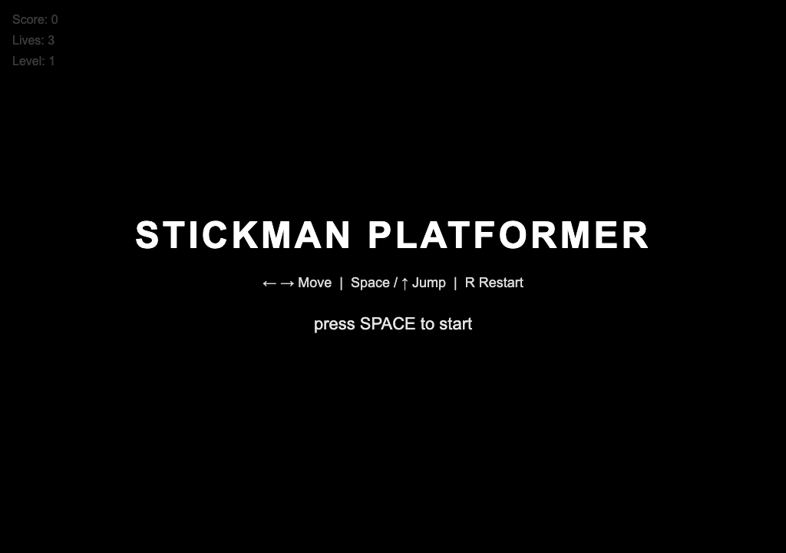

# Mimo × OpenGame 模板 A/B 评测报告

**日期**: 2026-05-16
**模型**: mimo-v2.5-pro (OpenAI-compatible, sgp endpoint)
**温度**: 0.3
**目标**: 验证艾克斯假设 — 「Mimo 裸写 vs Mimo + OpenGame 模板」在 4 项指标上是否拉得开差距

> 艾克斯原话：「下一步最小验证就跑一组 A/B：同一个'火柴人平台跳跃' prompt，当前 Mimo 单 HTML 一版，Mimo + OpenGame 模板一版，看 build、runtime smoke、浏览器首屏、可玩性四项。」

---

## TL;DR

**两版都没跑出可玩的火柴人平台游戏**，但暴露的瓶颈完全不同：

- **A1（Mimo 裸 HTML）**：build / runtime smoke / 首屏全过，但 **进入游戏后每帧 pageerror 419 次，player 完全不动**。问题是「拆段调用导致跨段接口不一致」（seg2 写 `Player.update(dt, input, level)`，seg3 调 `player.update(dt)`）。
- **A2（Mimo + OpenGame 模板，6 段输出 Phaser 项目）**：**6 段里 4 段 thinking 失控**（`finish_reason=length`、reasoning tokens 吃光全部预算），只产出 5/13 个文件，tsc 直接报 `Cannot find module './scenes/Level3Scene'` 等，**build 直接 fail**，连截图都跑不到。

**对艾克斯判断的更新**：「Mimo 不适合裸写」只对了一半。Mimo 在 OpenGame 这种「多文件 JSON schema + 强模板约束」的结构化输出场景下更糟 — thinking 模式被任务复杂度直接打爆，单次任务越大失败率越高。**OpenGame 模板的真实价值不能用 mimo 验证**。

---

## 评测维度结果对比

| 维度 | A1（裸 HTML） | A2（OpenGame 模板） |
|------|---------------|---------------------|
| **build** | ✅ pass — 24,574 byte HTML, doctype/canvas/script 齐全 | ❌ fail — `tsc` 缺 8 个 scene 类，多个 TS2352 类型错误 |
| **runtime smoke** | ✅ pass — 0 console error, `__GAME_META__` + `snapshot()` 都已暴露 | ⏭️ skipped — build failed |
| **浏览器首屏** | ✅ pass — title screen 渲染正常（截图见下） | ⏭️ skipped |
| **可玩性** | ❌ fail — 按 Space 后 main loop 每帧抛 `TypeError: Cannot read properties of undefined (reading 'left')`，**419 次 pageerror**，player.x 始终 50 没动 | ⏭️ skipped |

---

## 生成阶段对比

### A1（拆 3 段调用，串行）

| 段 | 任务 | finish | content | reasoning | elapsed |
|----|------|--------|---------|-----------|---------|
| seg1-html | HTML + CSS + DOM 骨架 | stop | 1,953 | 134 | 28.4s |
| seg2-classes | Player/Enemy/Block/Level/ParticleBurst 类定义 | stop | 10,751 | 118 | 55.5s |
| seg3-runtime | LEVELS 数据 + 主循环 + boot | stop | 11,884 | 86 | 55.5s |
| **合计** | | | **24,574** | **338** | **139.4s** |

✅ 三段全部 `finish=stop`，thinking 在小 prompt 下完全可控（reasoning < 0.5K chars/段）。

### A2（拆 6 段调用 → JSON 文件清单）

| 段 | 任务 | finish | content | reasoning | elapsed | 文件 |
|----|------|--------|---------|-----------|---------|------|
| turn1-main | main.ts / LevelManager.ts / gameConfig.json | stop | 4,085 | 11,182 | 82s | ✅ 3 个 |
| turn2-preloader | Preloader.ts（10 个 procedural texture） | **length** | **0** | 23,407 | 124s | ❌ 缺 |
| turn3-title-uioverlays | Title/UI/GameOver/Victory 4 scene | **length** | **0** | 28,406 | 106s | ❌ 缺 |
| turn4-base-and-level1 | BaseLevelScene + Level1Scene | **length** | **0** | 36,065 | 121s | ❌ 缺 |
| turn5-level2-level3 | Level2Scene + Level3Scene | **length** | **0** | 28,042 | 119s | ❌ 缺 |
| turn6-characters | Stickman.ts + StickEnemy.ts | stop | 5,334 | 595 | 26s | ✅ 2 个 |
| **合计** | | | **9,419** | **127,697** | **578s** | **5/13 ❌** |

⚠️ **结构化 JSON 输出在 mimo 上系统性失败**：turn2-5 全部触发 thinking 失控（reasoning 23K-36K chars，把 max_tokens 全用完），4/6 失败率。

---

## 截图

### A1 首屏（title screen）✅



标题、控制说明、HUD（Score/Lives/Level）都正常渲染。Mimo 段 1 输出的 HTML/CSS 视觉到位。

### A1 进入游戏后（按 Space → 长按 →）❌


Title screen 消失了，但 canvas 一片漆黑、没有任何 sprite 绘制。原因是 `update()` 在第一帧就 throw `TypeError: Cannot read properties of undefined (reading 'left')`，requestAnimationFrame 链路中断，render 永远不被调用。

### A2 ❌ 无截图（build 失败跑不到）

---

## 故障根因

### A1：跨段调用接口漂移

```js
// seg2-classes 里 mimo 写的 Player 方法签名：
class Player {
  update(dt, input, level) {  // 期望传入 input 对象
    if (input.left) this.vx -= accel * dt;   // ← 这里假设 input 一定有
  }
}

// seg3-runtime 里 mimo 写的主循环：
function update(dt) {
  if (keys.left) player.vx = -player.speed;
  // ...
  player.update(dt);   // ← 只传了 dt，input/level 都没传！
}
```

每帧 `player.update(dt)` 调用，Player 内部 `input.left` 解 undefined → 抛 TypeError → 链路断 → 玩家不动。

**这是 prompt 拆段策略的副作用**：每段调用独立，mimo 在 seg3 自由选择了"主循环维护 keys 状态"，但没意识到 seg2 设计的 Player 是"自给自足读 input 参数"。

### A2：mimo thinking 在多文件 JSON 任务下失控

完全一致的现象：每段 prompt > 1K tokens 且要求结构化 JSON 输出时，mimo 把 `max_tokens` 几乎全部用在 `reasoning_content` 上：

```
turn2-preloader: reasoning_tokens=8000 (=max_tokens)  content=0
turn3-uioverlays: reasoning_tokens=7000 (=max_tokens) content=0
turn4-base+L1:    reasoning_tokens=9000 (=max_tokens) content=0
turn5-L2+L3:      reasoning_tokens=9000 (=max_tokens) content=0
```

`enable_thinking: false` 参数被 mimo 在长复杂 prompt 下**忽略**（短 prompt 下生效）。

成功的 turn1 / turn6 都是「输出量适中 + JSON schema 简单（≤3 个 file）」。一旦让 mimo 同时承担「项目级文件清单 + 强模板规范 + 跨文件接口」就直接崩。

---

## 对艾克斯判断的回应

| 艾克斯说 | 实际结果 |
|----------|----------|
| 「Mimo 裸写时只要 runSmokeTest 和 validator 过了，就可能交出一个瘦线小人」 | ✅ 印证 — A1 截图甚至连主角都没画出来（419 pageerror）。但根因不是「美术敷衍」，是 Mimo 输出长 JS 时跨段接口漂移 |
| 「OpenGame 的 Template Skill + Debug Skill 会显著降低能跑但不像游戏的概率」 | ⚠️ 未验证 — Mimo 走 OpenGame 路径直接崩溃，根本没到「跑不跑得起来」的层面 |
| 「Mimo 可以当主模型试，但最好别让它裸写」 | ❌ 反例 — 加了 OpenGame 模板后失败率反而更高（4/6 段崩 vs 单 HTML 至少 build/smoke 过） |
| 「最适合 code-agent 的做法是吸收 Game Skill 机制：classify → scaffold → GDD → assets/config → code → verify → preview」 | 📌 这次没测，但**前提是有能稳定产出多文件代码的主模型**。这次实测 Mimo 不胜任 |

---

## 下一步建议（按优先级）

1. **不要在 Mimo 上继续推 OpenGame 集成**。先做模型路由：用 Mimo 跑 GDD / classify / 短答任务，用 Kimi K2 或 DeepSeek-V3 跑多文件代码生成。
2. 如果想真验证 OpenGame 模板价值，用 **非 thinking 模型** 重跑这次 A/B（DeepSeek-V3 或 Kimi K2 是公平的 baseline）。
3. A1 拆段策略本身可保留，但要在 seg3 prompt 里**显式 echo seg2 输出的类方法签名**，避免接口漂移。或者改成单次调用（如果总 token 数 < 6K）。
4. Mimo 长 prompt 下 `enable_thinking: false` 失效是个**重要 finding**，建议补到 Code Agent 的 model-routing.md。

---

## 附录

### 文件清单

```
games/ab-test/
├── REPORT.md                          # 本报告
├── a1-mimo-bare/
│   ├── index.html (24.5KB)            # A1 产物
│   ├── seg1-raw.txt / seg2 / seg3     # 三段 Mimo 原始输出
│   └── mimo-meta.json                 # token usage/timing
├── a2-mimo-opengame/
│   ├── src/                           # 仅 5 个文件（13 需要）
│   ├── mimo-raw-turn{1..6}.txt
│   └── mimo-meta.json
├── a1-report.json / a2-report.json    # 评测原始数据
├── screenshots/
│   ├── a1-firstframe.png ✅
│   ├── a1-after-play.png ❌
│   └── (A2 无)
└── scripts/
    ├── shared.mjs                     # Mimo SSE 流式封装
    ├── a1-v2-mimo-bare.mjs            # 3 段拼装
    ├── a2-v2-mimo-opengame.mjs        # 6 段 JSON
    └── run-eval.mjs                   # 4 项评测 pipeline
```

### 关键技术 finding（值得收编）

1. **mimo-v2.5-pro 在 prompt > 1K tokens 时强制启用 thinking**，`enable_thinking: false` 失效。完成生成必须流式 + 拆小调用 + max_tokens 6-8K。
2. **mimo 输出结构化 JSON（schema 强约束）比输出松散 JS 失败率高**。turn1（main.ts + 简单 json）和 turn6（2 个独立 sprite class）通过；中间需要满足 Phaser 多 scene 接口的 turn2-5 全爆。
3. **Mimo SDK / OpenAI-compatible 流式调用**：必须设 `stream: true` + undici ProxyAgent + `bodyTimeout` 配置，否则长任务（> 60s）会被 socket idle timeout 静默断开（这次第一轮就踩了）。
